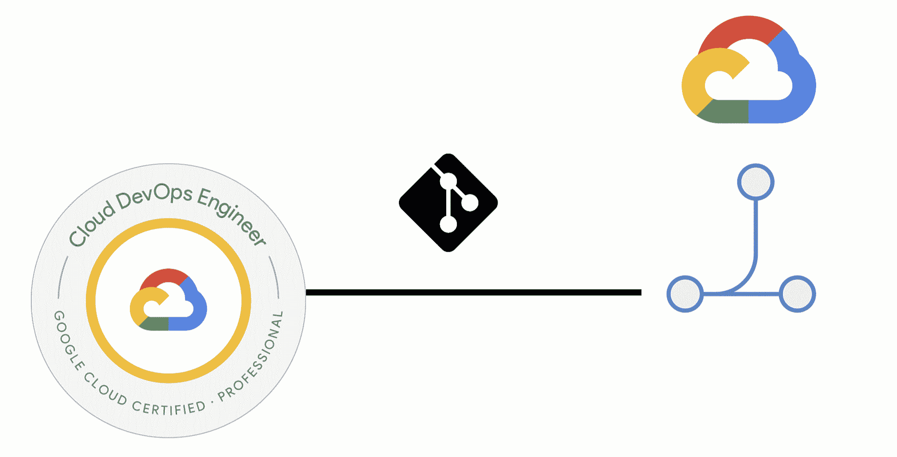
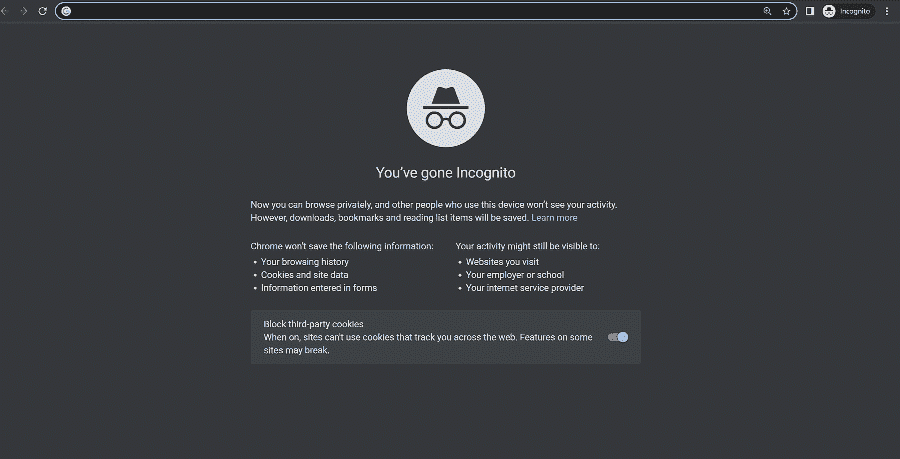
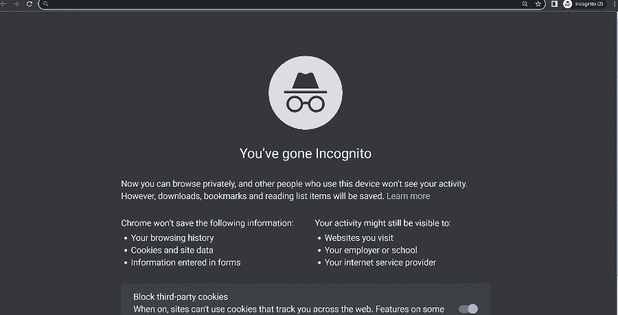
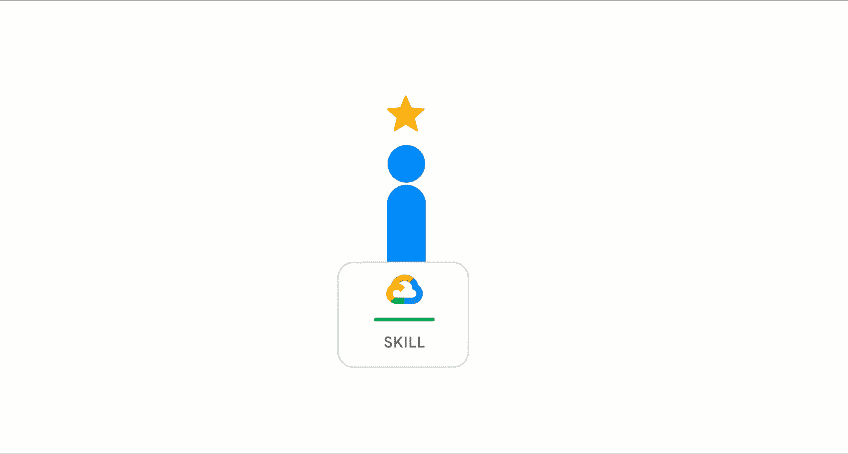
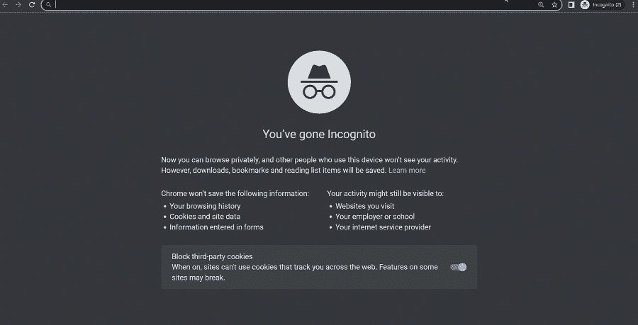
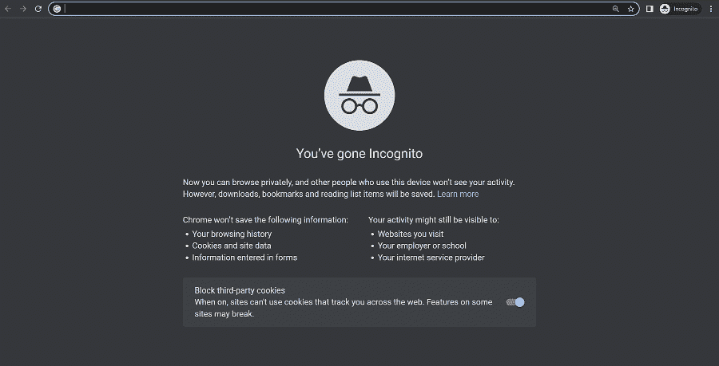

# 准备谷歌云专业云 DevOps 工程师考试

> 原文：<https://medium.com/google-cloud/preparing-for-the-google-cloud-professional-cloud-devops-engineer-exam-30e9d5fe07e4?source=collection_archive---------0----------------------->

DevOps

如果你想了解网站可靠性工程(SRE)和谷歌云中可用的 DevOps 工具，那么 [**谷歌专业云 DevOps 工程师**](https://cloud.google.com/certification/cloud-devops-engineer) 认证就是对你的挑战。

站点可靠性工程师是一个有趣的话题，花时间去了解它肯定会是一次有价值的经历。俗话说 SRE 阶级实现 DevOps。

考试内容包括:

*   将现场可靠性工程原则应用于服务
*   为服务构建和实现 CI/CD 管道
*   实施服务监控策略
*   优化服务性能
*   管理服务事件

# 第一步:查看考试指南

考试指南列出了要涵盖的所有目标。这是非常有用的，一看就知道你需要学习哪些方面来准备考试。可以在这里 **查看当前考试指南 [**。**](https://cloud.google.com/certification/guides/cloud-devops-engineer)**

# 第二步:注册谷歌云培训

在你阅读了考试指南之后，如果你认为值得花时间去查阅一些谷歌云学习材料。谷歌云有[谷歌云技能提升](https://www.cloudskillsboost.google/paths)。在您的学习路径中登录并注册，开始学习。对于这一个，让我们挑选 [**DevOps 工程师，SRE 学习路径**。](https://www.cloudskillsboost.google/paths/20)

选择学习路径后，您将看到需要完成的几门课程和实验。

学习路径

如果你正在寻找谷歌云培训的其他选择，Coursera 和 Pluralsight 上有一些课程。

**Coursera 链接**:

*   [准备谷歌云认证:云 DevOps 工程师职业证书](https://www.coursera.org/professional-certificates/sre-devops-engineer-google-cloud?=)

**多视链接**:

*   [SRE 和 DevOps 工程师与谷歌云](https://www.pluralsight.com/paths/sre-and-devops-engineer-with-google-cloud)

# 第三步:查看 SRE 图书和播放列表

网上和书店里有几本书。这些书更深入，是理解 SRE 学科的宝贵资源。

*   [现场可靠性工程](https://sre.google/sre-book/table-of-contents/)
*   [现场可靠性工作手册](https://sre.google/workbook/table-of-contents/)

还有 SRE 谷歌网站

*   【https://sre.google/ 

YouTube 播放列表

*   [类 SRE 实现 DevOps](https://www.youtube.com/playlist?list=PLIivdWyY5sqJrKl7D2u-gmis8h9K66qoj)
*   [可靠性工程](https://www.youtube.com/playlist?list=PLIivdWyY5sqLOiLXJDlN-wKd0g7hf_9vC)

SRE 内容

# 步骤 4:实验室实践经验

学习路径中包含几个实验，您应该努力完成它们。通过完成实验和任务，你有机会获得[技能徽章](https://cloud.google.com/training/badges)。

也可以访问[https://codelabs.developers.google.com](https://codelabs.developers.google.com/)/搜索*你感兴趣的话题* **。**你会看到几个代码实验室，你可以在自己的环境中做，以获得更多的实践机会。在学习过程中，您可以探索服务配置中存在的各种选项。

codelabs

# 第五步:DevOps 主题深入探讨

谷歌云文档是技术文档。这里是我对你可以阅读的主题的一些建议。

*   [数据事件响应流程](https://cloud.google.com/docs/security/incident-response)
*   [谷歌云的运营套件(前身为 Stackdriver)](https://cloud.google.com/stackdriver/docs)
*   [秘密经理](https://cloud.google.com/secret-manager/docs/overview)
*   [二进制授权](https://cloud.google.com/architecture/secure-software-supply-chains-on-google-kubernetes-engine)
*   [连续集成](https://cloud.google.com/architecture/devops/devops-tech-continuous-integration)，[连续交付](https://cloud.google.com/architecture/devops/devops-tech-continuous-delivery)
*   [云构建](https://cloud.google.com/build/docs/overview)、[云运行](https://cloud.google.com/run/docs/overview/what-is-cloud-run?hl=en)、 [App 引擎](https://cloud.google.com/appengine/docs/the-appengine-environments?hl=en)
*   [工件注册库](https://cloud.google.com/artifact-registry?hl=en)，[源库](https://cloud.google.com/source-repositories/docs/features?hl=en)
*   [GKE](https://cloud.google.com/kubernetes-engine/docs/concepts/kubernetes-engine-overview) ，[安东尼](https://cloud.google.com/anthos/docs/concepts/overview)
*   [应用部署和测试策略](https://cloud.google.com/architecture/application-deployment-and-testing-strategies?hl=en)

我还整理了一份这次考试的预习表，可以在[https://www.startcloudnow.com/google%20cloud.html](https://www.startcloudnow.com/google%20cloud.html)网站上找到

立即启动云

# 第六步:样题

认证网站上有样题，你可以在这里查看[。](https://docs.google.com/forms/d/e/1FAIpQLSdpk564uiDvdnqqyPoVjgpBp0TEtgScSFuDV7YQvRSumwUyoQ/viewform)

# 第七步报名参加考试

在这里报名参加考试[。](https://webassessor.com/googlecloud)

**也可以随时查看我的另一篇认证准备文章**s——

*   [**备战 GCP 专业云网络工程师考试**](/google-cloud/preparing-for-success-with-the-gcp-professional-cloud-network-engineer-exam-da230f9788ed)
*   [**准备 GCP 云专业安全工程师考试**](/google-cloud/preparing-for-the-google-cloud-professional-cloud-security-engineer-exam-56bc34d02c45)
*   [**准备成功通过谷歌专业数据库工程师考试-2023**](/google-cloud/preparing-for-success-with-google-cloud-professional-cloud-database-engineer-exam-2023-3ad33fa3eea9)

如果你想问一个问题，了解更多或分享一个想法？请在 [**Linkedin**](https://www.linkedin.com/in/ammett/) 或[**Twitter @ ammettw**](https://twitter.com/ammettw)**上联系我，并给我发消息。**

**我会保持联系的。**