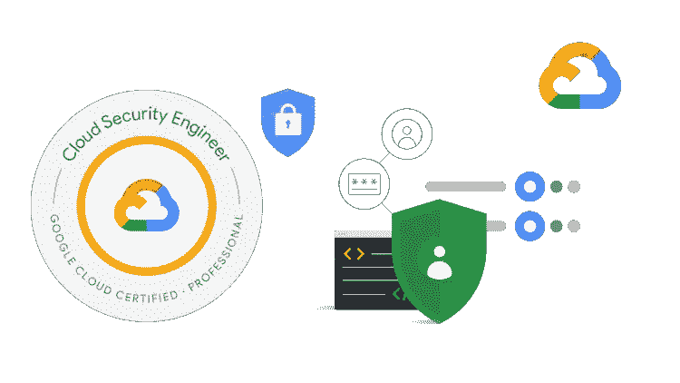
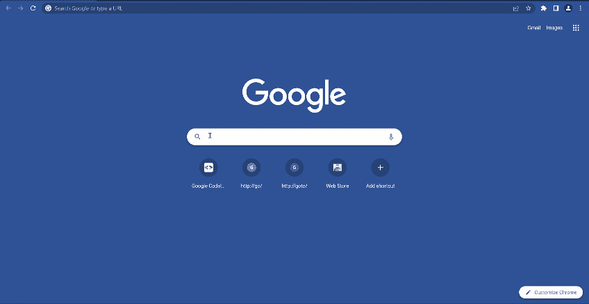
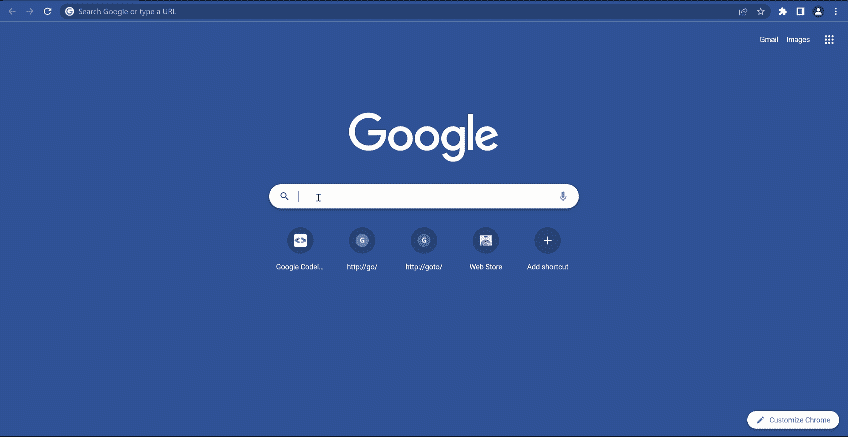

# 准备 Google Cloud 专业云安全工程师考试

> 原文：<https://medium.com/google-cloud/preparing-for-the-google-cloud-professional-cloud-security-engineer-exam-56bc34d02c45?source=collection_archive---------0----------------------->

PCSE

安全性对每个组织都非常重要。如果你有兴趣学习更多关于谷歌云的安全知识，那么 [**谷歌专业云安全工程师**](https://cloud.google.com/certification/cloud-security-engineer) 认证就是对你的挑战。

考试于 2021 年 11 月刷新，内容涵盖

*   在云解决方案环境中配置访问
*   配置网络安全
*   确保数据保护
*   在云解决方案环境中管理运营
*   确保合规

安全方面也涉及一些网络点。为了帮助你在这次考试中取得成功，我整理了一些小贴士。

# 第一步:查看考试指南

考试指南列出了要涵盖的所有目标。这是非常有用的，一看就知道你需要学习哪些方面来准备考试。可以在这里 **查看当前考试指南 [**。**](https://cloud.google.com/certification/guides/cloud-security-engineer)**

# 第二步:注册谷歌云培训

在你阅读了考试指南之后，如果你认为值得花时间去查阅一些谷歌云学习材料。谷歌云有[谷歌云技能提升](https://www.cloudskillsboost.google/paths)。在您的学习路径中登录并注册，开始学习。对于这一个，让我们挑选**安全工程师学习路径**。

一旦您选择了学习路径，请查看[为您的专业云安全工程师之旅做准备](https://www.cloudskillsboost.google/course_templates/397)中的详细信息。这个免费的培训将向你展示考试中哪些主题是重要的，并让你知道自己的优势和劣势。

如果你正在寻找谷歌云培训的其他选择，Coursera 和 Pluralsight 上有一些课程。

**Coursera 链接**:

*   [准备您的专业云安全工程师之旅](https://www.coursera.org/learn/preparing-for-your-professional-cloud-security-engineer-journey)
*   [准备 Google 云认证:云安全工程师职业证书](https://www.coursera.org/professional-certificates/google-cloud-security#courses)

**多视链接**:

*   [准备您的专业云安全工程师之旅](https://www.pluralsight.com/courses/preparing-professional-cloud-security-engineer-journey-2)
*   [谷歌云认证专业安全工程师](https://www.pluralsight.com/paths/google-cloud-certified-professional-security-engineer)

# 步骤 3:实验室实践经验

学习路径中包含几个实验，您应该努力完成它们。通过完成实验和任务，你有机会获得[技能徽章](https://cloud.google.com/training/badges)。

也可以访问[https://codelabs.developers.google.com](https://codelabs.developers.google.com/)/搜索 ***联网*** 或者 ***云安全*。**你会看到几个代码实验室，你可以在自己的环境中做，以获得更多的实践机会。在学习过程中，您可以探索服务配置中存在的各种选项。

# 第 4 步:深入探讨安全主题

谷歌云文档是技术文档。以下是我对你可以阅读的主题的一些建议。

*   [企业组织的最佳实践](https://cloud.google.com/docs/enterprise/best-practices-for-enterprise-organizations)
*   [云 IAM](https://cloud.google.com/iam/docs/overview) ， [2F 认证](https://support.google.com/cloudidentity/answer/175197?hl=en&ref_topic=2759193#zippy=)
*   [云审计日志](https://cloud.google.com/logging/docs/audit/)
*   [云 IAP](https://cloud.google.com/iap/docs/concepts-overview)
*   [DNSSEC](https://cloud.google.com/dns/docs/dnssec)
*   [信封加密](https://cloud.google.com/kms/docs/envelope-encryption)
*   [云 EKM](https://cloud.google.com/kms/docs/ekm?hl=en#how_it_works)
*   [防火墙规则](https://cloud.google.com/vpc/docs/firewall-policies-examples)
*   [DLP](https://cloud.google.com/dlp/docs/) ，[假名化](https://cloud.google.com/dlp/docs/pseudonymization?hl=en)
*   [PCI DSS 分担责任](https://services.google.com/fh/files/misc/gcp_pci_srm__apr_2019.pdf)
*   [秘密管理](https://cloud.google.com/secret-manager/docs/overview)
*   [二进制授权](https://cloud.google.com/binary-authorization/docs/overview)
*   [已签名的网址](https://cloud.google.com/cdn/docs/using-signed-urls#:~:text=Signed%20URLs%20contain%20authentication%20information,request%20associated%20with%20the%20URL.)
*   [NGFW](https://cloud.google.com/architecture/architecture-centralized-network-appliances-on-google-cloud?hl=en#choosing_an_option_for_attaching_network_segments)
*   [云甲](https://cloud.google.com/armor/docs/cloud-armor-overview)
*   [VPC 服务控制](https://cloud.google.com/vpc-service-controls/docs/overview)，[组织约束](https://cloud.google.com/resource-manager/docs/organization-policy/understanding-hierarchy)
*   [安保指挥中心](https://cloud.google.com/security-command-center/docs/concepts-security-sources?hl=en)

我还整理了这次考试的预习表，可以在[https://www.startcloudnow.com/google%20cloud.html](https://www.startcloudnow.com/google%20cloud.html)网站上找到

PCSE 床单

# 第五步:样题

认证网站上有样题，你可以点击查看[。](https://docs.google.com/forms/d/e/1FAIpQLSfSuKEE8cUQWj9sfak7QG9hpaljBC89Y22KoWMQFgoECZjzUg/viewform)

# 第六步报名参加考试

报名考试[这里](https://webassessor.com/googlecloud)。

= = = = = = = = = = = = = = = = = = = = = = = = = = = = = = = = = = = = =
安全是你的云平台必须具备的。Google Cloud 拥有默认的安全性、可配置的安全服务以及集成外部安全产品的能力。

为了从**非特定于供应商的角度**获得关于云安全的总体概述，我推荐阅读免费的 CCSK 文档。
- [云计算中关键焦点的安全指导 V4](https://downloads.cloudsecurityalliance.org/assets/research/security-guidance/security-guidance-v4-FINAL.pdf)-
-[ENISA 云计算风险评估](https://www.enisa.europa.eu/publications/cloud-computing-risk-assessment)

**也可以随意查看我的文章** —

*   [**备战 GCP 专业云网络工程师考试**](/google-cloud/preparing-for-success-with-the-gcp-professional-cloud-network-engineer-exam-da230f9788ed)
*   [**准备成功通过谷歌专业数据库工程师考试-2023**](/google-cloud/preparing-for-success-with-google-cloud-professional-cloud-database-engineer-exam-2023-3ad33fa3eea9)
*   [**备考谷歌云专业云 DevOps 工程师考试**](/google-cloud/preparing-for-the-google-cloud-professional-cloud-devops-engineer-exam-30e9d5fe07e4)

如果你想问一个问题，了解更多或分享一个想法？请在 [**Linkedin**](https://www.linkedin.com/in/ammett/) 或[**Twitter @ ammettw**](https://twitter.com/ammettw)**上与我联系，并给我发消息。**

**我会保持联系的。**