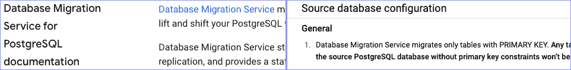
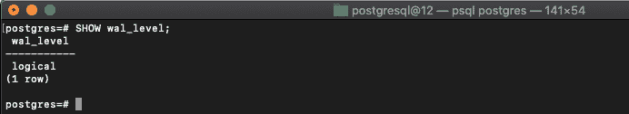

# 为数据库迁移服务准备 PostgreSQL

> 原文：<https://medium.com/google-cloud/preparing-postgresql-for-migration-database-migration-service-b092207b31a3?source=collection_archive---------0----------------------->

[去年 11 月](https://cloud.google.com/blog/products/databases/database-migration-service-now-available-for-cloud-sql-and-more)，我们发布了数据库迁移服务(DMS)的公开预览版，让 MySQL 用户的关系数据库迁移变得更加容易。今天，我们正式发布了该产品，并为 PostgreSQL 带来了同样易于使用的迁移功能。

我最欣赏 DMS 的一点是，它很好用。一旦准备好源实例和数据库，并建立了源和目标之间的连接，迁移工作就全部完成了。当所有这些都完成后，切换到使用云 SQL 实例作为应用程序的主数据库就像在 DMS UI 中单击一个按钮一样简单。

不要低估数据库准备或连接的难度。我写了一篇全面的[博文](https://cloud.google.com/blog/topics/developers-practitioners/database-migration-service-connectivity-technical-introspective)，详细介绍了 DMS 的各种连接选项。网络拓扑可能非常复杂，通过互联网安全地连接两台机器，同时为拥有数千或数百万用户的应用程序提供服务绝非易事。

今天，我想花一点时间向您介绍如何使用 DMS 为迁移准备您的源 PostgreSQL 实例和数据库，以及我发现的一些问题，这样您就不必这么做了。

首先，我要说的是，[文档](https://cloud.google.com/database-migration/docs/postgres/configure-source-database)和产品内用户界面指南对 DMS 来说都是极好的。如果您熟悉为 PostgreSQL 设置复制基础设施，那么您可能很乐意投入其中，并在需要时查看文档。话虽如此，但这是文档，所以在这里我将尝试添加一些内容，以便在一个地方获得准备源 PostgreSQL 实例和数据库所需的一切。

第一步，确保您的源实例版本受支持。当前支持的版本列表可以在我上面链接的文档页面上找到。

接下来是一个模式部分:DMS 不支持迁移没有主键的表。针对包含没有主键的表的数据库启动迁移仍然会成功，但是不会从缺少主键的表中获取数据，但是仍然会创建该表。因此，如果您想从没有主键的表中获取数据，有几种选择:

1.  在开始迁移之前，您必须添加一个主键。
2.  初次迁移后，您需要自己携带数据。当然要记住，如果您自己带来了数据，即使您保持了连接，DMS 也不会继续为该表复制数据。
3.  您可以从源实例中导出表，并将其导入到新实例中。
4.  最后，您可以创建一个与没有主键的表具有相同模式的表，给它一个主键(应该使用序列生成器来自动生成键)，并将源数据复制到其中。然后进行迁移。作为迁移的一部分，DMS 将创建非 PK 表，它只是不复制数据。然后，您可以从迁移的主键表中复制数据，最后在验证完数据后删除主键表。这听起来很复杂，但是它可以确保您在迁移时获得与其他数据相同的数据，只要您将任何新行插入到非主键表中，并且将这些新行插入到主键副本中。如果您担心该表中的数据在迁移过程中发生变化，您可以在提升目标实例之前复制数据以最小化该窗口。

DMS 依赖 pglogical 进行迁移工作。这意味着必须在每个要迁移的数据库上安装 pglogical 扩展。在你的实例和数据库上安装 pglogical 的说明可以在[这里](https://cloud.google.com/database-migration/docs/postgres/configure-source-database#pglogical)找到。如果你运行的是 Linux，repo 的安装页面会很有帮助。为了确保我为团队做了一件事，我决定看看将安装了 Homebrew 的 PostgreSQL 数据库从 MacOS 迁移到 Cloud SQL 会有多糟糕。结果，令人震惊的不太坏！正在从源安装 pglogical:

1.  克隆 GitHub repo
2.  运行 make
3.  获取编译错误，因为找不到 postgres.h
4.  找到 Homebrew 安装 Postgres 的地方，找到包含文件夹，将所有包含文件夹添加到`C_INCLUDE_PATH`
5.  再跑`make`，建成！
6.  运行`sudo make install`因为 pglogical 文档说我可能需要它(旁注:不要预优化！)
7.  失败，没有任何好消息
8.  运行`make install`
9.  大获成功！还不能完全测试成功，因为现在实例和数据库必须配置为使用 pglogical 和 replication。

如果您以前在 PostgreSQL 中做过复制，那么下一部分非常简单。为了复制成功，需要在实例上设置一些配置变量。有两种主要的方法来改变这些值。您可以在实例运行时使用`ALTER SYSTEM SET <variable> TO <value>;`调用来调整它们，也可以在配置文件 posgresql.conf 中更改它们。

如果你想在配置文件中改变它，但是不知道它在哪里，通常它在数据库的数据目录中。如果您只有登录您的数据库的凭证，但不知道它在哪里，您可以在连接到数据库后运行`SHOW data_directory`,它会给出数据目录的位置。

您需要设置的变量有:

#需要设置为逻辑
`wal_level = logical`

#数量有所不同，详见[此处](https://cloud.google.com/database-migration/docs/postgres/configure-source-database#pglogical)详见

#应为 max_replication_slots plust 活动连接的复制副本数。
`max_wal_senders = n`

#应设置为正在复制多少个数据库 `max_worker_processes = n`

#注意不要删除该变量
`shared_preload_libraries = ‘pglogical’`中的任何其他库

请注意，shared_preload_libraries 变量是一个逗号分隔的列表。当您将它设置为首先检查是否有其他库被预加载以包含它们时，您需要小心，否则您可能会卸载您的设置所需的库，并导致数据库出现问题。

重新启动后，您可以通过连接并运行`SHOW <variable>`来验证更改，例如`SHOW wal_level`应显示`logical`。

快速示例时间:

请注意，这些数字仅用于 DMS 负载。如果您因为其他原因已经设置了这些值，那么您需要考虑到这一点。例如，如果您已经将 max_worker_processes 设置为 8 来处理更高的并行查询，那么您可能希望在上面添加更多以适应复制，从而避免影响性能。

案例 1:您正在进行迁移，并立即升级云 SQL 实例。源上没有设置任何其他副本，您只有一个要迁移的数据库。然后，您需要将这些值设置为:

#从技术上讲，对于云 SQL 订阅者，我们只需要 1，默认设置是
#设置为 10，所以您可以不去管它。这只是说明
#您可以将其设置得更低，而不会有任何问题
**max _ replication _ slots = 3**

#等于 max_replication_slots + 1，因为我们只有一个
#副本连接到源实例
**max_wal_senders = 4**

#从技术上来说，我们在这里只需要 1 个数据库，因为我们只带来了
#一个数据库，但最好有一个作为缓冲区
#以防出现问题，这样它就不依赖于
#只依赖于一个处理器。
max _ worker _ processes = 2

案例 2:在您的设置中，您的本地本地实例已经设置了 5 个复制插槽来处理您现有的其他复制，并且有 4 个数据库要迁移到云中，您可能希望设置如下变量:

现有订阅者 5 个，每个源数据库 4 个，因为 pglogical
#要求每个数据库 1 个插槽
**max _ replication _ slots = 9**

#等于 max_replication_slots + 6，因为假设我们有 5 个现有副本，
#我们将为进行迁移的 DMS 再添加一个副本
**max _ wal _ senders = 15**

# 4 我们正在迁移的数据库，外加额外的缓冲区，以防万一
**max _ worker _ processes = 5**

一旦您设置好所有变量，如果您在配置文件中更改了它们，现在您需要重新启动 PostgreSQL 实例。

您可以通过登录到实例并在您计划复制的一个数据库上运行`CREATE EXTENSION pglogical`来验证它是否工作。只要它正常工作，您就需要连接到您想要复制的每个数据库，并在每个数据库上运行该命令。当您在每个数据库上时，您需要授予您在创建迁移的`Define a source`步骤中指定的用户某些特权。这些授权需要在您复制的每个数据库以及 postgres 数据库上进行:

#在每个要迁移的数据库的所有模式上(除了信息模式和以“pg_”开头的模式)，包括 pglogical
`GRANT USAGE on SCHEMA *<SCHEMA>* to *<USER>*`

#从源数据库获取复制信息。
`GRANT SELECT on ALL TABLES in SCHEMA pglogical to *<USER>*`

#在每个要迁移的数据库的所有模式上(除了信息模式和以“pg_”开头的模式)，包括 pglogical
`GRANT SELECT on ALL TABLES in SCHEMA *<SCHEMA>* to *<USER>*`

#在每个要迁移的数据库的所有模式上(除了信息模式和以“pg_”开头的模式)，包括 pg logical

#我们不会在这篇博文中处理它，但是如果你碰巧想从 RDS 中复制
#的话，那就是:
`GRANT rds_replication TO <USER>`
`ALTER USER <USER> WITH REPLICATION`

如果您的源数据库版本低于 9.6，则需要执行额外的步骤，因为在此之前，PostgreSQL 在默认情况下没有复制延迟监控。这是必要的，因为 DMS 利用这一点来观察复制延迟是否变得过高。我不打算在这里详细介绍它，因为 9.6 之前的所有版本目前都已停止使用，但如果您需要这样做，这里有关于您需要做什么的信息。

恭喜你！您的 PostgreSQL 实例和数据库已经完全配置好，可以使用 DMS 了！DMS 的另一个好处是，当您全部配置好并准备好运行时，在您点击最后的“开始”按钮之前，UI 中会有一个连接/配置测试，它会告诉您是否一切都配置正确。

还记得我提到过，在我在这篇文章顶部链接的博客文章中，我涉及了很多关于源数据库和云 SQL 实例之间的连接的细节。它涵盖了 MySQL，所以在我离开您之前，我将在这里添加一个我在使用 PostgreSQL 时遇到的陷阱。

如果您还没有这样做，请务必记住，使您的数据库能够侦听和接受来自非本地主机位置的连接。两件事，第一，您需要更改 postgresql.conf 文件中的`listen_address`变量。它默认为 localhost，这可能取决于您如何管理从应用程序到数据库的连接，但对迁移不起作用。您还需要修改 pg_hba.conf 文件，以授予您的用户从云中迁移到本地数据库的访问权限。如果您没有做到这两点，DMS 可以很好地从 PostgreSQL 实例中给出明确的错误消息，告诉您您搞砸了。问我怎么知道的。

现在我们有了。一切尽在一处，让您准备好将 PostgreSQL 数据库引入云 SQL。如果您有任何问题、建议或投诉，请通过 [Twitter](https://twitter.com/GabeWeiss_) 联系我，我的 DMs 是开放的！感谢阅读。