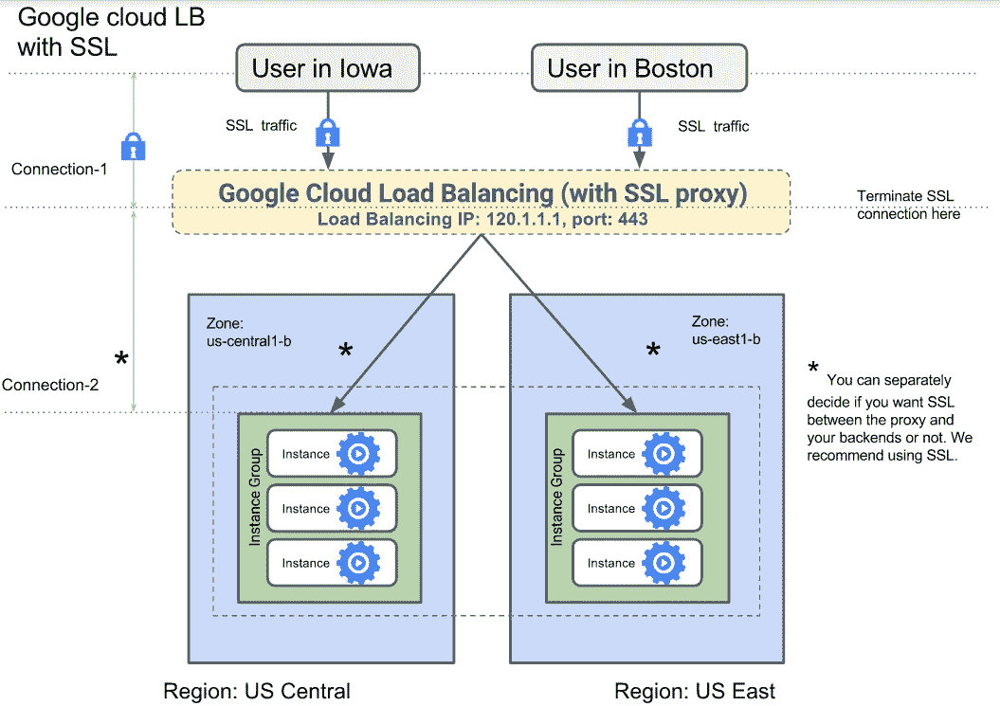
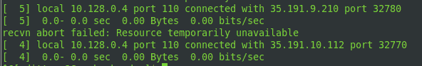
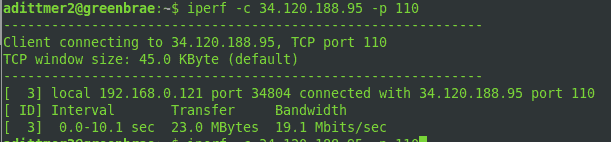
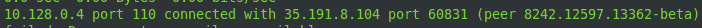
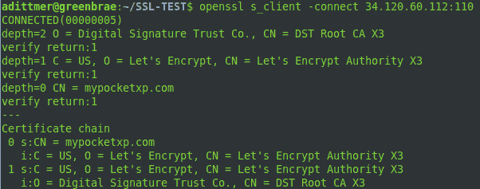
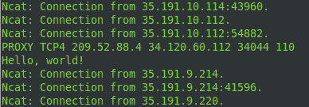
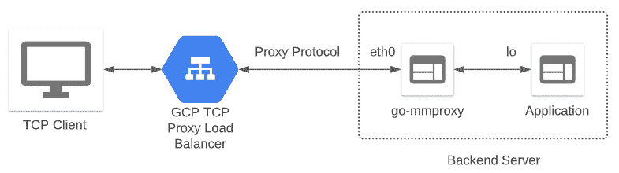
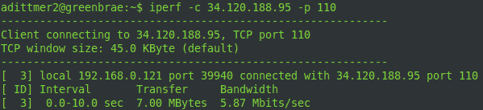
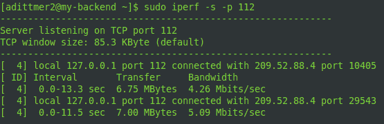
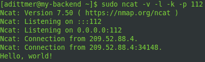

# 通过 Google Cloud 的全球 TCP 和 SSL 代理负载平衡器保护客户端 IP

> 原文：<https://medium.com/google-cloud/preserving-client-ips-through-google-clouds-global-tcp-and-ssl-proxy-load-balancers-3697d76feeb1?source=collection_archive---------0----------------------->

当您构建包含反向代理(代表客户端连接到后端服务器的系统)的网络架构时，原始客户端请求的 IP 地址很可能在代理处“丢失”。如果您需要后端服务器上的客户端 IP 地址用于基于 IP 的客户端白名单/黑名单(例如游戏服务器)，用于基于 IP 的二级客户端身份验证，用于记录客户端请求或用于故障排除，这将是一个问题。

Google Cloud 为 TCP 和 SSL 的全局负载平衡提供反向代理。在本文中，我将首先一步一步地向您展示如何使用在 TCP 有效负载中保留客户机 IP 地址的配置来配置这些负载平衡器。然后，我们将了解如何使用名为 [go-mmproxy](https://github.com/path-network/go-mmproxy) 的 OSS 解决方案，结合 GCP 代理负载平衡器，将客户端 IP 透明地传递给运行在后端服务器上的应用程序。

**GCP TCP 和 SSL 代理负载均衡**

谷歌云的 [TCP 代理负载平衡器](https://cloud.google.com/load-balancing/docs/tcp)和 [SSL 代理负载平衡器](https://cloud.google.com/load-balancing/docs/ssl)非常适合在全球范围内提供应用和服务。用户连接在负载平衡层终止，然后代理到后端实例。对于 SSL 代理负载平衡器，您可以在 SSL 和 TCP 之间选择从代理到后端服务器的连接。请注意，即使对于代理和后端服务器之间的 TCP 连接，到后端服务器的[流量也将被加密](https://cloud.google.com/security/encryption-in-transit#automatic_encryption_between_gfes_and_backends)。



GCP 的全球 TCP 和 SSL 代理负载平衡器具有以下优势

*   有了对任播 IP 的支持，您可以对全球所有用户使用一个外部 IP 地址，同时流量被路由到地理上离用户最近的后端
*   如果一个区域的容量已满，新的连接将自动定向到另一个具有可用容量的区域
*   TCP 和 SSL 代理负载平衡器可以终止 IPv6 连接
*   如果您对代理到后端的流量使用 TCP，SSL 代理负载平衡器可以保护不提供本地 SSL 支持的应用程序

如果您不确定 TCP 代理负载平衡器是否适合您的架构，GCP 官方文档中的第[页](https://cloud.google.com/load-balancing/docs/choosing-load-balancer)可以帮助您确定最适合您的用例的解决方案。

TCP 和 SSL 代理负载平衡不太适合 HTTP(S)流量。对于 HTTP(S)流量，使用外部 [HTTP(S)负载平衡](https://cloud.google.com/load-balancing/docs/https)。使用 HTTP(S)负载平衡器时，保留原始客户端 IP 也不成问题，因为它会在 X-Forwarded-For 标头中透明地设置客户端的 IP 地址。

**GCP TCP 和 SSL 代理负载均衡概念**

与上面的简化图不同，负载平衡器实际上包括多个组件。让我们放大一下将要配置的 GCP 结构。


对已配置端口上保留的外部 IP 的传入请求被转发到全局转发规则中定义的目标 TCP/SSL 代理。目标 TCP/SSL 代理终止 TCP/SSL 连接，并将流量转发到相关的后端服务。如果进行了相应的配置，目标 TCP/SSL 代理会将客户端 IP 保存在[代理头](https://www.haproxy.org/download/1.8/doc/proxy-protocol.txt)中。全局后端服务定义了如何分配流量，将流量路由到地理上最近的具有资源可用性的区域中的实例组。全局后端服务与实例组相关联，实例组是接受服务请求的所有虚拟机的区域分组。实例组被单独添加到后端服务中，每个实例组的负载平衡方案可以在添加到后端服务时指定。通过更新后端服务的运行状况检查来监控各个节点。

有关更多详细信息，请查看 GCP 文档，其中提供了 [TCP 代理负载平衡概述](https://cloud.google.com/load-balancing/docs/tcp)和 [SSL 代理负载平衡概述](https://cloud.google.com/load-balancing/docs/ssl)。

**配置和测试 TCP 和 SSL 代理负载平衡**

为了简单起见，我们将在负载平衡器后面设置一个后端服务器。这种基本配置可以通过在不同地理位置添加实例组和虚拟机来轻松扩展，按照 Google Cloud 文档设置 [TCP](https://cloud.google.com/load-balancing/docs/tcp/setting-up-tcp) 和 [SSL](https://cloud.google.com/load-balancing/docs/ssl/setting-up-ssl) 代理负载平衡器。

若要遵循，您必须能够在项目中创建实例和修改网络。您必须是项目所有者或编辑者，或者必须拥有以下所有计算引擎 IAM 角色

*   [网络管理员](https://cloud.google.com/compute/docs/access/iam#compute.networkAdmin)
*   [安全管理员](https://cloud.google.com/compute/docs/access/iam#compute.securityAdmin)
*   [计算实例管理](https://cloud.google.com/compute/docs/access/iam#compute.instanceAdmin)

*TCP 和 SSL 代理*

我们首先创建后端虚拟机实例

```
gcloud compute instances create my-backend --image-project centos-cloud --image-family centos-7 --tags tcp-lb --zone us-central1-b
```

然后，我们创建一个实例组

```
gcloud compute instance-groups unmanaged create my-instance-group --zone us-central1-b
```

我们为实例组创建一个命名的 TCP 端口，它是负载平衡器将流量定向到的端口的别名。我们将在稍后设置后端服务时使用这个命名端口。在本例中，我们选择了端口 110。由于 go-mmproxy 不支持 SSL/TLS，我们使用 TCP 进行 SSL 代理的代理到后端连接。

```
gcloud compute instance-groups set-named-ports my-instance-group --named-ports tcp110:110 --zone us-central1-b
```

我们将后端虚拟机添加到实例组中。在真实的用例中，我们将在这里添加多个实例。

```
gcloud compute instance-groups unmanaged add-instances my-instance-group --instances my-backend --zone us-central1-b
```

现在有了一个实例组，该实例组公开了端口 110，我们可以配置负载平衡器了。我们在端口 110 上创建健康检查。

```
gcloud compute health-checks create tcp my-tcp-health-check --port 110
```

我们为实例组创建的命名端口 tcp110 创建了 TCP 的全局后端服务

```
gcloud compute backend-services create my-tcp-lb --global-health-checks --global --protocol TCP --health-checks my-tcp-health-check --timeout 5m --port-name tcp110
```

现在，我们可以将实例组添加到后端服务中。我们将 UTILIZATION 指定为负载平衡方案，用于平衡实例组内实例间的流量。max-utilization 定义后端实例组中后端实例平均利用率的最大目标。我们选择 80%，这意味着如果平均利用率超过 80%，流量将被重定向到其他实例组。有关更多详细信息，请查看添加后端的 [gcloud 文档](https://cloud.google.com/sdk/gcloud/reference/compute/backend-services/add-backend)。

```
gcloud compute backend-services add-backend my-tcp-lb --global --instance-group my-instance-group --instance-group-zone us-central1-b --balancing-mode UTILIZATION --max-utilization 0.8
```

*TCP 代理*

我们创建目标 TCP 代理，指定我们需要在代理头中保留客户机 IP

```
gcloud compute target-tcp-proxies create my-tcp-lb-target-proxy --backend-service my-tcp-lb --proxy-header PROXY_V1
```

*SSL 代理*

对于 SSL，我们需要从我们的证书文件中创建一个 GCP SSL 证书。fullchain.pem 是我为我的域 mypocketxp.com 公开信任的 x509 证书，由[让我们加密认证机构](https://letsencrypt.org/)生成。privkey.pem 是相应的私钥。

```
gcloud compute ssl-certificates create my-ssl-cert --certificate fullchain.pem --private-key privkey.pem
```

我们创建一个 SSL 策略，指定服务器端对客户端和 SSL 代理负载平衡器之间连接的 SSL 特性的支持。MODERN profile 支持广泛的 SSL 特性，允许 modern clients 协商 SSL。要了解更多细节，请查看 gcloud [关于 SSL 策略的文档](https://cloud.google.com/sdk/gcloud/reference/compute/ssl-policies/create)。

```
gcloud compute ssl-policies create my-ssl-policy --profile MODERN --min-tls-version 1.0
```

我们创建 SSL 目标代理，通过代理头保留客户机 IP，链接我们的证书并应用我们的 SSL 策略

```
gcloud compute target-ssl-proxies create my-ssl-lb-target-proxy --backend-service my-tcp-lb --ssl-certificates my-ssl-cert --ssl-policy my-ssl-policy --proxy-header PROXY_V1
```

*TCP 和 SSL 代理*

对于 SSL 和 TCP 代理，我们保留我们的全球任播 IP。在本例中，我们只分配了一个 IPv4 地址

```
gcloud compute addresses create lb-static-ipv4 --ip-version=IPV4 --global
```

我们查找保留的 IP 地址并配置全局转发规则

```
gcloud compute addresses list
```

*TCP 代理*

```
gcloud compute forwarding-rules create my-tcp-lb-ipv4-forwarding-rule --global --target-tcp-proxy my-tcp-lb-target-proxy --address <reserved IP address> --ports 110
```

*SSL 代理*

```
gcloud compute forwarding-rules create my-ssl-lb-ipv4-forwarding-rule --global --target-ssl-proxy my-ssl-lb-target-proxy --address <reserved IP address> --ports 110
```

*TCP 和 SSL 代理*

对于 SSL 和 TCP 代理，我们需要启用从代理到后端虚拟机的流量。我们创建了一个防火墙规则，将 GCP 代理用于代理到虚拟机连接以及运行状况检查的源 IP 列入白名单。

```
gcloud compute firewall-rules create allow-lb-and-health --source-ranges 130.211.0.0/22,35.191.0.0/16 --target-tags tcp-lb --allow tcp:110
```

*TCP 代理*

对于 TCP 转发的基本测试，我们登录到后端服务器，并在我们的后端服务器上安装 [iperf](https://iperf.fr/) ，这是一个广泛用于网络性能测量和调优的工具

```
gcloud compute ssh my-backend --zone us-central1-bsudo yum install -y iperf
```

然后，我们在后端服务器上以服务器模式启动 iperf

```
sudo iperf -s -p 110
```

大约五秒钟后，您将会看到类似这样的条目，显示来自端口 110 上的健康检查的连接尝试，这是对后端服务的健康检查。



现在，我们可以从客户端(即我们的本地系统)连接，通过代理检查与后端的连接

```
iperf -c <reserved address> -p 110
```

大约 5-10 秒后，我们看到连接已经建立，性能测试的数据已经交换。



在服务器端，您会看到一个如下所示的日志条目，表明与一个对等机建立了连接。我们看不到源 IP，因为 iperf 忽略了 TCP 有效负载中的代理报头，只看到来自代理使用的 IP 范围(35.191.0.0/16)内的 IP 的连接。



*SSL 代理*

由于 iperf 不支持 SSL，我们需要以不同的方式测试 SSL 代理。使用下面的小 python 客户端代码，我们可以向后端服务器发送“Hello，world”。

代码使用 Python [SSL 模块](https://docs.python.org/3/library/ssl.html)为套接字对象提供 TLS/SSL 包装器。server_name 必须与 x509 证书的“主题”行或“主题备用名”(SAN)中的公用名(CN)相匹配。您可以通过以下方式检查证书的内容

```
openssl x509 -in <certificate file> -text -noout
```

因为我们想要验证根 CA，所以我们使用 load_verify_locations()将包含根 CA 证书的文件传递给 SSL 上下文。

要识别根 CA 的 x509 证书文件，您可以运行

```
openssl s_client -connect <reserved IP address>:110
```

使用我们保留的 IP 地址并附加到上面的转发规则。这将向您显示信任根的证书链。在我的例子中，我看到一个带有一个中间证书的链:“DST 根 CA X3”→“让我们加密权威 X3”→“mypocket XP . com”。



在我的笔记本电脑(Ubuntu 18.04.5 LTS)上，我可以在/etc/ssl/certs 中找到根 CA 的证书文件 DST_Root_CA_X3.pem。如果你找不到根 CA 证书文件，你可以使用根 CA 的 CN 搜索像 [IdenTrust](https://www.identrust.com/) 这样的网站，在我们的例子中是 DST 根 CA X3’，然后下载文件。然后你可以在这里安装证书[。您还可以在这篇](https://support.nmi.com/hc/en-gb/articles/360021544791-How-to-Check-If-the-Correct-Certificates-Are-Installed-on-Linux#Importing%20Missing%20Certificates)[中型文章](/@superseb/get-your-certificate-chain-right-4b117a9c0fce)中找到一篇关于证书验证的精彩文章。

为了测试连通性，我们在后端将 ncat 作为“服务器”运行。与 nmap 软件包一起安装的 ncat

```
yum install -y nmap
```

ncat 监听端口 110。k 选项确保 ncat 不会在连接关闭后终止

```
sudo ncat -v -l -k -p 110
```

当我们在本地主机上运行我们的客户端程序时，我们看到代理头显示了我们的客户端 IP 209.52.88.4 以及我们的消息。源 IP 35.191.10.112 是代理范围内的一个 IP。消息上方和下方显示的连接是运行状况检查连接。



如果您希望 ncat 绑定到特权端口，而不是以 root 用户身份运行，您可以为 ncat 设置 [Linux 功能](https://man7.org/linux/man-pages/man7/capabilities.7.html) cap_net_bind_service

```
setcap 'cap_net_bind_service=+eip' /usr/bin/ncat
```

**Go-mmproxy**

虽然这种负载平衡配置通过代理标头保留了原始的客户端 IP，但是我们如何将标头中的信息传递给后端服务器上的应用程序呢？理想情况下，我们希望这对于应用程序是完全透明的。这就是 [go-mmproxy](https://github.com/path-network/go-mmproxy) 发挥作用的地方。

go-mmproxy 是一个独立的应用程序，我们在后端服务器上运行。它监听远程连接，在我们的例子中是来自 GCP 代理负载平衡器。在为新的输入 TCP 连接完成 TCP 握手之后，go-mmproxy 从第一个输入分组的有效载荷中读取[代理协议报头](https://www.haproxy.org/download/1.8/doc/proxy-protocol.txt)。Go-mmproxy 然后创建一个新的套接字，[将](https://man7.org/linux/man-pages/man2/bind.2.html)绑定到它在代理协议头中找到的源 IP。接下来，go-mmproxy 使用此套接字在 go-mmproxy 启动时指定的端口上打开到主机环回网络接口(lo，IP 127.0.0.1)的连接。对于侦听该端口的应用程序，传入的连接将原始 TCP 客户端 IP 作为源地址。换句话说，go-mmproxy 欺骗了连接的源 IP，因此通过 go-mmproxy 到应用程序的连接似乎来自原始的 TCP 客户端 IP 地址。



虽然本文的重点是将 go-mmproxy 用于 TCP，但 go-mmproxy 也支持 UDP 流量。有关 go-mmproxy 实现细节的更多信息，请查看 Cloudflare 的 [mmproxy](https://github.com/cloudflare/mmproxy) 上的这个[博客](https://blog.cloudflare.com/mmproxy-creative-way-of-preserving-client-ips-in-spectrum/)，它启发了 go-mmproxy 以及这篇[文章](https://idea.popcount.org/2014-04-03-bind-before-connect/)。

**在 GCP 上设置 go-mm proxy**

在基于 Debian 的系统上，有一个预构建的 [go-mmproxy 包](https://manpages.debian.org/testing/go-mmproxy/go-mmproxy.1.en.html)可用。否则我们需要在我们的后端系统上安装 git。

```
sudo yum install -y git
```

然后我们下载 Go 构建环境…

```
curl -o go1.15.5.linux-amd64.tar.gz [https://dl.google.com/go/go1.15.5.linux-amd64.tar.gz](https://dl.google.com/go/go1.15.5.linux-amd64.tar.gz)
```

…并解压缩安装在/usr/local 中的 tarball

```
sudo tar -C /usr/local -xzf go1.15.5.linux-amd64.tar.gz
```

Go 现在已经安装好了，我们现在只需要把它添加到我们。bashrc 或您喜欢的 shell 初始化脚本

```
export PATH=$PATH:/usr/local/go/bin
```

您可以使用一个快速的“Hello，World”示例来测试安装，如这里的[所示](https://linuxize.com/post/how-to-install-go-on-centos-7/#test-the-installation)。

我们现在可以提取 go-mmproxy 代码，并使用一个命令进行构建

```
go get github.com/path-network/go-mmproxy
```

go-mmproxy 二进制文件位于 go/bin 子目录中。在启动 go-mmproxy 之前，我们需要修改后端服务器上的路由表。来自后端服务器上的应用程序的传出流量默认被路由到默认的互联网网关。该流量需要通过环回接口从应用程序路由回 go-mmproxy。我们创建一个自定义路由表，强制将来自应用程序的返回流量路由到 loopback lo，以便 go-mmproxy 可以将其作为来自 loopback 接口的传入流量进行处理。

此命令确保表 100 中的自定义路由应用于来自应用程序的所有传出数据包

```
sudo ip -4 rule add from 127.0.0.1/8 iif lo table 100
```

在表 100 中，我们将所有本地流量重定向回环回接口，而不考虑目的地 IP (0.0.0.0 ),以支持 go-mmproxy 的处理。

```
sudo ip route add local 0.0.0.0/0 dev lo table 100
```

最后，我们需要创建一个包含 go-mmproxy 接受流量的 IP 范围的文件。在我们的例子中，这些是 GCP 代理负载平衡器使用的 IP 范围。

```
echo 35.191.0.0/16 > gcp-tcp-proxy-ip-range
echo 130.211.0.0/22 >> gcp-tcp-proxy-ip-range
```

我们启动 go-mmproxy 监听端口 110，并将流量转发到端口 112。我们需要以 root 用户身份启动，因为我们正在使用特权端口。

```
sudo ./go/bin/go-mmproxy -l 0.0.0.0:110 -4 127.0.0.1:112 --allowed-subnets ./gcp-tcp-proxy-ip-range
```

*TCP 代理*

我们等待片刻，以确保 GCP TCP 代理健康检查已经注意到 go-mmproxy 正在侦听端口 110，将实例组标记为健康。我们在后端服务器上启动 iperf，监听端口 112

```
sudo iperf -s -p 112
```

并从客户端启动会话。保留地址是我们为全局 TCP 代理保留的 IP，可通过“gcloud compute addresses list”获得

```
iperf -c <reserved IP address> -p 110
```

在客户端，您应该会看到类似如下的输出



在服务器端，您将在端口 112 上看到来自原始客户端 IP 的连接



*SSL 代理*

为了测试 SSL 代理，我们再次依赖我们的 Python 客户机和 ncat。我们在后端服务器的端口 112 上启动 ncat 监听

```
sudo ncat -v -l -k -p 112
```

并从本地客户端发送我们的消息。我们看到 ncat 将原始客户端 IP 记录为源地址



到目前为止，我们一直以 root 用户身份运行 go-mmproxy，就像我们使用特权端口(端口 1–1023)一样。如果您担心这个问题，您应该担心，您可以使用非特权端口，并将 CAP_NET_ADMIN [Linux 功能](https://man7.org/linux/man-pages/man7/capabilities.7.html)分配给 go-mmproxy 二进制文件。这并不是 100%安全，但至少与以 root 用户身份运行可执行文件相比，潜在的爆炸半径更小。如果你想了解更多关于 setcap 的信息，看看这篇文章。

```
sudo setcap cap_net_admin+eip ./go/bin/go-mmproxy
```

**注意事项**

在我的测试中，所提出的解决方案运行良好。在使用 go-mmproxy 测试 GCPs TCP/SSL 代理负载均衡器之前，有一些注意事项需要考虑

*   TCP 和 SSL 代理负载平衡仅支持端口 25、43、110、143、195、443、465、587、700、993、995、1883、3389、5222、5432、5671、5672、5900、5901、6379、8085、8099、9092、9200 和 9300
*   我只测试了 Redhat 7/CentOS 7 后端服务器的设置
*   有一个性能影响—来自 path.net 的[基准测试](https://blog.path.net/introducing-go-mmproxy/)显示吞吐量带宽大约有 20%的性能影响

**总结**

在本文的第一部分中，我们介绍了全局 GCP TCP/SSL 代理负载平衡器的基本配置。我们展示了如何通过在 GCP 的目标 TCP/SSL 代理上启用代理协议头来保留 TCP 有效负载中的客户端 IP。在本文的第二部分中，我们看到了如何部署 go-mmproxy 来解开这个代理协议头，并为运行在后端服务器上的应用程序伪造原始的 TCP 客户机 IP。

**更新**

为了使事情变得更简单，我编写了一个简单的启动脚本，它可以自动设置路由表，为连接日志配置 rsyslogd 和 iptables，将编译好的 go-mmproxy 复制到/tmp 并启动 go-mmproxy。

该脚本在一个公共可读的桶中。如果您使用这个 gcloud 命令行创建一个虚拟机

```
gcloud compute instances create my-backend --image-project centos-cloud --image-family centos-7 --tags tcp-lb --zone us-central1-b --metadata=startup-script-url="gs://startup-script-proxy/gommproxy-startup.bash"
```

一切都“自动”运转。