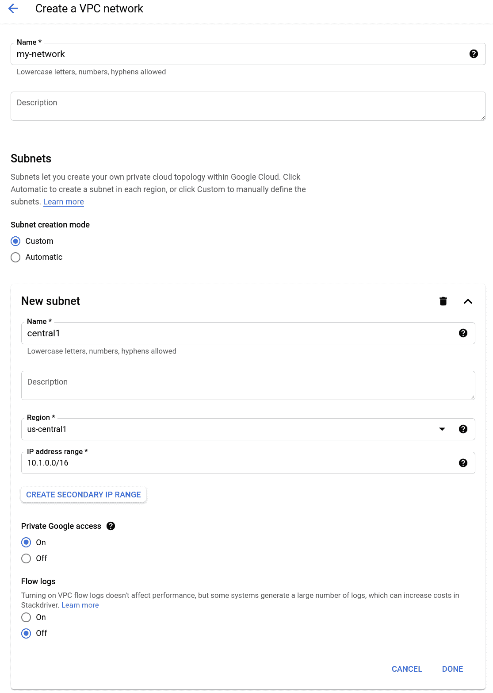

# 专用服务连接

> 原文：<https://medium.com/google-cloud/private-service-connect-c99e3e94537b?source=collection_archive---------0----------------------->


当我们建立 VPC 网络时，我们可能不希望通过该网络连接互联网。这可能意味着连接到该网络的应用程序可能无法访问 Google 托管的服务，如云存储、Pubsub、BigQuery 和许多其他服务。这些服务通过公共(互联网)IP 地址公开。此外，如果有内部应用程序希望利用 Google 托管服务，我们也可能希望通过 VPN 或其他互连解决方案将内部流量路由到我们的 GCP 网络，我们似乎也有同样的问题。

这就是 GCP 专用业务连接功能发挥作用的地方。在本文中，我们将讨论使用私有服务连接来专门访问 Google 托管服务，但似乎私有服务连接(可以/将会有额外的用途)。

私有服务连接的最高概念是我们在 VPC 网络中保留一个 RFC1918 IP 地址。当配置正确时(我们将很快介绍)，发送到我们选择的 IP 地址的请求会透明地自动路由到正确的 Google 托管服务。这意味着我们现在可以在没有任何人看到的公共 IP 地址的情况下与这些服务进行交互。我们现在考虑的所有 IP 地址都是基于 RFC1918 的，没有任何东西接近互联网。

设置私有服务连接环境非常简单。在这里，我们将从头开始进行完整的设置:

*   从一个空的 GCP 项目开始。
*   创建一个新的 VPC 网络。我们称我们的为`my-network`。请特别注意，我们**必须**启用私人谷歌访问。



*   在网络服务下，选择专用服务连接。


*   单击连接服务链接。这是我们将在网络中创建私有服务连接端点的地方，这将是我们用来连接到 GCP 托管服务的路径。


我们创建了一个名为`endpoint1`的静态 IP 地址。

*   完成后，我们会发现我们有一个如下所示的条目:


*   创建云 DNS 区域。


*   添加记录集


*   创建一个新的虚拟机，用于在我们的网络上进行测试。确保它没有公共 IP 地址。
*   设置防火墙规则以允许进入。
*   通过 SSH 登录到我们的虚拟机。
*   创建新的 GCS 存储桶。

```
gsutil mb gs://kolban-psc-test2
```

*   证明我们可以通过互联网访问谷歌托管服务。

```
curl -X GET -H "Authorization: Bearer $(gcloud auth print-access-token)" "https://storage.googleapis.com/storage/v1/b?project=$(gcloud config get-value project)"
```

*   演示我们可以通过私有服务连接访问 Google 托管服务:

```
curl -X GET -H "Authorization: Bearer $(gcloud auth print-access-token)" "https://storage-endpoint1.p.googleapis.com/storage/v1/b?project=$(gcloud config get-value project)"
```

*   删除我们网络的默认 Internet 出口路由。
*   重新运行`curl`测试，我们将看到互联网路径路由失败。

除了本文之外，这里还有一个 YouTube 视频，演示了创建私有服务连接环境的步骤:

# 参考资料:

*   [文档:私有服务连接](https://cloud.google.com/vpc/docs/private-service-connect)
*   [文档:配置私有服务连接](https://cloud.google.com/vpc/docs/configure-private-service-connect-consumer)
*   [博客:新的私有服务连接简化服务的安全访问—2020–07](https://cloud.google.com/blog/products/networking/introducing-private-service-connect)
*   [YouTube:谷歌新的私有服务连接简化了云服务的安全访问规模 2:13–2020–07](https://www.youtube.com/watch?v=TksQGwXIl1A)
*   [YouTube:私有服务连接和服务目录:在云中连接应用程序的革命—22:22–2020–09](https://www.youtube.com/watch?v=TYumathiFRI)