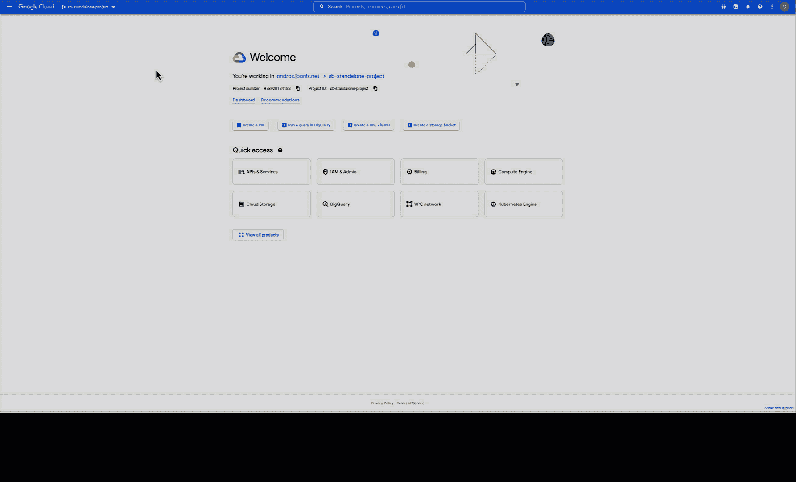
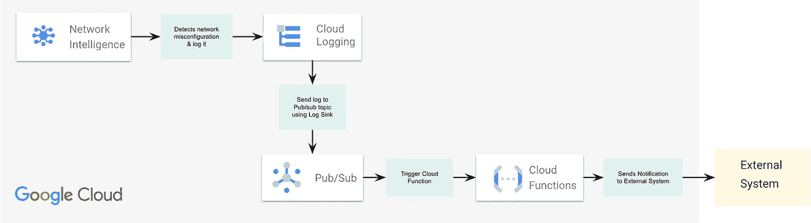

# 使用 GCP 网络分析仪进行主动网络监控

> 原文：<https://medium.com/google-cloud/proactive-network-monitoring-with-gcp-network-analyzer-94c5be824e06?source=collection_archive---------0----------------------->

主动网络健康管理计划对于所有云部署和业务流程都至关重要。尽管云计算功能强大且动态，但当客户无意中部署次优或易出错的网络配置时，他们有时会感到复杂。例如，组织可能会实施一些更改，从而在不知不觉中引入错误配置、违反最佳实践、超过 IP 地址利用率配额，或者低效地分配 IP 地址。在某些情况下，它甚至可能导致服务中断。让组织的内部或外部用户无法使用该服务可能会对其业务和声誉造成灾难性的影响。在服务中断后，团队通常求助于反应式工作流来排查和解决此类问题，即手动运行耗时的诊断。

实现主动网络健康管理的一种方法是使用网络监控工具。这些工具可以持续监控网络中的问题，例如高网络使用率、低带宽和延迟问题。他们还可以提醒 IT 人员注意潜在的问题，以便在造成中断之前解决这些问题。

主动网络健康管理的另一个重要方面是实施网络配置和管理的最佳实践。这可能包括遵循 IP 地址分配的指导原则，确保安全协议到位并保持最新，以及定期测试和更新网络配置以确保最佳性能。

主动网络健康管理还包括实施持续网络维护和优化流程。这可能包括定期系统更新、性能调整以及使用分析工具来识别和解决网络瓶颈。

总体而言，主动网络健康管理对于确保云部署的稳定性和可靠性以及防止代价高昂的服务中断至关重要。通过持续监控和优化网络，组织可以最大限度地降低中断风险，并为其用户保持高水平的性能。

谷歌云平台(GCP)上的网络智能中心的网络分析器模块帮助您在网络问题导致服务中断之前主动识别和修复网络问题。这项功能在 Google Cloud Next’22 上正式推出，包括一系列分析器，可以检测和预测潜在的网络问题，并将其作为洞察呈现出来。使用 Network Analyzer，您可以设置警报来接收有关网络中任何错误配置的即时通知。

在本文中，我们将探讨 Network Analyzer 提供的不同见解，以及如何为它们配置警报。

# 从网络分析仪中可以获得什么样的见解？

网络分析器洞察分为 5 个不同的类别:

**1。VPC 网络洞察:**这涵盖了与您的 VPC 网络相关的常见问题，如-

*   未使用的外部 IP 地址:您需要支付一个外部 IP 地址的费用，该地址是保留的，但没有连接到您环境中的任何资源。当保留的外部 IP 地址超过 24 小时未分配时，网络分析仪上会显示一条警报。
*   IP 地址利用率:如果 VPC 中任何子网的 IP 地址利用率超过 75%,则会被标记。
*   无效的 VPC 路由:如果 VPC 路由的下一跳是无效位置或配置不正确，那么它会在网络分析器上被标记。在这种情况下可能有多种情况，例如路由的下一跳是 GCE 实例被停止或删除，或者没有将实例属性`canIPForward`设置为`True`，路由的下一跳是关闭的 VPN 隧道等等..

**2。网络服务洞察:**这涵盖了错误配置的负载平衡器的问题，如-

*   防火墙规则不允许或仅部分允许负载平衡器运行状况检查。
*   负载平衡器后端服务对运行状况检查和流量使用不同的端口。

**3。Kubernetes Engine Insights :** 与 GKE 相关的见解归入此类别。

*   GKE 节点到控制面板的连接配置错误(VPC 路由)或被阻止(防火墙规则)
*   GKE 控制面板到节点的连接配置错误(VPC 路由)或被阻止(防火墙规则)
*   分配的 pod/服务子网范围的高 IP 利用率。
*   从私有 GKE 集群访问 Google APIs。

**4。混合连接洞察:**检测被子网或静态路由遮蔽或部分遮蔽的动态路由。被遮蔽的动态路由可能是从 VPC 网络上的云路由器获知的路由，也可能是从 VPC 对等网络导入的路由。

**5。托管服务洞察:**该洞察小组涵盖了 Google 托管服务的连接性问题。

*   与云 SQL 实例的连接配置错误(VPC 路由)或被阻止(防火墙规则)

> GCP 正在向该模块添加越来越多的分析仪，您可以参考[官方文档](https://cloud.google.com/network-intelligence-center/docs/network-analyzer/overview)了解当前列表。

# 网络洞察多久生成一次？

每当进行相关配置更改时，Network Analyzer 都会定期生成见解。进行相关配置更改后大约 10 分钟触发分析。每天至少进行一次定期分析。

# **如何获得实时通知？**

您可以在网络分析仪页面上的云控制台中查看细节。Network Analyzer 也以 API 的形式公开，因此您可以通过编程的方式使用这些见解，并将它们包含到现有的工作流中，或者在此基础上创建新的工作流。

来自 Network Analyzer 的见解也作为平台日志记录在云日志中。您可以在这些日志上配置基于自定义日志的指标，并使用云监控创建警报。

让我们看看如何配置实时通知。首先，让我们为网络分析器洞察创建一个基于日志的度量，该度量被优先排序为*关键*或*高*，并且属于类型*错误*。

```
gcloud logging metrics create criticalHighNetworkIssue \
      --description "Critical or High Impact insight from Network Analyzer" \
      --log-filter "LOG_ID("networkanalyzer.googleapis.com%2Fanalyzer_reports") AND
(jsonPayload.priority="CRITICAL" OR jsonPayload.priority="HIGH") AND 
jsonPayload.type = "ERROR""
```

> 根据问题的严重性，Network Analyzer 洞察力分为关键、高、中和低四个优先级。更多细节[这里](https://cloud.google.com/network-intelligence-center/docs/network-analyzer/overview#priority)。
> 
> 洞察类型可以是信息、警告或错误。更多详情[此处](https://cloud.google.com/network-intelligence-center/docs/network-analyzer/overview#status)。

创建指标后，您可以轻松配置警报策略来获取通知-



从基于自定义网络分析器日志的度量创建警报

1.  转到日志记录下的基于日志的指标。
2.  从我们的自定义指标的三点菜单中，选择“从指标创建警报”选项。它将打开“创建警报策略”窗口。
3.  选择时间序列聚合为无，然后单击下一步按钮。
4.  在“配置预警触发器”窗口中，选择条件类型为阈值，预警触发器为任何时间序列变量，阈值位置高于阈值，阈值为 0。
5.  为条件命名，然后单击下一步。
6.  在“配置通知和完成警报”窗口中，切换选择使用通知通道，并从下拉列表中选择您配置的通知通道。
7.  为警报策略命名，然后单击下一步。
8.  查看并单击创建策略。

> 您可以提前为工具创建一个通知渠道(电子邮件、Slack、pagerduty 等..)使用[本指南](https://cloud.google.com/monitoring/support/notification-options#creating_channels)进行选择。我使用了电子邮件通知渠道。

如果您想要向任何外部标签/通知系统发送通知，除了日志记录之外，您还可以使用云发布/订阅和云功能来完成此操作。下图显示了相同的参考架构示例-



向外部系统发送通知

# 如何一起监控多个项目？

组织拥有复杂的网络架构，包括共享 VPC、VPC 对等、具有互连和 VPN 的混合连接、专用服务连接等。监控整个网络比监控单个项目更重要。

与监视一样，您可以通过更改度量范围来查看多个项目的 network analyzer 细节。创建单个范围界定项目，并将其他项目作为受监控项目添加到其中。这将确保您可以集中查看所有项目中的 network analyzer 洞察。更多详情[此处](https://cloud.google.com/monitoring/settings)。

# 结论

这个工具对于检测网络错误配置或问题非常有用。如本博客所述，通过将 network analyzer insights 与日志记录和监控相结合，我们甚至可以获得实时警报，并在问题影响业务运营之前采取预防措施。