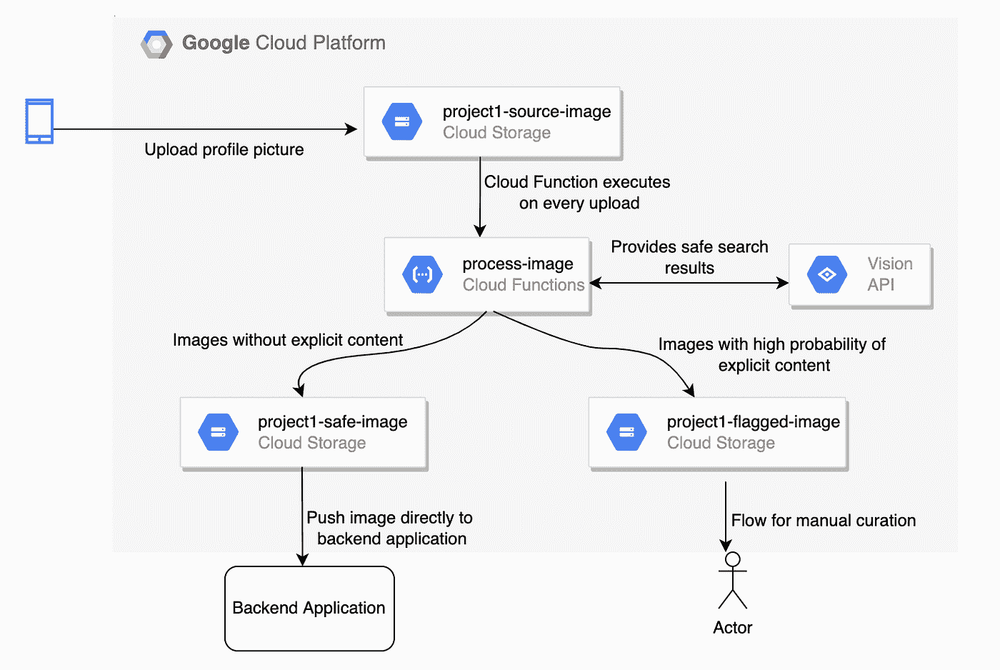

# 用谷歌云人工智能处理图像

> 原文：<https://medium.com/google-cloud/process-images-with-google-cloud-ai-c8a9ff159d99?source=collection_archive---------1----------------------->

无论您是一家企业还是一家初创公司，如今几乎每个企业都有一堆需要处理并从中获取价值的图像。随着疫情之后技术创新和在线渗透在我们生活中的破坏，企业正在采用技术优先的方法。因此，敏捷性和大规模运营的能力正成为成功的关键参数。

在这个博客中，我将讨论并尝试回答以下问题

*   为什么以及在哪里我们需要处理 OCR 之外的图像？
*   当前的挑战是什么？
*   谷歌云能有什么帮助？

# 我们需要处理图像的地方

为了更好地理解这种需求，让我们举几个与图像相关的潜在使用案例。

**1。零售**:这个细分市场主要由消费者驱动。每一件小商品的网上购物的兴起不仅增加了零售商的竞争，也给消费者提供了一个分享评论和反馈的工具。

消费者以表情符号、图片或文本的形式分享对产品的反馈是企业的宝贵资产。这种反馈的情绪给零售商或分销商一个更好地理解他们的客户和他们的问题的机会。这使得企业能够评估市场并简化整体运营，以实现更高的客户满意度。

从零售商的角度来看，其他重要的用例是产品编目、产品推荐、安全和建议性搜索等。

**2。食品行业**:网上订餐发展迅速，已经成为我们很多人的首选。在 B2B 模式下工作的企业，也就是为食品卖家提供一个在线销售平台，或者拥有一个食品链，每个人都与数字图像打交道。

这一领域的一些流行用例是菜单数字化、情感分析、反馈价值链等。对于菜单数字化，当地供应商或大餐馆可以提供他们菜单的图像，作为快速在数字平台上装载它们的来源。另一个用例出现在您拥有全球业务并需要多语言能力的时候。

**3。社交平台**:这些平台大力支持众包内容，即允许人们上传和分享图片。这是千禧一代和 genZ 的新常态和趋势。虽然这些平台提供了允许人们进行社会联系和提高意识的功能，但同时平台必须支持许多社会义务和地区合规性。

有一个用例可以扫描图像，标记或编辑出负面的民族情绪、暴力、色情、虐待等明确的内容。

**4。出版社**:大出版社有丰富的历史保存在箱子里。这些内容位于孤岛中，不可搜索。将这些内容数字化不仅可以帮助我们保存我们的存在，还可以帮助我们更好地揭示和理解历史。研究人员可以使用相同的内容，大学也可以使用相同的内容作为收入模式的另一个来源。

《纽约时报》也做过类似的工作，这是一个非常有趣的案例研究。查看此 [**链接**](https://cloud.google.com/blog/products/ai-machine-learning/how-the-new-york-times-is-using-google-cloud-to-find-untold-stories-in-millions-of-archived-photos) 了解更多信息。

**5。制造业:这一领域的数字化正在加快步伐，潜力巨大。随着智能设备的兴起，用例正在从发现机器、智能家居、智能相机中的缺陷，到超越自动驾驶汽车。**

除了上述列表之外，还有许多跨行业的使用案例，如汽车、医疗保健、安全、游戏、政府、军事、媒体和娱乐等。我们需要图像处理和分析来获取价值。OCR 技术已经存在了几十年，可以从图像中提取文本，但今天世界并不局限于此。我们需要与源内容相关的丰富的元数据，以便更好地理解数据，帮助做出明智的决策。

# 了解当前的挑战

现在，我们已经看到了一些用例，让我们试着理解 AI/ML 试图解决的一些现有的挑战和复杂性。

**1。规模和敏捷性**:不管我们到目前为止讨论了什么，以接近实时的速度对数百万个请求进行大规模处理是不可能的。因此，直接需要一种能够提供大规模解决方案的技术。想象一下，一个运营团队为一个大规模的社交平台手动扫描你的图像。

**2。成本**:拥有一个专门的团队来进行元数据标记或扫描所有图像以保持合规性是一个成本高昂的模式。投资于能够显著降低运营开销的正确技术是更明智的选择。

**3。文本提取**:虽然市场上有很多成熟的 OCR 技术产品，但是复杂度随着

*   手写文本
*   不同字体的图像
*   破碎的或历史的图像
*   像我们在报纸上看到的有分段栏的图像

**4。多语言**:随着业务走向全球，各行业需要提供支持多种全球语言的应用。与此同时，随着每个人手里都有智能手机，有一个巨大的细分市场也需要支持本地语言。

**5。元数据提取**:为了从图像存储库中获取商业价值，我们需要包括类型、对象、情感、颜色、标签、文本、面孔等的元数据。这些背景数据有助于行业做出正确的选择。

# 谷歌云如何提供帮助

谷歌一直是向世界提供人工智能/人工智能服务的先驱。Forrester Research 在由 Mike Gualtieri 和 Tracy Woo 撰写的 Forrester Wave:AI infra structure，Q4 2021 报告中，将谷歌云评为 [*的领导者。*](https://cloud.google.com/blog/products/ai-machine-learning/google-cloud-a-leader-in-the-forrester-wave-ai-infrastructure)

Google cloud 提供了一组 AI/ML 服务，这些服务可以缝合在一起，以解决与图像相关的复杂用例。让我们简要总结一下这些服务，看看我们如何使用它们来构建解决方案。

[**云视觉 AI**](https://cloud.google.com/vision) 来自 Google Cloud，是图像分析的核心服务。这有助于您通过 REST 和 RPC APIs 使用预先训练的机器学习模型从图像中获得洞察力。它可以快速将图像分类到数百万个预定义的类别中(例如，“水果”、“狗”、“埃菲尔铁塔”)，检测带有相关情绪的人脸，并识别多种语言的印刷文字。其他有趣的功能包括徽标检测、地标检测等等。人们可以使用云视觉人工智能在他们的图像目录上建立一个有价值的元数据库。它可以根据请求分析上传的图像，或者在[谷歌云存储](https://cloud.google.com/storage/)上整合您的图像存储。

你可以通过上传你的图片到 [*这里*](https://cloud.google.com/vision/#section-2) 来试试这个 API。

一旦从图像中提取出文本，其他基于文本的人工智能服务，如*云翻译*和*云自然语言人工智能*可以用于添加维度。

[**云翻译**](https://cloud.google.com/translate) 利用谷歌的神经机器翻译技术，即时检测源语言，将文本翻译成一百多种语言。谷歌在提供行业领先准确性的翻译服务方面有着丰富的历史。

请参考 [*链接*](https://cloud.google.com/translate/docs/languages) 查看支持的语言。

[**云自然语言 AI**](https://cloud.google.com/natural-language) 使用谷歌机器学习从非结构化文本中获取洞察，包括情感分析、实体提取、内容分类、语法分析。

如需快速演示，请点击 [*此处*](https://cloud.google.com/natural-language#section-2)

[**Cloud AutoML**](https://cloud.google.com/automl) :利用 AI/ML 技术的服务被构建来解决独特而复杂的问题，否则这些问题很难或很麻烦由人类来处理。每个图像和用例都是独一无二的，因此可能需要构建特定于行业或用例的定制模型。为了解决这一问题，谷歌云拥有 **AutoML** ，使开发人员能够训练高质量的模型，并且只需要有限的机器学习专业知识。

# 是时候建造一些东西了

让我们看一个应用程序允许用户上传个人资料图片的用例。扫描这些图片以识别明显的内容。随着这种应用程序的流行，需求变得不可预测和尖锐，因此需要自动化。

为了实现这一点，我用谷歌云制作了一个带有原型的高级示意图。这完全是事件驱动的，并且使用完全托管的无服务器服务。*这只是一个示例，可能没有遵循所有的最佳实践。*



**1。**作为一个先决条件**我假设你对谷歌云平台有一个基本的了解。确保*云构建 API* 和*云视觉 API* 已启用。现在从 gCloud 配置您的项目**

```
$ gcloud config set project YOUR_PROJECT_ID
```

**2。按照上图中的说明创建云存储桶**。

您可能不会得到这些存储桶名称，因为 GCS 存储桶名称是全局唯一的。在这种情况下，选择不同的选项并相应地做进一步的更改。

```
$ gsutil mb gs://project1-source-image$ gsutil mb gs://project1-safe-image$ gsutil mb gs://project1-flagged-image
```

**3。为云函数创建源代码文件** *main.py* 和 *requirements.txt*

> **云视觉—安全搜索检测**功能可检测图像中的色情内容或暴力内容。该功能使用五个类别(成人、欺骗、医疗、暴力和色情),并返回每个类别出现在给定图像中的可能性。

**4。通过执行以下命令部署云功能**

**5。通过**将图像上传到云存储桶*“项目 1-源-图像”*来测试代码

样本输出 1: **图像被移动到项目 1-标记图像桶**


https://pixabay.com/photos/fist-aggression-abuse-1131143/

```
adult: VERY_UNLIKELYmedical: UNLIKELYspoofed: VERY_UNLIKELYviolence: POSSIBLEracy: POSSIBLE
```

样本输出 2: **图像被移动到项目 1-安全图像桶**


[https://www . whatsapp profiledpimages . com/WP-content/uploads/2021/08/Profile-Photo-wallpaper . jpg](https://www.whatsappprofiledpimages.com/wp-content/uploads/2021/08/Profile-Photo-Wallpaper.jpg)

```
adult: VERY_UNLIKELYmedical: UNLIKELYspoofed: VERY_UNLIKELYviolence: VERY_UNLIKELYracy: VERY_UNLIKELY
```

**6。故障排除:**提供运行时服务账户*(可选)*

如果出现以下访问错误，请继续，否则跳过。

> *PROJECT_ID@appspot.gserviceaccount.com 没有 Storage bucket 访问 Google 云存储 bucket。*

除非您在部署功能时指定不同的运行时服务帐户，否则云功能将使用[应用引擎默认服务帐户](https://cloud.google.com/appengine/docs/standard/python/service-account)、PROJECT_ID@appspot.gserviceaccount.com 作为其功能执行的身份。

*注意:确保您提供了正确服务帐户的所需访问权限。*

```
$ gsutil iam ch serviceAccount:YOUR_PROJECT_ID@appspot.gserviceaccount.com:roles/storage.admin gs://project1-source-image$ gsutil iam ch serviceAccount:YOUR_PROJECT_ID@appspot.gserviceaccount.com:roles/storage.admin gs://project1-safe-image$ gsutil iam ch serviceAccount:YOUR_PROJECT_ID@appspot.gserviceaccount.com:roles/storage.admin gs://project1-flagged-image
```

这只是谷歌云完整产品组合中的几项服务的简要概述。围绕图像有潜在的用例以及需要解决的问题。如果你对你在这个博客中读到的内容有任何疑问，或者有任何你可能想要解决的有趣的用例，请随时在下面留下评论。

> PS:参考这个[链接](https://cloud.google.com/vision#section-7)获得 Google 提供的各种用例的其他高级示意图。