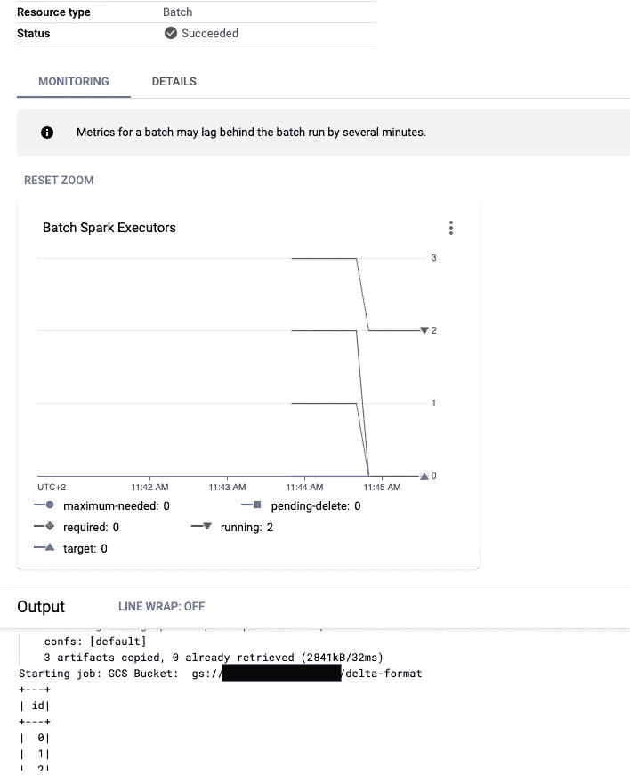
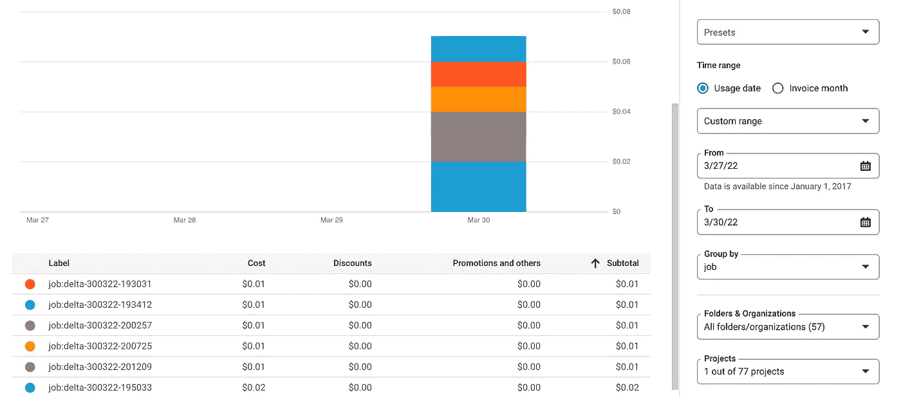

# 在 Google Cloud Dataproc 中处理 databricks Delta Lake 数据

> 原文：<https://medium.com/google-cloud/processing-databricks-delta-lake-data-in-google-cloud-dataproc-serverless-for-spark-1cc1405a3ee4?source=collection_archive---------1----------------------->

今年早些时候，谷歌宣布了面向 Spark 的 [Dataproc 无服务器版(Dataproc s8s)的正式发布，它允许您在 Dataproc 上运行 Spark 作业，而不必启动和管理自己的 Spark 集群。](https://cloud.google.com/dataproc-serverless/docs)

最近，我在一个项目中与一位客户合作，该客户希望将他们目前使用 databricks 执行的一些工作转移到 Dataproc s8s 上，目的是减少和简化他们的操作。另一方面，该客户希望维护其基于 databricks Delta Lake 的当前数据湖。

> Delta Lake 是由 databricks 开发的开放式存储层，基于 Apache Parquet，为 Apache Spark 和其他大数据引擎带来可扩展的 ACID 事务(参考: [delta.io](https://delta.io/) ， [github](https://github.com/delta-io/delta) )。

尽管工作迁移过程非常简单，但有几个问题需要特别注意:

*   连通性
*   运行时版本
*   其他库和依赖项

# **连通性**

Spark 驱动程序和执行器实例将拥有内部 IP 地址。因此，如果您计划从 Spark 代码访问任何 Google API，您需要确保您正在使用的子网启用了私有 Google Access。此外，如果您需要访问互联网(即下载一个包或访问另一个云存储桶)确保您已经在子网中部署了云 NAT 或您有可用的互联网代理。

此外，确保子网具有防火墙规则，允许所有子网入口使用所有端口上的所有协议进行通信。

更多信息[点击这里](https://cloud.google.com/dataproc-serverless/docs/concepts/network)。

# **运行时版本**

Dataproc s8s 目前支持 Spark 3.2.1、Python 3.9、Java 11 和 Scala 2.12。如果您的代码使用以前的版本，您将需要检查它在所需的运行时版本下是否运行正常。点击查看全部详情[。](https://cloud.google.com/dataproc-serverless/docs/concepts/versions/spark-runtime-versions)

# **附加库和依赖关系**

默认情况下，Dataproc s8s 使用一个容器映像，其中包含与运行时发布版本相关联的默认 Spark、Java、Python 和 R 包。为了达到 [60s 的启动时间](https://cloud.google.com/dataproc-serverless/docs/overview#for_spark_compared_to_on)，为 Dataproc s8s 提供的运行时在支持的 Java 库和 python 包方面进行了非常优化(详见这里的)。

但是，有几种机制可以包含额外的 Java 库或 python 包:

## **a)启动过程中的供应依赖关系**

Spark batches API 的 Dataproc s8s 支持几个参数来指定额外的 JAR 文件和归档。

对于 pyspark，您可以在 gCloud CLI 中使用以下参数来指定依赖项:

`--jars` =[ 【T1，…]要提供给类路径的以逗号分隔的 jar 文件列表。

`--py-files`=[【T3]，…]要传递给 PySpark 框架的 Python 脚本的逗号分隔列表。支持的文件类型:`.py`、`.egg`和`.zip.`

`--archives`=[【T8]，…]要提取到工作目录中的档案。支持的文件类型:。罐子，。tar，. tar.gz，.tgz 和. zip。

此外，您可以使用 spark 运行时属性 *spark.jars.packages* 来包含一个逗号分隔的 jar 的 Maven 坐标列表，以包含在驱动程序和执行器类路径中。

要安装所需的 delta lake 库，您需要在使用 gCloud CLI 运行作业时指定以下属性:

```
--properties=”spark.jars.packages=io.delta:delta-core_2.12:1.1.0"
```

不需要额外的 python 包，因为所需的 Python 模块已经打包在*io . delta:delta-core*jar 文件中。

## b)在自定义容器中包含依赖关系

Spark batches API 的 Dataproc s8s 允许您使用定制的容器图像来代替默认图像。通常，自定义容器映像会添加默认容器映像不提供的 Spark workload Java 或 Python 依赖项。

对于 Internet 访问受限的环境，或者当所需的附加软件包数量较高时，这将是推荐的方法。

点击查看全部详情[。](https://cloud.google.com/dataproc-serverless/docs/guides/custom-containers)

# End2end 示例—备选项 1:在引导过程中提供依赖关系

一旦我们回顾了上下文并介绍了一些理论，我们就开始动手做例子吧！

我们将首先回顾如何在引导过程中运行此示例资源调配依赖关系。在下一节中，我们将使用自定义容器执行相同的操作。

## 1-Google Cloud 项目和资源

为了运行这个示例，我们需要:

*   拥有所有资源的 GCP 项目
*   由 Dataproc s8s 使用的 VPC 网络和子网
*   允许 Dataproc 所需的内部子网通信的防火墙规则
*   云 NAT，需要从 Dataproc 计算资源到达互联网
*   具有 Dataproc 所需的最低权限的服务帐户
*   一个 GCS 存储桶，用于存放 Delta Lake 文件以及 Dataproc 所需的其他分段对象。

所有这些设置都可以使用 terraform 自动部署。在这篇文章的末尾，你可以找到不同的 terraform 文件以及后续的过程。

## 2-Pyspark 工作

一旦资源可用，我们就可以在 Dataproc s8s 中运行以下 pyspark 作业:

python 代码基本上是用一些数据创建一个虚拟文件，使用增量格式将其保存在 GCS 存储桶中，然后读取它。

## 3–启动工作

最后，使用 gCloud CLI 启动该作业:

使用默认容器运行作业

作业完成后，您将能够在 Google 云控制台中访问作业详细信息(data roc->批处理)。



GCP 控制台中的工作详细信息

此外，通过使用“ *labels=job=* ”参数，您将能够在 GCP 计费控制台中查询作业的成本(该数据将在大约 24 小时后出现。)



账单详情

# 结束 2 结束范例—替代 2:在自订容器中包含相依性

在集群创建/运行时期间安装 Python 包是不确定的，并且根据包和依赖关系，此过程可能非常缓慢，会影响工作者和执行者的引导时间。

不过，还有其他方法可以达到同样的目的:使用自定义图像或分发 Python env 包作为归档文件([参考](https://spark.apache.org/docs/latest/api/python/user_guide/python_packaging.html))。

在本例中，我们将探讨创建自定义容器的过程。

## Google Cloud 项目和资源

在这个例子中，将利用上面描述的相同 Google Cloud 项目和资源。

## 创建自定义容器

使用带有 Dataproc s8s 的定制容器在官方指南([链接](https://cloud.google.com/dataproc-serverless/docs/guides/custom-containers)中有很好的解释。我们将更新提供的示例，并包括所需的 Delta Lake Java 库和 python 包。

这可以通过添加以下代码来实现:

```
COPY delta-core_2.12–1.1.0.jar “${SPARK_EXTRA_JARS_DIR}”(…)RUN ${CONDA_HOME}/bin/pip install ‘delta-spark’
```

下面是完整的 Dockerfile:

Dockerfile

为了构建容器，我们可以使用 Google Cloud Build:

构建自定义容器

## 启动作业

如前所述，作业使用 gCloud CLI 启动，但添加了*容器图像*参数:

使用自定义容器运行作业

仅此而已！我们有同样的例子，但是这次是在一个定制容器中运行，依赖项包含在 Dockerfile 文件中。

我希望这些例子能够在 Dataproc s8s 中部署作业的过程中帮助您。

# 附件-地形文件和部署

您可以在下面找到 terraform 文件以及执行它们的过程:

main.tf

变量. tf

要运行 terraform 代码:

*   将`main.tf`和`variables.tf`的内容复制到自己选择的文件夹中(内容在本帖末尾)。
*   创建一个`terraform.tfvars`文件并指定所需的变量:

```
admins = [
  "user:admin@xxxxxx.com"
]
billing_account_id = "1234-1234-1234"
root_node          = "folders/12345678"
prefix             = "myprefix"
```

*   确保您拥有正确的身份验证设置(应用程序默认凭据或服务帐户密钥)
*   运行`terraform init`和`terraform apply`