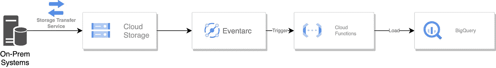

# 使用 GCP 处理医疗保健数据文件:简单如 1–2–3！

> 原文：<https://medium.com/google-cloud/processing-healthcare-data-files-with-gcp-easy-as-1-2-3-eae8a47d6e22?source=collection_archive---------0----------------------->

(使用无服务器云功能)


凯利·西克玛在 [Unsplash](https://unsplash.com?utm_source=medium&utm_medium=referral) 上的照片

将数据放入云中很重要，但采取正确的步骤来适当地准备数据更为关键。如今，医疗保健领域的数据来源广泛，包括患者临床数据、可穿戴设备和设备的导出，以及药房的数据。这意味着它可以以各种格式到达，因此在将文件上传到云之前确保它们是“干净的”是至关重要的。由于数据很少没有错误，例如重复记录、格式不正确或损坏等，我们需要一种快速简单的方法来确保数据在传输时处于良好状态，以确保下游的高质量分析。

[**无服务器谷歌云**](https://cloud.google.com/serverless) 服务消除了管理硬件、软件以及与之相关的更新和补丁的麻烦。让我们来看看一种方法，在文件到达[谷歌云存储(GCS)](https://cloud.google.com/storage) 后立即清理文件，使用[云函数](https://cloud.google.com/functions)来转换数据，以便可以将其加载到大查询中，例如，用于分析和处理。

# 工作流程序列:

*   文件从本地系统传输到[谷歌云存储](https://cloud.google.com/storage)
*   事件触发器启动[Google Cloud Functions(CF)](https://cloud.google.com/functions)，它读取文件并完成必要的转换
*   数据被加载到一个[大查询](https://cloud.google.com/bigquery)表中



在加载到 BigQuery 之前转换文件的工作流

**第一步:数据落地** : [谷歌云存储](https://cloud.google.com/storage)是你数据落地的绝佳选择。它易于传输，允许多种文件格式，并可根据需要选择将其传输出去，而且非常经济实惠。您还可以将数据上传到其他存储系统，比如我们在上面的工作流序列中使用的存储系统(BigQuery ),以便进一步处理。可以使用[存储传输服务](https://cloud.google.com/storage-transfer-service)或 [gsutil 复制命令](https://cloud.google.com/storage/docs/gsutil/commands/cp)将文件从本地加载到云存储。您还可以设置按计划或每日批处理运行的增量同步。下面是 gsutil 命令:

```
gsutil cp [INSERT SOURCE FILE] gs://my-bucket
```

**第二步:无服务器 ETL** :云函数允许你使用 Python 脚本或其他支持的语言进行无服务器提取、转换和加载。它们也是无状态的，所以它可以应用于响应添加到 GCS 的新文件和执行简单的验证等事件。它允许你运行 Python 程序并使用 [pandas 库](https://pandas.pydata.org/)转换数据。Pandas 是一个强大的库，用于加载、清理和转换表格数据。如果需要，您可以重组数据。在部署云功能的过程中，您可以指定依赖项来安装转换数据所需的任何库。可以创建一个 [Eventarc 触发器](https://cloud.google.com/functions/docs/calling/eventarc),让新文件上传到 GCS bucket 时触发云功能。

```
# Here’s an example of a requirements file; add your dependencies as appropriate:pip install pandas**=0.20.3**# Read the CSV file directly from GCS bucket using data frameimport pandas as pddf = pd.read_csv(‘gs://file_location’)# Data Manipulation # Clean the data by removing all null values based on patient_id columndf = df.dropna(axis=0, subset=[patient_id])# De-duplicate based on patient ID and request all the latest admissiondf.sort_values(admission_date, ascending=False).drop_duplicates(‘patient_id’).sort_index()# Convert age from string to integerdf[‘Age’] = df[‘age’].astype(int)
```

**数据加载:**现在数据准备好了，可以将更新后的 dataframe 加载到 BigQuery。您可以使用 pandas-gbq 库(BigQuery 客户端库的包装器)将 pandas 数据帧加载到 BigQuery。BigQuery 提供了使用 gbq 库加载数据的本地解决方案，pandas 允许使用 pandas-gbq 库。作为恢复选项，您还可以将文件下载回 GCS bucket。

```
pip install pandas-gbq -Upandas_gbq.to_gbq(df, table_id, project_id=project_id)
```

# **最佳实践-优势:**

**负载优化**:考虑使用 Parquet 文件格式来加速数据帧，并优化 BigQuery 的负载。利用像 pandas-gbq 这样的本地库可以更快地加载数据。如果要写入现有的表，可以使用“if_exists = append”如果该表不存在，它将被自动创建。

**工作流自动化:**您可以通过添加事件驱动机制来自动化上述步骤。Eventarc 触发器可以监听任何上传到 GCS 的文件，并在文件到达后立即启动云功能。

**减少延迟:**您可能需要尽快加载数据。使用最少的实例来防止冷启动和避免延迟。您还可以设置最小实例数，以避免最初必须设置执行环境，并减少延迟。

# 其他提示:

**较大的工作负载:**这里介绍的方法非常适合于那些通常较小并且需要简单数据转换的批处理文件。对于大量数据，考虑使用 spark 数据帧来利用并行处理。对于流式作业，您可以将一些转换合并到[数据流](https://cloud.google.com/dataflow)管道中。

**长时间运行的作业:**当请求超时超过 60 分钟时，考虑使用[云运行](https://cloud.google.com/run)vs[云功能](https://cloud.google.com/functions)，以便同时处理多个作业，并根据需求进行扩展。

**流程编排:** [Cloud Composer](https://cloud.google.com/composer) 是一个完全托管的服务，可以处理工作流的所有方面。它在编排作业方面非常有效，因为每个有向无环图(DAG)都可以负责不同的工作流，包括传输、转换和加载。如果数据加载失败，它可以重新运行加载作业。

**SQL 操作:**有了云函数和熊猫，还可以做 SQL 特定的转换。但是请记住，由于 BigQuery 针对 SQL 操作进行了优化，所以一旦加载了数据，您可能希望以 DML 语句的形式进行这些操作。

下面是 GitHub 的代码让你开始:[https://github.com/jayjayakumar/gcs2bq-data-load](https://github.com/jayjayakumar/gcs2bq-data-load)

**总结:**使用这种方法和这些提示进行快速简单的转换，并在数据到达后立即上传到 Google BigQuery。我欢迎你的反馈；如果你有任何问题让我知道。