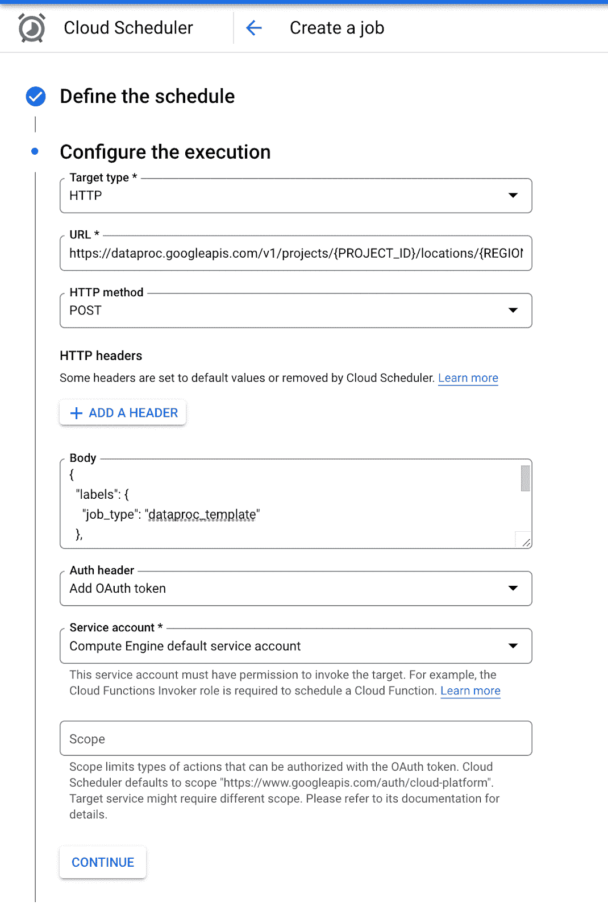

# 使用 PySpark 和 Dataproc 无服务器处理从 Hive 到 GCS 的大型数据表

> 原文：<https://medium.com/google-cloud/processing-large-data-tables-from-hive-to-gcs-using-pyspark-and-dataproc-serverless-35d3d16daaf?source=collection_archive---------0----------------------->


Dataproc 模板允许我们使用 Java 和 Python 在 Dataproc Serverless 上运行常见用例，而不需要我们自己开发。这些模板实现了常见的 Spark 工作负载，让我们可以轻松地定制和运行它们。

如果您不熟悉 Dataproc Serverless，或者您正在寻找使用 Dataproc Serverless 将数据从 GCS 迁移到 BigQuery 的 PySpark 模板，那么可以使用这个 [blogpost](/@ppaglilla/getting-started-with-dataproc-serverless-pyspark-templates-e32278a6a06e) 。

另外，你可以参考我的另一篇 [blogpost](/google-cloud/moving-data-from-bigquery-to-gcs-using-gcp-dataproc-serverless-and-pyspark-f6481b86bcd1) 来将数据从 BigQuery 移动到 GCS。

在这篇博文中，我们将讨论如何使用 Dataproc Serverless 处理从 Hive 到 GCS 的大量数据。

# 先决条件

为了运行这些模板，我们需要:

*   Google Cloud SDK 已安装并通过验证
*   Python 3.7 以上版本已安装
*   启用了专用 Google 访问的 VPC 子网。默认子网是合适的，只要启用了私有 Google 访问。您可以在此查看所有 Dataproc 无服务器网络需求[。](https://cloud.google.com/dataproc-serverless/docs/concepts/network)

# 主要优势

*   使用 Dataproc Serverless 运行 Spark batch 工作负载，而无需提供和管理您自己的集群。
*   [HiveToGCS](https://github.com/GoogleCloudPlatform/dataproc-templates/tree/main/python/dataproc_templates/hive) 模板是开源的，完全可定制，可用于简单的工作。
*   您可以将数据以拼花、AVRO、CSV 和 JSON 格式从 Hive 接收到 GCS。

# 配置参数

该模板包括以下参数来配置执行:

*   `spark.hadoop.hive.metastore.uris`:URI Hive metastore 的 spark 属性
*   `hive.gcs.input.database`:输入表的配置单元数据库
*   `hive.gcs.input.table` : Hive 输入表名
*   `hive.gcs.output.location`:输出文件的 GCS 位置(格式:gs://BUCKET/…)
*   `hive.gcs.output.format`:输出文件格式。avro、parquet、csv、json 之一。默认为拼花地板
*   `hive.gcs.output.mode`:输出写入模式。append、overwrite、ignore、errorifexists 之一。默认为追加。你可以在这里了解每种保存模式的行为[。](https://spark.apache.org/docs/latest/sql-data-sources-load-save-functions.html#save-modes)

# 使用

1.  如果你要使用“默认的”由 GCP 生成的 VPC 网络，请确保你已经启用了私有谷歌访问子网。您仍然需要启用如下的私人访问。


2.创建一个 GCS 存储桶，用作 Dataproc 的暂存位置。Dataproc 将使用这个桶来存储运行我们的无服务器集群所需的依赖项。

```
export STAGING_BUCKET=”my-staging-bucket”
gsutil mb gs://$STAGING_BUCKET
```

3.克隆 Dataproc 模板库并导航到 Python 模板的目录

```
git clone [https://github.com/GoogleCloudPlatform/dataproc-templates.git](https://github.com/GoogleCloudPlatform/dataproc-templates.git)
cd dataproc-templates/python
```

4.配置 Dataproc 无服务器作业

为了将作业提交给 Dataproc Serverless，我们将使用提供的`bin/start.sh`脚本。该脚本要求我们使用环境变量来配置 Dataproc 无服务器集群。

强制性配置包括:

*   `GCP_PROJECT`:无服务器运行 Dataproc 的 GCP 项目。
*   `REGION`:运行 Dataproc Serverless 的区域。
*   `SUBNET`:Hive metastore 所在的子网
*   `GCS_STAGING_LOCATION`:一个 GCS 位置，Dataproc 将在此存储登台资产。应该在我们之前创建的桶内。

```
# Project ID to run the Dataproc Serverless Job
export GCP_PROJECT=<project_id># GCP region where the job should be submitted
export REGION=<region># Subnet where Hive metastore exists so job can be launched in same subnet
export SUBNET=<region># The staging location for Dataproc
export GCS_STAGING_LOCATION=gs://$STAGING_BUCKET/staging
```

5.执行配置单元到 GCS Dataproc 模板

配置作业后，我们就可以触发它了。我们将运行 bin/start.sh 脚本，指定要运行的模板和执行的参数值。

```
./bin/start.sh \
— properties=spark.hadoop.hive.metastore.uris=thrift://<hostname-or-ip>:9083 \
— — template=HIVETOGCS \
— hive.gcs.input.database=”<database>” \
— hive.gcs.input.table=”<table>” \
— hive.gcs.output.location=”<gs://bucket/path>” \
— hive.gcs.output.format=”<csv|parquet|avro|json>” \
— hive.gcs.output.mode=”<append|overwrite|ignore|errorifexists>”
```

注意:提交作业将要求您启用 Dataproc API，如果还没有启用的话。

6.监控 Spark 批处理作业

提交作业后，我们将能够在 [Dataproc 批处理 UI](https://console.cloud.google.com/dataproc/batches) 中看到。从那里，我们可以查看作业的指标和日志。

# 预定处决

除了通过 start.sh 脚本提交作业，您还可以选择设置作业的计划执行。当您希望随着一天中新数据的到来而定期从 Hive 移动到 GCS 时，此设置非常有用。

需要考虑的一件重要事情是修改 HiveToGCS 模板以允许指定分区，这样您的调度作业就可以以增量加载的方式从最近的分区中读取数据。目前，模板可以支持输出模式为覆盖的全表定时导出

在下面的例子中，我们将使用 Cloud Scheduler 来调度 dataproc 模板的执行。云调度程序是一个 GCP 服务的 cron 作业调度程序。

1.  克隆 Dataproc 模板库并导航到 Python 模板的目录

```
git clone [https://github.com/GoogleCloudPlatform/dataproc-templates.git](https://github.com/GoogleCloudPlatform/dataproc-templates.git)
cd dataproc-templates/python
```

2.运行下面的命令来创建 egg 文件，并使用 gsutil 命令将文件上传到 GCS bucket，这将由云调度程序使用。还将 main.py 文件上传到同一个 GCS 存储桶

```
python setup.py bdist_egg — output=dataproc_templates_distribution.egggsutil mb gs://{DEPENDENCY_BUCKET}gsutil cp dataproc_templates_distribution.egg gs://{DEPENDENCY_BUCKET}gsutil cp main.py gs://{DEPENDENCY_BUCKET}
```

3.让我们创建云调度程序作业:

*   打开[云调度器](https://cloud.google.com/scheduler)并点击创建作业


*   填写工作名称的详细信息。支持 HTTPS 克朗工作的地区。对于这个博客，我们将使用美国中心 1。还要填写您希望该作业运行的 [Cron](https://crontab.guru/#0_5_*_*) 频率和时区，然后单击继续


*   下面是提交 dataproc 无服务器作业的 POST 请求所需的 URL

```
[https://dataproc.googleapis.com/v1/projects/{PROJECT_ID}/locations/{REGION}/batches](https://dataproc.googleapis.com/v1/projects/%7BPROJECT_ID%7D/locations/%7BREGION%7D/batches)
```

*   创建作业时需要提供的示例 JSON 主体。根据您的值编辑 JSON 主体

```
{“labels”: {“job_type”: “dataproc_template”},“runtimeConfig”: {“properties”: {“spark.hadoop.hive.metastore.uris”: “thrift://{hostname-or-ip}:9083”}},“environmentConfig”: {“executionConfig”: {“subnetworkUri”: “projects/{PROJECT_ID}/regions/{REGION}/subnetworks/{SUBNET}”}},“pysparkBatch”: {“mainPythonFileUri”: “gs://{DEPENDENCY_BUCKET}/main.py”,“args”: [“ — template=HIVETOGCS”,“ — hive.gcs.input.database={databaseName}”,“ — hive.gcs.input.table={tableName}”,“ — hive.gcs.output.location={gs://bucket/path}”,“ — hive.gcs.output.format={csv|parquet|avro|json}”,“ — hive.gcs.output.mode={append|overwrite|ignore|errorifexists}”],“pythonFileUris”: [“gs://{DEPENDENCY_BUCKET}/dataproc_templates_distribution.egg”],“jarFileUris”: [“file:///usr/lib/spark/external/spark-avro.jar”,“gs://spark-lib/bigquery/spark-bigquery-latest_2.12.jar”]}}
```

*   填写完详细信息后，页面将如下所示。最后，单击“创建”完成作业的创建。



*   确保选择正确的认证头/服务帐户，并有权限提交 Dataproc 无服务器作业
*   一旦创建了我们的作业，它将按照定义的频率运行。我们还可以手动触发云调度器作业(强制作业运行)进行测试，然后在 [Dataproc Batches UI](https://console.cloud.google.com/dataproc/batches) 中监控执行的 dataproc 作业

# 参考

*   [Dataproc 无服务](https://cloud.google.com/dataproc-serverless/docs/overview)
*   [Dataproc 模板库](https://github.com/GoogleCloudPlatform/dataproc-templates)