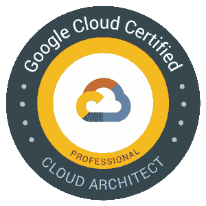

# 专业云架构师认证

> 原文：<https://medium.com/google-cloud/professional-cloud-architect-certification-6a6dfa5c6ff5?source=collection_archive---------0----------------------->

TL；DR:我最近经历了 Google Cloud 的[专业云架构师认证](https://cloud.google.com/certification/cloud-architect)的准备和考试。这是很棒的学习经历，我强烈推荐它。你可以在这里[注册](https://webassessor.com/wa.do?page=publicHome&branding=GOOGLECLOUD)获得认证！

# 为什么？

你可能知道，我是一名谷歌人，也是谷歌云的开发者拥护者。当我已经在 Google 工作并且对 Google Cloud 非常了解的时候，为什么我还想获得 Google Cloud 的认证呢？我有两个主要动机:

1.  我想和其他人一样经历这个过程，看看它是怎样的。我总是在会议上收到开发者关于认证的问题，除非你亲自经历这个过程，否则很难详细回答他们。
2.  我想看看我们是否可以改进流程，并向我们的认证团队提供我的反馈。
3.  填补空白，更新我现有的谷歌云知识。

我还了解到，云专业认证最近在【2019 年 15 项顶级 IT 认证中排名第一。很高兴知道！

# 查找学习资源

专业云工程师认证页面有[详情页](https://cloud.google.com/certification/cloud-architect)。在该页面中，有一个*成功之路*部分，列出了考试指南、Coursera 上的培训课程以及 Qwiklabs 的讲师指导和实践挑战。所有的资源都以清晰的格式列在这个页面上，这很好。

为了更加灵活，我决定选择在线课程。Coursera 在谷歌云平台的架构上有一个[专长。它有 6 道菜。我的计划是先完成这 6 门课程，然后在注册考试前浏览考试指南。](https://www.coursera.org/specializations/gcp-architecture)

后来，我意识到还有一门专门针对考试本身的附加课程。我也经历过。为了准备考试，我总共在大约 7 周的时间里完成了 7 门课程。

# 在 Coursera 上浏览课程

我通常会对在线教程视频感到厌倦，因为它们要么太长，要么不干涉，无法让我集中注意力。浏览 Coursera 上的课程非常有趣。视频长度合适，而且足够详细。它们不仅信息量大，而且还包含 Qwiklabs 的动手练习。这让视频对我来说更有意义，课程对我来说更有吸引力。

由于我目前在谷歌的角色，我并不期望学到很多新的信息，但我惊喜地发现一些视频对我来说信息量很大，尤其是网络和通用架构方面的视频。

Qwiklabs 的实践练习也很棒。唯一的小问题是 Coursera 有时很难注册我完成了实验。结果，我不得不做两次实验，这有点烦人。此外，每个实验室都必须使用新的凭证重新登录，这有点乏味，但不是大问题。

让我简单地介绍一下课程，这样你就可以知道会发生什么。

## 课程 1:谷歌云平台基础:核心基础设施

*开始日期:2019 年 1 月 13 日，结束日期:2019 年 1 月 20 日*

这是我学的第一门课程。这是对谷歌云的很好的介绍，解释了所有不同的服务和选项。总体来说，我喜欢这些视频。它们既不太长也不太短。我还喜欢他们有测验和 Qwiklabs 动手练习的事实。

## 课程 2:基本云基础架构:基础

*开始日期:2019 年 1 月 20 日，结束日期:2019 年 1 月 26 日*

这个课程比课程 1 短得多。我发现**模块 1** 中的一些内容是多余的，因为它们已经在课程 1 中讲述过了，但我认为重复一些还是有好处的。

有些**模块 2** (VPCs 和子网)已经在课程 1 中讲述过了，但是，模块后面的部分有我不知道的有用信息。

## 课程 3:基本云基础架构:核心服务

*开始日期:2019 年 1 月 27 日，结束日期:2019 年 2 月 2 日*

**本课程的模块 1** 都是关于 IAM 的。这在课程 1 中已经讲过了，但是更详细，所以我学到了很多。实验室练习也很不错。这段时间足够让我了解自己，但也不至于让我感到无聊。

**模块 2** 是关于储物的。它始于云存储。这是对课程 1 的复习，增加了一些信息和练习。

**模块 3** 是关于计费的，模块 4 是关于堆栈驱动的。对我来说不是最令人兴奋的话题，但仍然有用。

## 课程 4:弹性云基础架构:扩展和自动化

*开始日期:2019 年 2 月 4 日，结束日期:2019 年 2 月 9 日*

这可能是我最喜欢的课程，因为它包含了很多我不太了解的网络话题。

**模块 1** 从 VPN 开始，**模块 2** 是关于 HTTPs 负载均衡的。视频非常好，解释其工作原理的图表非常有用。我也喜欢他们的最佳实践部分。这一部分非常有用，对我来说可能是课程中最好的部分。

接下来的三个模块主要是回顾课程 1 中已经讲述的内容。**模块 3** 关于自动扩展，**模块 4** 关于使用云 API 实现基础设施自动化，以及**模块 5** 关于部署管理器。

最后一个模块，**模块 6，**是关于管理服务的，比如数据流、数据块和大查询。

## 课程 4:弹性云基础设施:容器和服务

*开始日期:2019 年 2 月 10 日，结束日期:2019 年 2 月 10 日*

本课程涉及到更多的应用开发方面的内容。**模块 1** 是关于云发布/订阅、云端点和云功能。**模块 2** 是关于 App Engine 标准和 Flex 的。它们都是很好的概述，但是没有动手实验。

**模块 3** 是关于 Kubernetes 引擎和容器注册。这是一个很好的带动手实验室的模块。

## 课程 6:可靠的云基础架构:设计和流程

*开始日期:2019 年 2 月 14 日，结束日期:2019 年 2 月 17 日*

这个课程是这个系列中唯一一个关于软件架构而不是具体的谷歌云产品的课程。我喜欢课程的第一部分，但后来当它开始谈论数据层时，它变得重复，因为我已经听说过云存储、BigQuery 等。在之前的课程中多次提到。

## 课程 7:准备 Google Cloud 专业云架构师考试

开始日期:2019 年 2 月 23 日，结束日期:2019 年 2 月 24 日

本课程不是专业的一部分，但更多的是关于考试的逻辑和逐个案例研究以找出解决方案。我非常喜欢它。许多有用的信息，你通常不会从文档中得到。事实证明，这比我想象的与考试更相关(下一节将详细介绍)。

在课程的后半部分，它变成了一个讲座，而不是案例分析。在这一点上，它对我来说有点重复，因为它开始谈论 Kubernetes 引擎，应用程序引擎等。或者像 BigQuery，Dataflow 这样的东西。所有这些都包含在其他课程中。

# 参加考试

2019-02-28 参加考试。考试由 50 道选择题组成，你有 2 个小时的时间来回答它们。我以为我会在 1 小时内完成，但令我惊讶的是，我花了 1 小时 45 分钟完成考试，这比我想象的要难。

案例研究中有一些问题。我花了相当多的时间阅读案例研究。事后看来，我应该在学习课程 7 时更仔细地阅读案例研究。总的来说，我应该在课程 7 上花更多的时间，它似乎是与考试最相关的课程。

我在大约 1 个小时内完成了问题的第一遍，我将大约 20 个问题标记为不确定。我在 35 分钟内完成了第二遍，但我仍然有大约 10 个问题不确定。我终于花了 10 多分钟最后一次复习不确定的问题，并提交了答案。我得到一个临时的结果，我通过了。

就考试本身而言，我认为这是一次中等难度的考试。大约有 5 到 6 个问题相当简单。剩下的，你要么好好阅读案例研究，要么对材料了如指掌。我意识到我不记得一些网络方面的东西(直接对等，CloudVPN 等等。)以及一些大查询细节，比如联邦表和分区表。结果，我对答案没有把握。

我发现有些问题相当棘手。例如，我觉得有一个问题，即正常或可抢占的虚拟机在解决方案中是否合适，但我必须选择一个。不确定我到底错过了什么。

# 结论

总的来说，我很高兴我完成了获得认证的过程。这绝对比我想象的更有挑战性。这是所有课程和实际考试本身的时间承诺。然而，你最终会学到很多东西，即使你已经很了解谷歌云。

我注意到了我们在课程和认证考试方面可以做出的一些改进，我将与我们的认证团队一起跟进，以确保今后的体验会更好。