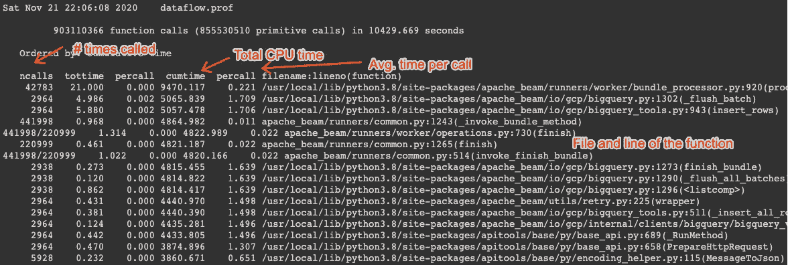
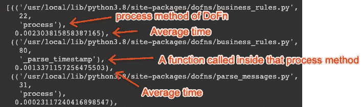
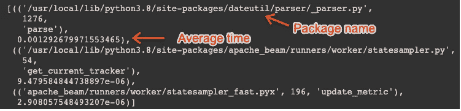

# 剖析 Apache Beam Python 管道

> 原文：<https://medium.com/google-cloud/profiling-apache-beam-python-pipelines-d3cac8644fa4?source=collection_archive---------1----------------------->


由[维里·伊万诺娃](https://unsplash.com/@veri_ivanova?utm_source=medium&utm_medium=referral)在 [Unsplash](https://unsplash.com?utm_source=medium&utm_medium=referral) 拍摄的照片

**更新(2022 年 1 月):**如果你正在云数据流上运行，它现在内置了对使用带有 Python 管道的 Google Cloud Profiler 的支持。如果你正在使用数据流，我强烈建议尝试一下，而不是按照这里给出的说明。更多详情请访问[https://cloud . Google . com/data flow/docs/guides/profiling-a-pipeline # python](https://cloud.google.com/dataflow/docs/guides/profiling-a-pipeline#python)

通常，我们的 Apache Beam 管道的第一个版本的性能并不像我们希望的那样好，有时并不容易找到我们可以优化性能的地方；有时它是一个解析 JSON 的函数，其他一些瓶颈将是一个外部源或接收器，或者我们有一个非常热的键，我们正在尝试按键分组。在谷歌云平台上，[我们可以很容易地将数据流与云分析器(以前称为 Stackdriver Profiler)](/google-cloud/profiling-dataflow-pipelines-ddbbef07761d) 结合起来，检测用 Java 编写的管道。但是如果我们想要分析 Python 管道呢？

可以获取在数据流上运行的 Python 管道的配置文件，但输出不会与云分析器集成。不过，您可以使用这些概要文件和一些其他工具来识别瓶颈。在这篇文章中，我们将解释如何获取分析数据，以及如何处理这些数据来识别 Python 管道中的代码瓶颈。

Apache Beam 中包含的分析器为管道处理的每个数据包生成一个包含分析信息的文件。

[类](https://github.com/apache/beam/blob/9054c7a8f3ca48b4ea75e5b01e18ca8e9f773354/sdks/python/apache_beam/options/pipeline_options.py#L913-L933) `[ProfilingOptions](https://github.com/apache/beam/blob/9054c7a8f3ca48b4ea75e5b01e18ca8e9f773354/sdks/python/apache_beam/options/pipeline_options.py#L913-L933)` [包含了我们可以用来分析 Python 管道的所有选项](https://github.com/apache/beam/blob/9054c7a8f3ca48b4ea75e5b01e18ca8e9f773354/sdks/python/apache_beam/options/pipeline_options.py#L913-L933):*profile _ CPU*， *profile_memory* ， *profile_location* 和 *profile_sample_rate* 。

前两个， *profile_cpu* 和 *profile_memory* 是布尔标志，用于获取关于 cpu 和内存消耗的数据。

选项 *profile_sample_rate* 是可选的，应该是 0 到 1 之间的一个数字。它是被分析的数据束的比率。默认值为 1。

*profile_location* 选项为 profiler 生成的所有文件设置输出目录。它应该被设置到 Google 云存储(GCS)中的一个位置。

## 用数据流从我们的 Python 管道中获取一些概要数据

例如，要获得一些 CPU 分析数据，您应该在启动管道时添加以下选项:

```
--profile_cpu \
--profile_location=’gs://<SOME_PATH_IN_GCS>’
```

我们将在这里使用的工具将处理 CPU 时间数据，但不处理内存数据。所以我们将只使用选项 *profile_cpu* 。

启动管道后，数据流应该开始在 GCS 中的位置写入文件:

```
$ gsutil ls <SOME_PATH_IN_GCS>
gs://<SOME_PATH_IN_GCS>/2020–11–21_19_15_10-process_bundle-4005
gs://<SOME_PATH_IN_GCS>/2020–11–21_19_15_10-process_bundle-4006
gs://<SOME_PATH_IN_GCS>/2020–11–21_19_15_10-process_bundle-4008
[...]
```

注意:不要运行管道太长时间，否则您将在该位置生成数百万个文件。为了识别管道中的潜在瓶颈，运行管道的时间不应该超过几分钟。运行一个小时应该绰绰有余(当然，前提是您有管道处理的数据的代表性样本)。

一旦您生成了一些文件，您可以将它们下载到本地目的地，这样您就可以使用分析工具来处理它们。在这里，我们将所有数据下载到`profiling`目录，并且我们将假设本文剩余部分中的概要分析数据位于那里。

```
gsutil -m cp "gs://<SOME_PATH_IN_GCS>/*" profiling/
```

如果您终止管道来停止生成更多的文件，您可能已经下载了一些空的 tmp 文件。在尝试处理它们之前，我们需要删除它们:

```
rm profiling/*tmp*
```

## 我如何解释分析器产生所有输出？

为了解析和分析分析器的输出，现在可以使用 Python 的`[pstats](https://docs.python.org/3/library/profile.html)`[模块。使用该模块，我们可以读取概要分析数据，对其进行聚合和排序，并生成一个更小的概要分析输出文件，这将使详细的分析更快。](https://docs.python.org/3/library/profile.html)

使用以下脚本，您可以导入下载的数据，并生成汇总输出。这里我们按`'cumulative'`排序，它是在那个函数上花费的总的累计 CPU 时间:

运行这个脚本之后，您将拥有一个名为`dataflow.prof`的文件，您可以使用它来调查您的管道的 CPU 和内存消耗。

该文件比您从 GCS 下载的原始数据小得多。例如，对于这篇文章，我生成了大约 1.2 GB 的数据，输出文件的大小为 427 KB。

我们现在可以用不同的工具研究这个文件`dataflow.prof`。有一些工具，比如 [gprof2dot](https://github.com/jrfonseca/gprof2dot) 、 [tuna](https://github.com/nschloe/tuna) 或 [snakeviz](https://jiffyclub.github.io/snakeviz/) ，允许您获得带有分析信息的图表，在某些情况下还可以交互地浏览图表。但是，由于这些图中包含大量不相关的函数调用，很难理解这些图中的分析数据。

因此，在这篇文章中，我们将使用 Python 来尝试过滤分析数据，并找到更相关的点，以确定我们可以提高管道性能的点。

让我们从读取我们生成的文件开始，并打印一些总体统计数据。脚本非常简单:

输出将类似于以下内容:



我们管道代码的概要统计

CPU 时间仅在函数级可用。在右边，我们看到函数的数据:文件名，函数开始的行，以及括号中的函数名。

在左侧，我们可以看到该函数被调用的次数、在该函数中花费的累计时间以及在该函数中花费的平均时间(*累计时间百分比*)。

**`**tottime**`**和** `**cumtime**` **有什么区别？**这种差异非常重要，将决定我们必须如何分析输出。一方面，`tottime`只计算函数内部代码花费的时间，但是不计算函数内部代码调用其他函数花费的时间。**

**另一方面，`cumtime`与我们将要分析代码的方式更相关。**它包括在函数内部花费的所有时间**，也包括对任何其他函数的任何调用。这将帮助我们找到代码中的瓶颈，即使这些瓶颈是由于调用了不是我们代码的库。**这可能是我们在分析数据管道时想要的信息**。我们不仅对算法的复杂性感兴趣，还对调用其他函数所产生的额外时间感兴趣，比如连接到服务、解析消息等等。此外，如果由于某种原因我们的一个函数是递归的，我们想知道从第一次递归调用开始在函数中花费的总时间，而不是每次递归调用的时间。递归函数可能很方便，但也是一个性能猪。有了`tottime`,我们将无法检测那些使用递归函数的性能猪；我们需要使用`cumtime`来找到我们的代码消耗大部分 CPU 的地方。**

**统计数据的一个值得注意的方面是，大多数函数都与 Beam SDK、其他库或 Python 本身相关。这是正常的，因为执行的大部分代码不是我们的代码。如果您试图在文件列表中找到您的代码，您会注意到它实际上位于`/usr/local/lib/python3.8/site-packages/`的子目录中。这是因为在创建 worker 时，您的代码只是作为另一个 Python 模块安装的。您需要保留您在代码中定义的任何模块的名称，以便能够将它们从安装在 Dataflow worker 中的其余 Python 模块中过滤出来。**

## **找到消耗大部分 CPU 的代码部分**

**`tottime`和`cumtime`之间的差异突然变得更加相关。统计数据中的噪音和外部文件数量惊人。如果我们使用`cumtime`,我们可以完全专注于我们的代码。如果有任何导致性能问题的外部调用，它将被计入`cumtime`。**

**我们如何过滤我们的代码？stats 对象包含一个字典，我们可以用它来过滤掉我们的代码。在 Python 中，我们可以将`p.sort_stats('cumulative')`的输出作为一个字典(下面是 Python 代码):**

```
stats_dict = p.sort_stats('cumulative').stats 
```

**这个字典的关键字是带有文件名、代码行和函数名的元组。如果我们知道模块的名字，我们就可以提取模块的密钥。例如，假设在我们的代码中有两个模块，分别叫做`dofns`和`pipeline`；我们希望提取关于模块的行，并按照这些函数所用的平均时间对输出进行排序。我们可以像下面这样做(使用上一步提取的 stats_dict):**

**在我的例子中，我获得了以下输出:**

****

**按平均时间过滤和排序后的输出**

**在我们的例子中，我们看到代码花费的大部分时间是在文件`business_rules.py`中找到的`DoFn`。第一个结果并不奇怪:大部分时间都花在了那个`DoFn`的`process`方法上。第二个结果更有趣:在那个`process`方法中，我们正在解析时间戳，看起来大约有一半的处理时间用于解析过程。也许我们可以尝试改进解析过程。**

**上面的例子强调了一个好的管道设计的重要性:**我们应该把我们的代码分成小的函数，当我们试图找出需要改进代码性能的地方时，这将对我们有很大的帮助。****

**如果我们没有在我们的`DoFn`类中定义这个`_parse_timestamp`方法，我们就不会知道为什么`business_rules` `DoFn`比`parse_messages` `DoFn`慢 10 倍。由于将工作划分为更小的函数，我们知道大约一半的时间专门用于解析时间戳。**

## **我的代码调用了哪些外部函数？**

**我们发现我们的`business_rules` `DoFn`消耗了大部分 CPU，这是由于解析时间戳造成的。在我们的代码中，我们使用一些外部代码来完成这项任务；也许是外部库导致了性能问题。我们能发现哪些对外部库的调用是通过这个函数完成的吗？这些调用消耗了多少？**

**让我们假设在前面的例子中，`_parse_timestamp`方法在索引为`1`的`mykeys`列表中；让我们试着找出所有被`mykeys[1]`调用的函数:**

**在这个代码片段中，我们找到了 stats 字典中被`mykeys[1]`调用的所有条目，这是`_parse_timestamp`方法，然后我们按平均值`cumtime`对输出进行排序。**

**运行上述代码片段后，我们获得了以下输出:**

****

**试图找出是否有任何外部库对性能猪负责。**

**我们发现两个条目是 Apache 射束函数。因为这些与 Beam 的工作原理有关，我们对此无能为力，所以我们可以忽略它们。**

**但是第一个条目实际上非常有趣:我们使用的是`dateutil`模块，它是[包 python-dateutil](https://pypi.org/project/python-dateutil/) 的一部分。该模块平均花费多少时间？答对了。我们在`_parse_timestamp`方法(. 00134 秒/呼叫)中花费了 96%的时间(. 00129 秒/呼叫)。**

**因此，总的来说，花费在我们最昂贵的`DoFn`上的时间大约有一半是由于使用了 python-dateutil 解析器。如果我们能找到替代方案，我们可能会大大减少管道资源的使用。**

## **结论**

**如果您的 Apache Beam Python 管道的性能不如您预期的好，您可以对其进行分析，以找出代码的哪些部分消耗了大部分 CPU，以及导致这种情况的潜在原因是什么(例如低效的外部库或服务)。**

**在 Google Cloud Platform 中，您可以将概要分析输出写入 GCS，然后使用 Python 脚本对其进行分析。**

**Python profiler 提供了两个主要的指标，可以用来测量代码的 CPU 使用率:`tottime`和`cumtime`。因为`cumtime`也测量调用外部库或服务后的等待时间，所以它可能是我们的评测更感兴趣的指标。通过关注`cumtime`，我们可以过滤掉所有不是我们代码的东西，然后通过`cumtime`对我们的代码进行排序。**

**这篇文章中的例子展示了一个好的管道设计的重要性。我们的代码应该**划分成小函数**。通常，大部分时间都花在我们的`DoFn`类的`process`方法中。如果我们不将`process`方法中的代码分割成更小的函数，就不可能知道`process`方法的哪一部分导致了性能问题。**

**类似地，因为分析输出中包含的函数调用数量惊人，所以为我们的代码选择**易于识别的模块名是很重要的。数据流工作者将把我们的代码和任何其他 Python 依赖项一起安装在通常的`site-packages`目录中。识别代码的唯一方法是通过模块和文件名，而不是路径。****

**总之，虽然[不像 Beam Java pipelines 和 Dataflow，我们不能使用像 Cloud Profiler](/google-cloud/profiling-dataflow-pipelines-ddbbef07761d) 这样简洁的工具，但这并不意味着我们不能分析 Python 管道。是的，我们可以，只需要一点点 Python 脚本。**