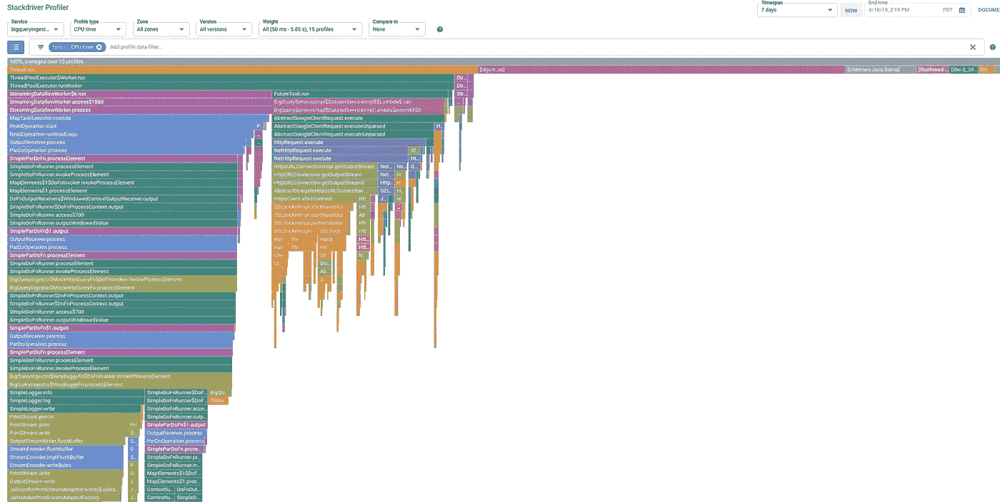
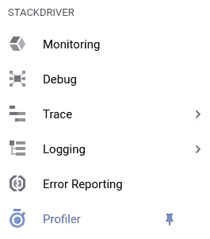
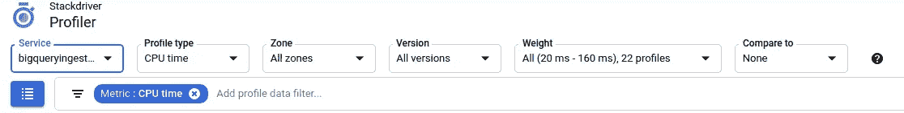
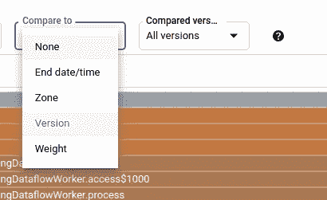

# 剖析数据流管道

> 原文：<https://medium.com/google-cloud/profiling-dataflow-pipelines-ddbbef07761d?source=collection_archive---------0----------------------->

***更新 2012 年 2 月 22 日:*** *数据流现在支持全面可用的概要分析—参见文档* [*此处*](https://cloud.google.com/dataflow/docs/guides/profiling-a-pipeline) *！*

[Google Cloud Dataflow](https://cloud.google.com/dataflow/) 是一个完全托管的服务，用于执行使用 [Apache Beam SDK](https://beam.apache.org/) 编写的批处理和流数据管道。除了为用户管理和协调端到端的管道执行之外，Dataflow 还提供了许多开箱即用的功能，如[自动扩展](https://cloud.google.com/dataflow/docs/guides/deploying-a-pipeline#autoscaling)、[动态工作重新平衡](https://cloud.google.com/blog/products/gcp/no-shard-left-behind-dynamic-work-rebalancing-in-google-cloud-dataflow)(又名液体分片)和[本机堆栈驱动程序集成](https://cloud.google.com/dataflow/docs/guides/using-stackdriver-monitoring)，进一步增强了 Dataflow 的零旋钮故事。这使得 Dataflow 成为在谷歌云平台上转换和丰富数据的理想执行平台。

## 太好了——数据流管道到底是什么？

数据流管道可以被描述为一系列的 [*转换*](https://beam.apache.org/documentation/programming-guide/#transforms) *s* ，当这些元素从源移动到目标时，这些转换被应用于数据元素的分布式集合。这些转换通常由管道(*又名用户代码*)的作者提供，并描述应用于数据元素的业务规则，以使它们成为可用的形式。

因此，数据管道的整体性能高度依赖于这些转换背后的用户代码的性能。

你听过多少次有人抱怨— *“我的工作运行缓慢”？*


> 可能比我们想的要多得多！！

## 好——所以管道运行缓慢。我该如何解决这个问题？

Dataflow 和 Apache Beam SDK 以[指标](https://beam.apache.org/releases/javadoc/2.12.0/org/apache/beam/sdk/metrics/Metrics.html)和集成的 Stackdriver 日志记录的形式提供了许多工具来帮助解决管道问题。然而，由于各种原因，这些可能并不总是足够的:

*   当作者试图添加详细的日志记录和指标来识别瓶颈时，容易出现反复试验。
*   过多的日志记录会增加管道性能的开销。
*   在用户代码与梁模型交互的地方，度量可能是相关的。然而，瓶颈步骤中的用户代码对用户来说可能仍然是不透明的。

这就是数据流剖析能有所帮助的地方。

数据流剖析是一个过程，它允许我们在用户代码的粒度上获得关于管道执行的更多见解。换句话说，概要分析帮助我们双击在组成管道的*转换*中执行的实际用户代码。

## 太棒了——那么我们如何分析数据流管道呢？

剖析数据流管道的一个更简单的方法是利用数据流与 [Stackdriver Profiler](https://cloud.google.com/profiler/) 的本机集成。Stackdriver Profiler 在可用于分析性能的交互式火焰图中可视化管道的调用层次结构和资源消耗。



堆栈中的火焰图驱动程序探查器可视化数据流管道调用堆栈

Dataflow 与 Stackdriver profiler 的本机集成使得为任何 Dataflow 作业启用分析变得极其容易。

对于使用 Apache Beam 的 Java SDK 编写的管道，可以通过传递一个接受属性的*映射*的附加参数来启用分析:

```
mvn clean compile exec:java \
-Dexec.mainClass=MyClass\
-Dexec.args=” \
— runner=DataflowRunner \
— project=my-project \
— jobName=my-job \
— stagingLocation=gs://my-staging-bucket \
— tempLocation=gs://my-temp-bucket \
……. <<other pipeline specific flags>> …..
***--profilingAgentConfiguration=’{ \”APICurated\”: true }’***
```

***注意:****Do****not****set—saveProfilesToGcs =<GCS-bucket-for-profiles>当使用上述配置时，将禁用性能分析！*

将布尔属性*a 精确化*设置为*真*作为*映射*输入添加到*profilingAgentConfiguration*属性中，这是启用管道分析所需的全部工作。

一旦管道开始执行，浏览到 *Google Cloud 控制台，点击导航菜单和 Profiler 特性*。



然后单击服务下拉菜单，搜索我们要分析的数据流作业:



## 太棒了——我们发现并解决了瓶颈。有没有一个简单的方法来比较改变前后的性能？

绝对的！ Stackdriver Profiler 让[比较作业](https://cloud.google.com/profiler/docs/comparing-profiles)变得超级简单。只需使用*相同的* *作业名*执行作业，并使用 Stackdriver Profiler 的“比较对象”下拉菜单选择不同的版本*(即 job_id)。*



## 有没有其他我们可以利用的分析旋钮？

*是的！*数据流使用的分析引擎公开了许多其他的旋钮:

```
**APICurated** = *Boolean flag to enable profiling* // Default: false
**Interval** = *Profile output frequency* // Default: 60 secs
**Duration** = *Trace duration per interval* // Default: 10 secs
**Delay** = *Delay tracing by seconds*              // Default: 0 secs
**MaxCounts** = *Max number of profiles collected*  // Default: unlimited
**NativeStacks** = *Boolean flag to enable native stack unwind* // Default: false
```

然而，在大多数情况下，仅仅将*精确的*标志设置为*真的*应该是唯一需要的改变。

## 还有其他分析工具吗？

*当然！*尽管 Stackdriver Profiler 非常易于使用，但在某些情况下，可能需要更深入地研究执行调用树。在这些罕见的情况下，我们可以利用 [***pprof***](https://github.com/google/pprof) ，这是一个用于可视化和分析概要文件数据的开源工具。Pprof 分析由数据流管道转储的配置文件数据，并具有 Stackdriver Profiler 中目前不存在的几个功能。其中包括:

*   图形视图( *pprof -graphviz* )
*   树形视图(*pprof-graphviz-call _ tree*)
*   自上而下/自下而上树形视图
*   其他输出格式(pdf 等。)

## 如何提取 pprof 所需的配置文件信息？

这非常简单，通过在执行管道时向命令行传递一个附加属性来实现。因此，例如，使用 Apache Beam 的 Java SDK 编写的数据流管道可以通过传递一个属性将概要文件转储到 GCS，如下所示:

```
mvn clean compile exec:java \
-Dexec.mainClass=MyClass\
-Dexec.args=” \
— runner=DataflowRunner \
— project=my-project \
— jobName=my-job \
— stagingLocation=gs://my-staging-bucket \
— tempLocation=gs://my-temp-bucket \
……. <<other pipeline specific flags>> …..
***--saveProfilesToGcs=gs://YOUR BUCKET HERE/profiler***
```

*就这些！*一旦作业开始执行，数据流服务将定期写入配置文件(*wall*和*cpu*)文件*(大约每 60 秒 cpu 和 wall 时间各一个文件)*

## 太好了——我如何使用 pprof 分析这些文件？

一旦收集到足够的配置文件信息*(大约 10 分钟)*或任务完成*(如果是批处理管道)*，本地下载配置文件并使用 pprof 可视化 cpu 或墙时间配置文件。Pprof 有许多命令行选项来帮助分析。例如:

```
pprof --call_tree --web “http:” <LOCAL PATH FOR PROFILES>/*cpu*
```

虽然我们可能会讨论更多关于使用这些工具的细节，但这个概述应该有望向每个人介绍一些非常有用的故障排除和性能调整工具，这些工具应该是每个数据流管道开发人员工具包的一部分。


## 其他详细信息和注释:

虽然这一概述仅涵盖了从 CPU 消耗角度进行的分析，但我们希望在后续博客中描述数据流管道的内存利用分析过程。内存分析目前没有集成到 Stackdriver Profiler 中，更多的是一个手动过程。