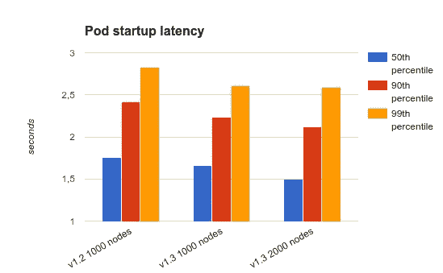
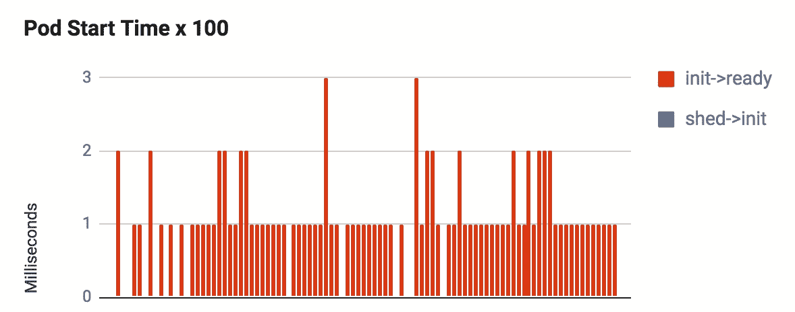

# 分析 GKE 启动时间

> 原文：<https://medium.com/google-cloud/profiling-gke-startup-time-9052d81e0052?source=collection_archive---------2----------------------->

有时候作为一个开发者拥护者真的很尴尬。你不断被来自不同方向的信息轰炸，你真的无法传递。这项工作的关键是弄清楚要传递什么信息，以及如何提炼这些信息以便正确地消费。

一个很好的例子，是几周前我在纽约遇到的 *FoodiePics* 团队。当我还在 NYC 的时候，一家*完全独立的公司*名叫*培根，活了！*“也走近了我。这两家公司的区别，就在于*腊肉，活！*更像是 Twitch，不过是给人做饭用的。

被两家专注于食品的初创公司接洽是一回事..听说他们都有冷启动问题是另一回事:我们能够帮助 *FoodiePics* 团队介绍并改善他们在谷歌计算引擎上的冷启动时间，但是 *Bacon，Live！*团队使用的是[谷歌容器引擎](https://cloud.google.com/container-engine/) (GKE)，这是一个完全独立的东西。

如果您用过 Kubernetes，那么您会知道它是一个非常棒的工具，可以帮助您以无缝和强大的方式管理、包含和部署图像到您的各种实例。但是你也会注意到，所有这些能量都有一些开销和非常厚的脚手架。这就是为什么帮助*培根，活下去！团队发现并解决他们的冷启动问题将会非常困难:事实证明，冷启动时间并不是 Kubernetes 向你轻易提出的事情。*

就像我做的*诱饵和缝线* (GAE)和*食物图片* (GCE)，解决*熏肉的第一步，活！*的问题是弄清楚如何分析 GKE 的冷启动时间，然后弄清楚在没有任何特定代码运行的情况下它有多快。

忙到没时间看书？看看上面的视频！

# 基线 Pod 冷启动性能

很少会有平台发布性能信息，所以当我看到 Kubernetes 网站[在大约一年前](http://blog.kubernetes.io/2016/07/kubernetes-updates-to-performance-and-scalability-in-1.3.html)发布的关于 1K 节点集群的 pod 启动延迟接近 3 秒的消息时，我非常高兴:

这就是说，对于 1.3 版本的节点，第 99 个百分位数略高于 2.5 秒，这给了我们一个很好的目标；让我们看看能否验证这些数字。

在四处挖掘之后，无论是云控制台、 [Stackdriver](https://cloud.google.com/stackdriver/) 还是 [Heapster](https://github.com/kubernetes/heapster) (对于 Kubernetes)都没有给出任何关于 pod 启动时间的直接数字。然而，有一个地方出现了一些启动时间信息 [kubectl get pod](https://kubernetes.io/docs/user-guide/kubectl/kubectl_get/) 。原来，调用" *kubectl get pod -o json"* 将返回一个 json 文件，其中包含一些与 pod 启动阶段相关的时间戳信息:

在这里，您可以看到 pod 状态发出“已计划”、“已初始化”和“就绪”阶段，每个阶段都有一个时间戳，告诉我们(相对)它是何时发生的。对于上面的示例，您可以看到从“初始化”到“就绪”大约需要 1 秒钟，这是 pod 的容器开始初始化自己的时间点。这些信息基本上告诉您挂载卷和下载映像数据需要多长时间(但是我们马上就会谈到这一点)。

我们现在的目标是对一批初创公司的数据进行分析，这样我们就可以清楚地了解我们非常简单的用例中 pods 的启动时间。幸运的是，kubectl 给了我们一些控制权，允许我们查找、查询和删除 pod:

因此，通过杀死节点，让它们恢复运行，并读取状态时间戳，我们可以清楚地了解每个 pod 恢复运行需要多长时间。这样做 100 次左右，我们最终会得到这样的结果:

我们可以看到，pod 从 *PodScheduled* 移动到 *Initialized* 所花费的时间是不存在的，并且由于我们使用了这样一个基本容器，所以它移动到“ *Ready* 所花费的时间在 0 到 3 毫秒之间。

# 集装箱！=虚拟机

Kubernetes 的基本原则之一是将应用程序容器从运行它们的系统细节中分离出来。谷歌云平台通过虚拟机(VM)向 Kubernetes 提供一组同质的原始资源，反过来，Kubernetes (k8s)调度容器使用这些资源。一旦提供了这些资源，k8s 就可以下载、安装和引导映像。

在这一阶段，它可能与带有容器/快照的 GCE 的工作方式非常相似，但是有一个微妙的区别，这是性能差异的主要原因:**引导 pod 不需要引导 VM。**

通常，当启动 GCE 实例时，VM 本身需要实际启动，并且在您自己的代码可以初始化自己并开始运行之前处于健康状态。如果你启动一个新的，那么整个过程又要重新开始。

然而，对于 Kubernetes pods，情况并非如此:引导一个新的 pod 只需要初始化它的容器(这是经过编排的，而不是重新引导内核本身。(这在很大程度上是因为容器*共享*一个内核)

因此，当我们谈论 pod 启动时间时，我们真正关心的是容器初始化需要多长时间。

# 计时容器

Kubernetes pod 由一系列容器组成，这些容器为实例本身提供端点和服务。一旦所有容器都已初始化，并且运行状况检查通过，pod 就被视为“就绪”。为了便于正确引导，初始化过程将容器分成两个主要组:

**首先是初始化容器**。它们按照安装脚本定义的顺序依次执行。

**第二种是平行集装箱**；剩余容器的列表，以随机的并行顺序执行它们。

这个设置有一些有趣的怪癖，也有可能出现问题。例如，如果一个容器在初始化阶段花费了很长时间，它将阻塞其他所有东西的加载。我有预感这可能是*培根直播的问题！但是为了证明这一点，我必须找出正确的方法来在初始化阶段分析每个容器。*

# 初始化容器计时

获得容器的启动时间比我预期的要困难得多。我也没想去经历和逼*培根，活！*重建他们的所有映像以进行分析(尽管他们认为从长远来看这是个好主意..)，所以需要一些不那么侵扰的东西。经过一番挖掘和反复试验，我意识到使用 kubernetes *get pod* 命令可能有一个“足够好”的解决方案:

这将返回 pod 状态，**并且当您定义了初始化容器**时，状态字段将列出初始化容器的状态。例如，状态“Init:1/2”表示两个 Init 容器中的一个已成功完成:

这意味着我们可以大约每 10 毫秒左右连续轮询 *get pod* 命令，并且可以了解每个阶段启动需要多长时间。下面的图表展示了我做的一个小原型，突出了它的工作原理:

在上面的例子中，您可以清楚地看到统计信息收集容器和数据库初始化容器是花费时间最多的容器。由于这些是*初始化*容器，这意味着所有随后的服务都会延迟大约 4-12 秒，因为这些阶段会阻塞其他工作组的初始化。

# 对并行容器计时

对并行容器进行计时要复杂得多，因为每个容器都可以按照自己想要的顺序启动和停止，并且有自己对“启动和运行”的定义。我尝试了很多不同的方法来以一种可靠的、不要接触太多东西的方式获得这些数据，并最终确定了以下技术:

对于每个容器，公开一个名为“/health”的新入口点，它返回字符串“Success”。从外部位置重复轮询此端点会产生三种不同的状态:

*   错误—服务尚未启动和运行(下面的红色条)
*   400 / 500 —服务正在启动，但端点尚不可用(下面的黄色条)
*   “成功”

目标是将/health 添加到每个容器中，并让脚本轮询每个容器以获得启动时间。我们可以创建一个图表，显示开始需要多长时间，以及每个阶段需要多长时间:

上面的图表揭示了一些事情。首先，在初始化容器时会有一些小的(读:无关紧要的)延迟时间。其次，在这个例子中，我们看到容器初始化阶段在这个例子中花费了最多的时间。

# 用侧写器做饭。

唷！Kubernetes pods 和引导时间有许多工作上的细微差别，这很有意义:一旦您达到 k8s 为您的应用程序节省大量运营成本的阶段，您可以打赌，您必须参与一些基本级别的复杂性。

在这一点上，我们能够计时一般的 pod 启动时间、映像获取时间和容器初始化时间。好到可以开始看一看*培根直播！*的业绩困境。但是既然这篇文章已经够长了，我就把那个话题推到下一篇；)