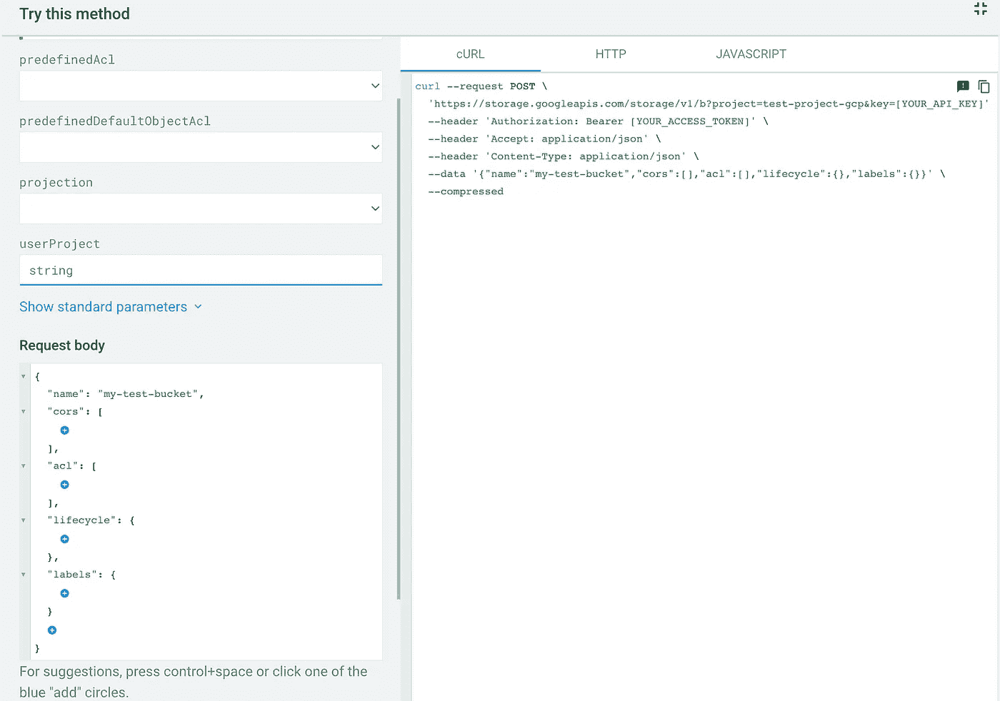

# 通过 REST APIs 以编程方式管理 Google 云资源

> 原文：<https://medium.com/google-cloud/programatically-manage-gcp-resources-via-rest-apis-6b216e5efadf?source=collection_archive---------0----------------------->

在本文中，我们将深入探讨如何使用 Google Cloud 提供的 REST APIs 轻松高效地管理 GCP 资源。我们将看看 GCP 的 REST APIs 如何为自动化和程序管理提供一个通用框架。使用 GCP REST API，您可以采用测试->实现->重用的方法来管理 GCP 资源。示例代码将使用 python，但是您可以使用任何选择的编程语言进行等效的替换

# GCP 的原料药

GCP 公开了 REST APIs 来创建、列出、查看、删除或修改 GCP 中的各种资源。虽然 SDK 存在于多种编程语言中，但每种 SDK 都有自己的方法和文档。例如，用于访问和管理谷歌云存储资源的 SDK 不同于用于管理 GCP 计算资源的 SDK。使用每一个 SDK 也需要一定的学习曲线。

GCP 提供了基于 JSON 的 REST APIS 来管理各种资源，并提供了详细的文档。例如，计算引擎 API 可以在[https://cloud.google.com/compute/docs/reference/rest/v1](https://cloud.google.com/compute/docs/reference/rest/v1)找到，GCS REST APIs 可以在[https://cloud.google.com/storage/docs/json_api/v1](https://cloud.google.com/storage/docs/json_api/v1)找到

# 测试您的 API 请求

参数、消息头、请求体和认证构成了 REST API 的关键部分。GCP 提供了试验 JSON API 的工具，在其中您不仅可以指定参数和头，还可以构造请求体(使用 autosuggest)并将请求提交到您选择的 GCP 项目。这使开发人员能够以一种简单的方式验证复杂的请求主体数据和请求参数，而无需编写一行代码。

还有可用于 HTTP 和 Java 脚本的代码片段

**HTTP 代码片段**

> 岗位[https://storage.googleapis.com/storage/v1/b?project = test-project-GCP&KEY =[YOUR _ API _ KEY](https://storage.googleapis.com/storage/v1/b?project=test-project-gcp&key=[YOUR_API_KEY)]HTTP/1.1
> 
> 授权:无记名[您的访问令牌]
> 接受:应用/json
> 内容类型:应用/json
> 
> {
> "name": "my-test-bucket "，
> "cors": []，
> "acl": []，
> "lifecycle": {}，
> "labels": {}
> }

# 代码实现

一旦您如上所述测试了参数、头部和请求体，下一步就是开始编写 REST 客户端。

**认证**

GCP REST 客户端的一个重要方面是身份验证和授权。对于身份验证和授权，最灵活、最简单的方法是通过环境变量设置凭证，并进行令牌刷新。凭证通常是具有执行 API 操作的相关 GCP 权限的服务帐户。

通过环境变量设置凭证，可以避免在代码中硬编码凭证。这也使您能够在不同的环境和 CICD 管道中运行相同的代码，而无需任何代码更改。

例如:*导出 GOOGLE _ APPLICATION _ CREDENTIALS = " KEY _ PATH "*

一旦您的环境中有了可用的 GCP 凭据，您就可以使用 google.auth.credentials api 来获取一个基于您的环境中设置的凭据的具有有限生命周期的令牌。

为环境中设置的凭证获取令牌的 python 代码片段如下

> 导入 google.auth
> 
> 导入 google.auth.transport .请求
> 
> def get_creds():
> 
> credentials，proj _ id = Google . auth . default(scopes =[" https://www . Google APIs . com/auth/cloud-platform "])
> 
> auth _ req = Google . auth . transport . requests . request()
> 
> credentials . refresh(auth _ req)#刷新令牌
> 
> token_str=(credentials.token) #打印令牌
> 
> 打印(凭证.到期)
> 
> 返回 token_str，proj_id

**通过 REST 客户端调用 GCP API**

让我们举一个例子，调用 REST API 在 GCP 创建一个云函数。在这个方法中，我们通过调用上面提到的 get_creds()函数来获得访问令牌。这个访问令牌在“Authorization”头中提到，post 请求与请求体 JSON 一起发送。请求体 JSON 可以像上面“测试您的 API 请求”一节中提到的那样获得。

> def create _ function _ with _ trigger(bucket _ name，bucket_out，template):
> 
> access_token，proj_id=auth.get_creds()
> 
> functions _ URL = " https://cloud functions . Google APIs . com/v1/projects/media-348707/locations/us-central 1/functions "
> 
> print(f '云函数{access_token} ')
> 
> headers _ req = { ' Authorization ':' Bearer '+access _ token }
> 
> request _ body = get _ request _ for _ create _ cloud _ function(模板，bucket_out，bucket_name)
> 
> resp = requests . post(URL = functions _ URL，json=request_body，headers=headers_req)
> 
> 打印(内容)

上面代码中的 request_body 是对 API 的 JSON 请求。有了上面的代码，用几行代码管理任何 API 资源都是可能的，最好的部分是整个 API 可以像最初提到的那样独立测试。这使用户能够创建更快、更高效的客户端来高效地管理 GCP 资源。

# 代码重用

除了上面代码中的请求 url 和请求主体，客户端的大部分代码都是可重用的。假设您想从 API 创建一个新的 GCP 资源，比如一个计算实例，您可以重复使用 GCP API 文档来构造请求体和请求 url 的整个过程。除了请求体和请求 url 之外，任何 post 请求的客户端代码都是相似的，可以重用。

# 结论

通过遵循测试->实现->重用方法，REST APIs 使您能够轻松地管理 GCP 资源。此外，GCP 公开的一套丰富的 API 文档能够“尝试任何 API ”,这使得这个过程更加简单、高效、不易出错