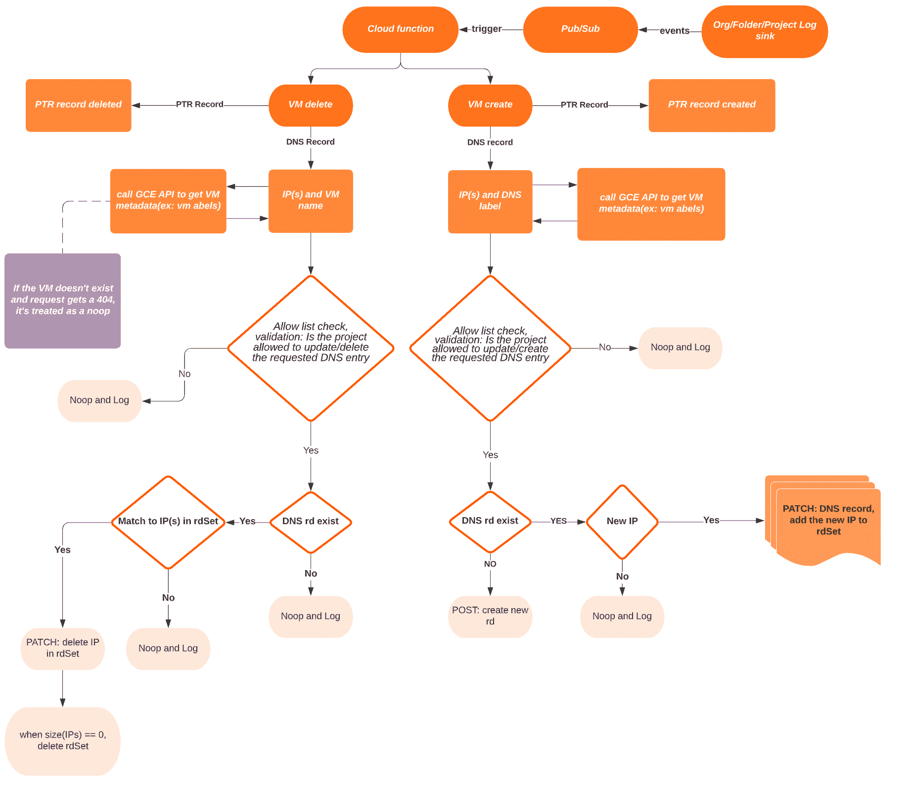
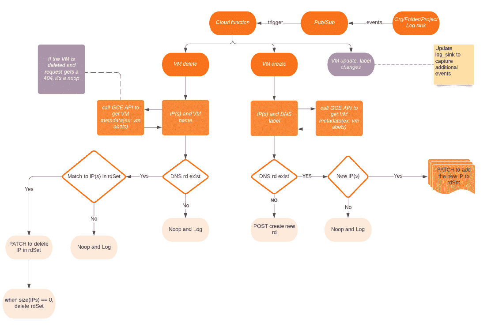

# Google Cloud 虚拟机的程序化 DNS 记录管理

> 原文：<https://medium.com/google-cloud/programmatic-dns-record-management-for-google-cloud-vms-9dc07972131c?source=collection_archive---------0----------------------->

# 经典的 DNS 更改流程

是否还需要使用旧的 DNS 变更控制流程？也许不是在这个时代，当你可以现代化你的工作流程，将大部分的手工过程委托给系统。或者，如果您是一个开发/基础设施团队，正在寻找一种功能，允许您管理 DNS 记录，而不必等待冗长的变更控制过程来跟上您的工作节奏。

毕竟，出于各种遗留原因，控制、治理和审计是必要的，但是如果我们能够使流程的一部分成为一次性交易并使其余部分自动化，我们就可以同时满足这两者。如果开发团队被列入白名单，使用一个正则表达式来满足 DNS 团队期望的控制，同时实现开发团队的 DNS 自助服务目标，会怎么样？

GCP 的[云 DNS](https://cloud.google.com/dns/docs/overview/) 可以用来以编程方式管理 DNS 记录。此外，云 DNS [100% SLA](https://cloud.google.com/dns/sla) 对这种方法本身提供的弹性是一个很大的优势。如果这对你来说足够有趣，请继续阅读，我相信你会过得很愉快:)

# 问题陈述

谷歌云虚拟机的 DNS 管理。

虚拟机生命周期事件(如创建和删除)通常需要组织处理 DNS 记录。一般来说，开发/基础架构团队创建虚拟机，DNS/网络团队分别生成 DNS 条目，如“A”和“PTR”记录。这意味着每当需要更新 VM/DNS 条目时，必须遵循相同的两步过程。

# 业务用例

基于 GCE 虚拟机创建/删除事件自动化 DNS“A”和“PTR”记录管理是一种常见的使用情形，适用于希望:

*   对需要 FQDNs 和 PTR 记录的虚拟机自动进行 DNs 管理，并进行必要的控制和治理，以确保正确/允许的 DNS 使用。
*   避免遵循两步变更流程，即开发/基础架构团队创建虚拟机(MIG ),然后单独请求创建 DNS 记录。
*   为开发/基础架构团队提供自助服务功能，以管理他们的 DNS 记录，同时还拥有自动化、治理和管理提升的 IAM 权限的必要控制，以跨项目全局管理 DNS 条目。

# 解决方案设计

包含所有步骤的自动化工作流程

在我们部署代码来实时测试上面的流程之前，让我们浏览几个主题来获得一些关于自动化如何工作的一般知识。

# 虚拟机标签

[VM 标签](https://cloud.google.com/compute/docs/labeling-resources#what-are-labels)在高级别上是可以添加到 VM 上的键-值对，用于为检查 VM 的下游系统定义 VM 属性。因此，当您向虚拟机添加虚拟机标签时，您可以控制诸如 DNS 主机名、DNS 区域和跳过 DNS 记录创建之类的事情。例如，您可能希望避免为特定虚拟机创建 dns 记录，当“DNS 跳过记录”标签设置为真时，自动化将跳过为这些虚拟机创建 DNS 记录。

# 需要注意的标签

*   " **dns_skip_record** "将此标签设置为 true 将跳过为虚拟机创建 dns 记录。
*   **“dns _ host _ name**”默认情况下，虚拟机的名称被作为 DNS 条目中的主机名，但是可以通过添加此标签来覆盖该默认行为。例如，在虚拟机上设置“dns _ host _ name”:“devserver”标签会将 DNS 条目创建为“devserver”+“.”+ providedDNSDomain。
*   " **dns_zone_name** "覆盖默认 dns 区域名称，以防有多个 DNS zone。这是 GCP DNS 区域名。
*   " **dns_zone_host_project** "来指定 dns_zone 托管的 project_id。
*   **“dns _ domain**”与 dns_zone 关联的 DNS 域。这是与上述区域名称相关联的域

# 部署解决方案

必须预先创建正向和反向环路的 DNS 区域。通常企业通过 IaC 使用类似 terraform 的东西来创建它。获取以下详细信息，因为我们在稍后部署云功能时需要它们。

1.  DNS 专用/转发区域主机项目 ID
2.  DNS 专用/转发区域名称
3.  DNS 私有/转发区域域名(用于“A”记录放置)
4.  DNS 专用/反向区域主机项目 ID
5.  DNS 私有/反向区域名称(用于“PTR”记录放置)

# 部署步骤

请遵循此处的部署说明

# 增强/可选改进

1.  这段代码中的 getGCEMetadata()函数在记录虚拟机事件后立即检索虚拟机信息，这意味着在云函数或下游依赖项(如 compute API)出现问题的情况下，可能会创建过时的 DNS 记录。这是一个边缘案例。

> 这可以用最少量的验证工作来处理，或者可以定期执行后端作业来检测/清除任何过时的条目。
> 
> 在数据库中维护虚拟机元数据或查询 AssetAPI 并使用该信息进行额外的验证和删除操作。

2.当前版本的自动化仅在创建或删除虚拟机时管理 DNS 记录，但此自动化范围可以扩展到虚拟机更新事件，如虚拟机重启时的标签更改，以更新 DNS 记录。

3.可以支持额外的[记录类型](https://cloud.google.com/dns/docs/overview#supported_dns_record_types)。

## 增强型设计

增强的自动化工作流程

# 常见问题

## 管理多个区域

当涉及多个区域时，可以通过 VM 标签来控制区域，通过这些标签可以显式地提供区域、域名和项目 ID。

## 多团队结构

这个云功能的多个副本可以跨项目/文件夹/组织部署，以将范围限制到一个[资源级别](https://cloud.google.com/resource-manager/docs/cloud-platform-resource-hierarchy)，并实现 IAM 的分离。需要为文件夹/项目级操作适当更新日志接收器过滤器。

## PTR 区域类型

虽然您可以使用地址 arpa. 中的“**”为 PRT 记录创建一个私有区域，作为一个总括域，以避免维护特定范围的粒度区域，但建议根据您计划的整体 DNS 区域管理策略创建更粒度的区域。**

## 配额和限额

请注意每个用户每分钟的 API 查询[配额](https://cloud.google.com/dns/quotas#quotas)，可以根据需要增加，以及[资源限制](https://cloud.google.com/dns/quotas#resource_limits)。