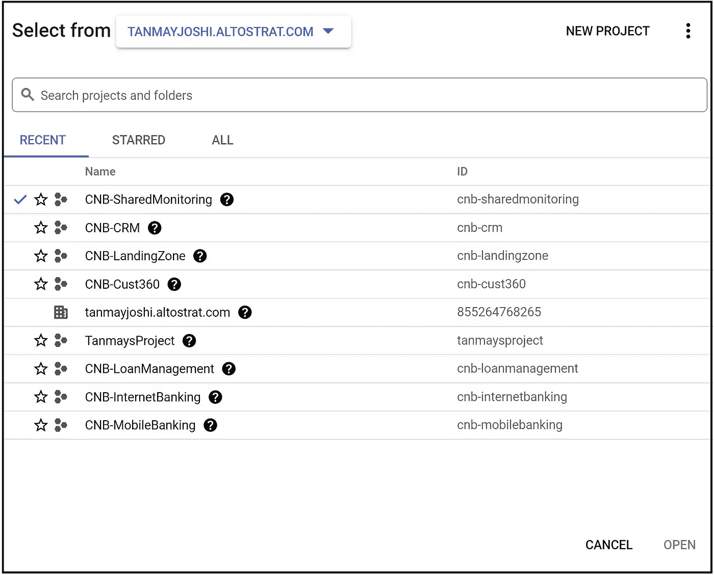
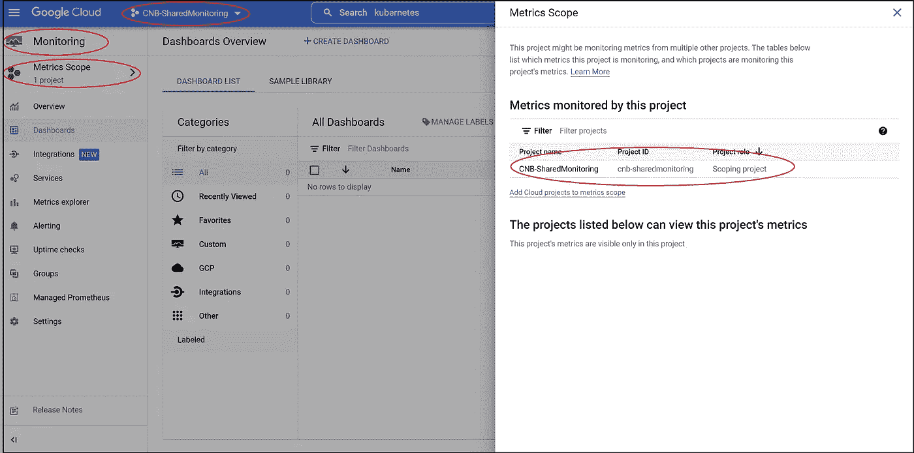
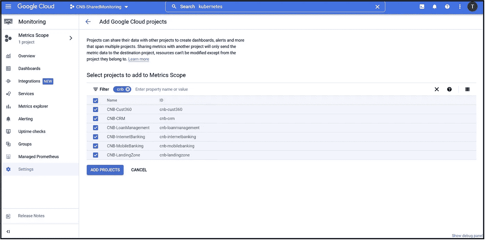
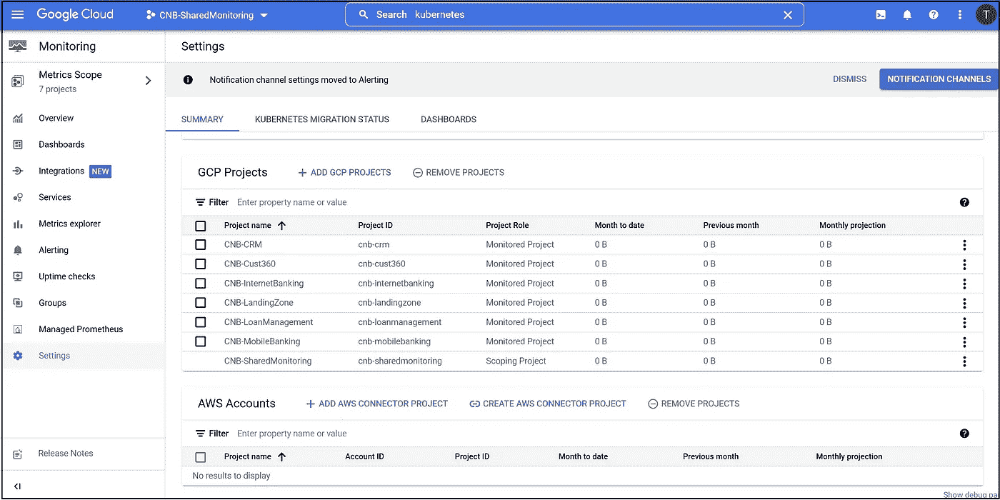
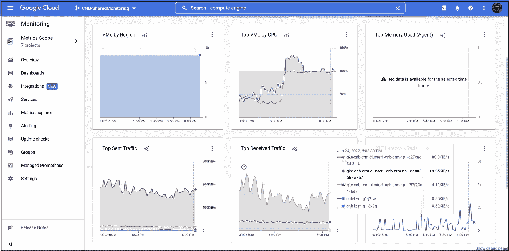
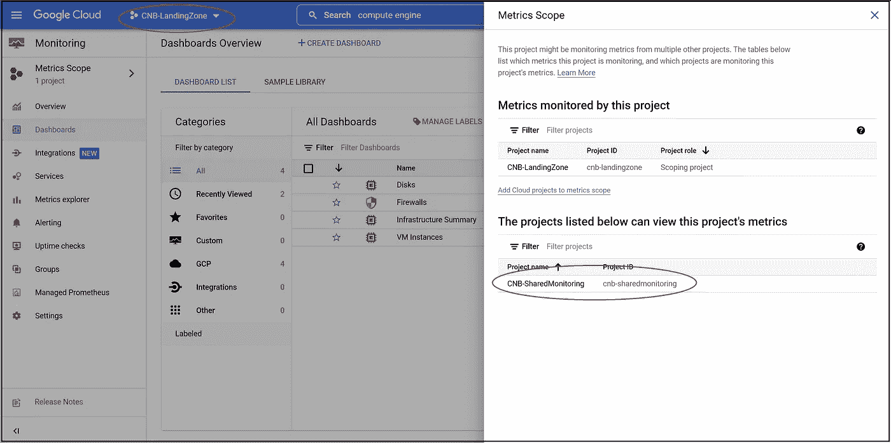

# 介绍 gCloud Genie！gCloud Genie 揭秘监控！

> 原文：<https://medium.com/google-cloud/prologue-introducing-gcloud-genie-97d68fa0efd7?source=collection_archive---------0----------------------->

推荐:请看这里的介绍:[有转折的科技博客！](/@tanmayj/tech-blogs-with-a-twist-5a940413e42d)

“AAARRRGHHH！！!"“我把自己弄成什么样了！”

扎克·肯尼迪，摇滚明星，炙手可热的企业建筑师，Cygnos 帝国银行最新的名人雇员，在他封闭的角落办公室里用拳头敲打着他的桌子。

一个超人的成就是，在他被雇用的一年内，通过说服和强制的结合，以及与当权者的一些聪明的定位，他成功地质疑了现状，并逐渐改变了心态。他成功地让该银行从一家传统的 IT 企业转向云计算，为其下一阶段的增长提供动力。事情已经到了管理层准备投身云计算世界的地步！他刚刚参加完由首席执行官、首席财务官、CISO 和首席信息官主持的会议。

他原本希望这是选择云服务提供商之前的最后一次讨论，但不幸的是，这变成了一场大屠杀！

“我需要部署新的应用平台，就像现在一样！现在，现在，现在！”首席执行官说。

首席信息官说，“当然；签了文件&我们马上就开始！”

首席财务官怒斥道:“在你证明投资回报率更高之前，我是不会签任何东西的。”。

“哦，不，你不要！除非您的团队让我的家人相信我们客户的数据是安全的，否则任何信息都不能传出数据中心！”CISO 插嘴道。

他们几乎要打起来了，会议陷入僵局。

可怜的扎克，他离实现改造 CIB 的梦想如此之近却又如此之远！

他深吸了几口气，平静下来，放了些音乐。他需要答案，而且要快！

在这个世界上，他只信任一个人来帮助他！

gCloud 精灵！他的救世主度过了艰难的时光！

他拿出一个非常特别、非常珍贵的 u 盘，把它插在笔记本电脑上。随着一阵烟雾，妖怪出现在屏幕上！

“我能帮你什么吗，主人？”

扎克疲惫地向精灵讲述了整个事件。

“放心吧主人，我会帮你的。我们会到达那里的！”

他的声音充满了自信。

那次灾难性的会议已经过去了 6 个月，但扎克仍然起了鸡皮疙瘩，但在这 6 个月里，在 gCloud Genie 的帮助下，扎克成功地穿越了 CIB 的迷宫，并让谷歌云平台(GCP)被选为战略合作伙伴。他们甚至在生产中推出了他们的第一个工作负载，并有一个未来推出的大管道。

扎克认为这只是一小步，但他很高兴 CIB 已经开始走上云转型之路！

扎克回忆着过去所有的艰苦工作，平静地满意地微笑着，突然，Cygnos 帝国银行云运营负责人 Aaron Baker 在一天早上闯进了他的角落办公室。

“伙计，你得帮我一把！”

Aaron 负责保持云的平稳运行和所有应用程序所有者的满意。

“怎么了亚伦？发生了什么事?你看起来满脸通红！”

“嗯，我刚和一群应用团队通了一个讨厌的电话。他们都希望将工作负载转移到云上。一些在开发部门，一些在 UAT，我们在生产部门有一个 CRM 工作负载，等等。”

“嗯，太好了！”扎克说。

“嗯，是的，在某种程度上，但这不是重点！接下来会有大量的工作。每个都部署在自己的 GCP 项目中，用于用户和角色分离”

“正确，应该是这样的”扎克说。

“是的，但正因为如此，我很难从一个中心位置查看他们的资源利用率和其他指标！”亚伦怒斥道。“在今天的电话会议上，有多个团队，一些报告了性能问题，一些报告了利用率不足，情况变得很糟糕，我无法帮助他们！”

“我不想获得每个应用程序所有者各自项目的权限，那将违反最小特权原则！更重要的是，作为云运营主管，我确实需要通过单一平台了解每个工作负载的运行情况！”阿龙总结道。

扎克现在明白了问题所在。“就这些？我马上就上！”

隐藏在扎克的笔记本电脑上的一个最小化的窗口中，gCloud Genie 正在听着戏谑和微笑！

亚伦一离开，扎克问精灵。

“这不是问题，很简单”，Genie 断言。“来，我给你看。解决这个问题的首选工具是“云监控”。有一种方法可以创建所谓的“范围项目”或仅处理集中监控的项目，并配置云监控以将所有指标传递给 it 部门，以获得集中观众。这些指标通常在它们各自的项目中也是可见的。通过这种方式，应用程序团队获得了他们自己的特定于应用程序的视图，而 Aaron 获得了他的企业级视图。两人皆大欢喜！”

无数次扎克对他的数字助手感到一阵感激。如果没有 gCloud Genie，迄今为止的旅程是不可能的！

“太棒了 G！”扎克惊呼！“你能给我介绍一下吗？”

“绝对的！让我给你看看……”

“这里，这是 CNB 目前正在进行的所有项目的清单”

"请注意，我已经专门为此创建了一个新的独立项目，名为“CNB 共享监控”. "

“对”，扎克说

“现在你要做的是，进入共享监控项目，从汉堡菜单启动云监控。

默认情况下，您只将度量范围视为一个项目——那个项目。你点击“Metrics Scope ”,就会打开一个窗格，只显示那个项目。

点击“将云项目添加到指标范围”按钮。"

"我可以预见，一些严重的可怕的是要遵循这一点"扎克惊呼搓着双手！

“你是对的，我的朋友！这里！您可以看到，我已经将 CNB 的其他项目选入这个项目进行监控。这些被称为受监控的项目。我现在将着手添加它们。”

“那里！所有 GCP 项目都已添加到“监视”窗格中。顺便说一下，您甚至可以添加 AWS 帐户，进行集中式多云监控！”

“给你！这正是亚伦想要的，不是吗！在这里，您可以在单一窗口中真实地看到所有项目的所有资产。请注意，来自着陆区(cnb-lz)的虚拟机和来自 CRM 项目(cnb-crm)的 GKE 节点的统计数据都显示在同一图表和同一控制面板中！”

“哦！最后但并非最不重要的一点是，如果个人应用程序所有者进入他们各自项目中的云监控，他们可以看到“大佬”Aaron 正在关注！

就是这样！任务完成。如果 Aaron 想了解更多这方面的内容，可以查阅最佳实践、所需的用户权限等。，请把这份阅读材料传给他。

“这是超越辉煌，非常感谢你克”扎克喊道！

gCloud 精灵微笑着双手合十，亲切地说:“乐意效劳！”