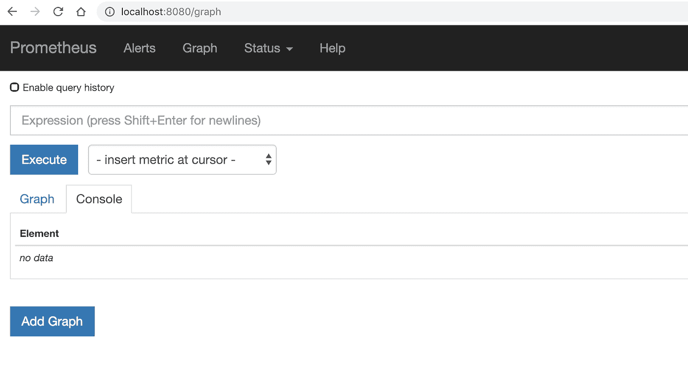
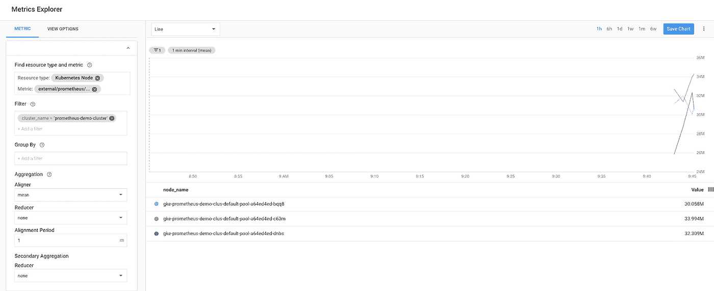
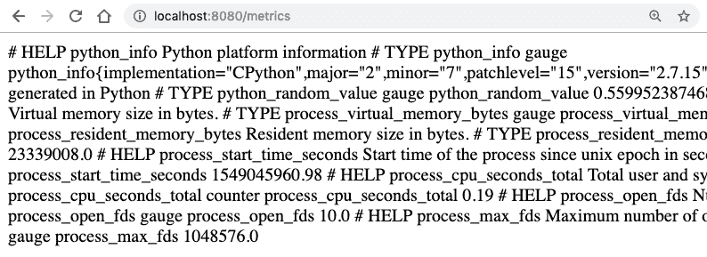
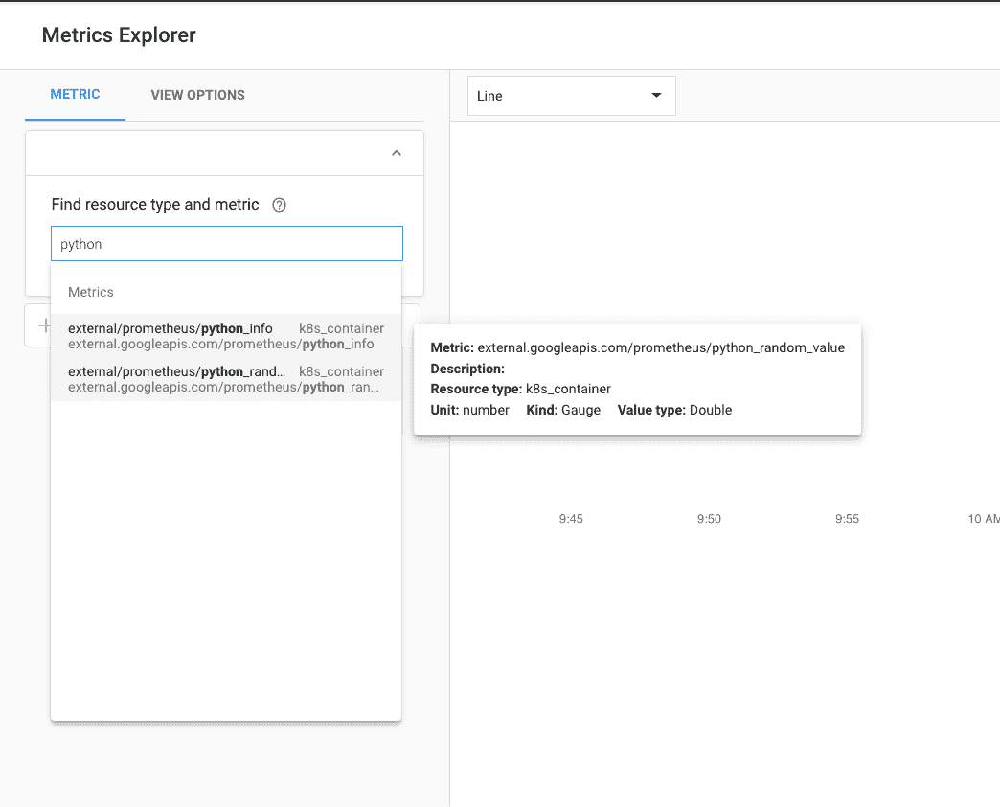
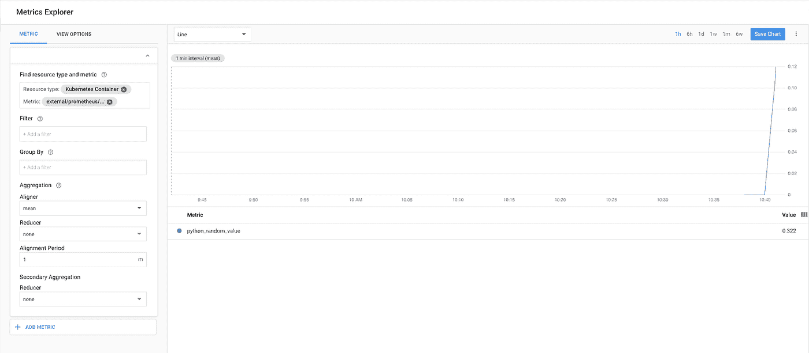
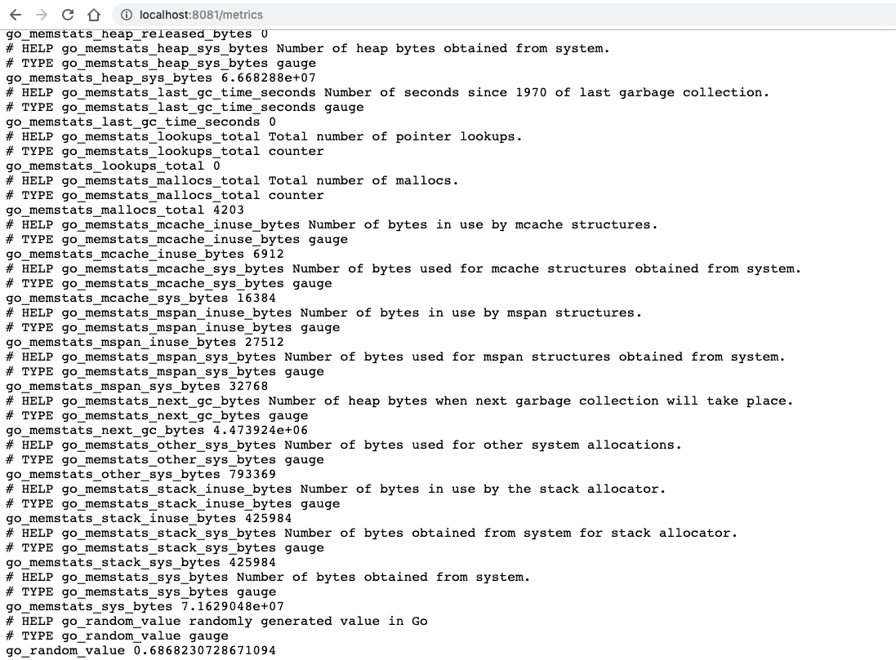
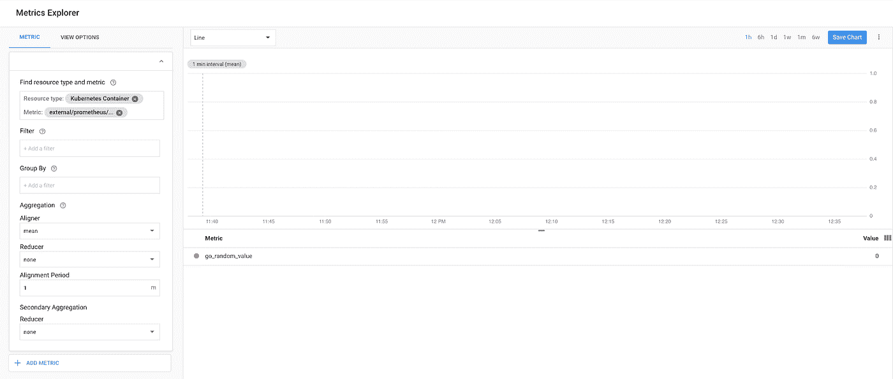
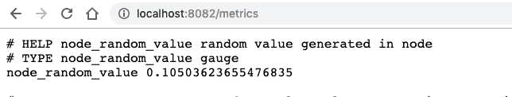
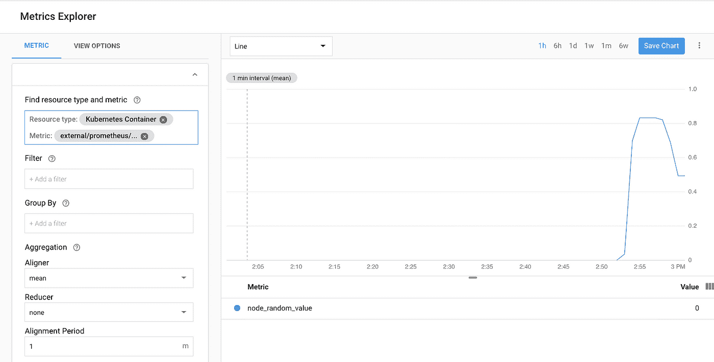

# 普罗米修斯和斯塔克德瑞弗

> 原文：<https://medium.com/google-cloud/prometheus-and-stackdriver-fb8f7524ece0?source=collection_archive---------0----------------------->

# 介绍

Kubernetes 的“新”Stackdriver 监控自 2018 年 5 月左右首次发布本[公告](https://cloud.google.com/blog/products/gcp/announcing-stackdriver-kubernetes-monitoring-comprehensive-kubernetes-observability-from-the-start)以来一直处于公开测试阶段。从那以后，我花了相当多的时间研究它，其中一个我真正想更好理解的领域是它与[普罗米修斯](http://prometheus.io)的集成。我以前也从未真正使用过 Prometheus，所以我也需要获得该工具的一些基本知识——特别是当我不断从客户那里听说它时，他们经常想知道如何在搬到 GKE 后继续使用它，或者如何用 Stackdriver 替换和/或补充它。下面是我尝试演示“GKE 上的普罗米修斯与斯塔克德瑞”——从零开始。和[剖析器](/google-cloud/introduction-to-stackdriver-profiler-614b580b978a)一样，我也想看看我是否能理解如何用多种语言编写代码。让我们看看会发生什么？

# 普罗米修斯基础

我需要学习的第一件事是——第一件事。什么是普罗米修斯？它是如何工作的？在这个练习中，对我来说最重要的是——指标是如何工作的？幸运的是，有人出色地记录了我需要的东西。你可以在这里找到他们的系列[，但是我需要从他们的帖子中了解和学习的关键事情是:](https://blog.pvincent.io/2017/12/prometheus-blog-series-part-1-metrics-and-labels/)

*   有 4 种主要的度量类型——计数器(递增的)、计量器(上升和下降的)、摘要和直方图
*   为了让 Prometheus 从应用程序接收指标，应用程序需要公开一个具有可用指标值的专用端点(通常为/metrics)
*   如果应用程序已经在某个地方写了度量(比如数据库或文件)，您可以创建一个 Prometheus exporter 来读取这些度量，然后公开它们
*   您需要一个存储指标的 Prometheus 服务器

我很确定我错过了很多东西。例如，我仍然不太理解注册表的概念，但这些信息足以让我工作。现在我们已经有了基本的东西，让我们开始实际操作吧。

# 在 GKE 上安装普罗米修斯并验证

我开始演示如何在一个简单的应用程序中导出 Prometheus 指标，并让 Stackdriver 获取它们来测试 Prometheus 集成。令人欣慰的是，Stackdriver 团队已经做了很好的工作，记录了实现这一目标所需的步骤。不管怎样，我们走一遍。

# 创建 GKE 集群

首先，我们需要创建一个集群。我们希望确保选择“新的”Stackdriver 监控和日志记录配置。

```
gcloud beta container --project "<your project ID" \clusters create "prometheus-demo-cluster" \--zone "<desired zone>" \--cluster-version "latest" \**--enable-stackdriver-kubernetes**
```

# 安装普罗米修斯

接下来，我们需要在集群中安装 Prometheus。根据兼容性[矩阵](https://github.com/Stackdriver/stackdriver-prometheus-sidecar#compatibility)，我想尽可能使用最新版本，在撰写本文时，是 2.6.1。我以前从来没有真正安装过它，但是一分钟的搜索就找到了这个[指南](https://devopscube.com/setup-prometheus-monitoring-on-kubernetes/)，我也跟着看了。我不确定在这里重复这些步骤有多大价值，但我想捕捉我的经验，以防我需要再次这样做。

首先，我需要将自己设置为集群中的管理员:

```
ACCOUNT=$(gcloud info --format='value(config.account)')kubectl create clusterrolebinding owner-cluster-admin-binding \--clusterrole cluster-admin \--user $ACCOUNT
```

然后，我为 Prometheus 组件创建了一个专用的名称空间:

```
kubectl create namespace prometheus
```

然后，我通过创建一个新角色，授予这个名称空间集群读取器权限。我复制了这个[文件](https://raw.githubusercontent.com/bibinwilson/kubernetes-prometheus/master/clusterRole.yaml),并简单地将最后的名称空间名称改为“prometheus ”,而不是“monitoring”。我保存了文件并创建了角色:

```
$ kubectl create -f clusterRole.yamlclusterrole.rbac.authorization.k8s.io/prometheus createdclusterrolebinding.rbac.authorization.k8s.io/prometheus created
```

下一步是为抓取和警报规则创建配置映射。我复制了这个[文件](https://raw.githubusercontent.com/bibinwilson/kubernetes-prometheus/master/config-map.yaml)，再次用“prometheus”替换对“monitoring”名称空间的引用，并应用它:

```
$ kubectl create -f configMap.yaml -n prometheusconfigmap/prometheus-server-conf created
```

接下来，按照指南，我为 Prometheus 部署创建了一个. yaml [文件](https://github.com/yuriatgoogle/prometheus-demo/blob/master/kubernetes/prometheus-deployment.yaml)，再次替换了名称空间引用和(重要的是！)更新参考 2.6.1 的 Prometheus 版本，并创建部署:

```
$ kubectl create -f prometheus-deployment.yaml -n prometheusdeployment.extensions/prometheus-deployment created
```

让我们检查一下，确保一切正常运行:

```
$ kubectl get pods -n prometheusNAME                                    READY   STATUS    RESTARTS   AGEprometheus-deployment-7ddb99dcb-fkz4d   1/1     Running   0          1m
```

最后，让我们通过将 pod 端口转发到 localhost 来检查以确保它工作正常:

```
$ kubectl port-forward prometheus-deployment-7ddb99dcb-fkz4d 8080:9090 -n prometheusForwarding from 127.0.0.1:8080 -> 9090Forwarding from [::1]:8080 -> 9090
```

现在，当我去 [http://localhost:8080](http://localhost:8080) 时，我可以看到这个:



# 安装 Stackdriver 收集器

现在我们已经在集群中运行了 Prometheus，我们需要安装 Stackdriver 收集器来将这些指标导出到 Stackdriver 后端。这明明是[记载的](https://cloud.google.com/monitoring/kubernetes-engine/prometheus)；首先，我在本地复制了这个[文件](https://raw.githubusercontent.com/Stackdriver/stackdriver-prometheus-sidecar/master/kube/patch.sh)。然后，我设置了所需的环境变量:

```
export KUBE_NAMESPACE=prometheusexport KUBE_CLUSTER=prometheus-demo-clusterexport GCP_REGION=<my region>export GCP_PROJECT=<my project ID>export DATA_DIR=/prometheus/export DATA_VOLUME=prometheus-storage-volumeexport SIDECAR_IMAGE_TAG=release-0.3.2
```

我运行了补丁脚本:

```
$ sh ./patch.sh deployment prometheus-deploymentdeployment.extensions/prometheus-deployment patched
```

现在，Stackdriver 收集器在 Prometheus 吊舱中作为边车容器运行:

```
$ kubectl get pods -n prometheusNAME                                     READY   STATUS    RESTARTS   AGEprometheus-deployment-744758f7cc-v6zqx   2/2     Running   2          1m
```

最后，我们准备看看是否有普罗米修斯指标出现在 Stackdriver 中。

请注意，虽然对这种集成的支持还处于测试阶段，但每个项目有 1000 个普罗米修斯指标的限制。如果遇到这种情况，您应该能够在日志记录中找到一条“超过配额”的消息。

我转到 Metrics Explorer，过滤到我正在使用的集群，果然，它们就在那里！



现在，我准备在我的代码中做一些检测。

# 在应用程序中导出普罗米修斯指标

我应该注意到，虽然我是从零开始，但是大多数人可能已经运行过 Prometheus(在这种情况下不需要任何关于检测的信息)或者正在寻找检测选项。在后一种情况下，我们可能会引导他们走向 [OpenCensus](https://cloud.google.com/monitoring/custom-metrics/open-census) ，而不是从普罗米修斯仪器开始，我希望很快有机会用 OpenCensus 做类似的练习。

# 计算机编程语言

我的意图很简单。我只想创建一个“Hello World”应用程序，它会在每次页面被点击时创建一个随机数，并在 Stackdriver 中将该数字显示为普罗米修斯度量。我不得不做一些关于如何做到这一点的研究，但是我发现了两个非常有用的资源。首先是普罗米修斯 Python 客户端[本身](https://github.com/prometheus/client_python)。第二个是别人发的一篇[帖子](/@andrei.chernyshev/prometheus-python-flask-8487c3bc5b36)，解释了如何使用 Flask 中的客户端。有了这些信息，我勇往直前。

首先，我创建了一个基本的 Flask 应用程序。我导入了 Prometheus 客户机，并创建了一个基本的度量标准，每次访问主页时，我都将其设置为一个随机值。然后，我为/metrics 创建了第二个 Flask route，它公开了度量。你可以在这里看到完整的 app.py 文件。

接下来，我需要从这个应用程序创建一个可以在 GKE 上运行的容器图像。我使用“pip freeze”保存了我的 Python 包[状态](https://github.com/yuriatgoogle/prometheus-demo/blob/master/python/requirements.txt),并尽我所能创建了最基本的 Dockerfile 文件:

我使用 Google Cloud Build 创建了这个图像:

```
gcloud builds submit — tag gcr.io/[project ID]/prometheus-demo-python .
```

第一次尝试就成功了！

在 GKE 部署之前，我想在本地测试一下，以确保一切正常。我使用“docker run”运行图像:

```
$ docker run -p 8080:8080 gcr.io/[project ID]/prometheus-demo-python:latest
```

果然，我能够在/metrics 上看到普罗米修斯指标:



现在，我需要定义我将用来在 GKE 上运行它的部署。我创建了一个. yaml [文件](https://github.com/yuriatgoogle/prometheus-demo/blob/master/python/prometheus-demo.yaml)来引用我的新图像。这里要注意的关键是这一部分，它告诉普罗米修斯从哪里获取度量:

我创建了部署:

```
$ kubectl apply -f ./prometheus-demo.yamldeployment.extensions/prometheus-demo-python created
```

并使用负载平衡器来公开它:

```
$ kubectl expose deployment prometheus-demo-python --type=LoadBalancer --port 8080service/prometheus-demo-python exposed
```

现在，我可以在通过运行“kubectl get services”获得的外部 IP 上看到相同的/metrics 页面。最后，是时候使用 Metrics Explorer 来查看我创建的随机值度量是否显示在 Stackdriver 中了:



就在那里！



这太酷了！现在，让我们看看我是否能在围棋中做同样的事情？

# 去

和以前一样，我需要四处看看，以了解如何用 Prometheus 检测我的(非常基本的)代码。我创建了一个基本的应用程序，并找到了 Golang Prometheus [客户端](https://github.com/prometheus/client_golang)和一个[向导](https://prometheus.io/docs/guides/go-application/)来安装我的应用程序——两者都直接来自 Prometheus。这足以让我继续前进。这里可以看到应用代码[。这里需要注意的是,/ route 和/metrics 路由实际上有两个独立的处理程序。第一个由 http 处理。ResponseWriter，而/metrics 由 promhttp 处理。至少对我来说这很有趣！](https://github.com/yuriatgoogle/prometheus-demo/blob/master/go/main.go)

现在我的代码已经写好了，我需要用它构建一个容器映像，这样我就可以把它部署到 GKE。以下是我使用云构建来构建映像的 Dockerfile 文件:

我花了一段时间才明白，为了让代码实际运行，我需要在 order 文件中包含构建步骤。这篇[帖子](https://blog.codeship.com/building-minimal-docker-containers-for-go-applications/)非常有帮助，尽管我从来没有想出如何让我的图像变得那么小。然而，它建成并运行！

我再次使用“docker run”在本地测试该映像，以确保我看到了/metrics，特别是我创建的 *go_random_value* 指标:



现在，我准备部署到 GKE。我复制了部署。yaml 文件，注意修改 Prometheus scrape 设置以引用运行该服务的端口(8081 而不是 8080)，用 go 替换所有对 Python 的引用，并将其指向新的 go 映像。然后，我在一个不同的端口(同样是 8081)上使用一个负载均衡器来公开部署，并检查是否可以在那个外部 IP 上使用/metrics 端点。最后，我准备好查看 go_random_value 度量是否在 Stackdriver 中——它在！



# 节点. js

我想尝试的最后一个语言是 Node.js，经过一番搜索，我发现没有一个来自 Prometheus 的“官方”客户端，但[这个](https://github.com/siimon/prom-client)似乎是标准。同样，我使用 Express 构建了一个简单的 Hello World [应用程序](https://github.com/yuriatgoogle/prometheus-demo/blob/master/node/app.js)，它设置了一个随机值，并确保它在本地工作。

这里需要注意的一点是，我的“用户”度量是列表中的第一个，这无疑使验证更加容易！



然后，我创建了一个 docker 文件，使用 Cloud Build 构建了映像，使用 docker run 在本地对其进行了测试，并以与之前相同的方式将其部署到我的集群中。果然 node _ random _ value 指标和其他指标一样显示在 Stackdriver 中！



# 结论

我真的很喜欢这个练习，因为它让我有机会学习普罗米修斯的基础知识，迫使我回忆(学习？)如何为不同的语言创建 Dockerfiles，并教会我如何让这些 Prometheus metrics 在 Stackdriver 中显示出来。后来，我可以看到进入管理时间序列标签，其他数据类型(如直方图？)，或者说如何在“生产中”实际操作普罗米修斯。但是我们现在就离开这里——谢谢你坚持到最后！如果你对代码或配置文件感兴趣，我已经在这个[报告](https://github.com/yuriatgoogle/prometheus-demo)中提供了它们。