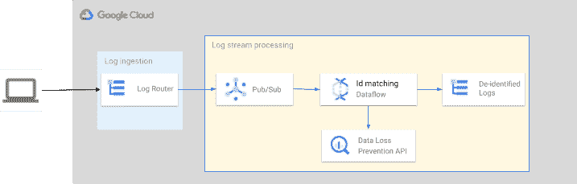

# 使用谷歌云保护日志中的敏感信息

> 原文：<https://medium.com/google-cloud/protect-sensitive-info-in-logs-using-google-cloud-4548211d4654?source=collection_archive---------2----------------------->

> 2023 年 3 月 10 日更新

应用程序日志可能会捕获包括敏感或专有数据在内的信息。因此，这些数据可能会被有权访问应用程序日志但不应该能够访问这些敏感数据的未授权人员获得。例如，当应用程序编写包含用户真实社会保险号的日志以进行进一步故障排除时，就会发生这种情况。在故障排除时，支持工程师和应用程序开发人员将有权访问真实人物的 SSN 数据，这些数据被视为 PII，未经明确同意不得访问。这种数据可以是任何东西，包括带有秘密 PIN 的信用卡号、护照号、密码等。很少审查应用程序代码在日志中写了什么。而且日志本身也不经常被审计(除非公司通过了合规性审计)。这就是为什么缓解这些问题是一项艰巨的任务。而且通常发生在数据被公开和使用之后。

当需要解决此问题时，通常会应用以下策略之一:

1.  通过限制对日志的访问来限制对存储的日志条目的访问。这种限制通常使用某种访问管理机制来应用，比如限制浏览或下载日志的权限。
2.  日志在写入之前的“医生”有效负载(也称为摄取)。要么通过搜索预定义的字符串模式并用#或*之类的“填充符”替换它们，要么简单地通过删除这样的日志条目。
3.  另一个策略是做同样的事情(就像上面的#2 ),但是在之后的*,日志被接收到日志后端。*
4.  我不能忽视一个*天真的*策略，指导开发人员“*不要将敏感信息包含到日志中*”，并在代码审查期间强制执行。

第一个和最后一个(#4)策略不能解决问题，因为它们依赖于人，而人会犯错，☹️.拥有访问日志权限的工程师可以将日志保存在一边，或者与不应该访问日志的人共享。类似地，将堆栈转储写入日志的代码可以通过审查，并最终将带有信用卡号的内存转储写入日志。不用说，这些解决方案是多么复杂，效率却相对较低。

其他两个策略(#2 和#3)需要认真的开发工作。随着客户数据、产品开发等的每一个额外需求或变化，必须对试探法进行审查。此外，策略#2 消耗了原本用于运行业务工作流的应用程序资源。此外，策略#3 将敏感日志暴露在后端，直到它们可以被处理。

这些策略可以通过将一个以上的策略结合在一起以及利用 3P 图书馆来改进。它仍然不能减少开发和维护的成本。在此之前，您需要根据应用程序运行的位置遵守不同的法规。

在接下来的部分中，我想提出一个利用无服务器实现的解决方案，它利用基于人工智能的 [DLP](https://en.wikipedia.org/wiki/Data_loss_prevention_software) 服务。解决方案运行在 Google Cloud 上，因为我非常了解这个云提供商。我确信你可以将它应用到另一个云提供商(可能需要一些额外的努力)。

# 体系结构

Google Cloud 为日志记录— [云日志记录](https://cloud.google.com/logging)和 DLP — [云 DLP](https://cloud.google.com/dlp) 提供托管(即无服务器)服务。这些服务彼此“不说话”,但是像 Google Cloud 中的一切一样，可以使用异步和可扩展的解决方案轻松集成。

该解决方案的最低要求是:

*   最大限度地减少资源调配和配置工作
*   摄取时编辑日志
*   解决方案应随负载而扩展
*   支持定制的编辑逻辑

以下解决方案的架构图反映了任务中涉及的所有服务。

架构图

它是如何工作的？[日志路由器](https://cloud.google.com/logging/docs/routing/overview)允许在日志被接收之前“拦截”日志，并将其路由到[发布/订阅](https://cloud.google.com/pubsub/)。[数据流](https://cloud.google.com/dataflow/)管道通过将日志聚合成批处理来处理从发布/订阅流出的日志，以便最大限度地减少 API 配额消耗，并调用 DLP 服务来检测和编辑有效负载中的敏感内容。管道中的输入可以定义应该检测的内容类型以及编校策略。云 DLP 支持多种[转换](https://cloud.google.com/dlp/docs/transformations-reference)，除了其他功能之外，还允许匿名敏感数据，同时保持数据的某些属性，如唯一性。这种类型的编辑允许使用日志进行故障排除，而不会将敏感信息暴露给使用日志的工程师。处理后的日志被接收到目标日志桶中。

# 设计

如图所示，通过定义一个根据日志名过滤日志的[日志接收器](https://cloud.google.com/logging/docs/export/configure_export_v2)，所有接收的日志都被重新路由到一个发布/订阅主题。阅读[“日志名称、桶和范围”](/google-cloud/log-names-buckets-and-scopes-75aa1f2514ac)帖子以了解更多关于日志名称的信息。过滤可以更复杂，并使用日志条目的其他字段(详见[日志条目](https://cloud.google.com/logging/docs/reference/v2/rest/v2/LogEntry)文档)。

> **注意:**您需要明确配置排除过滤器，以避免日志被路由或接收。它包括接收日志的默认接收器。

数据流管道是解决方案的主要元素。它实现 ETL 转换，从发布/订阅流中读取日志，将日志有效负载传递给 DLP，并将编辑后的日志写入目标[日志桶](https://cloud.google.com/logging/docs/buckets)。管道是用 Python 实现的，但是你可以用三种支持的语言中的任何一种来使用 Apache Beam SDK (Dataflow 是 Google Cloud 上 Apache Beam 的托管解决方案): Java、Python 或 Go。

设计的每个组件都是可扩展的托管服务，具有弹性，并提供 SLA ≥ 99.9%。

# ETL 实现

流水线由 6 个步骤组成。你可以在 [Github](https://github.com/GoogleCloudPlatform/python-docs-samples/blob/main/logging/redaction/log_redaction_final.py) 中找到管道的完整代码。

## 读取日志条目

数据流管道支持来自发布/订阅订阅的流，作为 **E** 提取数据路径之一。`io.ReadFromPubSub()`接受订阅或主题 ID。稍后，代码将尝试创建一个新的订阅。建议显式提供订阅，这样可以缩小授予管道的权限范围。

## 准备数据

日志条目作为字符串化的 JSON 负载进行流式传输。“转换”步骤是转换阶段的第一步。

它将有效负载字符串转换为 UTF-8，然后将字符串转换为 Python 字典。

## 聚集以进行批处理

接下来的两个步骤通过聚集在预定义的时间窗口(在实施中为 1 分钟)期间流动的所有日志来优化流水线工作负载，并且将当前波束集合从日志条目的集合转换为条目列表的集合。

时间窗口聚合是 Apache Beam 的内置机制。第二次转换是必需的，因此下一步将对到目前为止聚合的所有项目进行操作，而不需要迭代抛出集合。为一批输入调用 Google API 让您减少 API 配额消耗并降低成本。

## 日志修订

到目前为止，所有的步骤都是标准的 Apache Beam 动作( **e** xtract 或**t**transform)。这一步实现了日志编辑逻辑。为了便于演示，实施中使用了一些假设:

*   所有需要修订的信息都在日志条目负载中，负载是一个普通字符串
*   编辑的内容是*唯一的*美国社会安全号码
*   密文内容的转换是用“#”将其屏蔽

DLP 配置是在管道中硬编码的:

对于生产级别的解决方案，您希望将其作为参数传递给管道。该步骤的实现检索有效负载，调用 DLP API，然后将修订的有效负载更新回日志条目。

检查和转换都在同一个 DLP API 调用中完成。但是，如果您需要基于检查结果的不同转换逻辑，您可以决定将流程分成两个单独的调用。

> **注意:**这些步骤确保 DLP API 端点在托管数据流管道的同一区域内被调用。否则，DLP API 可能会拒绝执行该调用。

## 最后一步:接收编辑的日志

这个步骤将转换后的日志写入云日志，实现 ETL 转换的**L**loading 阶段。它遵循与上一步相同的原则，为已处理的一批日志条目调用 Logging Write API，以减少 API 配额消耗。

对于写 API 请求的大小，现有的实现不评估能够达到 10MB 的限制[的批处理的总大小。](https://cloud.google.com/logging/quotas#api-limits)

# 其他注意事项

呈现的实现 ***不是生产就绪的*** 。要在生产中使用上述设计，您需要考虑以下事项。

## 安全性

您需要确保使用执行这些步骤所需的最小权限集来执行管道。权限集必须允许:

*   从参数中提供的发布/订阅主题中读取消息
*   调用`entries.write`日志 API 写入参数中提供的日志桶
*   在管道运行的同一区域调用`projects.content.deidentify` DLP API

## 可扩展性和弹性

虽然四分之三的谷歌云服务不需要特殊处理来支持大规模负载，但配置数据流管道确实需要额外的工作。除了 Apache Beam 的常规实践，您可能想参考自动缩放的[数据流故障排除指南](https://cloud.google.com/dataflow/docs/guides/troubleshoot-autoscaling)和其他[发布的解决方案](https://cloud.google.com/architecture#/?q=dlp)。

此外，您可能希望通过创建指定的映像或使用模板来缩短管道的启动时间，而不是每次都构建解决方案。

## 费用

价格的主要组成部分是[数据流定价](https://cloud.google.com/dataflow/pricing#dataflow-pricing)。鉴于该项目不用于任何其他用途，DLP 和日志记录的使用应该是免费的。检查 [DLP 定价](https://cloud.google.com/dlp/pricing#inspection_and_transformation_pricing)和[云日志定价](https://cloud.google.com/stackdriver/pricing#google-clouds-operations-suite-pricing)的自由层。很难估计确切的费用。但是，如果你在试用样品后立即停止数据流，成本应该不会超过几美元。请不要认为我的话是理所当然的，因为价格可能是一个变化的主题。在运行示例之前，请检查上面的链接。使用[谷歌云价格计算器](https://cloud.google.com/products/calculator)获得更准确的估计。

数据流和 DLP 服务可能非常昂贵。然而，谷歌提供了多种方法来优化成本。您可以参考“[控制成本](https://cloud.google.com/dlp/docs/best-practices-costs)”、“[成本优化](https://cloud.google.com/architecture/cost-optimization-using-automated-vm-management?hl=en)”、“[控制日志量](https://cloud.google.com/dataflow/docs/guides/logging#LogControls)”等文档。

## 配额和限额

除了请求数量之外，DLP 和日志 API 还定义了对请求有效负载大小的限制。虽然演示实现通过聚合和批处理最大限度地减少了请求数量，但它没有解决其他限制，如请求大小。在为生产实现架构时，您将需要为[内容大小](https://cloud.google.com/dlp/limits#content-redaction-limits)(用于 DLP)和[请求以及日志条目大小](https://cloud.google.com/logging/quotas#log-limits)(用于日志记录)添加额外的验证。

## 错误处理和资源管理

在演示实现中，忽略错误处理是很常见的。这个也不例外。数据流管道处理转换错误，但与 DLP 和日志记录服务的交互以及相关客户端库资源的启动和释放可以比它在该实现中得到的更多。

这篇文章并没有介绍如何将所有这些架构安装在一起。要查看如何实现以及在工作中尝试该解决方案，请单击此按钮在 Cloud Shell 中打开一个交互式教程:

**注意:**你需要一个谷歌云账户才能使用本教程。你也可以在教程中创建一个 30 天试用期的。

如您所见，该解决方案不需要对应用程序的代码进行任何修改，只要它将日志写入云日志即可。该解决方案可由 DevOps 工程师实施、部署和维护，维护摩擦非常少，成本可控，同时服务于任意数量的应用。享受谷歌云！