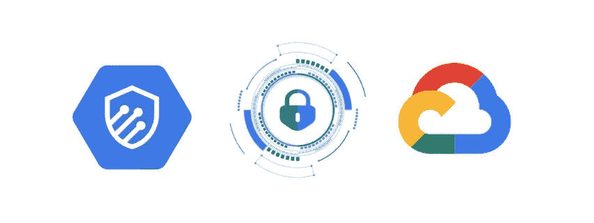

# 用云装甲保护 GKE 入口默认后端

> 原文：<https://medium.com/google-cloud/protecting-gke-ingress-default-backend-with-cloud-armor-53913c710bcd?source=collection_archive---------2----------------------->

来源:[https://medium . com/Google-cloud/cloud-armor-setup-and-configuration-on-gke-hosted-application-9fe 8847 A0 c0f](/google-cloud/cloud-armor-setup-and-configuration-on-gke-hosted-application-9fe8847a0c0f)

在 GKE 部署带有原生入口的 [GCLB](https://cloud.google.com/load-balancing?utm_source=google&utm_medium=cpc&utm_campaign=emea-be-all-en-dr-skws-all-all-trial-p-gcp-1011340&utm_content=text-ad-none-any-DEV_c-CRE_564600988558-ADGP_Hybrid%20%7C%20SKWS%20-%20PHR%20%7C%20Txt%20~%20Networking%20~%20Cloud%20Load%20Balancing-KWID_43700067795126610-aud-488003287395%3Akwd-11477981-userloc_1012229&utm_term=KW_load%20balancing-NET_g-PLAC_&gclid=Cj0KCQiA-oqdBhDfARIsAO0TrGGAvMmtFL6LaSKxr8febsdhsn-_uOXJw4Zhwn75_4myoXBgMpRh2RUaAs9TEALw_wcB&gclsrc=aw.ds) (谷歌云负载均衡器)(又名 [gce-ingress](https://cloud.google.com/kubernetes-engine/docs/concepts/ingress) )时。根据入口对象中配置的规则，会自动为您添加一个默认后端。这个默认后端的目的是在请求与配置的规则不匹配时处理流量路由。让我们以这个入口为例: