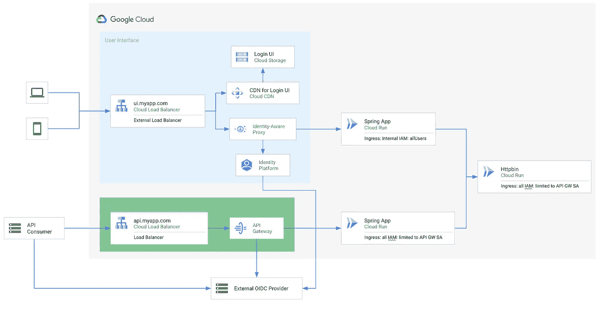

# 使用 API 网关和身份感知代理保护您的云应用

> 原文：<https://medium.com/google-cloud/protecting-your-application-on-cloud-run-with-api-gateway-and-identity-aware-proxy-712c237916b0?source=collection_archive---------2----------------------->


照片由[蒂姆·哈弗纳](https://unsplash.com/@huefnerdesign?utm_source=unsplash&utm_medium=referral&utm_content=creditCopyText)在 [Unsplash](https://unsplash.com/s/photos/guard?utm_source=unsplash&utm_medium=referral&utm_content=creditCopyText) 拍摄

我是无服务器的忠实粉丝。我对托管基础设施的关心越少，我就越开心。因为我可以把更多的时间放在为用户创造价值上。但是，由于我总是关注安全性，这也让我安心地知道，我的服务位于别人为我维护的安全层之后。就我个人而言，我喜欢使用平台特性来保护服务对服务的通信。在服务网格中，mTLS 是解决这一问题的最佳选择。在云运行中，我们可以依靠 Google Cloud IAM 为我们提供这种级别的安全性。

在使用身份识别代理 (IAP)的 Google Cloud 中，有一个很好的解决方案可以保护您的 web 应用程序免受不希望的访问。类似地， [API Gateway](https://cloud.google.com/api-gateway) 是一个很好的、轻量级的 API 公开选项。它负责为您验证 JWT 令牌，并且可以安全地集成到您的堆栈中，这要感谢 Google IAM。不过，将 IAP 和 API Gateway 结合起来可能会很有挑战性。在这篇文章中，我们将一起经历必要的步骤，你将需要一些关于 [Spring](https://spring.io/) 和 Spring Security 的经验。您可以从带有一些 OAuth 依赖项的 Spring 应用程序开始。我在这里放了一个完整的部署示例和 Terraform:

[](https://github.com/cgrotz/blog-examples/tree/main/lb_apigw_spring_boot_example) [## 主 cgrotz/blog-examples 上的 blog-examples/lb _ API GW _ spring _ boot _ example

### 在您的 GCP 项目中启用身份平台 https://console . cloud . Google . com/customer-Identity/on boarding 创建一个…

github.com](https://github.com/cgrotz/blog-examples/tree/main/lb_apigw_spring_boot_example) 

## 向 Spring Boot 应用程序添加身份识别代理

让我们从在应用程序中添加对 IAP 的支持开始。IAP 通过`x-goog-iap-jwt-assertion`头提供登录令牌。该报头包含由 IAP 签名的 JWT。因此，让我们从在应用程序中添加 JWT 验证开始。

```
spring:
  security:
    oauth2:
      resourceserver:
        jwt:
          issuer-uri: [https://cloud.google.com/iap](https://cloud.google.com/iap)
          jwk-set-uri: https://www.gstatic.com/iap/verify/public_key-jwk
```

并在`securityFilterChain`中配置不同的表头名称:

```
http
    .oauth2ResourceServer()
        .bearerTokenResolver(**new** HeaderBearerTokenResolver("x-goog-iap-jwt-assertion"));
```

现在，我们的应用程序已经准备好接受和验证 IAP 令牌。

## 向 Spring Boot 应用程序添加 API 网关支持

现在添加 API 网关支持应该很容易。我们需要将`issuer-uri`和`jwk-set-uri`配置添加到`application.yaml`中。

```
spring:
  security:
    oauth2:
      resourceserver:
        jwt:
          issuer-uri: <issuer-uri>
          jwk-set-uri: <jwk-set-uri>
```

当然，我们还需要一个 API Gateway 的令牌解析器，因为 API Gateway 通过`x-forwarded-authorization`头提供原始的登录令牌。自定义 BearerTokenResolver 可能如下所示:

```
http
    .oauth2ResourceServer()
        .bearerTokenResolver(**new** HeaderBearerTokenResolver("x-forwarded-authorization"));
```

## 组合 API 网关和身份感知代理

遗憾的是，目前我们不能简单地将这两种选择结合起来。Spring Security OAuth 一次只支持一个 JWT 身份提供者配置。但是我们可以在`SecurityFilterChain`中组合`BearerTokenResolver`和 init 自定义`AuthenticationManagerResolver`。

```
[@Bean](http://twitter.com/Bean)
  public SecurityFilterChain filterChain(HttpSecurity http) throws Exception {
    JwtDecoder decoder1 = createJwtDecoder(issuerUri, jwksUrl);
    JwtDecoder decoder2 = createJwtDecoder("[https://cloud.google.com/iap](https://cloud.google.com/iap)",
        "[https://www.gstatic.com/iap/verify/public_key-jwk](https://www.gstatic.com/iap/verify/public_key-jwk)");
    JwtAuthenticationProvider provider1 = new JwtAuthenticationProvider(decoder1);
    JwtAuthenticationProvider provider2 = new JwtAuthenticationProvider(decoder2);
    JwtIssuerAuthenticationManagerResolver authenticationManagerResolver =
        new JwtIssuerAuthenticationManagerResolver(context -> {
          if (context.startsWith(issuerUri)) {
            return provider1::authenticate;
          } else if (context.startsWith("[https://cloud.google.com/iap](https://cloud.google.com/iap)")) {
            return provider2::authenticate;
          } else {
            throw new RuntimeException("Unsupported Issuer " + context);
          }
        });http
        .authorizeHttpRequests(authorize -> authorize
            .anyRequest().authenticated()
        )
        .oauth2ResourceServer(oauth2 -> oauth2
            .authenticationManagerResolver(authenticationManagerResolver)
        );
    return http.build();
  }private JwtDecoder createJwtDecoder(String issuer, String jwkSetUri) {
    OAuth2TokenValidator<Jwt> jwtValidator = JwtValidators.createDefaultWithIssuer(issuer);
    NimbusJwtDecoder jwtDecoder = NimbusJwtDecoder.withJwkSetUri(jwkSetUri)
        .jwsAlgorithm(SignatureAlgorithm.ES256)
        .jwsAlgorithm(SignatureAlgorithm.RS256)
        .build();
    jwtDecoder.setJwtValidator(jwtValidator);
    return jwtDecoder;
  }
```

此外，这两个选项的标记格式不同。IAP 将从原始令牌中提取定制声明，并将它们放在`gcip`声明中。这导致不同格式的身份验证对象。我们当然可以用一个自定义的`Converter<Jwt, AbstractAuthenticationToken>`来协调这一点(你可以在链接的源代码中获得完整的例子)。

## 调用其他服务

在调用其他服务时，我们也希望使用 IAM 来保护服务到服务的流量。这意味着我们需要放置用户的上下文，例如原始的 JWT，其中调用应该在有效载荷或报头中进行。在 Spring 中，我们可以简单地定制`RestTemplate` ，使用`RestTemplateCustomizer`并添加一个拦截器来添加 IAM 令牌。

```
interceptors.add((request, body, execution) -> {
      // This behaviour could also be limited to the .a.run.app domain to only forward the Identity Token to other Cloud Run services
      GoogleCredentials adCredentials = GoogleCredentials.getApplicationDefault();
      if (adCredentials instanceof IdTokenProvider) {
        IdTokenProvider idTokenProvider = (IdTokenProvider) adCredentials;
        IdToken idToken = idTokenProvider.idTokenWithAudience(
            "https://" + request.getURI().getHost(), null);
        request.getHeaders().add(HttpHeaders.AUTHORIZATION, "Bearer " + idToken.getTokenValue());
      }
      return execution.execute(request, body);
    });
```

## 部署解决方案



该示例的架构

目前，有几个因素使得部署变得复杂:

1.  API 网关流量不被视为来自云运行的内部流量，因此由 API 网关提供的云运行服务需要配置`ingress all`。当然，当设置`ingress all`时，您希望在您的云运行服务前获得 IAM 授权。
2.  IAP 流量被认为是负载平衡器流量，因此您可以设置`ingress internal+loadbalancing`，但是它要求您将`roles/run.invoker`设置为`allUsers`

这两种配置是出于相互排斥的安全考虑。您希望在您的服务前面至少有一层保护。最简单的解决方案是，用不同的配置部署两次微服务。

如果您不想这样做(或者由于某些组织政策/约束无法这样做)，您也可以考虑使用基于 [envoy](https://www.envoyproxy.io/) 的反向代理作为负载平衡器的后端，该负载平衡器托管在 IAP 负载平衡器的虚拟机或托管实例组上，而不是使用无服务器网络端点组。代理可以将身份令牌添加到您的请求中，允许您统一部署所有云运行服务，将入口设置为 all，并将 IAM 限制为某些服务帐户。您可以在此找到特使配置的示例:

[](https://github.com/cgrotz/blog-examples/tree/main/envoy-cloudrun-proxy) [## blog-examples/envoy-cloud run-proxy at main cgrotz/blog-examples

### 这是一个简单的特使代理示例，它在云运行服务前充当反向代理。代理人…

github.com](https://github.com/cgrotz/blog-examples/tree/main/envoy-cloudrun-proxy) 

因此，这就完成了在前面有 API Gateway 和 IAP 的云上托管 Spring Boot 应用程序的小小尝试。