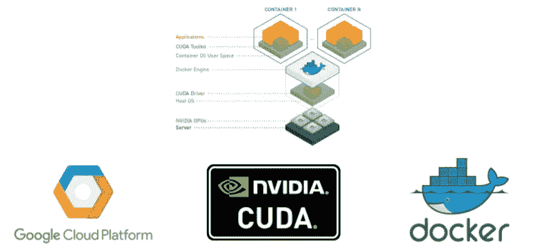

# 在谷歌计算引擎上提供基于 Docker 的深度学习工作空间

> 原文：<https://medium.com/google-cloud/provisioning-a-docker-based-deep-learning-workspace-on-google-compute-engine-e4f8d7182da6?source=collection_archive---------2----------------------->

处理图像分类或对象检测等计算机视觉问题需要大量计算能力(内存、GPU 等)。大多数情况下，您在本地机器上没有这种能力，因此需要为基于云的工作区提供所有必要的资源。

每个深度学习实验/项目都有自己的环境和依赖关系。这就是为什么我通常把它们打包成 Docker 图像。在可复制性方面帮助很大。

在这种情况下，我们所需要的是一个预先配备了 GPU 和正确配置的 CUDA 驱动程序、docker 和 NVIDIA docker 的虚拟机。

下面的脚本展示了如何创建一个 Google 计算引擎实例，通过一个启动 shell 脚本安装上述所有工具。

**create-instance.sh** 脚本使用 **gcloud** 创建一个新的计算引擎实例。它使用 [**启动脚本**参数](https://cloud.google.com/compute/docs/startupscript)来指定启动时将运行的 **startup.sh** (22)。这个脚本只运行一次，安装 docker(5–10)，CUDA(12–24)和 NVIDIA-docker(26–32)。

就这样，不再需要 apt-get 或 pip 安装。只需 SSH 进入虚拟机并启动您的容器！