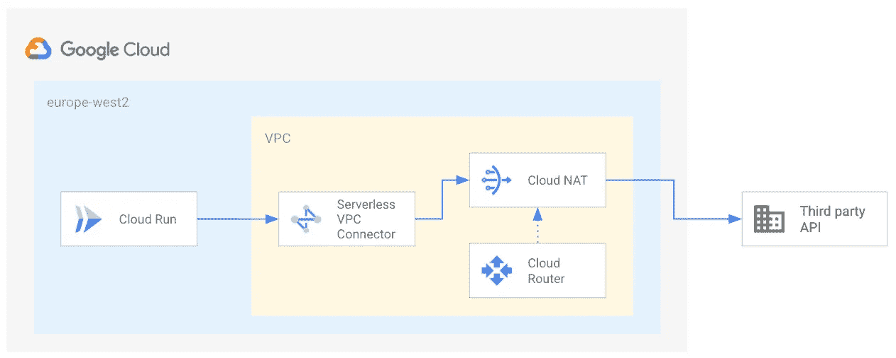
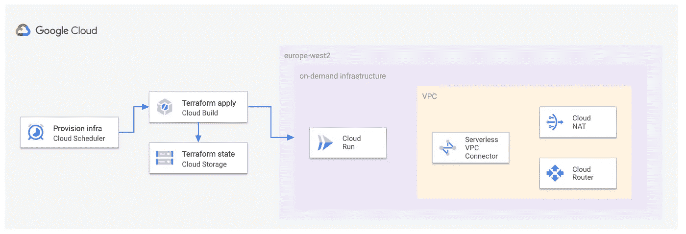

# 使用 Terraform 通过云 NAT 配置云运行

> 原文：<https://medium.com/google-cloud/provisioning-cloud-run-with-cloud-nat-using-terraform-e6b8d678eb85?source=collection_archive---------0----------------------->

我经常忙于一些兼职项目。其中一些只是一次性的实验，其他的是长期的爱好项目。然而，我所有的个人项目都有一个共同的要求——不要花费我太多的血汗钱！大家都喜欢便宜吧？

因此，我的大多数个人项目倾向于无服务器工具是有道理的；对于小规模、低流量的项目，使用无服务器选项通常要便宜得多。此外，谷歌云提供了一个慷慨的[免费层](https://cloud.google.com/free)，其中包括免费的无服务器选项配额，如云运行、云功能、云存储、BigQuery、Firestore、云构建等等。你可以用这些工具覆盖很多地方。

## 问题是

我目前正在做的一个项目使用 Cloud Run 与一个有地理限制的 API 进行交互。具体来说，您只能从定义的国家列表中访问 API。我在英国工作，很高兴英国是允许的国家之一。因此，我所要做的就是在欧洲-西方 2(伦敦)地区部署云运行服务，一切都应该工作。对吗？

*错了。*API 提供者使用 [Maxmind](https://www.maxmind.com/) 将源 IP 地址转换成地理位置。云运行外部 IP 地址来自一些未指定的 IP 地址池，这些 IP 地址在美国*注册*。不幸的是，Maxmind 对 IP 地址的地理定位查询因此解析到了美国，尽管托管云运行服务的实际机器位于英国。因此 API 拒绝了我的请求。非常沮丧。

现在，可以说这是 Maxmind 的错误行为。然而，我认为与其打开这个棘手的问题，还不如解决它…

## 解决方案:无服务器 VPC 连接器+云 NAT

云通过云 NAT 运行出口

解决方案是通过[云 NAT](https://cloud.google.com/nat/docs/overview) 发送云运行出口流量。这样，IP 地址地理位置将解析到 NAT 所在的任何区域。但是，为了使用云 NAT，我们首先需要使用[无服务器 VPC 接入连接器](https://cloud.google.com/vpc/docs/configure-serverless-vpc-access)将 Cloud Run 连接到我们的 VPC 网络。

[静态出站 IP 地址](https://cloud.google.com/run/docs/configuring/static-outbound-ip)文档很好地解释了这个过程。(注意，在我的例子中，我不需要静态 IP，我只需要 IP 来自特定地区)。总结一下，在你想要的地区(对我来说是欧洲-西方 2):

1.  创建无服务器 VPC 访问连接器
2.  创建云路由器(这将对 NAT 网关进行编程)
3.  创建 NAT 网关
4.  部署云运行服务，配置为通过连接器路由所有出口流量

## 使用 Terraform 实现自动化供应

我相信你会记得我喜欢便宜的东西。无服务器 VPC 连接器本质上是一个虚拟机，你可以从[的定价](https://cloud.google.com/vpc/docs/configure-serverless-vpc-access#pricing)中看到。虽然它并不贵，但它却是“永远在线”的——因此会增加成本！—即使云运行服务长时间处于闲置状态。云 NAT 网关也是如此。鉴于我的云运行服务只在营业时间调用第三方 API，让连接器和 NAT 整天运行没有太大意义。

因此，下一个逻辑步骤是按需创建连接器、NAT 和相关资源。当然，我们需要自动创建这些资源 Terraform 总是一个合理的起点。Google Cloud Terraform provider 支持所有这些资源，所以让我们看看 Terraform 配置是什么样子的:

## 使用云调度程序和云构建触发配置

我现在可以使用 Terraform 以自动化和可重复的方式创建我的云运行服务、VPC 连接器和云 NAT 资源。拼图的最后一块是根据我定义的时间表创建和销毁资源。例如，我可能想在早上创建资源，并在工作日结束时销毁它们。这样，资源只有在实际使用时才花费我的钱。

正如您可以从前面的图表中看到的，我使用云调度程序和云构建来实现这一点。我使用云构建来执行 Terraform 命令，云调度程序根据我定义的时间表触发构建。

下面是一个简单的云构建配置，它执行了 *terraform apply* 命令。

您可以创建一个云构建触发器来按计划执行构建。这将创建一个启动构建的云调度程序作业，以及一个具有调用构建的适当权限的服务帐户。更多细节请参考[计划构建](https://cloud.google.com/cloud-build/docs/automating-builds/create-manual-triggers)文档。

## 结论

这篇文章演示了如何使用 Terraform 来自动创建云运行服务，该服务通过云 NAT 网关引导出口流量。通过云 NAT 引导出口流量确保了由云运行服务发出的请求可以被地理定位到特定区域。按需创建和销毁资源可确保非无服务器资源(如云 NAT 和 VPC 无服务器连接器)不会处于不必要的闲置状态，从而降低成本。

所有这些都是使用棒极了的 Google Cloud 无服务器工具构建的！