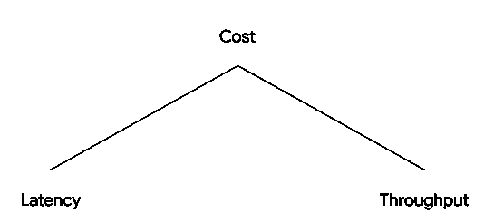

# 通过批处理和流量控制设置微调发布/订阅性能

> 原文：<https://medium.com/google-cloud/pub-sub-flow-control-batching-9ba9a75bce3b?source=collection_archive---------0----------------------->

[Google Cloud Pub/Sub](https://cloud.google.com/pubsub/docs/overview) 经常被用作大规模流媒体分析管道的事件消化和交付服务。当设计具有下游依赖性的大规模管道时，当在您的服务中使用云发布/订阅时，重要的是要考虑发布者**批处理**和订阅者**流量控制**属性，以在 ***成本*** *、* **、*延迟*** 、和 ***吞吐量*** 之间找到正确的平衡。在本文的上下文中，延迟是指下游依赖项接收发布的数据所需的时间，而吞吐量是指每秒发布的消息数。

# 定量

在 Cloud Pub/Sub 的上下文中，[批处理](https://cloud.google.com/pubsub/docs/publisher#batching)是指由[发布者](https://cloud.google.com/pubsub/docs/overview#publisher-subscriber-relationships)在单个发布请求中发布到主题的一个或多个消息的组。批处理在[客户端库](https://cloud.google.com/pubsub/docs/reference/libraries)中默认完成，或者由用户明确完成。此功能的目的是允许更高的消息吞吐量，同时也为消息通过服务的各个层提供更有效的方式。调整批量大小(即在发布请求中发送多少消息或字节)可用于实现所需的吞吐量水平。

理想情况下，如果不考虑成本，并且满足用例需求，可以在禁用批处理的情况下按需创建发布者的实例。这通过水平扩展发布者的数量来最小化延迟并最大化吞吐量。

*注意:1000 字节是最小的请求大小，因此如果请求小于 1000 字节，出于成本考虑，将向上舍入到 1000 字节。*

然而，在大多数情况下，成本是一个考虑因素，因此在单个发布请求中发送多条消息是用较少的发布者达到同等吞吐量的一种方法。由于消息将被保留以填充批，这可能会导致延迟增加。

## 批处理功能

特定于发布者端批处理的特性包括`setElementCountThreshold()`、`setRequestByteThreshold()`和`setDelayThreshold()`，作为发布者客户端`setBatchSettings()`的一部分(不同客户端库中的命名略有不同)。这些特性可以用来微调批处理的行为，以便在*成本、延迟、*和*吞吐量之间找到更好的平衡。*

`setElementCountThreshold()`和`setRequestByteThreshold()`通过指定消息或字节的最大数量来控制发布请求的最大大小。目标是在高吞吐量和与处理高吞吐量所需的订户资源相关联的成本之间找到正确的平衡。

*注意:单次批量发布的最大消息数为 1000 条或 10 MB。*

`setDelayThreshold()`提供了控制发送批处理前等待时间的灵活性，特别是关于为填充批处理而保存消息的时间。减小该值可改善延迟，而增大该值可增加填满整个批次的可能性，适用于对延迟不太敏感的应用。

这些批处理属性的示例可在[发布批处理设置](https://cloud.google.com/pubsub/docs/samples/pubsub-publisher-batch-settings)文档中找到。

# 流控制

数据管道经常会收到发布流量中的零星峰值，这可能会使订户不知所措，难以跟上。对于订阅中发布的高吞吐量，通常的反应是动态地自动调整订阅方资源，以使用更多的消息。但是，这可能会产生不必要的成本，例如，您可能需要使用更多的虚拟机，从而导致额外的容量规划。

[订户端的流量控制](https://cloud.google.com/pubsub/docs/pull#config)功能允许订户调节接收消息的速率，从而有助于控制管道上这些任务的不健康行为。这些特性提供了额外的功能来调整服务对发布吞吐量的突然峰值或下降的敏感程度。这减少了与自动扩展相关的不必要成本，以维持更高的吞吐量。

理想情况下，具有无限订户容量的服务可以通过在订户资源上水平扩展来最小化延迟和最大化吞吐量。然而，在大多数服务受用户容量限制的情况下，流量控制允许用户定义用户容量。这些流量控制功能可用于在吞吐量和端到端延迟之间找到最佳平衡。

## **流量控制特性**

有助于调整订户上的流量控制和其他设置的一些特性有`setMaxOutstandingElementCount()`、`setMaxOutstandingRequestBytes()`和`setMaxAckExtensionPeriod()`(同样，不同客户端库中的命名略有不同)。

`setMaxOutstandingElementCount()`和`setMaxOutstandingRequestBytes()`是订户客户端上`setFlowControlSettings()`的一部分，它们设置了未被发布/订阅接收到 ack/nack 的消息的最大数量和字节。一旦达到此限制，客户端将无法提取更多的消息，直到已经提取的消息得到确认。这提供了一种将吞吐量与运行更多订阅者的相关成本相匹配的方法。

`setMaxAckExtensionPeriod()`在订阅者客户端设置发布/订阅需要等待 ack 或 n ack 的最长时间。它通过让发布/订阅在一定时间后将消息重新传递给另一个客户端，来防止消息滞留在任何一个订阅者客户端上。*发布/订阅客户端库自动对正在处理的消息调用* `*modifyAckDeadline()*` *，直到* `*setMaxAckExtensionPeriod()*` *过去，默认为 1 小时。*如果消息在此时间段内既未被确认也未被否定，则它们将过期，并有资格重新传递。

正在使用的这些设置的示例可在[订阅流量控制](https://cloud.google.com/pubsub/docs/samples/pubsub-subscriber-flow-settings)文档中找到。

# 流量控制和配料

虽然流量控制功能在订阅服务器上工作，批处理功能在发布服务器上工作，但两者都可以结合使用，以抵消不同级别的*成本、延迟、*和*吞吐量*，从而找到最能满足服务需求的平衡点。

可以按需创建发布者和订阅者的服务可以产生低端到端延迟和高吞吐量，但代价是与更多计算资源相关联的更高成本。可以考虑批处理和流量控制优化，以将云发布/订阅服务成本控制在预算内。

批处理和流量控制都是通过限制资源来优化成本，然而它们是以相反的方式实现的。批处理侧重于用更少的发布者资源提供更高的吞吐量，而流控制侧重于以吞吐量为代价减少订阅者资源。类似地，这两种功能都在延迟方面做出了妥协，延迟由资源决定，这反过来有助于降低成本。当使用这些特性时，检查用例如何从这些优化中获益是很重要的。

批处理的好处是更高的吞吐量，但是这只有在下游处理所需的订户资源能够支持时才有效。根据使用情况，可以在需要时创建订户，以最大化吞吐量并最小化端到端延迟。这是通过允许在更大的计算资源池中分配更多工作来实现的。但是，在发布的吞吐量难以预测且存在预算限制的情况下，峰值或持续的高吞吐量可能成本高昂，并会导致不健康的管道行为，从而导致不必要的延迟和对下游的影响。这种不必要的行为可以通过使用流量控制功能来缓解，方法是限制计算资源，从而限制接收消息的速率。一般来说，这样做的好处是可以控制用户对高吞吐量时期的反应，但会增加延迟。

## 消息重新传递和重复率

但是，发布者的批处理配置有一个地方会影响订阅者— *一个批处理中的所有消息都必须在该批处理的确认截止日期之前得到确认，否则整个批处理都要重新排队等待传递*。当服务器在内存中缓存单个消息确认以尝试避免重新传递时，确认消息花费的时间越长，订户就越有可能使用不同的服务器，或者服务器将重新启动并丢失状态。因此，这些未确认的批次中先前已确认消息的记录将会丢失，并可能导致更高的重复率。因为云发布/订阅保证至少一次消息传递，所以重复率预计为 0.1%。如果重复率增加超过预期值，可以做一些事情来更好地调整服务:

*   通过以更高的速率确认消息来减少确认延迟。
*   通过调整订户客户端上的`setMaxExtensionPeriod()`来增加 ack 截止时间。这给了订户更多的时间来处理消息。
*   检查代码中某些消息没有得到确认的错误。这通常是未被捕获的异常的结果。为了对此进行调试，在收到消息后立即记录消息 ID，然后在对消息调用`ack()`后立即记录消息 ID 可能会有所帮助。确保收到的所有消息都有相应的`ack()`呼叫。
*   如果消息之间的确认延迟差异很大，或者有些消息无法得到确认，则以较小的批量发布会有所帮助。小批量有助于减少将整批标记为已确认所需的消息数量。
*   如果用户确认消息太慢，则减少`setMaxOutstandingElementCount()`或`setMaxOutstandingRequestBytes()`(通常在消息拉取和消息确认之间执行多个操作时)。在相同的时间内处理更少的消息和 ack 可以防止消息过早过期和被重新传递。

总之，目标是使用 ***消息大小*******发布者吞吐量*** *和* ***订阅者处理延迟*** 来优化*成本、延迟和吞吐量。*这些优化是通过*****流量控制*** 和***批处理*** 之间的权衡组合来实现的。***