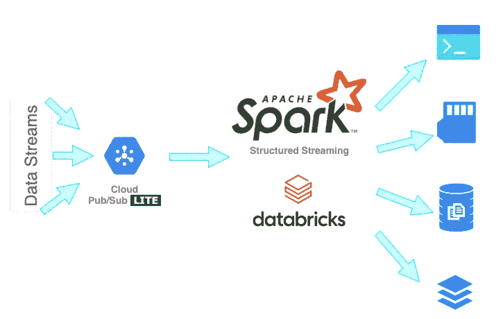
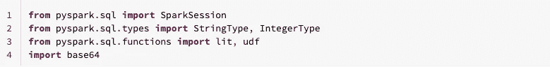
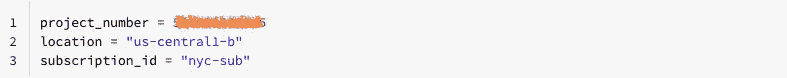
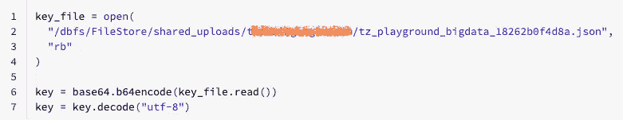
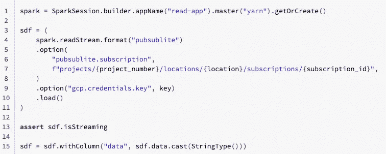
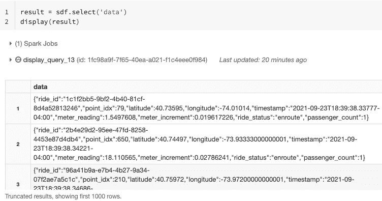
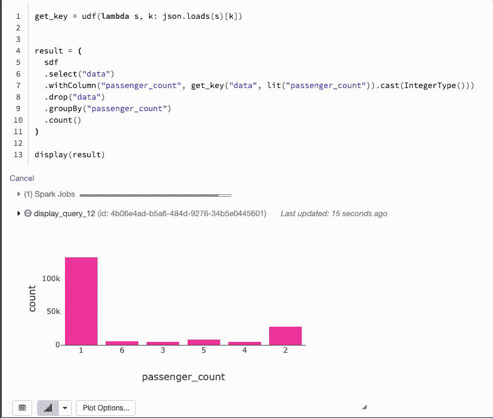
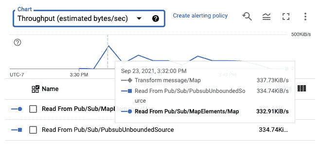

# Pub/Sub Lite 作为数据源，在数据块上提供 Spark 结构化流

> 原文：<https://medium.com/google-cloud/pub-sub-lite-as-a-source-with-spark-structured-streaming-on-databricks-facc0b5691f4?source=collection_archive---------0----------------------->

我最近在[data bricks Community Edition](https://community.cloud.databricks.com)上使用 [Pub/Sub Lite](https://cloud.google.com/pubsub/lite/docs/) 的 [Spark connector](https://github.com/googleapis/java-pubsublite-spark) 尝试了实时出租车乘车数据的流工作负载(免费)。这个连接器很容易安装。我几乎很快就用 PySpark 编写好了管道并开始运行。在这篇文章中，我将分享我的一步一步的指导，并为新的 Pub/Sub Lite 用户指出一些感兴趣的特性。

# Databricks 社区版

在[注册](https://community.cloud.databricks.com)后，熟悉左侧导航窗格。然后，

1.  创建一个集群。

    -对于**数据块运行时版本**，选择`Runtime: 6.4 Extended Support (Scala 2.11, Spark 2.4.5)`。
    -等待集群配置就绪。
    -进入**库**，点击**安装新的**。
    -选择**库源** `Upload`和**库类型** `Jar`后，删除连接器的 uber jar 及其依赖项(可从这个 Google 云存储位置`gs://spark-lib/pubsublite/pubsublite-spark-sql-streaming-LATEST-with-dependencies.jar`或 [Maven Central](https://search.maven.org/search?q=g:com.google.cloud%20a:pubsublite-spark-sql-streaming) 下载)。
2.  创建一个笔记本。

    **默认语言**可以是`Python`或`Scala`。

# 在 GCP 部署数据块

或者，前往 [GCP 市场](https://console.cloud.google.com/marketplace)并搜索`Databricks`。然后注册 14 天免费试用。按照这些步骤完成设置。

1.  创建工作区。
2.  创建一个集群。参考上面相同的集群配置来安装连接器的 jar。
3.  创建一个笔记本。

# 出租车乘车>公共/小型>火花>控制台

作为各种数据流的输入源

在我的另一篇[文章](/google-cloud/is-there-a-public-pub-sub-lite-topic-95a19ede4d6a)中，我介绍了一种使用 Dataflow Flex 模板建立出租车实时数据流的便捷方法。对于下面的演示，我使用了一个定制模板来建立一个数据流管道，将消息发布到一个发布/订阅 Lite 主题。我让管道运行了大约 15 分钟，同时对实时出租车乘坐数据流进行了一些简单的数据转换。

1.进口。

2.提供我的 GCP 项目编号、Pub/Sub Lite 订阅名称和位置。

因为我使用的是 Databricks 社区版，所以我必须将我的 GCP 服务帐户(IAM role `pubsublite.subscribe`)密钥文件上传到 Databricks 文件系统。如果您正在使用已部署的 Databricks 版本，您可以跳过这一步，因为在您第一次[设置您的帐户并创建工作空间](https://docs.gcp.databricks.com/getting-started/try-databricks-gcp.html#set-up-your-account-and-create-a-workspace)时，应该已经配置了凭证。

3.加载我的服务帐户密钥。这允许数据块通过 GCP 认证并使用发布/订阅建兴。

4.使用`readStream` API 连接到发布/订阅建兴。

5.峰值进入流输出的`data`字段。

请注意，当光标悬停在条形图上时，`"passenger_count": 3`的总计数从 4627 增加到 5295。实时图表大约每 5 秒钟更新一次。

6.观看`passenger_count`的实时更新。

我在这里使用的 Pub/Sub Lite 主题有两个分区，每个 30 GiB。它与我在同一云区域和 GCP 项目中的其他发布/订阅 Lite 主题和订阅共享发布和订阅吞吐量。当我创建我的[发布/订阅 Lite 预订](https://cloud.google.com/pubsub/lite/docs/reservations)时，我将我的吞吐量单位设置为 4。这意味着我的所有主题的总发布者吞吐量不能超过 4 MiB/s，我的总订阅者吞吐量不能超过 16 MiB/s，因为当我测试出租车乘坐数据流时，我的其他主题不活动，所以配置的容量绰绰有余。

数据流作业指标显示出租车数据以低于 400 KiB/秒的速度进入数据流管道

Pub/Sub Lite 支持[查找](https://cloud.google.com/pubsub/lite/docs/seek)到消息 backlog 的开头或结尾以及发布或事件时间戳。但是连接器还不支持 seek。这意味着您还不能从某个时间点重新启动数据流，无论是发布时间戳还是事件时间戳。如果你觉得这个功能非常有用，或者你想拥有的任何其他功能，请在这里或在[谷歌云社区](https://www.googlecloudcommunity.com/gc/forums/postpage/board-id/cloud-data-analytics)给我们留下评论或问题。也可以访问 [Buganizer](https://b.corp.google.com/issues?q=componentid:943271) 或者 [GitHub](https://github.com/googleapis/java-pubsublite-spark/issues) 正式提出公开特性请求。

感谢您的阅读！