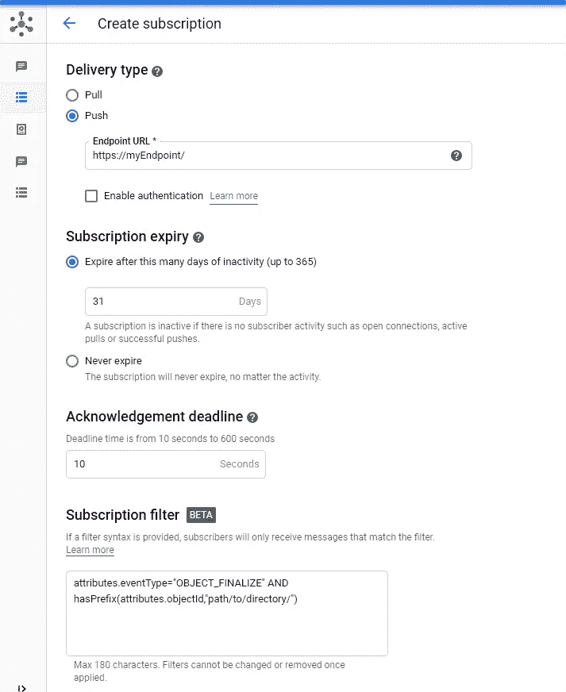

# PubSub 消息过滤器:小功能大改进

> 原文：<https://medium.com/google-cloud/pubsub-message-filter-small-feature-for-big-improvements-3d2d690b94a2?source=collection_archive---------0----------------------->


在 Google Cloud 上， [PubSub 是事件消息排队平台](https://cloud.google.com/pubsub)。**无服务器、全球化、高吞吐量**(每秒多达 100 万条消息)**负担得起、可定制重试**，PubSub 是**谷歌云上所有应用**的支柱之一。

您可以**在您的架构中使用 PubSub 作为事件总线**，并**异步触发不同的其他无服务器服务**，如 Cloud Run、Cloud Function 或 App Engine。您还可以**使用数据流** 在 [**中消费这些事件。**](https://cloud.google.com/dataflow/docs/concepts/streaming-with-cloud-pubsub)

> PubSub 上有一个解释核心行为的 Youtube 视频系列

# 缺失的特征

最近几个月，PubSub ( [推送订阅身份](https://cloud.google.com/pubsub/docs/push#authentication_and_authorization_by_the_push_endpoint)、[死信主题](https://cloud.google.com/pubsub/docs/dead-letter-topics)、[快照](https://cloud.google.com/pubsub/docs/replay-overview))中定期添加了一些功能，但还缺少一项功能:**过滤消息的功能。**

事实上，当你触发一个计算组件时，比如云运行、云功能或应用引擎，**你想调用它来做正确的工作**而不是无用消息上的**。**

# 消息过滤能力

这个特性非常简单，您现在可以根据消息属性过滤 PubSub 事件。

*   检查属性的**存在，无论其值如何**
*   检查属性的**精确值**
*   检查属性的**前缀值**
*   **二元构成(AND、OR、NOT 运算符)**这 3 个检查

您可以使用命令行或控制台来设置该过滤器。

## 限制

今天(2020 年 6 月)，**功能刚刚在测试版**中发布，有一些限制。

你**不能过滤有效载荷内容**只有属性可用。
另外，你**不能在比`hasPrefix`更复杂的表达式**上定义过滤器，比如一个[正则表达式](https://en.wikipedia.org/wiki/Regular_expression)。*此功能有助于对 blob 名称后缀进行过滤，例如，了解扩展名值。*

此外，只有 **PubSub 定义的订阅可以接受过滤器**。如果[你直接在 PubSub 主题](https://cloud.google.com/functions/docs/calling/pubsub)(命令行参数中的`--trigger-topic=<topic>`)上插入一个云函数，你还不能定义一个过滤器。
*解决方法是* [*定义云函数 HTTP*](https://cloud.google.com/functions/docs/calling/http) *(命令行参数中的* `*--trigger-http*` *)，并在其上定义一个 PubSub 推送订阅。*

最后，**不能更新滤镜**。您必须删除并重新创建带有过滤器更新的订阅。

为了解释为什么这个特性很棒，我们可以举一个最常见的用例。

> 云存储事件管理和 blob 处理

# 云存储使用案例

在这个用例示例中，您希望[执行一个加载作业，将创建到`gs://mybucket/path/to/directory/`目录中的 blob 加载到 BigQuery](https://cloud.google.com/bigquery/docs/loading-data-cloud-storage) 中。

首先，您可以[在 PubSub](https://cloud.google.com/storage/docs/reporting-changes) 上发布云存储事件，这意味着每次创建、删除、更新 blob(元数据)时，**都会有一个事件发布到 PubSub 中。**

## 没有消息过滤功能

如果没有过滤功能，问题是云存储桶上的任何事件都会发布到 PubSub 中，而不仅仅是所需目录的事件。因此，直到现在，你不得不这样

```
if (It's a blob creation) AND (it's the correct directory){
  Perform the job
}
exit
```

该流程的**问题是**

*   你必须**在你的代码**中实现检查并维护这个部分。
*   你必须**在所有需要过滤/选择的事件处理程序中重复这几行代码**。
*   **处理部分负责检查和选择**要处理的正确斑点。*不应该是它关心的事情*。
*   你的计算服务(云运行、云功能、应用引擎)被**调用，只需很短的时间就能完成**的处理。您将根据调用次数和处理时间支付**费用，四舍五入至最大值(云功能和云运行为 100 毫秒，应用引擎为 15 分钟)**

*注:云运行、云功能和 App 引擎* ***提供了慷慨的免费层*** *对于低流量，还有* ***不算任何额外费用*** *。*

## 邮件过滤器的改进

现在，云存储用例更简单了。你**可以删除校验码**和**定义一个简单的过滤器**像这样，然后调用你的`[https://myEndpoint/](https://myendpoint/i)`
比如，在控制台中



或者使用命令行

```
gcloud beta pubsub subscriptions create \
  --topic=<myTopic> \
  --push-endpoint=https://myEndpoint/ \
  --message-filter='attributes.eventType="OBJECT_FINALIZE" AND \ 
  hasPrefix(attributes.objectId,"path/to/directory/")'\
  <mySubscriptionName>
```

仅此而已。现在，只有当一个事件与过滤器匹配时，你的`https://myEndpoint/` **才会被调用，这里是在`path/to/directory`目录下创建一个文件。**

# 过滤更多以更智能地处理

在很长一段时间里，我乞求谷歌有这个功能。现在，我有了它，它简化了很多工作，减少了处理时间！

对于一个伟大的产品来说，这是一个非常好的改进。我强烈建议你试一试。