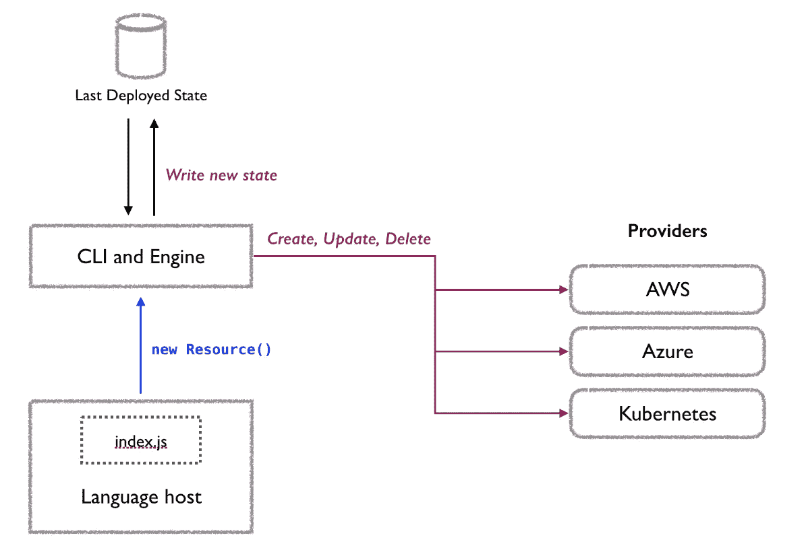
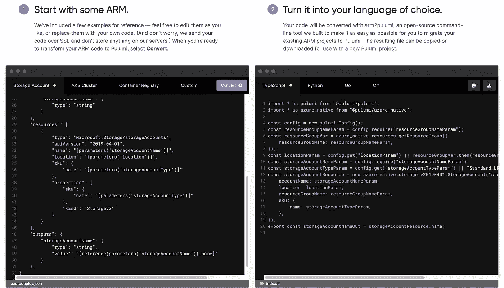
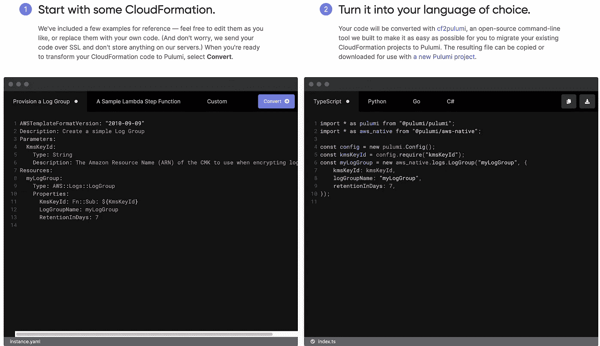
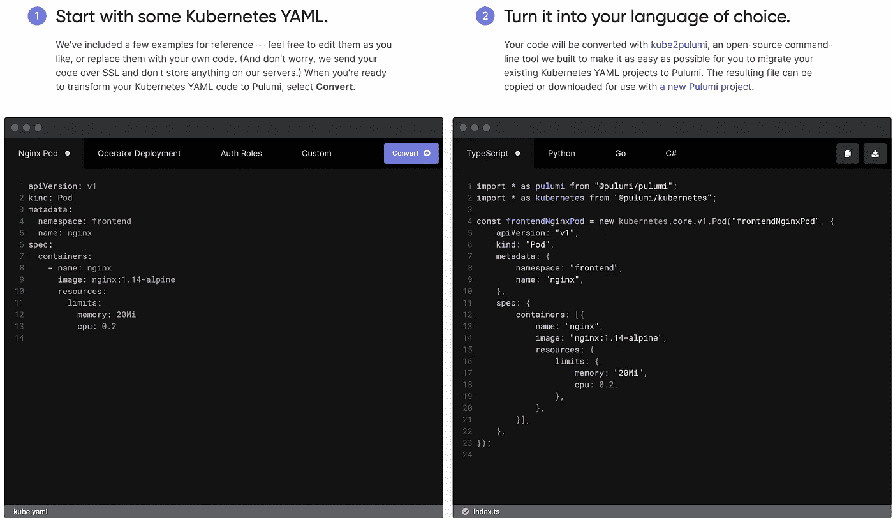
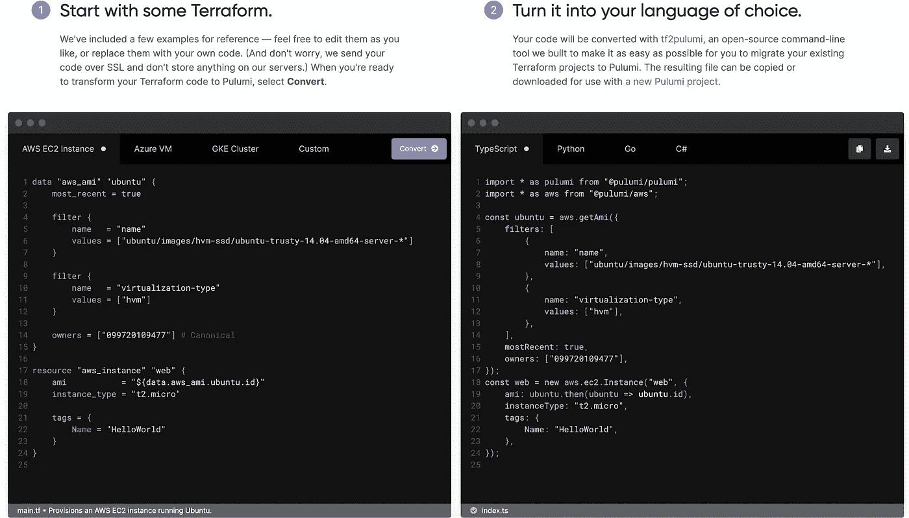

# 普鲁米转换器

> 原文：<https://medium.com/google-cloud/pulumi-convertors-ca8c712878?source=collection_archive---------4----------------------->

Pulumi 是一个很有前途的 IaC 工具，面向那些一直使用 Go、Java、C#等编程语言的核心开发人员。NET Stack)、Python、NodeJS、TypeScript，甚至像 YAML 等标记语言，用于构建服务器端或客户端(TypeScript/JavaScript)应用程序/系统。

这是 Pulumi 与市场上其他工具(如 Terraform)的主要区别，Terraform 有自己的规则，特别是在特定领域语言(terra form 的 HCL)方面。因此，在您变得高效之前，您需要花一些时间了解这些工具是如何工作的，以便开始实施过程。

使用 Pulumi，您可以用您熟悉的语言对基础设施进行编程。这意味着您可以开始编写云部署代码，而无需花费任何时间学习一门新语言。

Pulumi 使用期望的状态模型来管理基础设施。一个 Pulumi 程序由一个*语言主机*执行，为一个栈的基础设施计算一个期望的状态。*部署引擎*将该期望状态与堆栈的当前状态进行比较，并确定需要创建、更新或删除哪些资源。引擎使用一组*资源提供者*(如 [AWS](https://www.pulumi.com/docs/get-started/aws/) 、 [Azure](https://www.pulumi.com/docs/get-started/azure/) 、 [Google Cloud Platform](https://www.pulumi.com/docs/get-started/gcp/) 、 [Kubernetes](https://www.pulumi.com/docs/get-started/kubernetes/) 等)来管理个体资源。在运行过程中，引擎会使用有关已供应的所有资源以及任何未决操作的信息来更新基础架构的*状态*。



开发人员/DevOps/SRE 可能会考虑从现有的 IaC 工具(如 Terraform、ARM templates、AWS Cloud Formation、Kubernetes CRDs、Kubernetes YAMLs)迁移到 Pulumi。正是出于这个目的，Pulumi 提供了转换器，可以利用这些转换器从其他 IaC 工具转移到 Pulumi，以利用其 IaC 的代码中心性。

在这篇博客中，我将介绍 Pulumi 必须提供的以下转换器:

*   [手臂到 Pulumi](https://www.pulumi.com/arm2pulumi/)
*   [云形成到普鲁米](https://www.pulumi.com/cf2pulumi/)
*   [Kubernetes 海关资源给普鲁米](https://www.pulumi.com/blog/introducing-crd2pulumi/)
*   [YAML 到普鲁米](https://www.pulumi.com/kube2pulumi/)
*   [地形到普鲁米](https://www.pulumi.com/tf2pulumi/)

# 将模板武装到 Pulumi

如果你想把你现有的 ARM 模板转换成任何一种 Pulumi 支持的编程语言，Pulumi 提供了 https://github.com/pulumi/arm2pulumi[工具。](https://github.com/pulumi/arm2pulumi)

该工具目前托管在 https://www.pulumi.com/arm2pulumi/[并且将很快开源。](https://www.pulumi.com/arm2pulumi/)



# 自动气象站云形成到普鲁米

如果你想把现有的 AWS 云形成模板转换成 Pulumi 支持的编程语言，Pulumi 提供了 https://github.com/pulumi/pulumi-aws-native 工具。

Pulumi AWS 本机提供程序使您能够构建、部署和管理 AWS Cloud Control API 支持的任何 AWS 资源。通过 AWS Native，您可以在同一天访问所有新的 AWS 资源和云控制 API 支持的现有资源上的所有新属性。您可以从用任何 Pulumi 语言编写的 Pulumi 程序中使用 AWS Native:c#、Go、JavaScript/TypeScript 和 Python。如果您还没有安装和配置 Pulumi CLI，那么您需要安装和配置 Pulumi CLI。

> **注**
> 
> AWS 原生是在公共预览。在 AWS 本机提供程序中，目前并非所有的 AWS 资源都可用。它涵盖了 AWS Cloud Control API 和 AWS CloudFormation Registry 当前支持的所有资源。[支持资源列表](https://github.com/pulumi/pulumi-aws-native/blob/master/provider/cmd/pulumi-gen-aws-native/supported-types.txt)。
> 
> 对于新项目，我们建议同时使用 AWS Native 和 [AWS Classic](https://github.com/pulumi/pulumi-aws) ，这样您可以尽可能获得 AWS Native 的速度和正确性优势。对于现有项目，AWS Classic 仍然完全受支持；此时，我们建议等待将现有项目迁移到 AWS Native。



# CRD 到普卢米

如果你想从 Kubernetes CRD 迁移到 Pulumi，Pulumi 提供了一个工具[https://github.com/pulumi/crd2pulumi](https://github.com/pulumi/crd2pulumi)可以用来将 CRDs 转换成你选择的 Pulumi 支持的编程语言。

`crd2pulumi`是一个 CLI 工具，基于 Kubernetes CustomResourceDefinition(CRDs)生成类型化的 CustomResources。CRD 允许您通过为定制对象定义自己的模式来扩展 Kubernetes API。虽然 Pulumi 允许您创建 [CustomResources](https://www.pulumi.com/docs/reference/pkg/kubernetes/apiextensions/customresource/) ，但是以前这些对象没有强类型，因为每个模式都是自定义的。这对于像 [cert-manager](https://github.com/jetstack/cert-manager/tree/master/deploy/crds) 或 [istio](https://github.com/istio/istio/tree/0321da58ca86fc786fb03a68afd29d082477e4f2/manifests/charts/base/crds) 这样包含数千行复杂 YAML 模式的流行 CRD 来说是一个巨大的难题。通过生成 CustomResources 的类型化版本，`crd2pulumi`允许您利用现有的 IDE 类型检查和自动完成特性，从而使填写它们的参数更加方便。

`crd2pulumi`可以从 Pulumi 家酿水龙头安装在 Mac 上。

```
brew install pulumi/tap/crd2pulumi
```

`crd2pulumi`使用 Go 模块管理依赖关系。如果你想开发`crd2pulumi`本身，你需要安装 Go 来构建。一旦安装了这个先决条件，运行下面的代码来构建`crd2pulumi`二进制文件并将其安装到`$GOPATH/bin`中:

```
go build -ldflags="-X github.com/pulumi/crd2pulumi/gen.Version=dev" -o $GOPATH/bin/crd2pulumi main.go
```

# YAML 到普卢米

要将 YAMLs 转换成您选择的、Pulumi 支持的编程语言，您可以利用[https://github.com/pulumi/kube2pulumi](https://github.com/pulumi/kube2pulumi)工具。

在 Go，TypeScript，Python，C#和 Java 中将 Kubernetes YAML 转换为 Pulumi 程序。通过利用强类型、编译错误、对自动完成等特性的完全 IDE 支持来改善您的 Kubernetes 开发体验。在管理 Kubernetes 资源的同一个程序中声明和管理任何云中的基础设施。



> 注意:
> 
> `kube2pulumi`当前不处理 CustomResourceDefinitions 或 CustomResources 的转换。然而，我们的新工具`crd2pulumi`，基于您的 CRD 为资源创建强类型参数！

# Terraform 到 Pulumi

如果你想把 terraform HCL(Hashicorp 配置语言)转换成 typescript 语言，你可以利用一个叫做[https://github.com/pulumi/tf2pulumi](https://github.com/pulumi/tf2pulumi)的工具。`tf2pulumi`的目标是帮助用户有效地将 Terraform 管理的基础设施转换成 Pulumi 堆栈。它将 HCL 配置翻译成 Pulumi 类型脚本程序。在时机成熟时，它还会将 Terraform 状态文件转换为 Pulumi 检查点文件。

`tf2pulumi`可以从 Pulumi 家酿 tap 安装在 Mac 上。

```
brew install pulumi/tap/tf2pulumi
```

tf2pulumi 使用 [Go 模块](https://github.com/golang/go/wiki/Modules)来管理依赖关系。如果你想开发`tf2pulumi2`本身，你需要安装 [Go](https://golang.org/) 来进行构建。一旦安装了这个先决条件，运行下面的代码来构建`tf2pulumi`二进制文件并将其安装到`$GOPATH/bin`中:

```
go build -o $GOPATH/bin/tf2pulumi main.go
```

Go 应该会自动为您提取依赖项。

如果`$GOPATH/bin`不在您的路径上，您可能希望将`tf2pulumi`二进制文件从`$GOPATH/bin`移到您的路径上的一个目录中。

> 注意:
> 
> 虽然已经支持了大多数 Terraform 构造，但是还存在一些差距。最值得注意的是`tf2pulumi`目前不能转换置备程序块。除此之外，以下构造尚未实现:
> 
> 各种内置插值函数。对未实现函数的调用将在运行时抛出(#12)。
> 
> 多个提供程序实例和命名的提供程序。如果一个资源或数据源命名了一个提供者，那么这个引用当前被忽略(#11)。
> 
> 粮食供给商。置备程序块目前被忽略(#10)。
> 
> 数据源中的显式依赖(#1)。
> 
> `self`和`terraform`变量引用(#2)。



因此，Pulumi 转换器允许您将 ARM、CloudFormation、Kubernetes CustomResources、Kubernetes YAML 和 Terraform 转换为 Pulumi。希望这篇博客有助于理解 Pulumi 提供的从其他 IaC 工具移植而来的不同转换器工具。