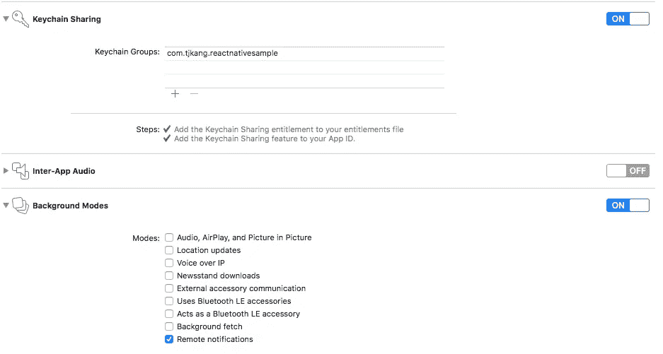
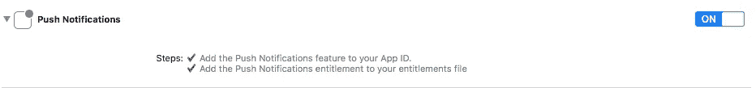
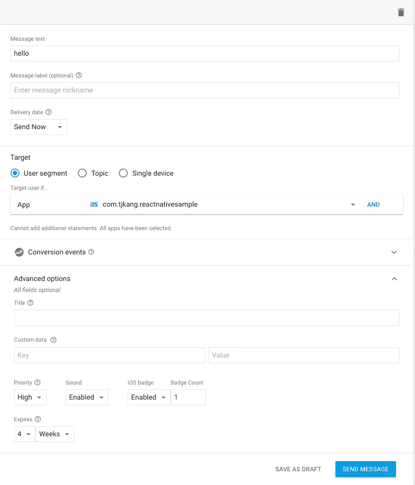
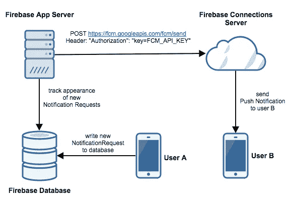
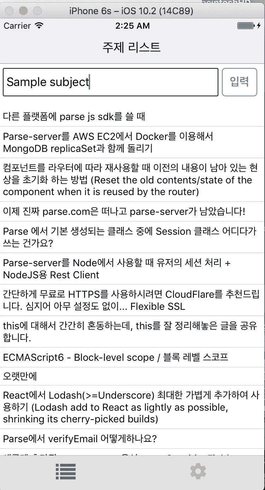
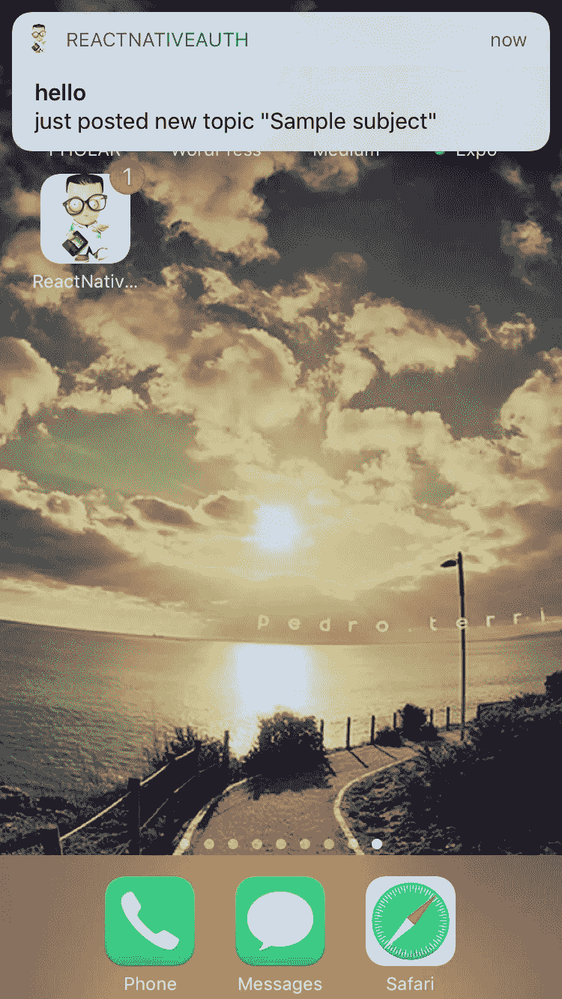
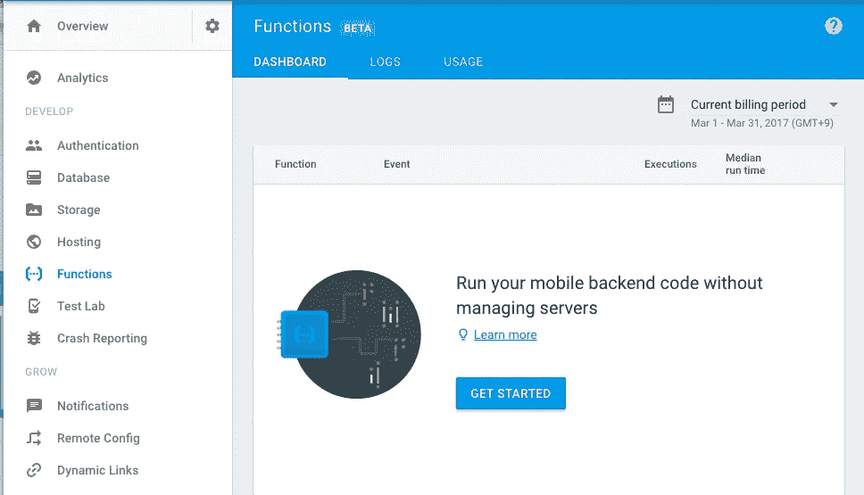
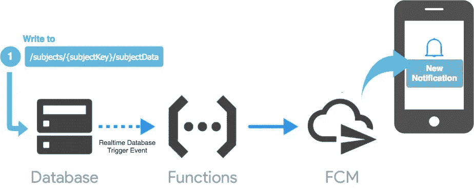
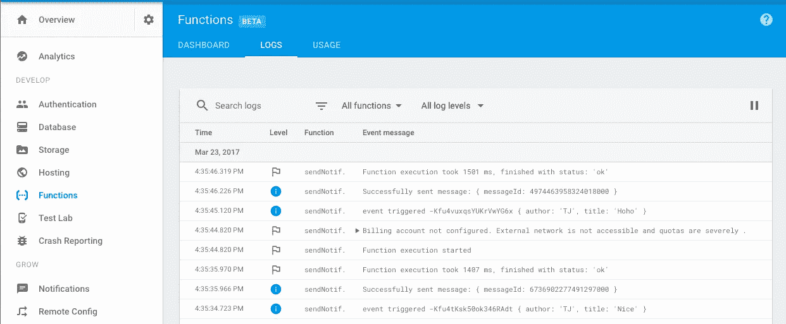

# React Native 的推送通知

> 原文：<https://medium.com/google-cloud/push-notification-for-react-native-bef05ea4d1d0?source=collection_archive---------1----------------------->

在本文中，我将向您展示如何使用 Firebase 数据库、应用服务器(GPC AppEngine)和 Firebase Cloud Messaging(FCM)为 React Native App 实现推送通知，这是一种跨平台的消息传递解决方案，可让您可靠地传递消息。最后，我还将向您展示如何为 Firebase 实现 Google 函数来运行无服务器环境。

不过，在本文中，我这次只关注 iOS for RN 应用程序。

# React Native(iOS)的推送通知设置

我将使用这个库: [**react-native-fcm**](https://github.com/evollu/react-native-fcm) ，它是一个用于 firebase 云消息传递和本地通知的模块。关于安装和配置，您可以参考此处的[获取详细信息。](https://github.com/evollu/react-native-fcm#installation)

## iOS 的配置

1.  pod 初始化

```
$> cd ios && pod init
```

2.编辑“Podfile”

```
# Uncomment the next line to define a global platform for your project
# platform :ios, '9.0'

target 'ProjecName' do
  # Uncomment the next line if you're using Swift or would like to use dynamic frameworks
  use_frameworks!

  # Pods for ProjecName
  pod 'Firebase/Messaging'

  target 'ProjecName-tvOSTests' do
    inherit! :search_paths
    # Pods for testing
  end

  target 'ProjecNameTests' do
    inherit! :search_paths
    # Pods for testing
  end

end
```

3.pod 安装

```
$> pod install 
```

> 当你在 xCode 上构建时，你必须打开 PROJECT_NAME.xcworkspace，而不是 **[***。xcodeproj]**

```
$> open ios/PROJECT_NAME.xcworkspac
```

4.认证设置

参见[https://firebase.google.com/docs/cloud-messaging/ios/certs](https://firebase.google.com/docs/cloud-messaging/ios/certs)

> *注意:您* ***必须*** *拥有一个付费的苹果开发者账户，才能在您的应用中启用推送通知。*

5.编辑 AppDelegate.h / AppDelegate.m

参见[https://github.com/evollu/react-native-fcm#shared-steps](https://github.com/evollu/react-native-fcm#shared-steps)

6.Xcode 构建设置

请参考[https://github . com/evollu/react-native-FCM # xcode-安装后步骤](https://github.com/evollu/react-native-fcm#xcode-post-installation-steps)



7.FCM 配置

= >在 [Firebase 控制台](https://console.firebase.google.com/)中，您可以获取`google-services.json`文件并将其放入`android/app`目录，获取`GoogleService-Info.plist`文件并将其放入`/ios/your-project-name`目录(在您的`Info.plist`旁边)

8.让我们编写示例代码

9.试验

一旦您完成了所有这些设置和构建项目，您就可以测试它是否能很好地从 Firebase 控制台发送测试通知。要从通知控制台发送通知，请转到 [Firebase 控制台](https://console.firebase.google.com/)，然后打开您的项目，再打开通知控制台，开始向用户段发送通知。



# 应用服务器(GPC AppEngine)实现

有两种通过 FCM 组织用户 2 用户通知发送的方法:

*   使用自己的 FCM 应用服务器实现 FCM。
*   没有 FCM 应用服务器的 FCM 实施(仅使用 React 本地应用客户端)。

考虑到安全性，不建议在没有 FCM 应用服务器的情况下实施。**为什么是**？它直接从客户端使用 FCM 连接服务器 API **，使用带有授权头的 HTTP `POST`请求，这是您的 FCM API 密钥。因此，在本文中，我将向您展示如何使用自己的 FCM 应用服务器(GPC AppEngine)来实现。最好使用 Firebase App Server，它将负责与 FCM 连接服务器进行交互。**



当用户 A 向用户 B 发送消息时

有几种方法可以向目标(或设备)发送消息。
1。发送到单个设备(*设备的注册令牌*)
2。发送到设备组(设备的*注册令牌组*)
3。发送到一个话题(*发布/订阅*模式)
4。发送到条件(组合*发布/订阅*主题)

> 详情请参考[https://firebase . Google . com/docs/cloud-messaging/admin/send-messages](https://firebase.google.com/docs/cloud-messaging/admin/send-messages)

## 方案

1)用户 A 在列表
中写入了某个*主题*2)由于列表中添加了新的主题，其他用户如用户 B 将收到推送通知

> 用户 A 和用户使用 Firebase Auth 进行身份验证。



左边的用户 A/右边的用户 B

下面是推送通知在我们的设置中的工作方式:

1.  用户“A”在列表中写下一些*主题*以及 Firebase 数据库上的*通知请求*
2.  应用服务器(GCP AppEngine)在 Firebase 数据库上跟踪新通知请求的数据
3.  对于列表中添加的新主题，应用服务器通过 FCM 向特定的**主题**发送消息。[ [**基于主题的通知**](https://firebase.google.com/docs/cloud-messaging/admin/send-messages) ]
4.  其他用户，如已订阅特定**主题**的用户‘B’，将收到我们从应用服务器发送给 FCM 的通知
    例如，RN 应用的用户将订阅 ***/topics/list***

# 从 RN 应用程序发送推送通知

**fire base 数据库的数据结构**

```
- notificationRequests
    $pushid
      from_username: "TJ"
      message: "just posted new topic"- subjects
    $pushid
      author: "TJ"
      title: "sample subject"
```

当用户“A”将“样本主题”添加到列表中时

我在这里使用数据库作为队列。RN app 将发送通知的请求写入数据库，App Server 将获取该请求并通过云消息发送通知。

# AppServer 代码

以下代码向您展示了它如何跟踪新通知的数据并将通知发送到特定的**主题**。这将是一个节点流程，运行在[谷歌应用引擎](https://cloud.google.com/nodejs/)上。节点脚本监控我们上面看到的通知队列。对于添加到该队列的每个孩子，它提取必要的信息，然后调用云消息发送来发送通知。如果成功，它将从队列中删除通知请求。

要使上面的脚本工作，您必须将 Firebase Admin SDK 添加到您的服务器中。你可以参考[这里的](https://firebase.google.com/docs/admin/setup)了解详情

# 部署到 AppEngine

现在您可以将节点代码部署到 AppEngine。具体可以参考[在谷歌云平台](https://cloud.google.com/nodejs/) *上运行 node.js。*

将应用程序部署到灵活的环境(如 Node)时，默认情况下最少有两个实例。除非另有说明，否则平台将不断产生新的实例，直到满足最低要求。

## 自动缩放

您可以在`app.yaml`文件中设置自动缩放。例如:

```
service: my-serviceruntime: nodejsenv: flexautomatic_scaling:min_num_instances: 5max_num_instances: 20cool_down_period_sec: 120 # default valuecpu_utilization:target_utilization: 0.5
```

> 详见[*https://cloud . Google . com/app engine/docs/flexible/nodejs/configuring-your-app-with-app-YAML # automatic _ scaling*](https://cloud.google.com/appengine/docs/flexible/nodejs/configuring-your-app-with-app-yaml#automatic_scaling)

# 在 RN 应用程序中接收通知

## 订阅主题

最后，当用户登录时只订阅主题，当用户注销时取消订阅主题

# 更多事情要做

上面的简单脚本中没有自动重试功能，所以当您重新启动脚本时，它只会重试失败的通知。对于一个更具可伸缩性的方法，考虑一下 [firebase-queue](https://github.com/firebase/firebase-queue) 库。如果您在服务器上使用 [firebase-queue](https://github.com/firebase/firebase-queue) ，它是一个任务队列，不断监听“**队列/任务**集合中的任务。然后，您可以让客户端设备向该集合添加发送 FCM 消息的任务，这将由您的服务器自动处理。只需确保为"**队列/任务**"集合设置适当的安全规则。

# 使用 Firebase 的云功能发送通知(测试版)

如果你想像上面那样不运行 App Server(AppEngine)就发送通知，可以直接从 Firebase 使用云功能。Cloud Functions 集成了 Firebase 平台，允许您编写代码来响应事件并调用由其他 Firebase 功能(如分析、实时数据库、身份验证和存储)公开的功能。是啊！这使得使用 Firebase 连接和扩展 google 云服务变得很容易！它刚刚发布，所以现在是测试版。

当你进入 firebase 控制台时，你会看到如下图所示的 ***功能***



现在，为云函数编写一些代码来发送通知。这和你在上面做的场景是一样的。



下面是推送通知在我们的设置中的工作方式:

1.  该函数在写入存储 subjectData 的实时数据库路径时触发。
2.  该函数通过 FCM 向特定的**主题**发送消息。
3.  FCM 向订阅了'***/topics/list '***'的用户设备发送通知消息。

首先，您必须安装 Firebase CLI

```
npm install -g firebase-tools
```

然后，初始化您的项目

```
firebase login
cd path/to/yourProject
firebase init functions
```

一旦这些命令完全成功，你的项目结构将看起来像这样。

```
myproject
 +- .firebaserc 
 |
 +- firebase.json
 |
 +- functions/     # Directory containing all your functions code
      |
      +- package.json 
      |
      +- index.js
      |
      +- node_modules/
```

编辑 functions 文件夹中的 index.js 文件

最后，使用 Firebase CLI 部署您的功能。您可以使用 Firebase 控制台查看和搜索日志。

```
firebase deploy --only functions
```



日志

就是这个！我希望这篇文章能帮助你为你的 React 原生应用实现推送通知！

# 参考

*   [http://blog . tech magic . co/firebase-cloud-messaging-for-push-notifications/](http://blog.techmagic.co/firebase-cloud-messaging-for-push-notifications/)
*   [https://firebase . Google blog . com/2016/08/sending-notifications-between-Android . html](https://firebase.googleblog.com/2016/08/sending-notifications-between-android.html)
*   [https://firebase.google.com/docs/functions/](https://firebase.google.com/docs/functions/)