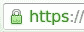

# 使用 Letsencrypt 提供的免费 SSL 证书将您的 Aurelia 应用程序放在 Google 应用程序引擎上

> 原文：<https://medium.com/google-cloud/put-your-aurelia-app-on-google-app-engine-with-free-ssl-certificates-from-letsencrypt-704de4581d4a?source=collection_archive---------0----------------------->


**编辑:2017 年 9 月 16 日** :
Google 现在在 App Engine 中有了一个非常方便的[托管 SSL 证书服务](https://cloudplatform.googleblog.com/2017/09/introducing-managed-SSL-for-Google-App-Engine.html?m=1)。
就用那个！免费的！
这篇文章的大部分内容仍然有些道理...但是一定要研究 Aurelia CLI，让事情对你自己来说更容易些。

我最近决定把我的 Aurelia 应用程序放在 Google App Engine 上，因为静态页面是免费的，只要 GAE 没有服务器。

考虑到 Aurelia 应用程序本质上是静态网页(从传统的“需要服务器端工作来生成”与“不需要服务器端工作”的角度来看)，这听起来很完美。

我还想确保我有 SSL，因为[让我们加密](https://letsencrypt.org/)提供免费的 SSL 证书，这个解决方案确实很好地结合在一起。

下面是我为使它工作而采取的步骤。这主要是笔记，以便我自己记住它，而不是全面的教程，所以祝你好运，如果你跟随我的脚步。我真的不能给你提供任何支持，但我经常在 [Aurelia Gitter](https://gitter.im/Aurelia/Discuss) 中，以 *@egeland 的身份。过来打个招呼。*

## Aurelia 应用程序必须捆绑

为了在任何地方部署应用程序，您确实需要捆绑它。我按照[这些步骤](http://www.onsentipster.com/blog/2016-02-10-tech-rewrite-aurelia.html#lessons)让我的捆绑工作。一旦你把你的应用程序导出到`export/`目录，你就准备好进入有趣的部分了。

## 必须安装 Letsencrypt

我没有包括如何设置 letsencrypt 的信息，你可以从他们的文档中找到。

# Google 应用程序引擎设置

有很多关于如何设置 GAE 的文档，所以这是我在配置方面需要的一个快速总结。

## 使用 GAE 配置文件设置您的应用程序

通过将`app.yaml`文件和 letsencrypt 的`.well-known`目录添加到`build/export.json`中，在导出中包含该文件:

```
{
 “list”: [
 “index.html”,
 **“app.yaml”,**
 “config.js”,
 “favicon.ico”,
 “robots.txt”,
 **“.well-known/acme-challenge/**”,**
// more files …
```

`**app.yaml**`应该是这样的:

```
application: my-applicationruntime: python27
api_version: 1
threadsafe: truedefault_expiration: “30d”handlers:
# re-direct to index.html if no path is given
- url: /
 static_files: index.html
 upload: index.html# get correct mimetype for acme-challenge, needed for letsencrypt
- url: /.well-known/acme-challenge/(.*)
 mime_type: text/plain
 static_files: .well-known/acme-challenge/\1
 upload: .well-known/acme-challenge/(.*)# access the static resources in the root directory
- url: /(.*)
 static_files: \1
 upload: (.*)# redefine skip_files
skip_files:
- ^(.*/)?#.*#$
- ^(.*/)?.*~$
- ^(.*/)?.*\.py[co]$
- ^(.*/)?.*/RCS/.*$
```

## 将你的应用上传到 GAE

我在应用程序的`package.json`的`scripts`部分放了两行代码:

```
“deploy”: “gulp export && appcfg.py -V v1 update export/”,
“postdeploy”: “gulp unbundle”
```

注意‘v1’可能会自动递增，这样您就可以获得 GAE 的版本/回滚功能。对于我的简单应用程序，我不关心这些，所以我只是不断地重新部署' v1 '。

使用以下命令运行部署脚本

```
$ npm run -s deploy
```

它需要运行一次，这样你就知道你的应用程序在 HTTP 上工作，在我们弄乱 SSL 和 Letsencrypt 之前。

## 设置 Letsencrypt

**配置文件(** `**cli.ini**` **):**

```
config-dir = /home/example/ssl/letsencrypt/config
work-dir = /home/example/ssl/letsencrypt/work
logs-dir = /home/example/ssl/letsencrypt/logs# make sure to use valid email and domains!
email = [myaddress@example.com](mailto:frode@onsentipster.com)
domains = site.example.comtext = True
agree-tos = True
verbose = Trueauthenticator = manual
```

**向 Letsencrypt 申请证书**

在单独的 shell 会话中，因为您需要在应用程序的会话中做一些工作，所以运行

```
$ letsencrypt certonly -c ./cli.ini
```

按照提示操作，您应该会看到如下内容:

```
Make sure your web server displays the following content at
[http://site.example.com/.well-known/acme-challenge/54W5HaD0c5ja5tWqlI09iXpXeY3GxI8Ix4FtRZFZXmY](http://admin.onsentipster.com/.well-known/acme-challenge/74W5HaD0c5ja5tWqlI09iXpXeY3GxI8Ix4FtRZFZXmY) before continuing:54W5HaD0c5ja5tWqlI09iXpXeY3GxI8Ix4FtRZFZXmY.Z9RAU1fXh5Srfn11JkM8nC-X2LWOP540MoH2JuBNJhgIf you don’t have HTTP server configured, you can run the following
command on the target server (as root):mkdir -p /tmp/letsencrypt/public_html/.well-known/acme-challenge
cd /tmp/letsencrypt/public_html
**printf “%s” 54W5HaD0c5ja5tWqlI09iXpXeY3GxI8Ix4FtRZFZXmY.Z9RAU1fXh5Srfn11JkM8nC-X2LWOP540MoH2JuBNJhg > .well-known/acme-challenge/54W5HaD0c5ja5tWqlI09iXpXeY3GxI8Ix4FtRZFZXmY**
# run only once per server:
$(command -v python2 || command -v python2.7 || command -v python2.6) -c \ 
“import BaseHTTPServer, SimpleHTTPServer; \ 
s = BaseHTTPServer.HTTPServer((‘’, 80), SimpleHTTPServer.SimpleHTTPRequestHandler); \ 
s.serve_forever()” 
Press ENTER to continue
```

将相当于粗体的行(无换行符)复制到 Aurelia 应用程序的 shell 会话中，为 Letsencrypt 创建令牌。

再次部署您的应用程序，然后测试令牌是否可用:

```
$ curl [http://site.example.com/.well-known/acme-challenge/54W5HaD0c5ja5tWqlI09iXpXeY3GxI8Ix4FtRZFZXmY](http://admin.onsentipster.com/.well-known/acme-challenge/74W5HaD0c5ja5tWqlI09iXpXeY3GxI8Ix4FtRZFZXmY)
```

如果是，很好，回到 Letsencrypt shell 会话并按 Enter 键。

如果一切顺利，您应该会收到一条高兴的消息，告诉您证书已经准备好了:

```
Congratulations! Your certificate and chain have been saved at **/home/example/ssl/letsencrypt/config/live/site.example.com/fullchain.pem**. Your cert will expire on 2016–09–21\. To obtain a new version of the certificate in the future, simply run Let’s Encrypt again.
```

## 将证书添加到 GAE

您需要准备好证书和密钥。GAE 的密钥格式不同，所以您需要转换它。

**将私钥转换成 GAE 可以阅读的形式:**

```
$ openssl rsa -inform pem -in ~/ssl/letsencrypt/config/live/site.example.com/privkey.pem -outform pem
```

上述命令将以 GAE 期望的格式输出您的密钥。

去你的谷歌应用引擎[控制台](https://console.cloud.google.com/appengine/settings/certificates)。

点击**上传新证书**，填写表单:


填写后保存！

请注意，我们使用`fullchain.pem`文件获取证书，并在中粘贴来自上述 *openssl* 步骤的私钥输出。

确保您将[自定义域](https://cloud.google.com/appengine/docs/python/console/using-custom-domains-and-ssl)设置为实际**使用**证书，保存并检查您的应用程序中是否有可爱的绿色挂锁:



啊……耶！

应该就这些吧！

祝你好运！！

## 更新

似乎通过安装`gcloud`工具包，一些 GAE 步骤现在需要稍微做些改变。

*   从您的`app.yaml`文件中删除`application: my-application`条目

运行以下命令，确保您使用 gcloud 登录

```
$ gcloud auth login
```

*   使用上传您的应用程序

```
CLOUDSDK_CORE_PROJECT=’my-application’ gcloud app deploy
```

*   其他都应该是一样的——如果我错过了什么，请告诉我！