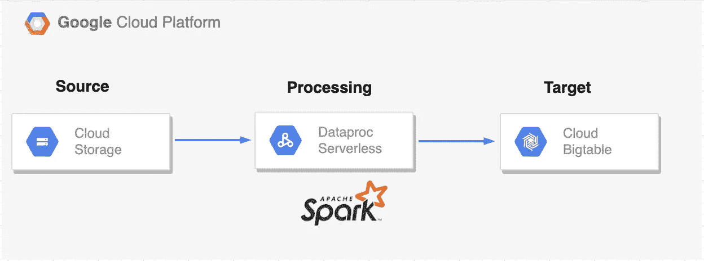

# [PySpark]将数据从 GCS 加载到 Bigtable —使用 GCP Dataproc 无服务器

> 原文：<https://medium.com/google-cloud/pyspark-load-data-from-gcs-to-bigtable-using-gcp-dataproc-serverless-c373430fe157?source=collection_archive---------2----------------------->


Google Cloud Dataproc 平台的最新功能之一， [**Dataproc 无服务器**](https://cloud.google.com/dataproc-serverless/docs/overview) ，使客户无需创建或维护集群即可运行 Spark 工作负载。一旦 Spark 工作负载参数被指定并且任务被提交给服务，Dataproc Serverless 将在后台处理所有必要的基础设施。它使开发人员能够专注于应用程序的基本逻辑，而不是花时间管理框架。


谷歌云数据平台

由于有了 [**Dataproc 模板**](https://github.com/GoogleCloudPlatform/dataproc-templates) ，我们无需从头开始创建它们，就可以使用 Java 和 Python 在 Dataproc 无服务器上运行典型用例。借助这些模板，我们可以轻松定制和运行常见的 Spark 工作负载。

如果您正在寻找一个 ***PySpark 模板来使用 Dataproc Serverless*** 将数据从 GCS 移动到 Bigtable，那么这篇博客文章会很有用。



**GCS 到云 Bigtable**

## 主要优势

*   [**GCSToBigTable**](https://github.com/GoogleCloudPlatform/dataproc-templates/tree/main/python/dataproc_templates/gcs)模板开源，配置驱动，随时可用。
*   通过简单地改变连接参数，这些模板可以相对快速地用于具有相同需求的用例。
*   这些模板本质上是可定制的。这意味着只需进行必要的代码修改，GitHub 库就可以在未来需要时被快速、轻松地克隆和利用。
*   支持的文件格式有 JSON、CSV、Parquet 和 Avro。

## 先决条件

为了运行这些模板，我们需要:

*   [Google Cloud SDK](https://cloud.google.com/sdk/docs/install) 已安装并通过认证。你可以在谷歌云控制台中使用云外壳，通过这个[链接](https://console.cloud.google.com/cloudshell/editor)获得一个已经配置好的环境。
*   Python 3.7+已安装并添加到 PATH 变量中。
*   登录到您的 GCP 项目并启用 Dataproc API，如果禁用的话。
*   请确保您已经启用了带有专用 Google 访问的子网。如果你要使用“默认”的 VPC 网络由 GCP 生成，你仍然需要启用私人访问如下


```
gcloud compute networks subnets update default --region=us-central1 --enable-private-ip-google-access
```

## 必需的 JAR 文件

提交作业时，必须提供一些 HBase 和 BigTable 依赖项。这些依赖关系必须使用-jars 标志提供，或者在 Dataproc 模板的情况下，使用 jars 环境变量。

一些依赖项(jar)必须从 [MVN 仓库](https://mvnrepository.com/)中下载，并放入您的 GCS 桶中(创建一个来存储依赖项)。

[**Apache HBase Spark 连接器**](https://mvnrepository.com/artifact/org.apache.hbase.connectors.spark/hbase-spark) **依赖关系**(已经挂载在 Dataproc Serverless 中，所以使用 file://)引用它们:

```
file:///usr/lib/spark/external/hbase-spark-protocol-shaded.jar
file:///usr/lib/spark/external/hbase-spark.jar
```

**Bigtable 依赖关系**

```
gs://<your_bucket_to_store_dependencies>/**bigtable-hbase-2.x-hadoop-2.3.0.jar**

Download it using **wget** 

[https://repo1.maven.org/maven2/com/google/cloud/bigtable/bigtable-hbase-2.x-shaded/2.3.0/bigtable-hbase-2.x-shaded-2.3.0.jar](https://repo1.maven.org/maven2/com/google/cloud/bigtable/bigtable-hbase-2.x-shaded/2.3.0/bigtable-hbase-2.x-shaded-2.3.0.jar)
```

**HBase 依赖关系**

```
gs://<your_bucket_to_store_dependencies>/**hbase-client-2.4.12.jar**

Download it using **wget** 

[https://repo1.maven.org/maven2/org/apache/hbase/hbase-client/2.4.12/hbase-client-2.4.12.jar](https://repo1.maven.org/maven2/org/apache/hbase/hbase-client/2.4.12/hbase-client-2.4.12.jar)
```

```
gs://<your_bucket_to_store_dependencies>/**hbase-shaded-mapreduce-2.4.12.jar**

Download it using **wget** 

[https://repo1.maven.org/maven2/org/apache/hbase/hbase-shaded-mapreduce/2.4.12/hbase-shaded-mapreduce-2.4.12.jar](https://repo1.maven.org/maven2/org/apache/hbase/hbase-shaded-mapreduce/2.4.12/hbase-shaded-mapreduce-2.4.12.jar)
```

## GCSToBigTable 模板要求

它使用 Apache HBase Spark 连接器写入 BigTable。

在这个模板中，您会注意到使用 Dataproc Serverless 运行 PySpark 作业有不同的配置步骤，使用 HBase 接口连接到 BigTable。

1.  用您的 BigTable 实例引用配置 [hbase-site.xml](https://github.com/GoogleCloudPlatform/dataproc-templates/blob/main/python/dataproc_templates/gcs/hbase-site.xml) ( [引用](https://cloud.google.com/bigtable/docs/hbase-connecting#creating_the_hbase-sitexml_file))。hbase-site.xml 需要在 Dataproc Serverless 使用的容器映像的某个路径中可用。为此，您需要在 GCP 容器注册中心构建并托管一个[客户容器映像](https://cloud.google.com/dataproc-serverless/docs/guides/custom-containers#submit_a_spark_batch_workload_using_a_custom_container_image)。

*   将以下层添加到 [Dockerfile](https://github.com/GoogleCloudPlatform/dataproc-templates/blob/main/python/dataproc_templates/gcs/Dockerfile) 中，以便它将您的本地 hbase-site.xml 复制到容器映像中(已经完成) :

```
COPY hbase-site.xml /etc/hbase/conf/
```

*   构建 [Dockerfile](https://github.com/GoogleCloudPlatform/dataproc-templates/blob/main/python/dataproc_templates/gcs/Dockerfile) ，构建并将其推送到 GCP 集装箱注册中心:

```
IMAGE=gcr.io/<your_project>/<your_custom_image>:<your_version>
docker build -t "${IMAGE}" .
docker push "${IMAGE}"
```

*   提交作业时，SPARK_EXTRA_CLASSPATH 环境变量也应该设置为相同的路径

```
--container-image="gcr.io/<your_project>/<your_custom_image>:<your_version>"  # image with hbase-site.xml in /etc/hbase/conf/
--properties='spark.dataproc.driverEnv.SPARK_EXTRA_CLASSPATH=/etc/hbase/conf/'
```

2.将所需的 HBase 目录 json 配置为作为参数传递(表引用和模式)。应使用-GCS . bigtable . h base . catalog . JSON 传递 hbase-catalog.json

```
--gcs.bigtable.hbase.catalog.json='''{
                    "table":{"namespace":"default","name":"<table_id>"},
                    "rowkey":"key",
                    "columns":{
                    "key":{"cf":"rowkey", "col":"key", "type":"string"},
                    "name":{"cf":"cf", "col":"name", "type":"string"}
                    }
                }'''
```

3.[创建和管理](https://cloud.google.com/bigtable/docs/managing-tables)您的 Bigtable 表模式、列族等，以匹配所提供的 HBase 目录。

## 配置参数

该模板包括以下参数来配置执行:

*   `gcs.bigtable.input.location`:输入文件的 GCS 位置(格式:`gs://<bucket>/...`)
*   `gcs.bigtable.input.format`:输入文件格式(avro、parquet、csv、json 中的一种)
*   `gcs.bigtable.hbase.catalog.json`:h 基本目录内联 json

## 执行 GCSToBigTable Dataproc 模板的步骤

1.创建一个 GCS 存储桶，用作 Dataproc 的暂存位置。这个桶将用于存储运行我们的无服务器集群所需的依赖项/ Jar 文件。

```
export STAGING_BUCKET=<gcs-staging-bucket-folder>
gsutil mb gs://$STAGING_BUCKET
```

2.克隆 Dataproc 模板存储库，并导航到 Python 模板的目录。

```
git clone https://github.com/GoogleCloudPlatform/dataproc-templates.git

cd dataproc-templates/python
```

3.获取身份验证凭据(以提交作业)。

```
gcloud auth application-default login
```

4.配置 Dataproc 无服务器作业

为了将作业提交给 Dataproc Serverless，我们将使用提供的 bin/start.sh 脚本。该脚本要求我们使用环境变量来配置 Dataproc 无服务器集群。

强制配置包括:

*   `GCP_PROJECT`:在其上运行 Dataproc Serverless 的 GCP 项目。
*   `REGION`:运行 Dataproc 无服务器的区域。
*   `GCS_STAGING_LOCATION`:一个 GCS 位置，Dataproc 将在此存储登台资产。应该在我们之前创建的桶内。

```
export GCP_PROJECT=<project_id>
export REGION=<region>
export GCS_STAGING_LOCATION=gs://$STAGING_BUCKET/staging
```

导出 jar 的环境变量。您还可以选择将 JAR 文件存储在您自己的存储桶中。

```
export JARS="gs://<your_bucket_to_store_dependencies>/bigtable-hbase-2.x-hadoop-2.3.0.jar, \
             gs://<your_bucket_to_store_dependencies>/hbase-client-2.4.12.jar, \
             gs://<your_bucket_to_store_dependencies>/hbase-shaded-mapreduce-2.4.12.jar, \
             file:///usr/lib/spark/external/hbase-spark-protocol-shaded.jar, \
             file:///usr/lib/spark/external/hbase-spark.jar"
```

5.执行 GCS 到 Bigtable Dataproc 模板

配置作业后，我们就可以触发它了。我们将运行`**bin/start.sh**`脚本，指定我们想要运行的模板和执行的参数值。

```
./bin/start.sh \
--container-image="gcr.io/<your_project>/<your_custom_image>:<your_version>" \
--properties='spark.dataproc.driverEnv.SPARK_EXTRA_CLASSPATH=/etc/hbase/conf/' \ # image with hbase-site.xml in /etc/hbase/conf/
-- --template=GCSTOBIGTABLE \
   --gcs.bigtable.input.format="<json|csv|parquet|avro>" \
   --gcs.bigtable.input.location="<gs://bucket/path>" \
   --gcs.bigtable.hbase.catalog.json='''{
                        "table":{"namespace":"default","name":"my_table"},
                        "rowkey":"key",
                        "columns":{
                        "key":{"cf":"rowkey", "col":"key", "type":"string"},
                        "name":{"cf":"cf", "col":"name", "type":"string"}
                        }
                    }'''
```

6.监控 Spark 批处理作业

提交作业后，我们将能够在 [Dataproc 批处理 UI](https://console.cloud.google.com/dataproc/batches) 中看到。从那里，我们可以查看作业的指标和日志。

## 参考

*   [Dataproc 无服务器](https://cloud.google.com/dataproc-serverless/docs/overview)
*   [Dataproc 模板库](https://github.com/GoogleCloudPlatform/dataproc-templates)

如有任何疑问/建议，请联系:**data proc-templates-support-external**@ Google groups . com