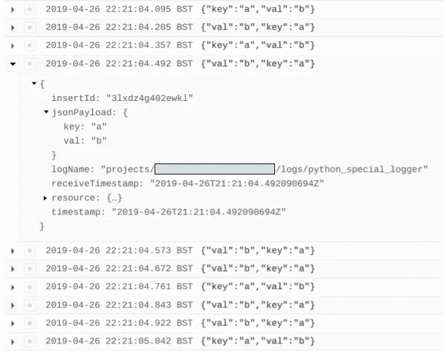
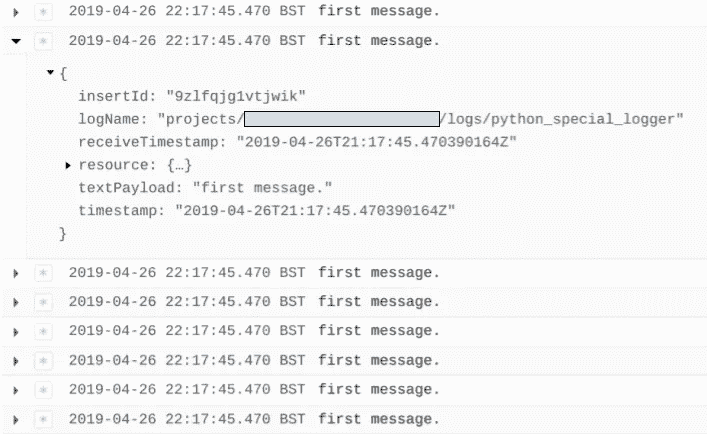
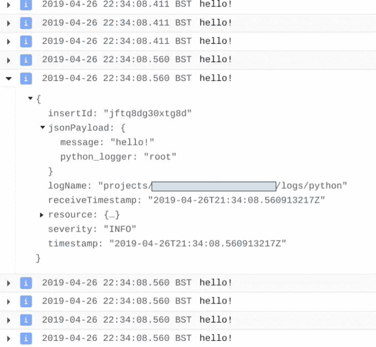
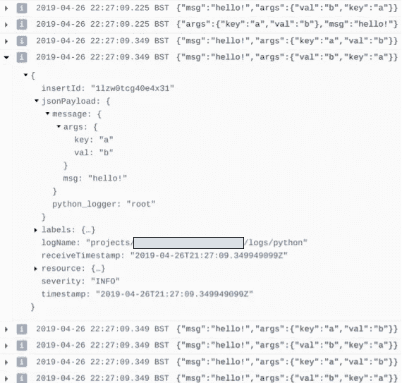

# Python 和 Stackdriver 日志记录

> 原文：<https://medium.com/google-cloud/python-and-stackdriver-logging-2ade460c90e3?source=collection_archive---------1----------------------->

# 现代测井:结构化还是文本？

现代日志记录是结构化的——JSON 或其他——在事件发生时记录事件，而不是传统的由一系列文本行组成的日志记录。这可以更好地索引、搜索和跟踪事件。

Stackdriver 支持结构化事件，但也可以管理文本。

使用 Python Stackdriver 客户端——参见此处的——您可以使用带有 Stackdriver 处理程序**的 Python 记录器，也可以使用本地 Stackdriver 记录器**。客户端的源代码可以在[这里](https://github.com/googleapis/google-cloud-python/tree/master/logging)获得。

## 先决条件

安装 google-cloud-logging pip 包，确保设置了应用程序默认凭证，并且有一个默认项目。

# 本机堆栈驱动程序记录器

使用本机 Stackdriver 日志记录器允许对发送日志进行显式控制。通过调用 log_text()和 log_struct()，您可以同步指定文本或结构化日志消息**。这允许您将记录的事件与实际事件协调起来，但是每个日志消息的**显著的性能损失**大约为 100 毫秒。**

**有一个未记录的 batch()选项可以在一个同步调用中发送多个日志条目，但这仍然很难管理。**

## **发送 100 条 JSON 消息的示例:**

```
import google.cloud.logging client = google.cloud.logging.Client() logger = client.logger('python_special_logger')                                 

for i in range(100):                                                            
    logger.log_struct({'key':'a', 'val':'b'}) 
```

**从下面可以看到，每条日志消息大约需要 100ms。总共 100 条消息大约是 **13 秒。****

****

## **批量发送 100 条短信示例:**

```
import google.cloud.loggingclient = google.cloud.logging.Client()logger = client.logger('python_special_logger')with logger.batch() as blogger:
    for i in range(100):                                                        
        blogger.log_text('first message.') 
```

**这要快得多。所有消息的时间戳都是相同的，程序花费大约 **1.4 秒**(单个请求)。但是它仍然同步发生——减慢你的程序——并且你需要小心你批处理的数量和你如何控制它。**

****

# **带有 Stackdriver 处理程序的 Python 记录器**

## **文本记录**

**按照下面的说明，将日志(普通文本日志行)从 Python 写入 Stackdriver 非常简单:**

```
import logging
import google.cloud.loggingclient = google.cloud.logging.Client()
client.setup_logging()for i in range(100):
    logging.info('hello!', {'key':'a', 'val':'b'})
```

**大约需要 **3 秒**。如果您看到下图，您可以看到许多日志消息具有相同的时间戳，但有多个批次。所以需要的时间比 1.4 秒长。**

**然而，这也是在后台线程中完成的，程序终止等待线程完成发送日志消息。所以是**异步**不阻塞主程序。**

****

**我们在日志中添加了一些额外的值，但是它没有在 Stackdriver 中被捕获。所以看起来它只是文本。**

## **自定义格式化程序— JSON 消息**

**现在，我们将使用相同的机制来记录日志，但是使用了 CustomFormatter。这将根据我们自己的逻辑格式化消息。**

**使用 Python logger，您可以在每个日志消息的基础上指定额外的参数字典。这有助于消息的格式化。通常情况下，message 是一个文本，但是这里我们将把它变成一个用于 Stackdriver 日志记录的 Python 字典。**

```
import logging
import google.cloud.loggingclient = google.cloud.logging.Client()# Custom formatter returns a structure, than a string
class CustomFormatter(logging.Formatter):
    def format(self, record):
        logmsg = super(CustomFormatter, self).format(record)
        return {’msg’: losgmsg,
                'args’:record.args}# Setup handler explicitly -- different labels
handler = client.get_default_handler()
handler.setFormatter(CustomFormatter())# Setup logger explicitly with this handler                                     
logger = logging.getLogger()
logger.setLevel(logging.INFO)
logger.addHandler(handler)

for i in range(100):
    logger.info('hello!', {'key':'a', 'val':'b'})
```

**我们使用 record . args——来自日志消息的参数——和“msg”字段作为正常格式的消息。**

**我们还在自定义处理程序上设置标签。**

**总时间仍然是大约 **3 秒。**这也在后台进行，就像文本日志一样。**

**信息不是文本，而是结构化的。**

****

# **建议**

**除非您需要同步控制——知道日志条目已经保存——否则您应该使用 Python 日志记录机制。如果您需要结构化消息，请创建适合您的应用程序的自定义格式化程序。**