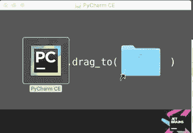
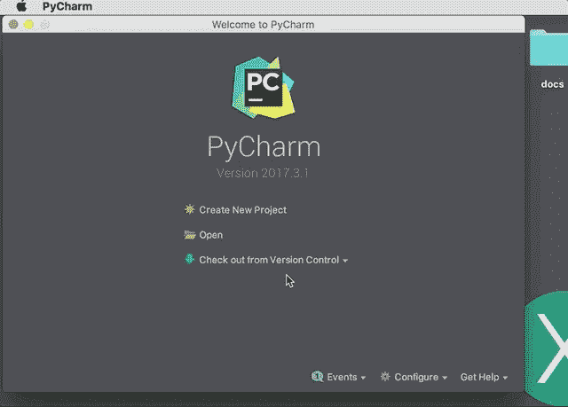
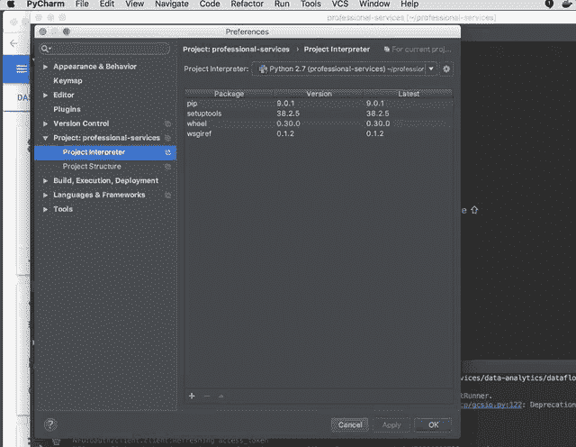
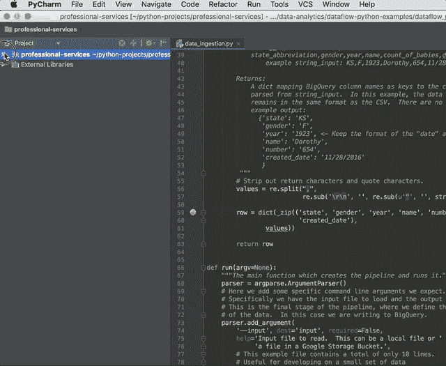
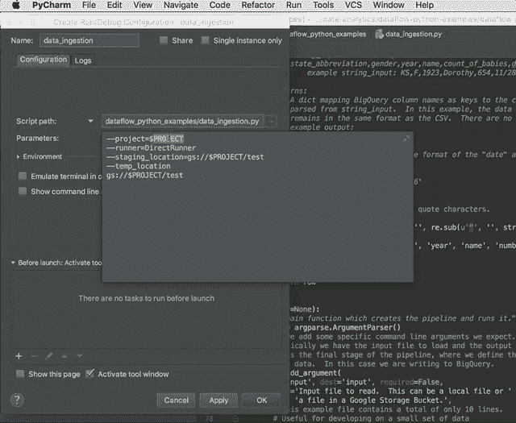
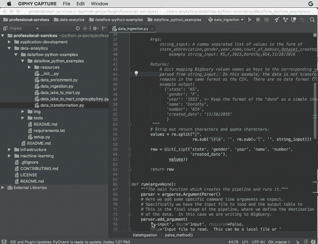
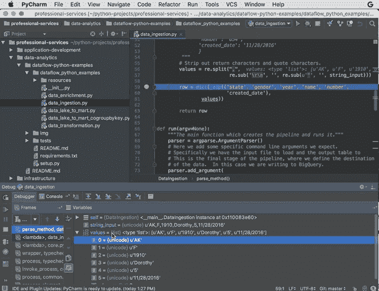
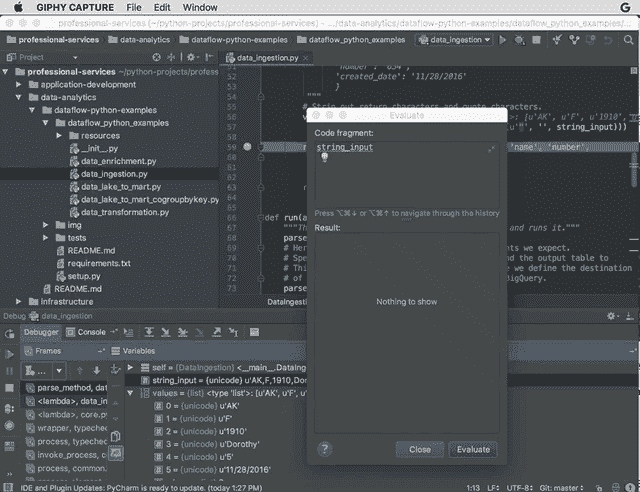

# Google 云平台上 Apache Beam 的 Python 开发环境

> 原文：<https://medium.com/google-cloud/python-development-environments-for-apache-beam-on-google-cloud-platform-b6f276b344df?source=collection_archive---------0----------------------->

这些说明将向您展示如何为 Python 数据流作业设置开发环境。最终，你将能够以调试模式在本地运行数据流作业，并在 [REPL](https://en.wikipedia.org/wiki/Read%E2%80%93eval%E2%80%93print_loop) 中执行代码，以加速你的开发周期。

# 下载并安装 Pycharm

Pycharm 是 Python 的集成开发环境(IDE)。Pycharm 有一个免费的开源版本，包含的特性包括与 git 的集成和一个不错的调试器。

1.  通过点击链接和说明[这里](https://www.jetbrains.com/pycharm/download/)，下载并安装社区版 Pycharm。



点击这里下载 Pycharm [并按照说明进行安装。](https://www.jetbrains.com/pycharm/download/)

# 结帐示例代码

1.  打开皮查姆。
2.  点击从版本控制创建项目。
3.  如果你之前已经打开过 Pycharm，你可以从下拉菜单中选择“VCS”->“从版本控制中检出”。这显示在下面的截图。
4.  在 Git 存储库 URL 中，粘贴一个指向 Google Cloud Professional 服务的链接

*Github Repo:Git 存储库 URL:*

[](https://github.com/GoogleCloudPlatform/professional-services) [## 谷歌云平台/专业服务

### 在 GitHub 上创建一个帐户，为专业服务的发展做出贡献。

github.com](https://github.com/GoogleCloudPlatform/professional-services) 

5.点击克隆



通过从 Google Cloud professional services repo 签出来创建一个新项目。

6.Pycharm 将提示您是否要打开专业服务目录。选择确定

*注意* : Pycharm 可能会提示您将“vcs.xml”文件添加到 Git 中。选择“不要再问我”和“不”。这是一个包含您对 Pycharm 的偏好的文件。一般来说，特定于 ide 的文件不会被签入版本控制，因为其他开发人员可能会使用不同的 ide。

# 设置相关性

示例代码需要 dataflow python 库才能运行。这些步骤将在 Pycharm 中建立所需的库。这有助于 Pycharm 在调用库时捕获语法错误，并允许我们以调试模式在 IDE 中本地运行脚本。

1.  选择 Pycharm ->首选项
2.  选择项目:专业服务->项目解释器
3.  点击齿轮图标->添加
4.  选择“新环境”->点击确定
5.  单击+号
6.  键入谷歌云数据流
7.  单击安装包
8.  单击确定



# 安装运行和调试配置

设置运行和调试配置将允许您在本地测试和调试管道。这通常比在数据流服务中运行更快，因为您不需要在代码运行之前等待虚拟机启动。

1.  导航至 data-analytics/data flow _ python _ examples/data _ ingestion . py
2.  右键单击 data_ingestion.py，然后选择创建 data_ingestion…
3.  选择参数

***将此粘贴到参数中并用您的项目 ID 替换＄PROJECT(或设置此环境变量)***

```
--project=$PROJECT--runner=DirectRunner--staging_location=gs://$PROJECT/test--temp_location=gs://$PROJECT/test
```



# 设置项目、时段和其它 GCP 相关性

1.  用您的项目 ID 替换$PROJECT
2.  点击确定
3.  在命令行上使用 gsutil 创建一个 bucket。您可以使用您的项目名称作为存储桶的名称。

***用你的项目 ID 替换$PROJECT(或者设置这个环境变量)***

```
gsutil mb -c regional -l us-central1 gs://**$PROJECT**
```

4.使用 gsutil 命令将文件复制到刚刚创建的 GCS bucket 中

```
gsutil cp gs://python-dataflow-example/data_files/usa_names.csv gs://$PROJECT/data_files/gsutil cp gs://python-dataflow-example/data_files/head_usa_names.csv gs://$PROJECT/data_files/
```

5.通过在命令行运行以下命令来创建 BigQuery 数据集

```
bq mk lake
```



# 设置断点并运行调试器

断点将暂停程序的执行，允许您在 REPL 中检查变量或运行代码片段。

1.  在 data_ingestion.py 的第 59 行放置一个调试点，方法是单击空白处代码的左侧
2.  通过单击 data_transformation.py 旁边的调试按钮运行
3.  通过单击“调试”按钮运行调试器



# 启动评估表达式窗口

Evaluate Expression 是 Pycharm 中的一个工具，它允许您在调试 python 脚本的过程中执行代码片段。在这个窗口中，您可以检查变量、设置变量，以及用 Python 编写的任何操作。

1.  选择运行->评估表达式
2.  Evaluate Expression 将启动一个 [REPL](https://en.wikipedia.org/wiki/Read%E2%80%93eval%E2%80%93print_loop) ，允许你在正在运行的程序中间运行任何 python 代码。



# 使用调试器—打印字符串

在“计算表达式”窗口中执行的任何打印语句都将在 Pycharm 中打印到控制台。试着打印一些变量，并在输出中看到它们。

1.  在代码片段窗口中键入 print(string_input)
2.  单击评估
3.  导航到控制台以查看打印的字符串



# 使用调试器—自动显示变量

结果，Pycharm 将始终显示“计算表达式”窗口中的最后一个变量。这甚至比打印变量更方便。在这个窗口中，您还可以像浏览树一样浏览嵌套字典这样的结构。

1.  字符串输入类型
2.  单击评估(或按 ctrl + enter)

