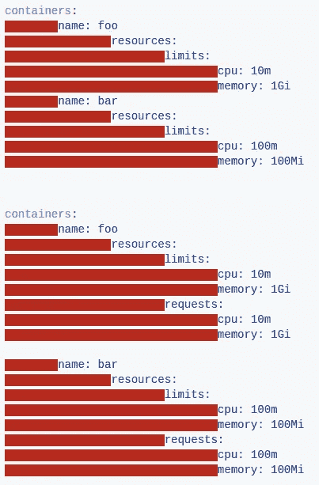
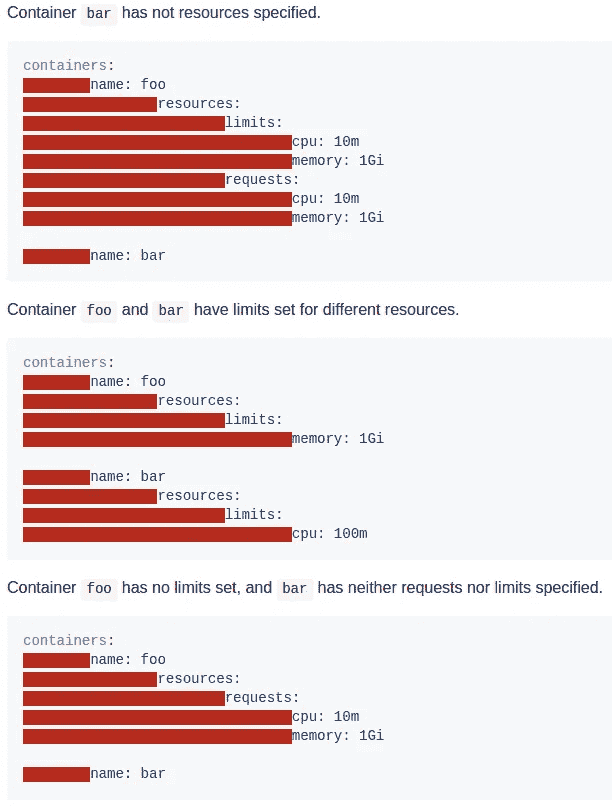
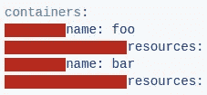

# Kubernetes 中的服务质量(QoS)等级是什么

> 原文：<https://medium.com/google-cloud/quality-of-service-class-qos-in-kubernetes-bb76a89eb2c6?source=collection_archive---------0----------------------->

Kubernetes 根据他们**的要求**和为他们设定的**限制**向 pod 提供不同等级的**服务质量**。

需要保持运行并持续良好的 pod 可以请求**保证资源**，而要求不太严格的 pod 可以使用**保证较少/没有保证的资源**。

对于每个资源，容器指定一个**请求**，这是系统将向容器保证的资源数量，以及一个**限制**，这是系统将允许容器使用的最大数量。

***调度基于请求而非限制。***

## **定义 pod 的资源约束**

***CPU***

CPU 资源以(v)核心当量来衡量。您可以用小数(例如 0.5 表示半个内核)或百万分位数(例如 500m 表示半个内核)来指定它们。

**记忆*记忆*记忆**

内存资源以字节为单位。您可以将它们指定为带有 SI 后缀(E，P，T，G，M，K)之一的小数，或者它们的 2 的幂等效值(Ei，Pi，Ti，Gi，Mi，Ki)。例如，以下代表大致相同的值:128974848、129e6、129M、123Mi。

“**请求和限制**”和“ **QoS 等级**”是紧密耦合的。

> ***如何实施请求和限制取决于资源是可压缩的还是不可压缩的。***

***可压缩资源保证:*** - Kubernetes 目前只支持 CPU。
-如果吊舱超过极限，将被节流。如果未指定 limit，则 pod 可以在可用时使用多余的 CPU。

***不可压缩资源保证:*** ——Kubernetes 目前只是支持内存。
-pod 将获得它们请求的内存量，如果它们超过它们的内存请求，它们可能会被杀死(如果一些其他 pod 需要内存)，但是如果 pod 消耗的内存比请求的少，它们将不会被杀死。
-当 pod 使用的内存超过其限制时，在 pod 的一个容器中使用最多内存的进程将被内核杀死。

如果系统运行**耗尽 CPU 或内存资源**(其中限制总和>机器容量)。 ***理想情况下，kubernetes 应该杀死不太重要的容器。***

> 对于每种资源，Kubernetes 将容器分为 3 个 QoS 等级:有保证、突发和尽力而为，按优先级降序排列。

## ***【QoS】***

豆荚被认为是 ***最优先*** 并且**保证**到**不会被杀死**直到它们超过它们的极限。

*如果为所有容器中的所有资源设置了限制和可选请求(不等于 0 ),并且它们相等，则 pod 被分类为保证。*

## 突发(服务质量)

pod 有某种形式的**最小资源保证**，但是在可用时可以使用更多的资源。在系统内存压力下，这些容器一旦超过它们的请求，并且没有尽力而为的容器存在，就更有可能被杀死。

*如果跨一个或多个容器为一个或多个资源设置了请求和可选限制(不等于 0 ),并且它们不相等，则 pod 被分类为可突发的。如果未指定限制，则默认为节点容量。*

## 尽力而为

pod 将被视为*的最低优先级。如果系统内存不足，这些 pod 中的进程会首先被杀死。但是，这些容器可以使用节点中任意数量的空闲内存。*

**如果没有为所有容器中的所有资源设置请求和限制，那么 pod 被分类为尽力而为。**

**

****ref***:[https://github . com/kubernetes/community/blob/master/contributors/design-proposals/resource-QoS . MD](https://github.com/kubernetes/community/blob/master/contributors/design-proposals/resource-qos.md)*

**