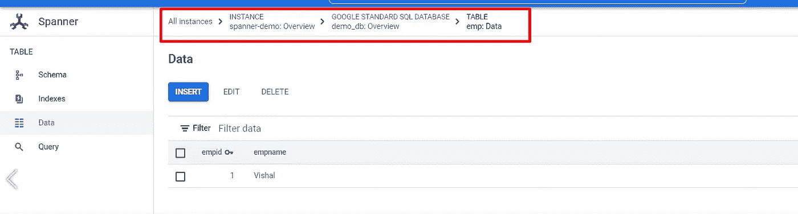
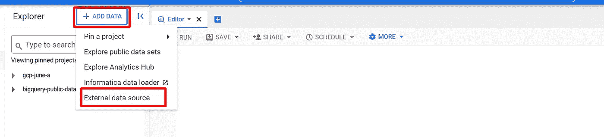
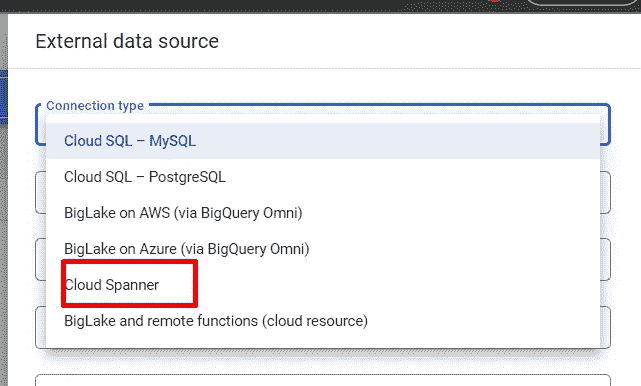
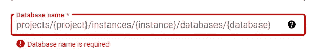
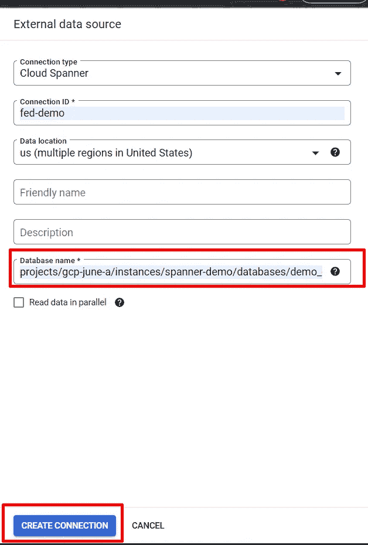
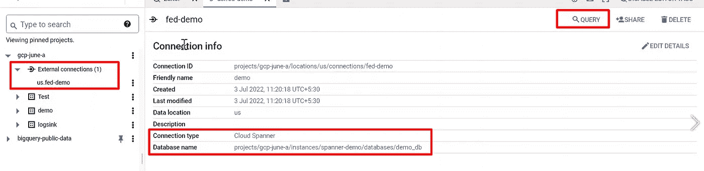
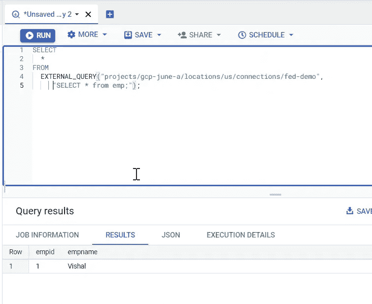

# 在 BigQuery 中使用联邦查询的查询云扳手

> 原文：<https://medium.com/google-cloud/query-cloud-spanner-using-federated-query-in-bigquery-d8eff8ec29c?source=collection_archive---------1----------------------->

**简介**

联邦查询是一种向外部数据库发送查询语句**并将结果作为临时表**返回的方式。

联邦查询使用 BigQuery 连接 API 来建立与外部数据库的连接。

在您的标准 SQL 查询中，您使用 EXTERNAL_QUERY 函数向外部数据库发送查询语句，使用该数据库的 SQL 方言。结果被转换为 BigQuery 标准 SQL 数据类型。

您可以对以下外部数据库使用联邦查询:

云扳手

云 SQL

步伐

1.  创建云扳手实例、数据库和样本表
2.  在 BigQuery for Cloud Span 中创建外部数据源连接
3.  查询云扳手数据库

**第一步**

对于本文，我们假设已经创建了云扳手实例和数据库。

我们有云扳手实例:扳手测试

我们有云扳手数据库:demo_db

我们在 demo_db 数据库中创建了示例表:emp

**第二步**

要在 BigQuery 中创建外部数据源连接，请导航到+添加数据>外部数据源

从下拉列表中选择云扳手

如下填写创建连接所需的详细信息，并点击**创建连接**

数据库名称应采用以下格式

一旦创建了连接，您将在项目名称下的 BugQuery 中看到外部连接。

点击查询按钮，立即对扳手数据库执行查询。

你会看到扳手数据库的结果。

如需视频演示，请参考以下视频