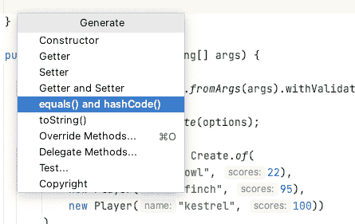

# 波束管道中 POJOs 的快速简易编码器

> 原文：<https://medium.com/google-cloud/quick-and-easy-coders-for-pojos-in-your-beam-pipeline-5d8e16994c1f?source=collection_archive---------0----------------------->

你并不孤单。当用 Java 编写第一个 [Apache Beam](https://beam.apache.org/) 管道时，我们中的许多人都被这条错误消息挡住了去路:

```
Exception in thread “main” java.lang.IllegalArgumentException: Unable to infer a coder and no Coder was specified. Please set a coder by invoking Create.withCoder() explicitly or a schema by invoking Create.withSchema().
```

本文演示了几种通过使用以下方法序列化普通旧 Java 对象(POJOs)来消除错误的方法:

*   可序列化
*   阿帕奇 Avro
*   协议缓冲区

GitHub 上的提供了完整的示例[。](https://github.com/anguillanneuf/beam-medium/tree/main/coders-beam)


让我们看一个简单的射束管道。它创建一个`Player`对象的集合，并打印出`Player`的名称和分数。

1.  POJO —这是`Player`类的定义。

2.光束管道——这是一个简单的管道，首先创建一个`Players`的`PCollection`,然后在每个`Player`对象上执行一个元素式的`MapElement`转换。

# 可序列化

实现`Serializable`是序列化 POJO 最直接的方式。

1.  使您的类从 Serializable 继承:

```
static class Player implements Serializable {}
```

2.为`equal()`和`hashCode()`生成代码:



在 IntelliJ 中，这可以通过导航到**代码** > **生成……**>**等于()和 hashCode()** 来完成。

运行管道:

```
mvn compile exec:java -Dexec.mainClass=SerializablePlayerExample
```

它将使用`DirectRunner`，除非你指定一个不同的流道。参见输出中的`Player`。请注意，输出元素可以按任何顺序排列。

```
kestrel: 100
owl: 22
finch: 95
Process finished with exit code 0
```

完整示例见[此处](https://github.com/anguillanneuf/beam-medium/blob/main/coders-beam/src/main/java/SerializablePlayerExample.java)。

# Avro

没听说过[阿帕奇 Avro](https://avro.apache.org/) 的也不用担心。它是一个广泛使用的数据序列化系统，由 Beam 支持。

以下步骤将基于您的 POJO 使用 Avro 生成一个 Java 类:

1.  [下载](https://avro.apache.org/releases.html#Download) Avro。
2.  使用 Maven 构建 Avro。

```
cd avro-src-1.10.2/lang/java/tools/
mvn clean install
```

3.创建一个符合您的类定义的 JSON 格式的 Avro 模式文件。参见支持的[类型](https://avro.apache.org/docs/1.10.2/spec.html#schema_primitive)。

`AvroPlayer.avsc`

```
{
  "type":"record",
  "name":"AvroPlayer",
  "namespace":"utilities",
  "doc":"A player.",
  "fields":[
    {
      "name":"name",
      "type":"string",
      "doc":"The player name."
    },
    {
      "name":"score",
      "type":"int",
      "doc":"The player score."
    }
  ]
}
```

4.基于您在`.avsc`文件中的类定义生成一个 Java 类:

```
java -jar \
  ~/avro-src-1.10.2/lang/java/tools/target/avro-tools-1.10.2.jar \
  compile schema \
  path/to/your/.avsc/file \
  destination/folder/
```

运行管道:

```
mvn compile exec:java -Dexec.mainClass=AvroPlayerExample
```

同样，它将使用`DirectRunner`运行。输出元素可以按任何顺序排列。

```
kestrel: 100
owl: 22
finch: 95
Process finished with exit code 0
```

看完整的例子[这里](https://github.com/anguillanneuf/beam-medium/blob/main/coders-beam/src/main/java/AvroPlayerExample.java)。

# 协议缓冲区

Google [协议缓冲区](https://developers.google.com/protocol-buffers)是 Beam 支持的另一个广泛使用的数据序列化系统。

以下步骤将基于 POJO 在协议缓冲区中生成一个 Java 类:

1.  [安装](https://developers.google.com/protocol-buffers/docs/downloads)协议。家酿在 MacOS 上为我工作。

```
brew install protoc
```

2.创建一个符合您的类定义的原型模式文件。

`ProtoPlayer.proto`

```
syntax = "proto3";package utilities;option java_outer_classname = "ProtoPlayer";message Player {
  string name = 1;
  int32 score = 2;
}
```

3.中的类定义生成一个 Java 类。原型文件:

```
protoc \
  --proto_path /your/.proto/file/folder/ \
  --java_out destination/folder/ \
  path/to/your/.proto/file
```

再次运行管道:

```
mvn compile exec:java -Dexec.mainClass=ProtoPlayerExample
```

除非另有说明，否则它将使用`DirectRunner`运行。输出元素可以按任何顺序排列。

```
kestrel: 100
owl: 22
finch: 95
Process finished with exit code 0
```

参见完整示例[此处](https://github.com/anguillanneuf/beam-medium/blob/main/coders-beam/src/main/java/ProtoPlayerExample.java)。

本文只介绍了几种序列化数据的方法，但是 Beam 支持更多的方法。希望我已经帮助你们中的一些人解决了使用 Beam 编写真正的业务逻辑的问题！