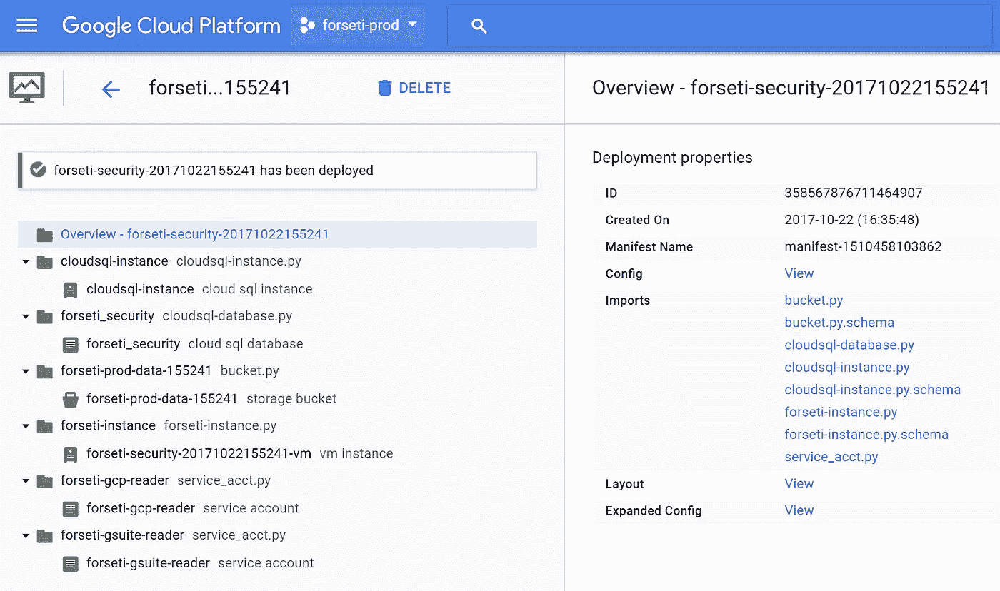
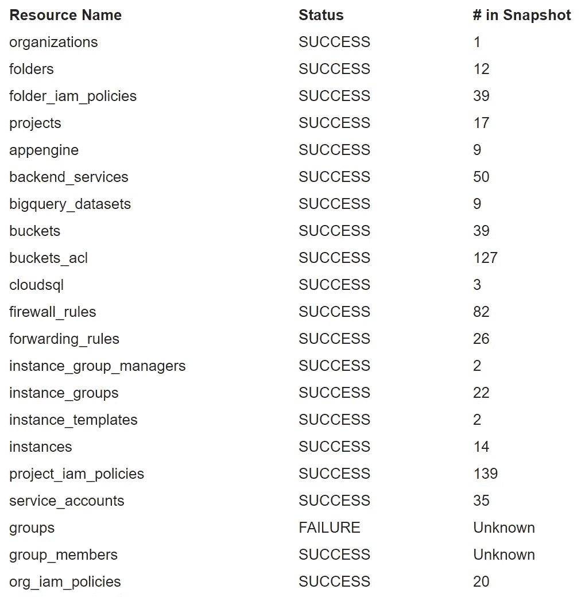
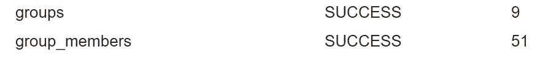
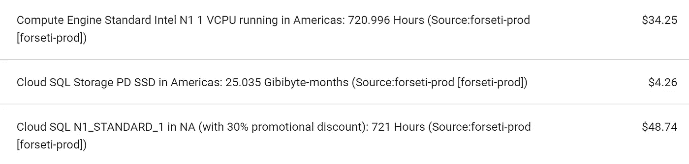

# 在谷歌云平台上快速安装凡赛堤安全

> 原文：<https://medium.com/google-cloud/quick-install-of-forseti-security-on-google-cloud-platform-ac91b91f807f?source=collection_archive---------0----------------------->


[凡赛堤安全](http://forsetisecurity.org)是[开源](https://github.com/GoogleCloudPlatform/forseti-security)为谷歌云平台打造的安全工具。它可以跟踪您的环境，监控您的策略，甚至在将来强制执行。

安装非常简单，因为它包含在一个[部署管理器](https://cloud.google.com/deployment-manager)模板中。部署管理器自动化谷歌云平台资源的基础设施部署。为了完整起见，我将在这篇文章中重点介绍凡赛堤官方文档[中的一些注释。](http://forsetisecurity.org/docs/quickstarts/forseti-security/index.html)

您需要一个专门用于凡赛堤安全的 GCP 项目和一个具有组织管理员角色的帐户。打开谷歌云外壳，克隆回购协议:

```
$ git clone -b master --single-branch \ https://github.com/GoogleCloudPlatform/forseti-security
```

导航到安装目录:

```
$ cd forseti-security/scripts/gcp_setup
```

执行脚本:

```
$ python setup_forseti.py
```

需要注意的一点是，如果您在 G Suite 中使用与 IAM 中具有角色的成员对齐的组，设置脚本将会失败。需要在用户级别设置组织管理员。[[当组织管理员是 Google Group # 780](https://github.com/GoogleCloudPlatform/forseti-security/issues/780)时，安装程序无法检测组织管理员角色]

```
user@domain.com is Org Admin? False
You do not have the necessary roles to grant roles that Forseti needs. Please have someone who is an Org Admin and either Project Editor or Project Owner for this project to run this setup. Exiting.
```

一旦脚本运行，您将被提示输入一个 [SendGrid](https://sendgrid.com) API 密钥。谷歌正在努力支持标准的 SMTP 中继。[ [通过 G Suite 域启用电子邮件提醒，作为 SendGrid #749](https://github.com/GoogleCloudPlatform/forseti-security/issues/749) ] & [ [通过任意中继邮件服务器启用电子邮件提醒(通过主机名/端口)#770](https://github.com/GoogleCloudPlatform/forseti-security/issues/770)

之后，安装脚本将创建启动和运行所需的所有资源。您可以在部署管理器中签出所有资源。在高层次上，它创建了几个服务帐户、Google Cloud SQL 实例、Google Cloud SQL 数据库、存储桶和 Google Compute Engine VM 实例。



凡赛堤可以收集贵公司高管团队的数据。为此，您需要启用 G Suite Google Groups Collection。做这件事的文档是这里的。

*注意:确保您为 forseti-gsuite-reader 服务帐户启用了 G Suite 域范围的委托，而不是在 python 脚本中看到它。*

如果您没有正确设置，您将在清单快照通知上看到部分成功。



如果您看到组和 groups_members 的计数，您就知道可以开始了:



因为我们是在云壳上做的，如果你想修改你的配置，你可以在本地编辑，然后推送到你的谷歌云存储空间。首先复制安装程序为您创建的配置。

```
$ cd configs
$ cp forseti_conf_dm.yaml forseti_conf.yaml
```

继续编辑此文件并将其复制到您的存储桶中:

```
$ vi forseti_conf.yaml
$ gsutil cp forseti_conf.yaml gs://forseti-prod-data-155241/configs/forseti_conf.yaml
```

SSH 到部署为您创建的 VM 实例中，您将看到 forseti 只是通过 ubuntu 用户 cron 运行，并调用/home/ubuntu 中名为 run_forseti.sh 的脚本，它实际上在每次运行时复制配置和规则。

```
#!/bin/bash

# Put the config files in place.
gsutil cp gs://forseti-prod-data-155241/configs/forseti_conf.yaml \ /home/ubuntu/forseti-security/configs/forseti_conf.yaml
gsutil cp -r gs://forseti-prod-data-155241/rules \ /home/ubuntu/forseti-security/

if [ ! -f /home/ubuntu/forseti-security/configs/forseti_conf.yaml ]; then
    echo Forseti conf not found, exiting.
    exit 1
fi

# inventory command
/usr/local/bin/forseti_inventory --forseti_config \ /home/ubuntu/forseti-security/configs/forseti_conf.yaml
# scanner command
/usr/local/bin/forseti_scanner --forseti_config \ /home/ubuntu/forseti-security/configs/forseti_conf.yaml
# notifier command
/usr/local/bin/forseti_notifier --forseti_config \ /home/ubuntu/forseti-security/configs/forseti_conf.yaml
```

更新凡赛堤应该也很容易。只需在您的云 shell 上运行一个 git pull，然后更新部署。部署文件将位于 deployment-templates 目录中，并根据部署名称进行命名。检查新获取的 deploy-forseti.yaml.sample，如果其中有任何新内容，请更新您的示例并部署:

```
gcloud deployment-manager deployments update forseti-security-20171022155241 --config deploy-forseti-20171022155241.yaml
```

大部分成本在这里:



下一篇文章将围绕它生成的数据，深入挖掘规则，真正理解从这样的工具中可以学到什么。