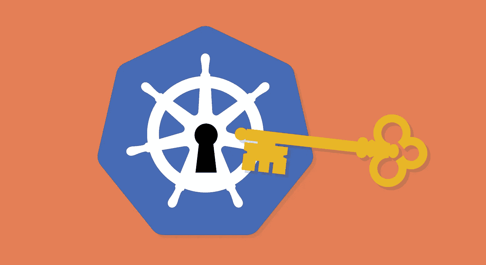

# 快速提示:通过云构建实现更简单的 GKE 认证

> 原文：<https://medium.com/google-cloud/quick-tip-simpler-gke-authentication-from-cloud-build-be418274d36c?source=collection_archive---------0----------------------->

**TL；DR:** 使用全局环境变量来指定您想要使用的 GKE 集群。

谷歌[云构建](https://cloud.google.com/cloud-build/)是一个托管 CI/CD 解决方案，可用于实现低成本、零维护的持续交付给谷歌 [Kubernetes 引擎](https://cloud.google.com/kubernetes-engine/) (GKE)。很容易配置云构建来构建一个(或三个)容器，并将其部署到 GKE。当然，部署需要对 GKE 集群进行身份验证。在这篇文章中，我们将学习一种简单的认证方法。

(我们将跳过真正困难的*步骤:[手动创建客户端配置](https://github.com/kelseyhightower/kubernetes-the-hard-way/blob/master/docs/05-kubernetes-configuration-files.md)。因为我们在使用 GKE，我们可以让云来做所有那些证书密钥交换的事情。)*

# 通过痛苦的经历

如果我们从一台本地机器连接到 GKE，我们可能会将 kubectl 授权给集群，然后运行我们的 kubectl 命令。*(为了便于说明，我们将部署一个常用的 NGINX 容器。您可能想要构建自己的、更有趣的容器，并部署它们。)*

这一两步过程可以在云构建中模拟:

…好吧，这并不是真的*那么*难。但是我们可以做得更好！

# 简单的方法

由于我们在 Google Cloud 的环境中使用 kubectl，它可以**自动连接到一个 GKE 集群**，只要我们告诉它我们想要哪个集群(并且假设 Cloud Build 已经被授权访问……我们不能随便搞乱任何人的集群！).我们将使用几个环境变量来指定集群:

我们已经取消了一个步骤！这使得我们的构建运行得更快。🎉

# 更简单的方法

有时，我们需要在一次构建中对集群执行多个操作。在每一步中都传递相同的环境变量是很乏味的。让我们通过在云构建中使用**全局环境变量**来消除冗余:

现在，嘘！这是一个*秘密功能！*不要告诉任何人！

实际上，这并不是一个秘密:只是全局环境变量是新的，它们还没有被记录。继续谈论他们。享受一整天的 kubectling！