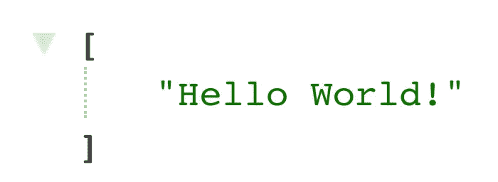

# r 功能框架

> 原文：<https://medium.com/google-cloud/r-functions-framework-fba630e820c2?source=collection_archive---------1----------------------->


R Logo +云跑

🅡是一种编程语言和环境，通常用于统计计算、数据分析和科学研究。

*R 函数框架*允许你编写可移植的 R 函数，可以很容易地部署到 Cloud Run。

在这篇博文中，我们将介绍如何部署一个 R 服务到 Cloud Run！

## 安装 R

在[https://cloud.r-project.org/](https://cloud.r-project.org/)为您的操作系统安装预编译的 R 二进制发行版。

这将安装 R 语言和`rscript` CLI。

## 在 VS 代码中安装 R 扩展

为了便于在我们的 IDE 中对 R 进行本地测试，请从 VS Marketplace 安装 R 扩展:

[](https://marketplace.visualstudio.com/items?itemName=Ikuyadeu.r) [## R - Visual Studio 市场

### 完整的文档在 Windows 的 Wiki 页面上，如果 r.rterm.windows 为空，那么到 R.exe 的路径将在…

marketplace.visualstudio.com](https://marketplace.visualstudio.com/items?itemName=Ikuyadeu.r) 

## 本地测试

打开 VS 代码命令面板( *⌘⇧P* )，键入:

`R: Run Command in Terminal`

这将启动一个交互式会话。

您将看到以下提示:

```
R version 4.0.2 (2020-06-22) -- "Taking Off Again"
Copyright (C) 2020 The R Foundation for Statistical Computing
Platform: x86_64-apple-darwin17.0 (64-bit)R is free software and comes with ABSOLUTELY NO WARRANTY.
You are welcome to redistribute it under certain conditions.
Type 'license()' or 'licence()' for distribution details.Natural language support but running in an English localeR is a collaborative project with many contributors.
Type 'contributors()' for more information and
'citation()' on how to cite R or R packages in publications.Type 'demo()' for some demos, 'help()' for on-line help, or
'help.start()' for an HTML browser interface to help.
Type 'q()' to quit R.
```

在该会话中，安装 R `[devtools](https://www.rdocumentation.org/packages/devtools/)`和 R 函数框架:

现在创建新的终端。(➕在终端)运行服务:

```
Rscript create-app.R --target=hello
```

您将看到控制台输出:

```
Starting server to listen on port 8080
```

前往`localhost:8080`测试您的服务器。



你好世界！由 R 函数框架提供服务。

# 部署到云运行

现在让我们将我们的应用程序部署到 Cloud Run。

## 1.下载函数框架二进制文件

```
curl -O [https://github.com/averikitsch/functions-framework-r/blob/master/examples/functionsframework_0.0.0.9000.tgz](https://github.com/averikitsch/functions-framework-r/blob/master/examples/functionsframework_0.0.0.9000.tgz)
```

## 2.创建 Dockerfile 文件:

Dockerfile 文件

## 3.构建并运行:

*构建容器需要一点时间，但构建完成后，它运行良好。*

# **云运行测试**

部署后，您将获得如下 URL:

```
[https://hellor-q7vieseilq-uc.a.run.app](https://hellor-q7vieseilq-uc.a.run.app)
```

现在可以自由地创建一个更高级的 R 应用程序了！

## 了解更多信息

感谢阅读！

如果您喜欢这篇文章，您可能会对以下资源感兴趣:

*   😺[R 函数框架的 GitHub 源代码](https://github.com/averikitsch/functions-framework-r)
*   📄[功能框架合同](https://github.com/GoogleCloudPlatform/functions-framework)