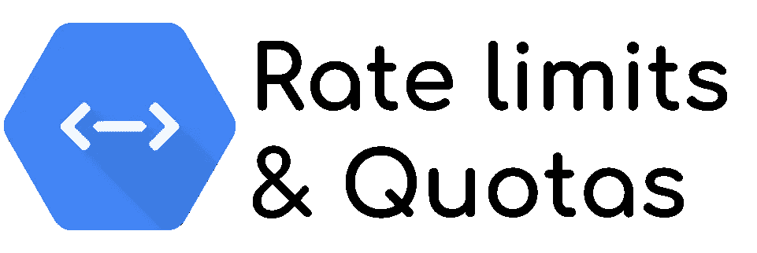

# 通过云端点配额限制您的 API 使用率

> 原文：<https://medium.com/google-cloud/rate-limit-your-api-usage-with-cloud-endpoints-quotas-1270da55d2bf?source=collection_archive---------0----------------------->



所有的 API 提供者，比如谷歌云平台，**必须通过设置 API**的**配额和速率限制来保护和保存用户可用的资源**。这可以是为了保护服务免受错误使用，避免[级联故障](https://landing.google.com/sre/sre-book/chapters/addressing-cascading-failures/)或者仅仅是为了丢弃像 DDoS 这样的攻击。

然而，当你想在你的 API 中实现一个速率限制特性时，这并不容易。

1.  你必须**编码它，或者使用一个框架**为你做这件事。
2.  您必须**支付速率限制操作**的处理时间，这会影响您的计费。*万一受到攻击，你的账单会爆炸！*
3.  您必须管理 Redis 等内存数据库的分布式缓存中的 **API 用法，以实现水平可伸缩性。**

# 免费的 API 管理解决方案

这就是为什么**解决方案存在的原因，比如** [**Apigee**](https://cloud.google.com/apigee) 这是一款众所周知的企业级 API 管理产品，但也有企业级成本。对于较小的项目，有一个**自由解存在:** [**云端点**](https://cloud.google.com/endpoints/docs/) **。**

本产品是[**开源**](https://github.com/cloudendpoints/esp) 并且可以在**上托管** [**几种服务**](https://cloud.google.com/endpoints/docs/openapi/tutorials) :

*   计算引擎
*   谷歌 Kubernetes 引擎(GKE)
*   云运行
*   应用引擎
*   云函数

*在我的* [*上一篇文章*](/google-cloud/secure-cloud-run-cloud-functions-and-app-engine-with-api-key-73c57bededd1) *中，我描述了如何用 API 密匙保护无服务器端点。这将是实施步骤*的起点

# 用于识别消费者的 API 键

为了使用云端点配额，你**必须使用 API 密匙**。这里，这个键用于识别使用您的 API 的**项目**。**对，项目**，不是重点。的确，**如果你在同一个项目中创建了几个键，那么所有键都引用同一个项目**并且限制是相同的。

> 如何将 API 限制在几个客户之间没有依赖关系？

在[这个页面](https://cloud.google.com/endpoints/docs/openapi/restricting-api-access-with-api-keys#sharing_apis_protected_by_api_key)，谷歌提出了一个决策图。如果您想要区分几个客户，解决方案是**创建几个项目，每个客户一个，每个项目中的 API 都有一个 API 键**授权。

# 用配额改进 API 定义

为了实现 API 的配额，我从我上一篇文章中描述的现有定义开始，我**使用** `[**endpoint.yaml**](https://github.com/guillaumeblaquiere/apikey-endpoint/blob/master/endpoint.yaml)` **文件作为基础文件**。

定义配额有 3 个步骤:

1.  说出你的配额以便于理解。
2.  设置**默认速率**(每分钟每项目查询)。
3.  定义每条路径的**成本调用**。

*本文提供的* ***最终文件*** *中的所有描述/更新都是* [*这里的*](https://github.com/guillaumeblaquiere/apikey-endpoint/blob/master/endpoint-quotas.yaml) *。*

## 1.说出您的配额

命名您的配额允许您在云端点的配额页面中看到它们，而且每个使用这个 API 的项目将能够在页面中看到它的配额。

因此，让我们在**YAML 文件**的根级别定义您想要使用的配额名称，例如就在`paths:`定义之前。

```
x-google-management:
  metrics:
    - name: "my_first_quota"
      displayName: "My first quota"
      valueType: INT64
      metricKind: DELTA
```

*`*displayName*`*为达到定额错误时返回，显示在 GUI 上。明确一点！**

## *2.设置配额的默认值*

*现在，您必须**为该配额**定义标准值。*`*metric:*`*字段的值与前一个块的名称相同，用于在两个*之间建立链接。**

****集团与** `**metrics:**` **定义**在同一层(上一部分，为定额命名)**

```
 **quota:
    limits:
      - name: "read-get"
        metric: "my_first_quota"
        unit: "1/min/{project}"
        values:
          STANDARD: 1**
```

**`values:`是极限的值。这里每分钟一个请求，更容易测试。*在这个测试版中不能改变单位。***

## **3.设置 API 调用的开销**

**云端点配额功能**允许您创建不同的配额指标**来区分业务案例、功能或查询类型(GET、POST、PUT、DELETE)。**

**然而，**您也可以在相同的配额定义内，区分每个** `**paths**`上消耗的资源。例如，带有结果列表的多标准搜索比获取单个资源要昂贵得多。**

**因此，在每个`paths`上，您可以**设置呼叫**的*成本*。您可以在与`OperationId:`相同的级别添加该部件**

```
 **x-google-quota:
        metricCosts:
          "my_first_quota": 1**
```

## **测试配额**

**对于测试，开始部署新的服务定义**

```
**gcloud endpoints deploy endpoint.yaml**
```

**并测试它。**重复几次** `**curl**` **。** `*-i*` *代表显示响应头，尤其是响应码***

```
**curl -i https://endpoint-<hash>-uc.a.run.app/hello?key=<API KEY>**
```

**在几次调用之后，您应该会看到这个错误。您可能会注意到，在被阻止之前，您必须进行 3、4 次或更多次尝试。更多详情见下一段。**

```
**HTTP/2 429
content-type: application/json
x-cloud-trace-context: d08f223742db0784fbb661e2512b3381
date: Mon, 27 Jan 2020 13:25:01 GMT
server: Google Frontend
content-length: 354{
 "code": 8,
 "message": "Quota exceeded for quota metric 'My first quota' and limit 'My first quota per minute' of service 'endpoint-<hash-uc.a.run.app' for consumer 'project_number:XXXXXXX'.",
 "details": [
  {
   "[@type](http://twitter.com/type)": "type.googleapis.com/google.rpc.DebugInfo",
   "stackEntries": [],
   "detail": "internal"
  }
 ]
}**
```

****限额工程**。您可以注意到为许多请求返回的`**429 HTTP**` **代码**。你还可以看到错误描述体中的**定额** `**display_name**` **和用 API 键标识的**项目号**。****

# **尽力配额管理**

****云端点配额目前处于测试阶段**，一些功能缺失，有时行为并不完美。**

**您可以使用`[hey](https://github.com/rakyll/hey)`进行测试。如果您将请求并发性设置为 1 ( `-c`参数)，**配额基本上是合理的**。**

**然而，如果您删除它，**请求将得到服务，直到云运行端点服务考虑到阻止项目号的信息**。**这可能需要几毫秒的时间**，足够满足**几十个额外的请求，即使超过了配额**。**

**并行运行的云实例越多，流量越高，更重要的是通过而不是被阻塞的请求的数量。**

**总之，**在这个小故障之后，应用了速率限制**,`429 HTTP`按预期返回，并且**API 防止了太多的请求。****

# **提高安全性并保持配额**

**在我的上一篇文章中，我解释过 **API Keys 并不是 API 用户认证**的最佳解决方案，即使它是可能的。但是，配额需要 A **PI 键。****

> **理想的情况是为配额保留 API 密钥，并使用 OAuth2 身份验证**

**云端点允许您设置此配置。在安全定义中，**添加** [**你想要的认证方式**](https://cloud.google.com/endpoints/docs/openapi/authentication-method)**。*在下面的例子中，我选择了 Google ID 令牌认证，并将其添加到了* `[*endpoint-quotas.yaml*](https://github.com/guillaumeblaquiere/apikey-endpoint/blob/master/endpoint-quotas.yaml)` *文件的安全定义部分。*****

```
****google_id_token:
  authorizationUrl: ""
  flow: "implicit"
  type: "oauth2"
  x-google-issuer: "https://accounts.google.com"
  x-google-jwks_uri: "https://www.googleapis.com/oauth2/v3/certs"****
```

*****这个配置* ***允许任何 google 账号调用我的 API，它是大开放的！*** *如果您想使用* [*云身份平台*](https://cloud.google.com/identity-platform/docs) *来管理您的用户子集，我推荐您使用* [*Firebase 认证方法*](https://cloud.google.com/endpoints/docs/openapi/authenticating-users-firebase)****

****然后，我通过设置这个值来更新端点路径的安全定义****

```
****security:
  - google_id_token: []****
```

## ****使用 OAuth2 安全定义测试云端点****

****现在部署新的 API 定义****

```
****gcloud endpoints deploy endpoint-quotas.yaml****
```

****并用不记名令牌进行测试****

```
****curl -H "Authorization: Bearer $(gcloud auth print-identity-token)"\
    https://endpoint-<hash>-uc.a.run.app/hello?key=<API KEY>****
```

****还有…**失败了。** ***为什么？*** 查看错误信息****

```
****{
 "code": 7,
 "message": "JWT validation failed: Audience not allowed",
 "details": [
...****
```

****是的，**你只需要将观众设置到你的令牌上**。很简单，使用命令`gcloud auth print-identity-token`的`--audiences`参数，并将云运行端点主机名设置为受众值****

```
****gcloud auth print-identity-token \
  --audiences https://endpoint-<hash>-uc.a.run.app****
```

****如果您通过了用户帐户的身份验证。你应该有另一个错误。****

```
****ERROR: (gcloud.auth.print-identity-token) Invalid account Type for `--audiences`. Requires valid service account.****
```

****好的，**有观众的身份令牌只能在**服务账号上生成。为此，****

*   ****创建服务帐户****

```
****gcloud iam service-accounts create test-endpoint****
```

*   ****生成并下载密钥文件。*用您的项目 ID* 替换 `*PROJECT_ID*`****

```
*****gcloud iam service-accounts keys create key.json \
  --iam-account [test-endpoint@PROJECT_ID.iam.gserviceaccount.com](mailto:test-endpoint@gbl-imt-homerider-basguillaueb.iam.gserviceaccount.com)*****
```

*   *****在 gcloud CLI 中激活服务帐户*****

```
*****gcloud auth activate-service-account --key-file=key.json*****
```

*****现在，执行工作测试的所有部分都准备好了*****

```
*****curl -H "Authorization: Bearer $(gcloud auth print-identity-token \
  --audiences=https://endpoint-<hash>-uc.a.run.app/)" \
  https://endpoint-<hash>-uc.a.run.app/hello?key=<API KEY>*****
```

*******那管用**！！试打几个电话，是的，**额度也是活动的**！*****

******注意:* ***这里只需要一个活动的服务账号*** *，没有任何被授予的角色，因为* ***只勾选了认证*** *。******

## ****认证转发****

****在这个模式中，有两个身份验证级别:****

1.  ****使用“无角色”服务帐户的云端点的**调用者。******
2.  ******云端点代理，执行对期望的** `**paths**`的调用。这里云运行端点服务账号用于在执行对`path`服务的请求时被认证和授权*(以* `*run.invoker*` *角色为例)*。****

****这两个认证令牌在请求头中被传输到`path`服务，其名称如下:****

1.  ****调用者令牌在`x-endpoint-api-userinfo`头键中。****
2.  ****云端点代理在`authorization`头键中。****

****您可以使用它们在您的`path`服务中执行业务级别的检查和/或额外授权。****

*****注意:* ***令牌有效性已经检查过了*** *，你不用做了，* ***简单使用令牌内容*** *。*****

## ****没有 API 键的 API 调用****

****现在，API 密钥还没有用于保护 API，并且**您可以在没有 API 密钥**的情况下调用 API。*试试看！*****

> ****如果没有 API 键，对配额有什么影响？****

****如前所述，这个云端点配额功能处于测试阶段。因此，今天，当 API 键丢失时，用于配额限制**的项目号是托管云端点服务**的当前项目。****

# ****保护您的 API****

****你的 API 是珍贵的，它是你的服务、信息系统和商业价值的切入点。你必须:****

*   ****确保**高水平的可用性**，让客户满意****
*   ****所有 API 消费者之间正确且**公平的延迟/使用******
*   ****用 OAuth2 代替 API 密钥的高安全级别****

****云端点允许你设置所有这些特性，用**一个免费的产品，你可以把它放在你想要的地方**。还不完善，配额功能还处于测试阶段，但是使用和发展将巩固这些良好的基础**并且伟大的事情将会到来！******