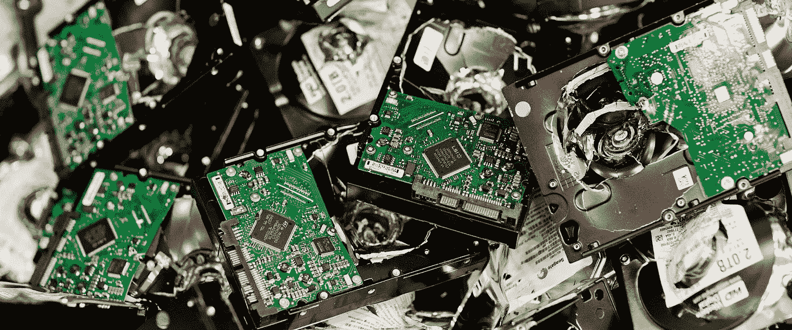
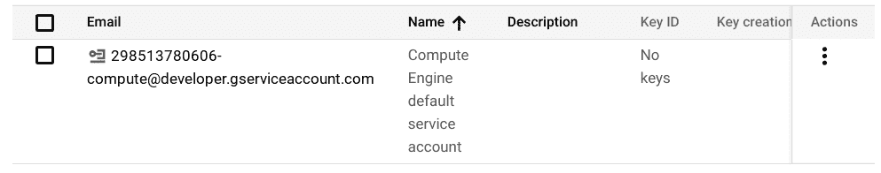
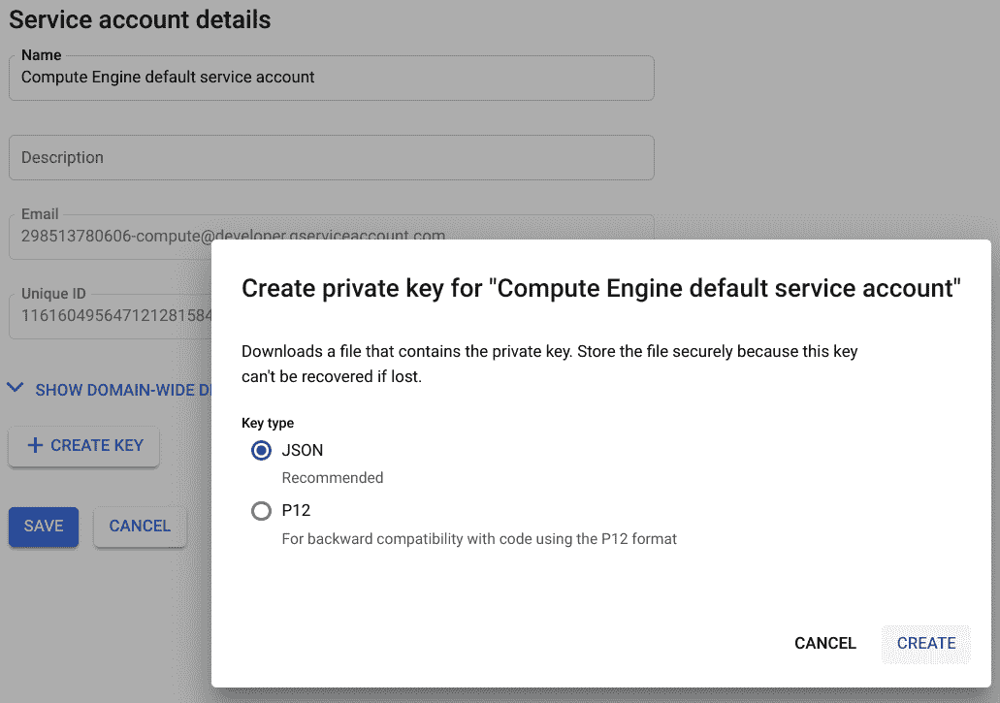

# 如何利用 Google Drive 等云存储，通过 rclone 复制本地或 NAS 数据，以实现区域外灾难恢复

> 原文：<https://medium.com/google-cloud/rclone-and-google-drive-3fdfb00f34e8?source=collection_archive---------0----------------------->

**TL；dr:** 如果你想将数据从本地或网络连接存储复制到你的云存储中——加密或不加密——而不依赖于除 rclone 之外的任何应用程序，请继续阅读。



毁坏的硬盘。希望你有这些的副本…(版权适用于这张照片)

# 背景

几周前，我决定通过添加区域外灾难恢复将我的专用 NAS 备份战略提升到一个新的水平。换句话说，我不仅想将最重要的数据复制到本地磁盘和 NAS 上，还想将它们存储在 Google Drive 上的云中。

当然，我已经有很多在云端的文件，比如谷歌文档和表格。但是还有其他的，像一些音乐，特别是 RAW 照片，到目前为止还没有。

本指南将概述如何使用 rclone 进行从 QNAP NAS 到 Google Drive 的加密拷贝，同时保持您当前的存储设置和工作流程不变。它也适用于其他 NAS、Linux 甚至 Windows 环境，以及其他云存储(例如 Google 云存储、OneDrive、Dropbox、S3)，只需要很小的调整。

此外，它描述了如何利用谷歌云服务帐户，以限制 rclone 的访问权限和您的帐户凭证落入坏人手中的机会。我将提供一个选项来使用 Google Drive 的文件夹共享机制，以确保您可以在没有服务帐户的情况下访问您的加密文件，甚至可以在 Google Drive web 应用程序中访问这些文件。

我把 Google Drive 作为 Google 云和 G Suite 家族的一部分来关注。这是一个面向低数据量的零成本、消费者就绪型解决方案。如果您需要更多存储空间，它还为消费者提供了一个易于理解的[定价模式](https://one.google.com/about#upgrade)。

**重要的是要理解:**这种方法不支持文件的快照或版本控制(参见下面“复制与同步的区别以及为什么版本控制不可用”一节)！

# 可供选择的事物

## QNAP 上的替代方案

有很多类似的使用案例利用 QNAP 内置功能，允许开箱即用的加密，如备份到谷歌云存储或 AWS S3，(例如 [QNAP 混合备份同步应用](https://www.qnap.com/solution/hybrid-backup-sync/en-us/))。

甚至还有 Google Drive 连接器可用(例如 [QNAP 云驱动同步](https://www.qnap.com/en/how-to/tutorial/article/connect-to-your-cloud-storage-smoothly-with-cloud-drive-sync-on-qnap-nas/))。但是由于只有 QNAP 知道的原因，它不支持加密。

## 通用加密的替代方案

您可以通过在将数据放入本地存储之前对其进行加密来解决缺少加密功能的问题。或者使用类似于 [Cryptomator](https://cryptomator.org/) (现在也可以作为运行在容器中的服务器版本)或者桌面环境中的 [Boxcryptor](https://www.boxcryptor.com) 的软件。但是这些选项要求您对现有的存储/备份概念进行调整，或者让您依赖于特定的供应商。

# 我们将要构建的 rclone.conf 示例文件

```
[GDrive_User]
type = drive
scope = drive.file
service_account_file = /share/homes/username/BackUp/rclone/my-service-account-file-12345.json
auth_owner_only = true/* Below is optional and only required if you want to encrypt your files */
[GDrive_User_Encrypted]
type = crypt
remote = GDrive_User:NAS_Documents/20181117_Baseline/
filename_encryption = standard
directory_name_encryption = true
password = someHash
password2 = otherHash
```

## 在 QNAP NAS 上安装 rclone

1.  [根据你的 CPU 架构下载](https://rclone.org/downloads/) rclone。对于 QNAP NAS 设备，您可以在 [QNAP Club](https://www.qnapclub.eu/en/qpkg/330) 中找到非官方的预建包(这就是我使用的那个)。
2.  使用 SSH 连接到您的 NAS。
3.  通过调用 rclone 命令检查是否安装了 rclone。

```
[/] # rclone
//Output
Usage:
 rclone [flags]
 rclone [command]…
```

## 创建一个 Google Drive 远程链接并添加加密

本指南假设您正在使用 Google Drive，但 rclone 也支持大多数其他云存储选项([参见配置选项](https://rclone.org/docs/#configure))。

## 创建一个 Google 服务帐户

我建议使用一个 [Google 服务帐户](https://cloud.google.com/iam/docs/understanding-service-accounts)进行连接，这个帐户需要先创建(见下文)。还有一个使用标准 OAuth2 令牌的选项，但我认为这在 NAS 环境中不起作用，因为它需要 web 浏览器和(定期)登录到您的 Google 帐户。

> 2019 年 10 月 22 日编辑:刚刚从一位读者朋友那里得知 OAuth2 应该可以工作。您会收到一个在浏览器中打开的 URL，然后将 OAuth2 令牌复制到控制台并从那里获取它。一个额外的好处是，您可以限制 rclone 只能访问它创建的文件。

创建服务帐户不仅可以通过[谷歌云控制台](https://console.cloud.google.com/)进行，还可以通过一个轻量级接口[谷歌 APIs IAM 站点](https://console.developers.google.com/projectselector/iam-admin/serviceaccounts)进行。如果你到目前为止没有使用任何其他的谷歌云平台服务，我建议你选择后者。

*   转到[Google API IAM 网站](https://console.developers.google.com/projectselector/iam-admin/serviceaccounts)
*   单击“服务账户”
*   创建一个新项目，如果你还没有做的话。项目名称可以是“rclone 副本”。然后，您将获得您的服务帐户 ID /电子邮件，例如



带有电子邮件和姓名的服务帐户

*   单击新创建的服务帐户，并创建一个 JSON 格式的密钥



服务帐户的 JSON 密钥创建

*   下载密钥，因为您的 rclone 配置文件需要它

将密钥保存在安全的位置，因为它将授予获得它的每个人对存储在服务帐户中(或与其共享)的文件的读写权限。

## 创建 rclone“远程”

请[按照官方文档](https://rclone.org/drive/)创建一个标准遥控器。远程就像特定云存储中特定文件夹的连接器。

## [可选]添加加密

现在，您在上面创建的远程链接上添加加密。[官方文件对此也有详细描述](https://rclone.org/crypt/)。

## [可选]使复制的文件在您的 Google Drive 中可见

在设置过程中，你可能已经检查过你的浏览器和你的 Google Drive 帐户，意识到你刚才复制的文件不在那里。这是因为服务帐户无法访问您现有的 Google Drive 文件！把服务账户想象成一个虚拟的新的 Google Drive 账户，但是和你的配额挂钩。你只能通过 Google Drive API 访问它的内容，就像 rclone 一样。

您可以在 drive.google.com 或 Google Drive 应用程序中提供您的(加密)文件，但请注意，这也意味着您或有权访问您的 Google Drive 的其他人/应用程序可能会(意外地)删除您使用 rclone 创建的副本。

如果您决定这样做，请与服务帐户共享 Google Drive 中的特定文件夹(例如 shared_folder)。由于您的服务帐户名称看起来像电子邮件地址(例如，name-of-your-sa-account @ your-project-name-123456 . iam . gserviceaccount . com ),您可以在 Google Drive web UI 中共享副本文件夹。只需将服务帐户“电子邮件”作为附加用户添加到复制文件夹中。您可能会收到一封自动发送的电子邮件，说明服务帐户电子邮件不可访问，但它仍然可以工作。

从现在起，您可以建议 rclone 使用 drive-shared-with-me 标志来访问此共享文件夹。这适用于所有 rclone 命令([参见官方文档](https://rclone.org/drive/#drive-shared-with-me))。这里有一个例子:

```
rclone copy --drive-shared-with-me /source/files your_remote:shared_folder/
```

# 使 rclone.conf 持久并备份它

## QNAP 设备上的配置持久性

在 QNAP 设备上，rclone 配置存储在/root/下。由于此位置将在 NAS 重新启动后或 NAS 升级后被擦除，因此您需要在其他位置手动复制 rclone.conf 文件，例如/share/homes/your-user/rclone/。请注意:每当您更改配置或使用 rclone config 创建新配置时，您都需要将配置再次保存在一个持久的位置。

## 配置备份

强烈建议将 rclone.conf 备份到保存的远程位置，因为它包含用于恢复加密数据的(散列和加盐)密码。

由于您只需要在发生重大事件时恢复您的文件，我建议将其加密并放在不同的云存储中，或者甚至打印出来并存储在一个保存的远程位置。如果您所有的本地副本和备份被破坏或无法访问，您的密码存储，笔记或无论如何你试图记住密码和盐也可能会消失！

您可以在新的 rclone 配置运行中使用您的密码和 salt 重新创建该文件，但是安全第一。服务帐户密钥文件(*。json)可以随时从谷歌云控制台下载，所以不需要备份。

# 复制与同步的区别以及版本控制不可用的原因

Rclone 支持多种文件操作命令。我想快速强调一下拷贝和同步之间的区别，并说明目前没有快照功能！

## 复制

这个命令复制文件，忽略未更改的文件，利用文件大小和修改时间。对于我们的用例很重要:这个命令永远不会删除目标位置的文件。即使文件在源位置被删除。但它确实会覆盖已更改的文件！我在本指南中使用副本。另请参见[官方文档](https://rclone.org/commands/rclone_copy/)。

## 同步

此命令将源同步到目标。特别是，如果在源位置删除文件，它还会在目标位置删除文件。但绝不会反过来。另见[官方文件](https://rclone.org/commands/rclone_sync/)。

## 快照/版本控制

Rclone 不支持开箱即用的版本控制或快照创建！。已更改的文件将在复制时被覆盖，而不是进行版本控制！所以我建议不要只依赖 rclone“备份”。确保您的实际备份(例如，在 USB 磁盘、本地服务器上)允许版本控制，并且如果您的所有备份源都不可用/不再可用，请仅使用 rclone。通常这意味着一场灾难。

举个简单的例子:如果你有一个像 important.txt 这样的文件，在周一保存，在周二修改，然后想在周三恢复到周一的版本，你不能用 rclone 做到这一点。除了您使用这种实现类似版本控制行为的变通方法，但是我在这里不使用它([参见关于 backup-dir](https://rclone.org/docs/#backup-dir-dir) 的官方文档)。

# [可选]为定期执行创建特定的运行脚本和计划

我建议创建一个总结所有必需选项的脚本，并使用 crontab 安排定期执行。

在我下面的复制脚本中，我使用了两个附加选项:

```
--config and --bwlimit.
```

第一个需要指向 rclone.conf 文件。请记住，在 QNAP NAS 设备上重新启动后，此文件的标准位置会被擦除！第二个应该将带宽使用限制在 500 千字节。根据您的具体上行链路环境进行调整。

请注意，带宽限制对我不起作用。快速调查显示，这可能是一个常见的错误。因此，我使用我的路由器通过利用服务质量设置来控制带宽使用。重要的是要保留足够的备用上传。否则，您的下载可能会受到影响，包括视频流。

## 我的 rclone_copy.sh 脚本

```
#!/bin/sh
rclone --config /share/homes/username/rclone/rclone.conf --bwlimit=500k copy --drive-shared-with-me /share/homes/username/documents GDrive_Username_Encrypted:
echo -e $(date -u) “ rclone_copy.sh ran” >> /share/homes/username/rclone/rclone.log
exit 0
```

## 使脚本可执行

不要忘记让您的 rclone_copy.sh 脚本在*NIX 环境中可执行。通常你用

```
chmod +x /path/to/rclone_copy.sh
```

## 计划定期执行

最后，我建议使用 crontab 进行调度。通常您可以通过 crontab -e 创建 crontab 条目，但是如果您在 QNAP NAS 设备上这样做，您的命令就会丢失！经过一番困惑之后，我在丹尼尔·汉森的技术和我博客上找到了他的描述。非常感谢！如果您正在使用 QNAP，请遵循 Daniel 的解决方法。

简而言之，您需要:

```
crontab -e
// insert your entry (vi-like editor)…
// make persistent
crontab /etc/config/crontab
// reload
/etc/init.d/crond.sh restart
```

我的 crontab 条目(每小时运行 rclone_copy.sh):

```
0 0–23 * * * /share/homes/username/rclone/rclone_copy.sh
```

因为我的复制脚本在每次执行后都会写入一个日志文件，所以您可以将这个日志用作交叉检查。另一种方法是查看加密的文件名或者计算你的 Google Drive 副本文件夹中的加密文件。

# 在初始上传期间避免并行执行

根据数据量和你的上传能力，最初复制到 Google Drive 可能需要几天或几周的时间。我建议在这段时间内不要设置 cron 作业。并行运行多个 rclone 实例通常不会提高上传效率，但会导致在 NAS 硬盘上进行大量搜索。您可能希望不时地检查您的初始上传是否完成，或者检查潜在的早期脚本终止。

# 接下来是什么？

打开终端，开始为您最珍贵的本地数据构建您的区域外灾难恢复设置。请记住:数据只有在您能够访问的情况下才有价值。因此，请测试恢复。

你也可以看看更多的阅读推荐:

*   [谷歌云存储和谷歌驱动——何时选择什么](https://www.cloudberrylab.com/resources/blog/choosing-online-backup-storage-google-cloud-storage-vs-google-drive/)
*   [The Matrix — OAuth 2.0、服务账户、Google Drive 和 Node.js](/@abhimanyuPathania/google-drive-service-accounts-and-nodejs-a038b8ec482f)

感谢您的反馈和改进，比如实现快照功能。