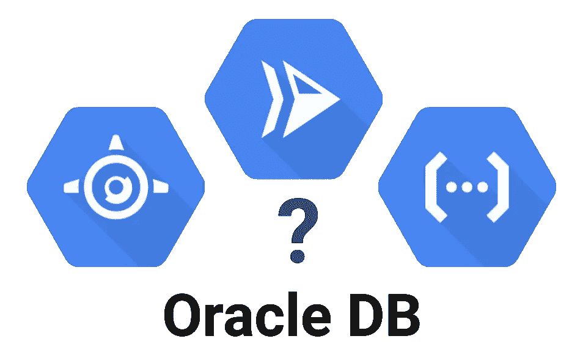

# 在无服务器中访问 Oracle 数据库

> 原文：<https://medium.com/google-cloud/reach-oracle-db-in-serverless-271293f79861?source=collection_archive---------1----------------------->



在我之前的[故事](/google-cloud/how-to-reach-on-premise-resources-with-serverless-products-747ebd37dc8e)中，我详细介绍了如何通过执行简单的 ping 来使用无服务器产品访问内部资源。现在，**想把这些资源用在真实的工作量上。其中一个是 Oracle 数据库**，我想连接并查询它。

> 但是，使用哪种无服务器产品来访问 Oracle 数据库呢？云功能？云跑？App 引擎？

*为了在云中执行测试，您可以在具有公共 IP 的 n1-standard-1 虚拟机上设置一个 Oracle XE 数据库。别忘了打开防火墙规则！*

# 云函数

云功能是一种流行的无服务器产品。**你带来你的代码，一个函数，你运行一个** `**gcloud**` **命令来部署它**。编译、部署、向上和向下扩展(最大为 0)由平台管理。

然而，主要的代价是支持的**语言数量有限:Python、Go 和 NodeJS** 。反正没问题，语言不重要，我们试试用带云功能的 Oracle DB。

## Oracle 约束

**Oracle 产品、工具和驱动程序不是开源的，如果没有连接到 Oracle 门户网站、通过身份验证并接受许可，您就无法下载它们**。

顺便说一下，您不能轻松地自动化构建，并且 Python、NodeJS 或 Go 中没有本机库来将您的代码直接连接到 Oracle 数据库。您必须在您的环境中安装一个名为“即时客户端”的 Oracle 中间软件，以便与数据库进行通信。然后，你可以使用开源库，在你的代码和“即时客户端”软件之间建立链接。从而到达数据库

总之，你必须**在云功能上部署你的代码和一个 Oracle 二进制文件**。这是不可能的。有了云功能，你只需要**带来你的代码**，而不是第三方的二进制代码。**Python、NodeJS 或 Go 的云函数不是在无服务器**中使用 Oracle DB 的好产品。

*如果你想自己尝试部署*，你可以在[*GitHub*](https://github.com/guillaumeblaquiere/serverless-oracle)*上找到代码示例*

# 云运行替代方案

2019 年初宣布， [Cloud Run](https://cloud.google.com/run/) 是 Google Cloud 全新的无服务器产品。**云运行为容器**带来无服务器能力。开发人员必须遵守两个契约:HTTP 容器(托管 web 服务器)和无状态(没有卷/磁盘挂载)。仅此而已！

**容器有能力打破云函数的现有限制**:你可以**使用任何语言，你可以添加任何库、依赖和二进制**(这里[是一个例子](/google-cloud/portable-prediction-with-tensorflow-and-cloud-run-669c1c73ebd1))。

云运行和云功能在它们的无服务器方法上非常接近；云运行在可移植性方面更好[，在测试方面更好](/google-cloud/cloud-run-and-cloud-function-what-i-use-and-why-12bb5d3798e1)，在降低成本方面更好[。](/google-cloud/cloud-run-vs-cloud-functions-whats-the-lowest-cost-728d59345a2e)

## 消除云功能限制

由于容器的功能，目标很简单:**用即时客户端创建一个容器，并在其中运行代码。**

首先编写 [Go 代码](https://github.com/guillaumeblaquiere/serverless-oracle/edit/master/go/function/function.go)来测试连接。( [Python 版本](https://github.com/guillaumeblaquiere/serverless-oracle/blob/master/python/function/main.py)， [NodeJS 版本](https://github.com/guillaumeblaquiere/serverless-oracle/blob/master/nodejs/function/index.js)也有)

*GitHub 中提供了* [*webserver 代码*](https://github.com/guillaumeblaquiere/serverless-oracle/blob/master/go/Server.go) *但这里没有介绍，对这个主题没有价值。*

```
package functionimport (
	"database/sql"
	"fmt"
	_ "gopkg.in/goracle.v2"
	"net/http"
)func OracleConnection(w http.ResponseWriter, r *http.Request) { dbIp := os.Getenv("ORACLE_IP")
	dbSchema := os.Getenv("ORACLE_SCHEMA")
	dbUser := os.Getenv("ORACLE_USER")
	dbPassword := os.Getenv("ORACLE_PASSWORD") db, err := sql.Open("goracle", dbUser + "/" + dbPassword + "@" + dbIp + ":1521/" + dbSchema)

        if err != nil {
		fmt.Println(err)
		w.WriteHeader(http.StatusInternalServerError)
		fmt.Fprintln(w, err)
		return
	}
	defer db.Close() rows, err := db.Query("select 'Great!' from dual")
	if err != nil {
		fmt.Println("Error running query")
		fmt.Println(err)
		w.WriteHeader(http.StatusInternalServerError)
		fmt.Fprintln(w, err)
		return
	}
	defer rows.Close() var value string
	for rows.Next() {
		rows.Scan(&value)
	}
	w.WriteHeader(http.StatusOK)
	fmt.Fprintln(w, value)
}
```

将依赖关系添加到`[go.mod](https://github.com/guillaumeblaquiere/serverless-oracle/blob/master/go/go.mod)`(或[Python](https://github.com/guillaumeblaquiere/serverless-oracle/blob/master/python/requirements.txt)T1、 [NodeJS](https://github.com/guillaumeblaquiere/serverless-oracle/blob/master/nodejs/package.json) `[package.json](https://github.com/guillaumeblaquiere/serverless-oracle/blob/master/nodejs/package.json)`)

```
module servergo 1.12require (
	github.com/gorilla/mux v1.7.1
	gopkg.in/goracle.v2 v2.20.1
)
```

现在，用`[Dockerfile](https://github.com/guillaumeblaquiere/serverless-oracle/blob/master/go/Dockerfile)` ( [Python 版本](https://github.com/guillaumeblaquiere/serverless-oracle/blob/master/python/Dockerfile)， [NodeJS 版本](https://github.com/guillaumeblaquiere/serverless-oracle/blob/master/nodejs/Dockerfile))构建容器

```
FROM golang:1.12 as builder# Copy local code to the container image.
WORKDIR /go/src/function/
COPY go.mod .
ENV GO111MODULE=on
RUN CGO_ENABLED=1 GOOS=linux go mod downloadCOPY . .
# Perform test for building a clean package
#RUN go test -v ./...
RUN CGO_ENABLED=1 GOOS=linux go build -v -o server# Now copy it into Oracle base image.
FROM oraclelinux:7-slimARG release=19
ARG update=3RUN  yum -y install oracle-release-el7 && \
  yum-config-manager --enable ol7_oracle_instantclient && \
  yum -y install oracle-instantclient${release}.${update}-basic && \
  rm -rf /var/cache/yumCOPY --from=builder /go/src/function/server /server
CMD ["/server"]
```

考验的时候到了！

*   构建容器(或者使用云构建，参见`[README.md](https://github.com/guillaumeblaquiere/serverless-oracle/blob/master/README.md))`

```
gcloud builds submit --tag gcr.io/<your project>/oracle-connection
```

*   在云上部署运行(*用您的值更新您的环境变量)*

```
gcloud beta run deploy oracle-connection --platform managed\
    --image gcr.io/<your project>/oracle-connection
    --region us-central1 --allow-unauthenticated
    --set-env-vars ORACLE_IP=<YOUR IP>,ORACLE_SCHEMA=<YOUR SCHEMA>,\
ORACLE_USER=<YOUR USER>,ORACLE_PASSWORD=<YOUR PASSWORD>
```

*   测试您的查询

```
curl $(gcloud beta run services describe oracle-connection \
    --region us-central1 --format "value(status.address.hostname)" \
    --platform managed)> Great!
```

嘣，连上了！

## 云运行权衡

太好了，这很有效！！*嗯嗯，* *是与否*。是的，我可以访问部署在计算引擎上的 Oracle 数据库，但是我的本地 Oracle 数据库怎么样呢？

今天(2019 年 10 月)，还不能用 [**无服务器 VPC 连接器**](https://cloud.google.com/vpc/docs/configure-serverless-vpc-access) 将云运行服务连接到 VPC。只有云功能和 App 引擎与之兼容。云函数达不到 Oracle DB 所以还是用 App Engine 试试吧。

***编辑(2020 年 5 月)*** [*云运行现已兼容无服务器 VPC 连接器*](https://cloud.google.com/run/docs/configuring/connecting-vpc) *内测。您不再有网络限制*

# 应用引擎解决方案

App Engine 是谷歌云平台上最古老的服务。它有两个版本:标准和灵活

## 标准环境

[App 引擎标准](https://cloud.google.com/appengine/docs/standard/)允许**带给你代码，一个微服务，你运行** `**gcloud**` **命令来部署它**。编译、部署、向上和向下缩放(到 0)由平台管理。

与 my Cloud 函数定义非常相似，因此主要问题也很相似:**无法在 App Engine 标准环境中安装 Oracle 软件**。仍然不是正确的解决方案。

*如果你想测试部署，代码存在于 Go、Python 和 NodeJS 目录中。参见* `[*README.md*](https://github.com/guillaumeblaquiere/serverless-oracle/blob/master/README.md)`

## 灵活的环境

[**App Engine Flexible**](https://cloud.google.com/appengine/docs/flexible/)**去掉了标准版**的很多取舍，比如语言数量有限或者无法安装软件。怎么会？和云运行一样， **App Engine flexible 基于容器**。

很好，让我们试着在 App Engine Flex 上部署我们的工作容器。*为此，我将使用自定义运行时。*

从 Go 容器的一个`[app-flexible.yaml](https://github.com/guillaumeblaquiere/serverless-oracle/blob/master/go/app-flexible.yaml)`描述文件开始

```
runtime: custom
env: flex
service: go-serverless-oracle-flexenv_variables:
    ORACLE_IP: "<YOUR IP>"
    ORACLE_SCHEMA: "<YOUR SCHEMA>"
    ORACLE_USER: "<YOUR USER>"
    ORACLE_PASSWORD: "<YOUR PASSWORD>"
```

*   在应用引擎上灵活部署

```
gcloud app deploy app-flexible.yaml
```

*   测试您的查询

```
curl $(gcloud app browse --no-launch-browser \
     -s go-serverless-oracle-flex)> Great!
```

厉害！那有效！App Engine 与无服务器 VPC 连接器兼容！问题解决了！！！

不是因为我从不满足，而是现实中， ***这种解决方案并不“完美”*** 。事实上，对我来说，App Engine Flexible 有一个主要的缺点:它不能扩展到 0。当然，您不必关心服务器配置和纵向扩展。但你只有一个运行实例，并支付它，如果没有交通事件。

> App Engine Flex 不是我对无服务器的“严格”定义。我想在使用服务时付费。我们能做得更好吗？

# 我的爪哇，我的英雄！

由于功能限制，我将测试局限于 Python、NodeJS 和 Go。但是，在 App Engine 上，也支持 Java。目前，Java 在无服务器和微服务领域并不是一种流行的语言。

但是 **Java 社区非常活跃** **有几个语言口味** (Kotlin，Groovy，Scala)**几个新的面向微服务的框架** (Quarkus，Vertx，micron aut)**新的 JIT/AOT** (刚好及时/提前)**用 GraalVM 编译**。顺便说一下，这种语言仍然是最新的，使用和测试起来非常有趣。

[Oracle 和 Java 多年来一直保持着密切的关系](https://en.wikipedia.org/wiki/Sun_acquisition_by_Oracle)，不管是不是因为这个原因，令人惊讶的是 **Oracle Java 库(Jar)不需要任何 Oracle 二进制文件就能连接到数据库**

当然，您仍然需要从 Oracle 门户下载 Jar 驱动程序并保存在您的项目中([参见资源目录](https://github.com/guillaumeblaquiere/serverless-oracle/tree/master/java/src/main/resources))，因为它不能被*匿名*构建系统(在我的例子中是 Maven)直接下载

## App Engine 标准解决方案

顺便说一句，符合 J[**ava 8**](https://github.com/guillaumeblaquiere/serverless-oracle/tree/master/appEngine8)**和 J**[**ava 11**](https://github.com/guillaumeblaquiere/serverless-oracle/tree/master/java)**的 **App 引擎标准缩放至 0，符合无服务器 VPC 连接器。厉害！让我们部署一个 Java 版本****

**从[定义测试连接的端点](https://github.com/guillaumeblaquiere/serverless-oracle/blob/master/java/src/main/java/dev/gblaquiere/serverlessoracle/java/function/OracleConnection.java)开始。**

```
package dev.gblaquiere.serverlessoracle.java.endpoint;

import javax.servlet.http.HttpServlet;
import javax.servlet.http.HttpServletRequest;
import javax.servlet.http.HttpServletResponse;
import java.io.IOException;
import java.sql.Connection;
import java.sql.DriverManager;
import java.sql.ResultSet;
import java.sql.Statement;

public class OracleConnection extends HttpServlet { 

    public void doGet(HttpServletRequest request,
                      HttpServletResponse response) 
                      throws IOException {
        try {
            Class.forName("oracle.jdbc.driver.OracleDriver");

            String dbIp = System.getenv("ORACLE_IP");
            String dbSchema = System.getenv("ORACLE_SCHEMA");
            String dbUser = System.getenv("ORACLE_USER");
            String dbPassword = System.getenv("ORACLE_PASSWORD");

            Connection con = DriverManager.getConnection(
                    "jdbc:oracle:thin:@" + dbIp + ":1521:" + 
                     dbSchema, dbUser, dbPassword);

            Statement stmt = con.createStatement();

            ResultSet rs = stmt.executeQuery(
                               "select 'Great!' from dual");
            while (rs.next())
                response.getWriter().println(rs.getString(1));

            con.close();
            response.setStatus(HttpServletResponse.SC_OK);
        } catch (Exception e) {
            System.out.println(e);
            response.setStatus(HttpServletResponse.SC_INTERNAL_SERVER_ERROR);
            response.getWriter().println(e.getMessage());
        }
    }
}
```

**现在，在`src/main/appengine`目录下创建`[app.yaml](https://github.com/guillaumeblaquiere/serverless-oracle/blob/master/java/src/main/appengine/app.yaml)`文件(*用您的值*更新环境变量)**

```
runtime: java11
service: java11-serverless-oracleenv_variables:
    ORACLE_IP: "<YOUR IP>"
    ORACLE_SCHEMA: "<YOUR SCHEMA>"
    ORACLE_USER: "<YOUR USER>"
    ORACLE_PASSWORD: "<YOUR PASSWORD>"
```

***运行时 java11。* [*Java8 不同，同样在源代码*](https://github.com/guillaumeblaquiere/serverless-oracle/tree/master/appEngine8) 中提供**

**手动安装 Oracle 依赖项**

```
mvn install:install-file -Dfile=src/main/resources/ojdbc7.jar \
    -DgroupId=com.oracle -DartifactId=ojdbc7 -Dversion=1.0.0 \
    -Dpackaging=jar
```

**使用 Maven 进行部署(*不要忘记更新* `*pom.xml*` *文件*中的 `*projectId*` *maven 属性)***

```
mvn clean package appengine:deploy
```

**最后，测试一下**

```
curl $(gcloud app browse -s java11-serverless-oracle \
    --no-launch-browser)> Great!
```

**嘣！我拿到了。**一个无服务器平台，可扩展至 0，并能够查询我的内部 Oracle 数据库！****

## **集装箱有什么不同？**

**云运行和 App Engine Flexible 需要一个容器。有了 Java，我们不需要安装 Oracle Instant Client。因此，**容器的构建更简单，但是必须手动安装 Oracle Jar 驱动程序(在我的例子中是使用 maven 的**)**

```
FROM maven:3.5-jdk-8-alpine as builder

# Copy local code to the container image.
WORKDIR /app
COPY pom.xml .
COPY src ./src

# Install Oracle Jar to Maven
RUN mvn install:install-file \
    -Dfile=/app/src/main/resources/ojdbc7.jar \
    -DgroupId=com.oracle \
    -DartifactId=ojdbc7 -Dversion=1.0.0 -Dpackaging=jar

# Build a release artifact.
RUN mvn package -DskipTests

FROM adoptopenjdk/openjdk8:jdk8u202-b08-alpine-slim

# Copy the jar to the production image from the builder stage.
COPY --from=builder /app/target/java-*.jar /java.jar

# Run the web service on container startup.
CMD ["java","-Djava.security.egd=file:/dev/./urandom","-Dserver.port=${PORT}","-jar","/java.jar"]
```

**然后部署和测试类似于其他语言。[*详见源代码*](https://github.com/guillaumeblaquiere/serverless-oracle) *。***

# **摘要**

**最后，对于在无服务器平台上构建和部署解决方案，连接到 Oracle 数据库意味着比预期更多的限制。**

**希望容器包装能解决很多问题，但不是全部。事实上， **Cloud Run 无法访问内部资源**(直到与无服务器 VPC 连接器兼容) **App Engine Flex 无法扩展到 0** 。**

**出乎意料的是， **Java 解决了所有问题，可以部署在 App Engine standard 上，扩展到 0，可以使用无服务器 VPC 连接器**。**

**现在我期待着看到预期的功能正式宣布和可用。2020 年将会是有趣的一年！**

*****补充说明:*** *除了 Java，同样的* [*代码*](https://github.com/guillaumeblaquiere/serverless-oracle) *在 Node、Python、Go 这 4 款无服务器产品(App Engine standard、App Engine flex、Cloud Run、Cloud Function)上工作。只有配置文件是定制的，很容易改变平台，以利用其特定的功能。***