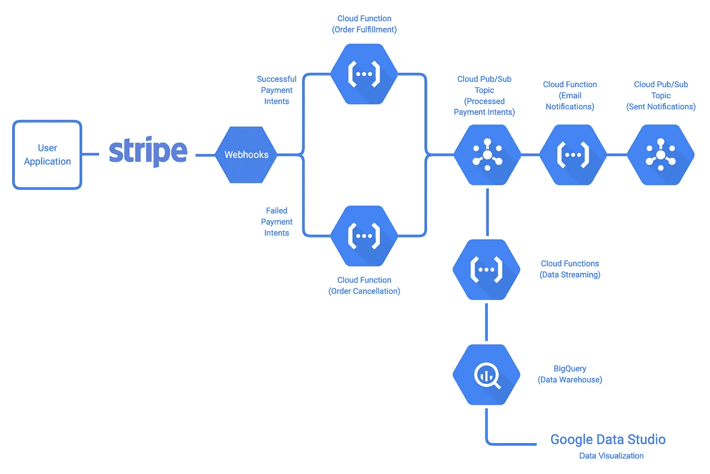

# 反应式事件驱动系统和推荐做法

> 原文：<https://medium.com/google-cloud/reactive-event-driven-systems-and-recommended-practices-785a1ab7e509?source=collection_archive---------3----------------------->

本文讨论了如何构建反应式事件驱动系统及其推荐实践。这是[构建事件驱动的云应用和服务](/@ratrosy/building-event-driven-cloud-applications-and-services-ad0b5b970036)教程系列的一部分。

# 介绍

正如开篇所讨论的，在反应式事件驱动系统中，发布者发出事件来调用(触发)订阅者中的动作；这种模式中的事件实际上与内部函数调用、HTTP 请求或 RPC 调用没有什么不同，从技术上讲，您可以将这种模式改进到您的单片或基于 HTTP RESTful/RPC 的微服务系统中的任何工作流中。常见的用例包括支付处理、预订/保留以及任何长时间运行的操作(例如视频转码)。

该模式具有以下优点:

*   高度解耦:发布者和订阅者之间几乎没有依赖性，服务现在可以独立发展
*   更好的可伸缩性(通过正确配置的消息队列/流解决方案):消息队列/流解决方案可以保留大量消息，并根据订户处理事件的速度进行自适应
*   更好的可扩展性:开发人员可以随时添加/删除订阅者，比如设置多个工作流同时处理同一个事件流

然而，不利的一面是跟踪事件流的难度越来越大。此外，由于图中没有执行路径，发布者不再保证得到响应；为了得到一些反馈，你可能需要自己做一些查询。

在本教程中，您将使用 [Stripe](https://stripe.com/) 和 [Google Cloud Functions](https://cloud.google.com/functions/) 构建一个简单的支付处理工作流，其中客户使用他们的信用卡通过 Stripe 支付，您的服务履行他们的订单并发送确认电子邮件。注意，这个工作流和许多用反应模式构建的工作流一样，是**事务性的**；更具体地说，在每种情况下，包括错误、崩溃和平台不可用(例如，谷歌云功能离线)，该工作流中的所有步骤要么成功完成，要么失败完成。

演示项目使用[云发布/订阅](https://cloud.google.com/pubsub/)进行消息队列/流传输。云发布/订阅是一个托管解决方案，发布者和订阅者通过云发布/订阅主题处理消息(事件)。

# 架构概述

工作流程如下:

1.  顾客通过应用程序进行购买。
2.  Stripe 对客户的信用卡进行充值，并向云函数`fulfillment`(如果充值成功)或`cancellation`(如果充值失败)发送 webhook 事件。
3.  `fulfillment`完成订单，并向云发布/订阅发布一个`orderProcessed`事件。`cancellation`拒绝了订单，还发布了一个`orderProcessed`事件到 Cloud Pub/Sub。如果`fulfillment`或`cancellation`无法处理订单，则发送的 webhook 事件条带将保存在 DLQs 中，以供进一步检查。
4.  `email`接收`orderProcessed`事件，发送确认邮件。如果`email`无法发送邮件，则`orderProcessed`事件将被保存在 DLQ 中以备进一步检查。
5.  `stats`也接收事件，并将订单的 ID 写入 BigQuery 进行引用。

# 设置

如果您喜欢在本地运行它，请按照以下步骤操作:

*   [设置您的 Python 开发环境](https://cloud.google.com/python/setup)。安装 Python 3。
*   [安装谷歌云 SDK](https://cloud.google.com/sdk/install) 。
*   按照`[gcp_tutorial.md](https://github.com/michaelawyu/stripe-google-demo/blob/master/gcp_tutorial.md)`继续。

# 理解代码

## 事件

该工作流程中涉及的事件在`[events.yaml](https://github.com/michaelawyu/stripe-google-demo/blob/master/events.yaml)`中定义。演示项目使用[一个由 CloudEvents Generator](https://github.com/michaelawyu/stripe-google-demo/tree/master/gcp/example_events) 准备的事件库来写入和读取事件。

## 至少递送一次，并且恰好递送一次

在单片系统中，内部函数调用总是同步的；如果你调用一个函数，它将被调用一次，而且正好是一次。不幸的是，在反应式事件驱动的系统中情况并非如此:大多数消息队列/流解决方案，如 [Cloud Pub/Sub](https://cloud.google.com/pubsub/) 和[Apache Kafka](https://kafka.apache.org/)(0.11 之前)，只保证至少一次交付，即所有事件最终都会被交付，尽管订户可能会看到少数事件两次或更多次。

> **注*注*注**
> 
> *即使您的消息队列/流解决方案承诺只传递一次，您也应该格外小心。这些承诺通常带有一个前提条件:对于 Kafka，恰好一次处理是一个端到端的保证，并且您的应用程序必须被设计为不违反该属性；*[*Google Cloud Tasks*](https://cloud.google.com/tasks/)*另一方面，errs 在必要时保证执行而不是一次执行，这意味着它承诺 99.999%的任务一次交付，但* ***不是所有的*** *。*

如果您的订户不是等幂的，那么至少有一次交付会在您最意想不到的时候引起您的愤怒。例如，在本教程的演示项目中，一个订单不应该执行两次。因此，强烈建议您通过事务将传入事件(或者至少是它们的标识符)保存在数据库中，并使用记录拒绝任何重复的事件。此外，您应该为您的事件设置一个 TTL(生存时间)值(例如 10 分钟)，这样您就不需要永远保存所有事件；任何不在数据库中但过时的事件也应该被拒绝。

这个演示使用 [Cloud Firestore](https://cloud.google.com/firestore/) ，一个托管的 NoSQL 数据库解决方案来保存事件。它首先检查事件的到期日期，然后使用一个事务来确保该事件以前从未被处理过。在云功能开始时使用事务把关，即使部署在执行过程中崩溃，每个事件也只处理一次。

此外，一些消息队列/流解决方案也不保证消息的排序。在这个用例中，消息的顺序是无关紧要的，但是，如果您的系统要求以正确的顺序接收消息，您将不得不以某种方式持久化事件，并自己解决问题。

## 可观察性

如前所述，反应式事件驱动系统的最大缺点之一是，您无法像在单一系统中使用 try-catch 块(或其等效块)那样观察系统中的事件(命令)流。比方说，如果事件流突然停止(可能是由于代码中的错误)，您将根本无法在上游(事件流的开始)或下游(事件流的结束)捕捉到它；要排除故障，您必须逐个检查每个发布者和订阅者。

幸运的是，有工具可以提供帮助。**分布式日志记录、集中式监控和分布式跟踪**是反应式事件驱动系统(以及几乎所有分布式系统)中可观察性的**三大支柱:**

*   分布式日志记录有助于将逻辑连接的所有组件的日志关联起来(例如在同一事件流中)。
*   集中式监视有助于从所有逻辑连接的组件收集指标。
*   分布式跟踪有助于跟踪流程中每个步骤花费的时间，从而度量其性能。

以下两个示例展示了如何分别使用 [Stackdriver Logging](https://cloud.google.com/logging/) 、 [Stackdriver Monitoring](https://cloud.google.com/monitoring/) 和 [OpenCensus](https://opencensus.io/) 进行分布式日志记录和跟踪，前者使用订单 ID 对日志进行分组，后者使用唯一 ID 对同一跟踪下的范围进行分组。

您可以使用过滤器标签在 Stackdriver 日志查看器中进行查询。orderId=myOrderId 跟踪处理该特定订单时生成的所有日志

当您在 Stackdriver 跟踪查看器中查看跟踪时，这两个跨度将与同一跟踪相关联，即使它们在两个不同的实例中运行。也可以用 orderId 来注释跟踪，以供参考

## DLQs (✨Let it 崩溃！)

一般来说，在 monolithic 或基于 HTTP RESTful/RPC 的微服务系统中，开发人员必须仔细检查每一个可能的输入，并尽最大努力从异常中恢复。这部分是因为函数调用(或 HTTP 请求/RPC 调用)在其核心是同步的；如果没有捕获到异常(并从中恢复)，调用本身将永远丢失——没有简单的方法可以恢复。

另一方面，反应式事件驱动系统中的事件是不可变的，并且可以很容易地被重新捕获，这要归功于充当中间人的消息队列/流解决方案。你可能会觉得奇怪，建议你在反应式事件驱动系统中采取“**让它崩溃**”的糟糕态度，关注订阅者中的快乐路径**，简单地拒绝任何你不能处理的事件到 DLQ(死信队列)。**

> ***重要的***
> 
> 显然，这种态度不适用于对您的业务逻辑至关重要的异常，这些异常仍然需要尽快发现和处理。例如，在这个演示项目中，当一个订单由于一个 bug 而无法履行时，您仍然需要在代码中尽快修复它。或者，您可以拒绝 DLQ 的所有死事件，并设置专门的工人来处理特定类型的错误。

死信队列是用于死信事件的消息队列，顾名思义。它允许开发人员

*   检查潜在的问题和缺陷
*   **检测和分析问题模式**
*   配置专门的工作人员来处理错误

DLQ 的美妙之处在于，它准确地捕捉到了事件制作者发送的信息，给了你第二次机会来轻松纠正问题。例如，如果出于某种原因，传递给 fulfillment 的订单 id 暂时损坏，而您在不久后找到了修复它们的方法，那么您可以从 DLQ 中检索所有被拒绝的事件，并要求`fulfillment`再次处理它们。

> ***注***
> 
> *与某些消息队列/流选项不同，云发布/订阅没有内置的 DLQ 支持。因此，这里我们设立了一个单独的题目作为 DQL；在您的生产系统中，您可以选择拒绝事件，而无需在代码中进行额外的设置。*

# 流控制

您可以随时暂停然后重新启动事件流的一部分。您的消息队列/流解决方案应该能够在这段时间内(在云发布/订阅的情况下为 7 天)阻止事件，以便您可以从中断的地方恢复。要在演示项目中执行此操作，请在[云控制台](https://console.cloud.google.com/cloudpubsub/subscription/list)中删除与您想要暂停的云功能相关联的订阅。当您准备好以后，可以重新创建一个。

默认情况下，Cloud Pub/Sub 根据您的云函数的事件消耗率自动控制流的速度。云功能自动扩展；如果您想限制云功能实例的最大数量，从而调节流量，[调整云功能的可扩展性设置](https://cloud.google.com/functions/docs/max-instances)。其他消息队列/流解决方案和计算平台也可能有类似的设置。

# 构建、测试、部署

云发布/订阅和其他一些消息队列/流解决方案具有[快照](https://cloud.google.com/pubsub/docs/replay-qs)功能，允许您重放一系列事件。当您为反应式事件驱动系统增加/评估新代码时，这非常有用:只需要求 Cloud Pub/Sub 在另一时间向新代码交付相同的事件序列，您就有了比较的基础。

此外，正如本系列教程开篇所介绍的，您可以在任何时候使用消息队列/流解决方案在反应式事件驱动系统中添加/删除订阅者。这将启用镜像模式，在这种模式下，您可以设置新版本的订阅服务器与旧版本的订阅服务器并肩工作，进行尝试。例如，这个演示项目添加了一个`stats`云函数，与`email`一起将订单状态保存到 BigQuery。

# 下一步是什么

了解流处理事件驱动系统。