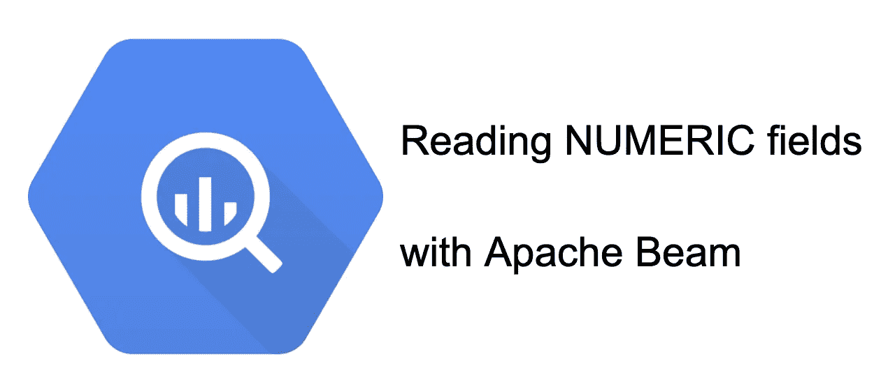
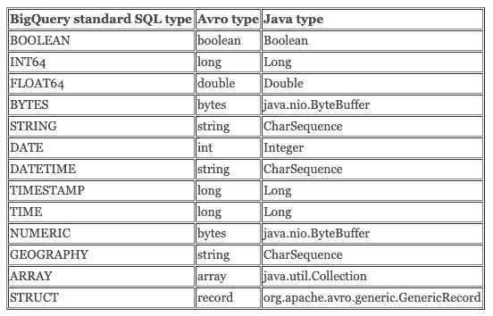

# 用 BigQueryIO 读取 Apache Beam 中的数值字段

> 原文：<https://medium.com/google-cloud/reading-numeric-fields-with-bigqueryio-in-apache-beam-23273a9d0c99?source=collection_archive---------0----------------------->

使用 Apache Beam 的 BigQueryIO 从 BigQuery 读取数值字段

在 BigQuery 的所有数字类型中， [NUMERIC](https://cloud.google.com/bigquery/docs/reference/standard-sql/data-types#numeric_type) 提供了最长的精度(38 位)和小数位数(9 位)，这使得它成为需要很长精度的应用程序的首选。在 BigQuery 中处理数值很简单，但是在从 BigQuery 中读取数据的 Apache Beam 管道中就不那么简单了。在本文中，我们将看到如何使用 BigQueryIO 从 BigQuery 读取这个数值类型，这样我们就可以在管道中使用精度尽可能长的十进制值。

当使用 [Apache Beam](https://beam.apache.org/) 和 [BigQueryIO](https://beam.apache.org/releases/javadoc/2.22.0/org/apache/beam/sdk/io/gcp/bigquery/BigQueryIO.html) 从 [BigQuery](https://cloud.google.com/bigquery) 读取数据时，从 BigQuery 读取记录有两种主要方式:使用`read(SerializableFunction)`(将 Avro `GenericRecord`转换为自定义类)或`readTableRows`(更容易使用，但性能较低)。

因此`read`提供了最佳的性能，但是它以开发人员的成本为代价:您需要将每个字段解析成正确的 Java 类型。

没什么大不了的，是吧？好吧，让我们看看 BigQueryIO 的[文档中的转换表:](https://beam.apache.org/releases/javadoc/2.22.0/org/apache/beam/sdk/io/gcp/bigquery/BigQueryIO.html)

从 BigQuery 读取 Avro 记录时的类型转换

所有类型看起来都很简单(boolean 映射到 BOOLEAN，FLOAT64 映射到 double，等等。).

但是，等一下，NUMERIC 的 Java 类型是什么？这是一个字节缓冲器…

我们如何在 Java 中将它转化成一个数字呢？

让我们看看如何在 Beam 中解析 Avro 字段并将它们映射到 Java 类型。

假设我们正在从 BigQuery 中读取数据，我们希望将表中的一行映射到我们的自定义类`SomeCustomObject`。我们可以在 BigQueryIO 中这样做，如下所示:

我们在`GenericRecord`中获得行值，现在我们需要将内容解析成正确的类型。使用上表，对于大多数基本类型来说，这是一个微不足道的任务。例如，对于字符串、长或双数:

上面的代码假设`fieldName1`是包含字符串的列名，`fieldName2`是包含长整型的列，`fieldName3`是包含双精度型的列。在生产环境中，实际检查字段的类型是明智的。我们在下面看到如何检查类型。

如果 BigQuery 中的列包含数字，我们如何进行转换呢？

这种转变更加复杂。总之，我们需要将字节数组映射到一个`java.math.BigDecimal`，因为其他数字类型没有足够的精度来保存一个数字。但是对`BigDecimal`进行这样的映射需要几个步骤。

让我们从一开始就把事情做对。让我们首先检查一下类型是否为 BYTES。当使用 GenericRecords 时，我实际上总是试图编写一个函数，该函数使用一个`switch`来尝试为每种 Avro 类型找到正确的解析代码。在下面的代码中，我们只包含了数字对象的代码。在这篇文章的后面，我会在同一个`switch`中包含更多类型的完整代码的链接。

在我们[确定类型是 BYTES](https://gist.github.com/iht/e848365e8f3a4c06fefba8c2967100cd#file-readnumeric-java-L8) (第 8 行)之后，我们检查是否有逻辑类型。那是什么？BYTES 实际上用于两种大查询类型:BYTES 和 NUMERIC。NUMERIC 类型有一个额外的*逻辑类型*，它包含 Avro GenericRecord 中编码的数字的精度和小数位数。

我们需要找出**的小数位数**，以便能够将字节数组解析为一个数字。这是在上面代码片段的第 16 行和第 17 行中完成的；标度实际上是 Avro GenericRecord 模式的一部分。

GenericRecord 中的值被编码为 ByteBuffer ( [第 19 行](https://gist.github.com/iht/e848365e8f3a4c06fefba8c2967100cd#file-readnumeric-java-L19))。然后，我们获取 ByteBuffer 并将其解析为 BigDecimal，使用我们刚刚恢复的 scale 值([第 20–22 行](https://gist.github.com/iht/e848365e8f3a4c06fefba8c2967100cd#file-readnumeric-java-L20-L22))。

在 Beam 中，我们如何将上述所有内容结合起来从 BigQuery 中读取数据？[我添加了一个要点和一个完整的管道示例](https://gist.github.com/iht/7f8a8f4984a7640fd05220096b098f64)。在这个例子中，输入是一个只有两个字段的表: *key* 是 STRING 类型的列，而 *value* 是 NUMERIC 类型的列。该示例包含一个通用函数[，用于从通用记录](https://gist.github.com/iht/7f8a8f4984a7640fd05220096b098f64#file-readnumericinbeam-java-L40-L94)中解析不同类型的数据。我们需要知道我们正在读取的字段的类型以使用该函数(参见如何使用该函数读取*键*和*值*列的[示例)。该函数比其余代码片段中显示的代码稍微复杂一些，因为在 Avro 中，可空的 BigQuery 列实际上被表示为一个 *union* 。但是可空字段将是另一篇文章的主题！—注意:](https://gist.github.com/iht/7f8a8f4984a7640fd05220096b098f64#file-readnumericinbeam-java-L113-L114)[发布可空字段的帖子！](/@iht/reading-nullable-fields-with-bigqueryio-in-apache-beam-f0e36e1f6c7)

因此，如果您有一个 NUMERIC 类型的列，不要因为试图从 Apache Beam 管道中读取它而感到沮丧。您仍然可以使用`GenericRecord`并比使用`TableRows`获得更多的性能，您只需要从模式中提取数字的比例，并使用它来构造一个`BigDecimal`对象。