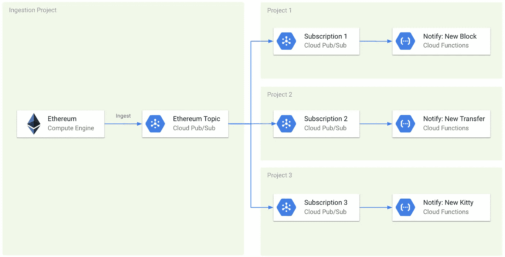

# 免费为每个人提供实时以太坊通知

> 原文：<https://medium.com/google-cloud/real-time-ethereum-notifications-for-everyone-for-free-a76e72e45026?source=collection_archive---------0----------------------->

将 [Google PubSub](https://cloud.google.com/pubsub/) 与[云功能](https://cloud.google.com/functions/)相结合，将允许将以太坊区块链吸收到订阅主题中，在数百万人之间共享，并在无服务器功能中运行自定义逻辑。

每当新的区块被开采，一些代币被转移到你的地址，或者一个新的加密猫[诞生](https://github.com/dapperlabs/cryptokitties-bounty/blob/master/contracts/KittyBase.sol#L15)，你都可以通过电子邮件或 Slack 得到通知。当前 [PubSub](https://cloud.google.com/pubsub/pricing) 和[云函数](https://cloud.google.com/functions/pricing)的定价模型将在大多数情况下实现自由伸缩。

它是这样工作的:

区块链数据被流式传输到“摄取项目”(GCP 的一个项目是管理云资源的抽象)中的“以太坊主题”(Ethereum Topic)。只有摄入计入该项目。主题是[共享](https://cloud.google.com/pubsub/docs/access-control)给只读访问的每个人。

用户可以在自己的项目中为主题创建[推送订阅](https://cloud.google.com/pubsub/docs/push)。然后，这些订阅可以[连接到实现定制逻辑的云功能](https://cloud.google.com/functions/docs/tutorials/pubsub)，例如[向空闲频道](https://cloud.google.com/cloud-build/docs/configure-third-party-notifications#writing_the_cloud_function)发送消息，或者进行交易。用户只需支付 PubSub 订阅和云函数调用的费用。

PubSub 中的前 10GB 是[空闲的](https://cloud.google.com/pubsub/pricing)。在云功能中，每月 200 万次调用、400，000 GB 秒、200，000 GHz 秒的计算时间和 5GB 的互联网出口流量是[免费的](https://cloud.google.com/functions/pricing)。许多使用情形(例如，订阅令牌传输、按数据块分组和发送通知— 3GB 数据、每月 20 万次调用)将适合免费层。对于免费层未覆盖的情况，费用将是最低的。

这种架构存在一些挑战，例如处理链重组和配置 PubSub 推送端点，这些都是可以解决的。

在 [Nansen.ai](https://nansen.ai/) 进行试用，查看我们实施的智能警报，通知您特定地址或实体的交易，或来自智能货币地址或交易所的资金流动。

另请参阅:

*   [如何在 BigQuery 中查询所有以太坊地址的余额](/google-cloud/how-to-query-balances-for-all-ethereum-addresses-in-bigquery-fb594e4034a7)
*   [实时以太坊免费通知大家](/google-cloud/real-time-ethereum-notifications-for-everyone-for-free-a76e72e45026)
*   [big query 中的以太坊:我们如何构建这个数据集](https://cloud.google.com/blog/products/data-analytics/ethereum-bigquery-how-we-built-dataset)
*   在推特上关注我们:[https://twitter.com/EthereumETL](https://twitter.com/EthereumETL)