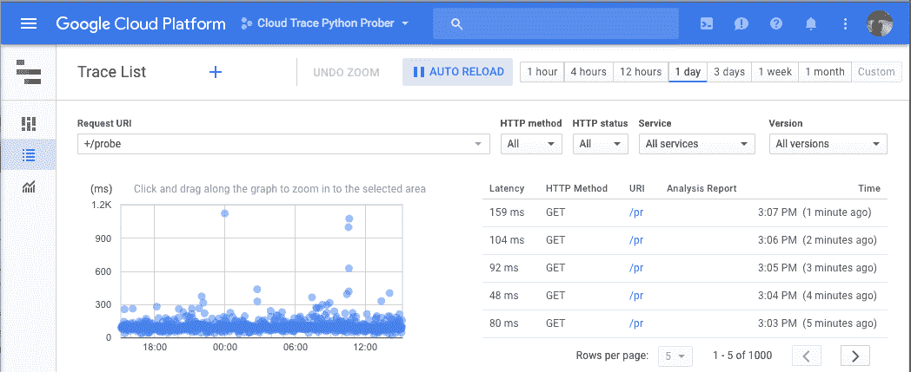
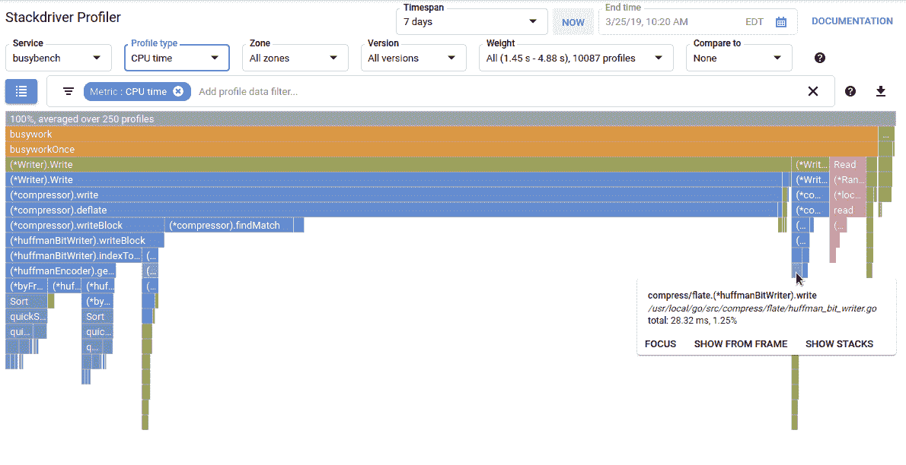

# 最近的 GCP“行动”视频

> 原文：<https://medium.com/google-cloud/recent-gcp-operations-videos-fa50c130c21c?source=collection_archive---------1----------------------->

你会发现下面是最近发布的视频，介绍了最常见的，有时非常独特的产品，以帮助您操作部署在谷歌云上的服务和应用程序。

devops 工具的“Hello world”可以说是跨涉及多个产品的分布式基础设施收集、读取和解析日志的能力。 [**云日志**](https://cloud.google.com/logging/docs) 存储所有谷歌云产品的日志，并为您提供搜索、监控和警报功能。通过改进的日志查看器、高级导出功能和强大的 API，有更多的针和更少的干草堆:

云日志记录介绍视频

下一个视频是关于位于开发人员和运营人员之间的产品: [**错误报告**](https://cloud.google.com/error-reporting/docs) 帮助您更好地捕捉应用程序错误，对它们进行分类，并管理它们的生命周期。

它会自动将应用程序中的`Error`或`Critical`级错误分组，消除重复，并在出现新类型的错误时通知您。

这可以跨多种语言工作，并由云函数、应用引擎、云运行、计算引擎和 Google Kubernetes 引擎提供开箱即用的支持。

请务必观看视频，了解错误的*解决状态*，将错误链接到错误跟踪系统的能力，以及如何在您的移动设备上得到通知:

Google Cloud 将 Dev+Ops 功能集向前推进了一步，提供了分布式跟踪、代码分析和独特的调试功能。

构建于 [OpenTelemetry](https://opentelemetry.io/) ， [**云跟踪**](https://cloud.google.com/trace/) 帮助您确定当您的应用程序执行特定任务时，时间实际花费在何处。它收集多个谷歌云产品和许多支持的语言的延迟数据。

控制台中提供了跟踪，每个跟踪都带有 URI、延迟和时间戳。控制台还允许您比较不同时间段的延迟分布。

对于任何给定的请求 URI，都会显示一个请求持续时间的热图，直观地提示您哪些特定请求可能需要进一步调查:

每一个跟踪细节都有一个网络依赖图，它应该给你足够的数据来跟踪你的架构的各个部分在哪里花费了时间。

一旦确定了应用程序中可能需要修改代码的特定瓶颈，就该使用分析器了。

与任何其他分析器一样， [**云分析器**](https://cloud.google.com/profiler/docs) 收集 CPU 使用和内存分配信息。这个分析器的特别之处在于，在从生产应用程序中连续收集数据时，几乎没有开销。

收集后，分析数据将使用火焰图显示，火焰图将大量信息压缩成紧凑易读的格式:

最后， [**云调试器**](https://cloud.google.com/debugger/docs) 是一个检查应用程序状态的工具，在任何代码位置，不停止或减慢正在运行的应用程序。

它提供了两个独特的特性:*快照*来捕获调用栈并检查局部变量和*日志点*(我的最爱！)来注入日志记录语句，而无需重启应用程序。

在一集短片中了解这三种工具:

*请继续关注那些在家里录制的视频的幕后细节(当然是在预算有限的情况下)以及沿途的一些学习经历！*