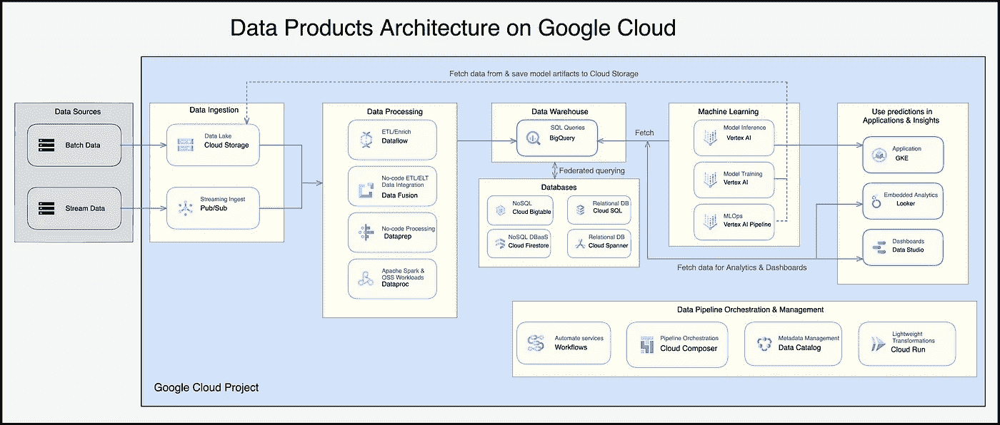

# 在数据网格中构建第一个数据产品的方法

> 原文：<https://medium.com/google-cloud/recipe-for-building-your-first-data-product-in-a-data-mesh-78b52338ef59?source=collection_archive---------0----------------------->

千里之行始于足下。对于一个[数据网](https://martinfowler.com/articles/data-mesh-principles.html)，这个旅程从一个单一的[数据产品](https://www.thoughtworks.com/about-us/events/webinars/core-principles-of-data-mesh/data-as-a-product)开始。

在本文中，我将概述构建您的第一个数据产品的方法。像所有的食谱一样，欢迎你根据自己的情况和喜好进行调整。

为了让这篇文章变得生动，我还将提供一个例子，展示 Google Cloud 上的数据产品架构。

本文假设读者要么是数据网格的业务发起人，要么是支持数据网格的数据平台团队的成员。

**1。找到一个可以用数据网格解决的业务案例**

首先，您需要找到一个业务发起人，他有一个特定的业务机会或挑战，但无法在现有的数据基础设施上有效地实现。几个例子是:

*   通过 API 提供新的服务产品，潜在地利用预测分析
*   建立综合客户数据库，以改善客户服务、营销和运营
*   简化风险和监管报告

解决这一挑战或机遇的投资回报需要证明由全职工程师组成的小团队构建和运行解决方案是合理的。理想情况下，该业务发起人应 1)在交付变革项目方面有良好的记录，2)倾向于成为[技术采用生命周期](https://en.wikipedia.org/wiki/Technology_adoption_life_cycle)中的早期采用者。

**2。确保业务准备就绪并获得资金**

第二，您需要获得该业务赞助商的认可，以拥有该新数据产品的开发。至关重要的是，他们了解数据网格的目标以及他们在构建该数据产品中的角色。具体来说:

*   数据网格的目标是使分布式团队能够从数据中创造商业价值。它旨在通过将数据视为产品并为分布式团队提供具有嵌入式治理的自助式数据平台来创建网络效应。
*   业务发起人拥有这种新数据产品的业务需求，以及端到端产品开发生命周期的责任。
*   业务发起人将为跨职能团队分配资金，以交付数据产品。该团队负责整理和交付产品路线图，以确保数据产品为给定的业务机会获取价值。他们还负责第 2 天的操作以及产品的任何持续改进和维护。
*   根据实现的业务成果来衡量进展，数据产品团队的资金可以根据业务审查进行调整，而无需变更控制流程。

**3。证明数据平台准备就绪，帮助人们走向成功**

第三，确保您的数据平台具备搭载这种新数据产品的技术能力。您需要确保数据产品所需的任何技术或基础设施服务已被批准在您的组织内使用。

目标是减少摩擦，降低采用这些服务的门槛。因此，应该有关于如何使用这些服务的清晰记录的安全护栏、开发人员指南、操作手册和架构蓝图。

至关重要的是，服务应该作为自助服务功能提供。这可以采用“基础设施即代码”模块的形式来部署云数据库，也可以采用模板化的数据管道的形式，以便分布式团队能够轻松采用和扩展。该指南还需要涵盖:

*   遵循 CI/CD 最佳实践的生产部署流程
*   如何满足平台级安全和治理护栏
*   如何与平台的第 2 天操作工具集成，用于日志记录、监控、可观察性、审计端点等…

作为一个数据平台团队，当一个分布式团队可以部署和管理一个数据产品而不需要您参与这个过程时，您就是成功的。只有当你作为客户加入了许多数据产品团队，这一点才能得到证实。

在开始阶段，如果找到一个愿意共同投资来构建他们所需的数据平台组件的客户，您可能会从中受益。作为数据平台团队，您的首要任务是开发该数据产品的功能，以便该平台的其他客户可以重用，而您的客户的首要任务是确保该平台适合实时数据产品应用。

将数据平台团队中的数据工程师嵌入到业务领域团队中，您也会从中受益。在这个参与模型中，业务领域团队拥有产品待办事项，而数据工程师作为同一个团队的一部分，提供技术专长来交付待办事项**。在项目结束时，数据工程师可以选择留在产品团队或返回数据平台团队，开始重新打包他们开发的产品，供其他数据平台客户重用。**

值得一提的是，数据平台本身是一个内部产品，用 Teams Topologies fame 的 Matthew Skelton 的话说，应该是一种[“为工程师策划的体验”](https://twitter.com/matthewpskelton/status/1305630151867330571?lang=ca)。数据平台的授权、降低技术壁垒和最小化集体技术债务的目标都是为使用它的社区服务的，例如数据产品团队，因此需要客户的不断反馈和完善来实现其目的。

**4。讲述你的成功故事**

开发一个数据产品是一个渐进的过程，因此你可以通过设置中间的里程碑来定期回顾进展和你的赞助商所取得的商业影响。这也是您庆祝任何成功并与组织的其他人分享您的成功故事的机会，以便吸引更多的客户加入数据网格。

**5。冲洗并重复**

对于每一个数据产品，您都应该致力于缩短数据平台上的下一组数据产品的价值实现时间。整个数据网格的价值至少应该与您的数据产品的组合价值成比例。随着数据产品数量的增加，由于网络效应允许数据产品相互叠加，数据网格的价值将呈指数级增长。

正如您所猜测的，采用数据网格可能需要您对数据文化和数据操作模型的看法发生巨大转变。我之前在 [10 个你还没准备好采用数据网格的原因](/google-cloud/10-reasons-why-you-should-not-adopt-data-mesh-7a0b045ea40f)中讨论过你在采用数据网格时可能遇到的文化和组织挑战。本文的目标是用一个关键信息来平衡前一篇文章的信息:**您可以从小处着手，逐步发展到完整的数据网，一次一个数据产品！**

**Google Cloud 上的数据产品架构示例**

[许多组织](https://cloud.google.com/customers#/products=Data_Analytics,Databases)利用我们全面的无服务器集成数据服务套件，在 Google Cloud 上构建了成功的数据产品，例如:

*   [无服务器数据仓库的 BigQuery](https://cloud.google.com/bigquery)
*   [数据流](https://cloud.google.com/dataflow)用于统一批处理和流数据处理
*   用于[无服务器 Spark](https://cloud.google.com/dataproc-serverless/docs) 和运行开源数据分析应用的 [Dataproc](https://cloud.google.com/dataproc)
*   [嵌入式分析和可视化的 Looker](https://cloud.google.com/looker)
*   [端到端 MLOps 的顶点 AI](https://cloud.google.com/vertex-ai)
*   [用于托管](https://cloud.google.com/composer) [Apache Airflow](https://airflow.apache.org/) 工作流编排服务的云合成器
*   [云扳手](https://cloud.google.com/spanner)用于无服务器和久经考验的关系数据库服务

下图展示了 Google Cloud 上典型的数据产品架构。该图摘自[谷歌云架构制图工具](https://cloud.google.com/blog/topics/developers-practitioners/introducing-google-cloud-architecture-diagramming-tool?utm_source=twitter&utm_medium=unpaidsoc&utm_campaign=CDR_pve_gcp__4words_&utm_content=-)，由 [@pvergadia](https://twitter.com/pvergadia?lang=en) 提供。

在这个架构中，每个 Google 云租户都有自己的[项目](https://cloud.google.com/resource-manager/docs/creating-managing-projects)，他们可以利用数据平台团队提供的部署模板和防护栏来管理其数据产品的端到端生命周期。大多数服务都是无服务器的，因此需要管理的基础设施很少，这使得数据产品团队可以专注于从他们的数据中创造价值。为了确保全球互操作性和治理，数据平台租户还可以受益于以下跨 Google 云数据堆栈的横向集成服务:

*   [分析中心](https://cloud.google.com/analytics-hub?utm_source=youtube&utm_medium=unpaidsoc&utm_campaign=CDR_ali_gcp_h8_xcbtyttu_#section-3)通过 BigQuery 实现零拷贝数据共享
*   [Dataplex](https://cloud.google.com/dataplex) 用于跨数据湖和数据仓库环境的统一治理
*   [Cloud IAM](https://cloud.google.com/iam) 用于所有谷歌云服务的统一访问管理
*   [用于集成日志记录和监控的云操作套件](https://cloud.google.com/products/operations)
*   [云资产清单](https://cloud.google.com/asset-inventory)用于审计所有项目和服务的资产

有关如何在 Google Cloud 上构建数据网格的更多信息，请参见作为 Dataplex GA 发布的一部分发布的新的 [Google Cloud 数据网格白皮书](https://cloud.google.com/blog/products/data-analytics/build-a-data-mesh-on-google-cloud-with-dataplex-now-generally-available)。

希望这篇文章对你有所帮助。是不是少了什么？请通过 Twitter 上的[*@ thinh _ ha*](https://twitter.com/thinh_ha)*或 LinkedIn 上的***联系我，告诉我你的想法。**

*特别感谢我的同事 Akhilesh Singh、Anant Vikram 和 andRubén Fernández 帮助审阅本文。*