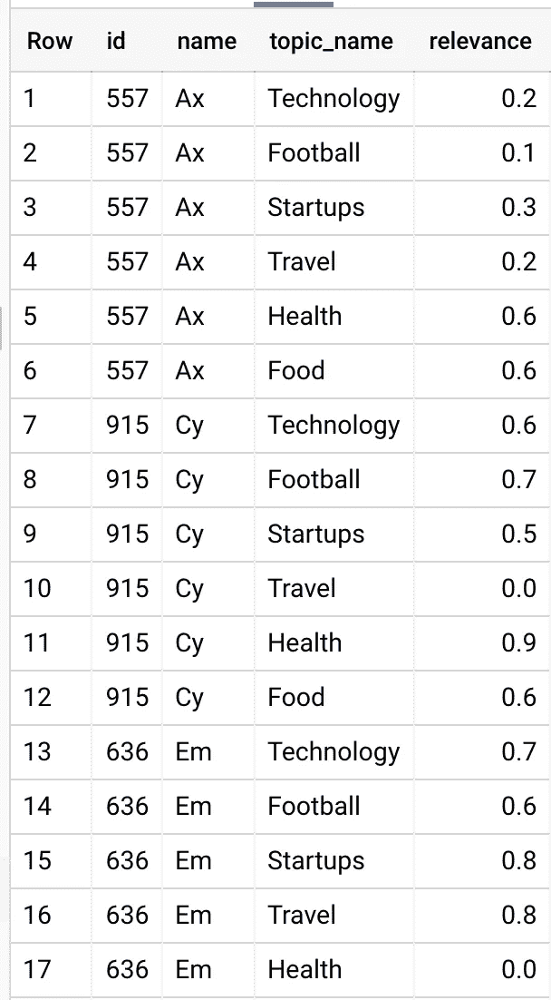

# 使用 BigQuery 为您的应用程序用户推荐个性化内容

> 原文：<https://medium.com/google-cloud/recommend-personalised-content-for-your-app-users-using-bigquery-239b1398a46a?source=collection_archive---------0----------------------->


当你最喜欢的应用程序向你展示相关内容时，你有多少次感到惊讶？

无论你是在使用 Youtube、网飞还是任何其他应用程序，你都会注意到推荐系统是他们成功的主要因素，但拥有一个推荐系统对你的初创公司来说可能有点沉重，添加像协同过滤/基于内容的过滤这样的机器学习算法，之后，你需要根据你的大数据训练一个模型，最终你会得到一个静态模型来预测内容与用户的相关性。

前面的方法很难应用，而且成本很高，任何模型训练都需要几个小时，到时候可能会让你的推荐引擎变得毫无用处！！，模型漂移是一个会一直追着你的问题，用户的数据以一种非常快节奏的方式保持变化。

# 可选择的解决方案

**我在这里提出的解决方案与新闻聚合器有关，它使用显式规则，不像 ML！您可以更改规则以匹配您的域。**

新闻聚合器从不同的出版商/主题构建一个精选的文章列表，并让用户能够关注出版商和阅读文章，智能新闻聚合器试图为用户提供相关的文章，根据研究案例，我们注意到在提供文章时几乎没有改善用户体验的规则:

用户对特定主题的文章感兴趣。

与其他发布者相比，用户更喜欢某些发布者。

用户更喜欢有一些主要关键字的文章。

推荐者不应该推荐用户已经阅读过的文章。

这个推荐器很简单，因为它是一个作为 cronjob 运行的命令，以每小时为用户聚集推荐的文章，工作将在离线模式下完成，以准备向用户推送/突出显示推荐的文章，即使当您有数千篇文章和数十万用户时，这项工作也只需几分钟即可执行！

# BigQuery

**为什么我首先喜欢使用 BigQuery？**

BigQuery 是一个来自 GCP (Google 云平台)的无服务器服务，对于 BigData 工作非常高效和强大，它可以以一种非常简单的方式与其他 GCP 服务集成，不需要做任何系统操作或托管，它有许多现代编程语言如 PHP，Go，node.js …等的 CLI 和 SDK，易于加载数据，有 2 种不同的计费方法和许多其他原因，只需从[这里](https://cloud.google.com/bigquery)看一下。

确保你使用 BigQuery 作为一个仓库，你在那里保留一个副本用于长期存储，你可能需要建立 ETL 管道来保持从你的数据库/ES 到 BigQuery 的数据移动，GCP 为你提供了一个处理这个的工具[谷歌数据融合](https://cloud.google.com/data-fusion/)

# 主菜！

**首先，这里所有的查询和示例数据都可以在**[**Github**](https://github.com/omegaes/Recommendation-Engine-BQ)**上找到。**

我不会讨论你将如何使用这个查询，对我来说，我会使用 [Laravel](https://laravel.com) ，它有一个很好的方法来使用 [Artisan 控制台](https://laravel.com/docs/8.x/artisan)构建命令，你只需要将 [PHP BigQuery SDK](https://github.com/googleapis/google-cloud-php-bigquery) 添加到你的 composer！

这里是我们需要处理的数据，`article`候选文章表，`user`有用户的表，每个`article` 属于`topic`和`publisher`

`user_article_feed`保留用户在 feed 中看过的文章。

`user_article_read`保留用户以前读过的文章。


要浏览文章表，让我们运行:

```
select * from test_data.article
```


在`user`表中，我们有 1000 个用户(id，name)。

基于历史用户数据，我们可以注意到，用户 X 可能对某些基于视图/共享/反应/点击率的主题/发布者感兴趣..等等，从这些数据中，我们可以生成一个用户度量的相关性分数(0 -> 1)，这里是`user_publisher`和`user_topic` come，两者都是预先计算的表，必须很好地维护和经常更新。



在本例中，我们有 100 篇不同的文章和 1000 个用户，这意味着我们有 100，000 种不同的组合，每个用户有 100 篇不同的文章可以阅读，但最终，一个用户需要前 X 篇相关的文章，BigQuery 可以提供出色的可扩展体验来做到这一点，只需使用标准 SQL！

我将向您展示可以实现这一点的简单查询:

```
with article as 
( 
  select * from test_data.article
),
user as (
  select * from test_data.user
),
topic as (
  select * from test_data.topic
),
user_read as (
  select * from `test_data.user_article_read` 
),
user_feed as (
  select * from `test_data.user_article_feed` 
),
user_publisher as (
  select * from test_data.user_publisher
),
user_topic as (
  select * from test_data.user_topic
),
enhanced_articles as (
  select *, 
  ROW_NUMBER() over (Partition BY article.topic_id ORDER BY score DESC ) as article_rank,
  max(score) over (Partition BY article.topic_id) as article_max_score,
  min(score) over (Partition BY article.topic_id) as article_min_score,
   1000 * (score / max(score) over (Partition BY article.topic_id)) as enhanced_scrollfrom article
),
user_article as (
  select user.id as user_id, article.id as article_id, article.score  as original_score, article.publisher_id , article.topic_id, article.enhanced_scroll  
  from user cross join enhanced_articles as article
),
user_article_with_dimension_relevance as (
  select user_article.*,  
  user_publisher.relevance as user_publisher_relevance,
  user_topic.relevance as user_topic_relevance
  from user_article 
  left join user_publisher on user_publisher.user_id = user_article.user_id  and user_article.publisher_id = user_publisher.publisher_id 
  left join user_topic on user_topic.user_id = user_article.user_id and user_topic.topic_id  = user_article.topic_id 
),
user_article_check_read_and_feed as (
  select distinct user_article_with_dimension_relevance.*, 
  IF(user_read.article_id is null, 0, 1) as read,
  IF(user_feed.article_id is null, 0, 1) as feed
  from user_article_with_dimension_relevance
  left join user_feed on user_feed.user_id = user_article_with_dimension_relevance.user_id and user_feed.article_id  = user_article_with_dimension_relevance.article_id
  left join user_read on user_read.user_id = user_article_with_dimension_relevance.user_id and user_read.article_id  = user_article_with_dimension_relevance.article_id
),
user_article_filtered as (select * from user_article_check_read_and_feed where read = 1 or feed = 1 or user_publisher_relevance = 0 or user_topic_relevance = 0
),
user_article_with_relevance_score as (
  select u.user_id, u.article_id, u.original_score, u.publisher_id, u.topic_id, ((user_publisher_relevance+user_topic_relevance)/2) as relevance_score, u.enhanced_scroll 
  from user_article_filtered as u),
user_article_with_calculated_score as (
   select *, (enhanced_scroll*relevance_score) user_article_relevance_score,
   ROW_NUMBER() over (Partition BY user_id ORDER BY (enhanced_scroll*relevance_score) DESC ) as user_article_rank,from user_article_with_relevance_score
),
user_with_top_articles as (
   select user_id, 
   to_json_string(ARRAY_AGG(
    STRUCT<article_id INT64, original_score INT64, publisher_id INT64, topic_id INT64, relevance_score FLOAT64, enhanced_scroll FLOAT64, user_article_relevance_score FLOAT64, user_article_rank INT64>(article_id,original_score,publisher_id, topic_id, relevance_score, enhanced_scroll, user_article_relevance_score, user_article_rank)
   ) ) data
   from user_article_with_calculated_score
   where user_article_rank <= 5
   group by user_id)
 select * from user_with_top_articles
```

所以这个查询被认为是一个步骤流水线，或者一个递归查询，执行是自下而上的，但是我们将讨论自上而下。

我将跳过前几个子查询，因为它太简单了，`enhance_articles`意味着为文章评分做共同的基础，因为文章的评分值可能因不同的主题而异，所以我们将文章的评分设为 0 - > 1000 的值。

`user_article_with_dimension_relevance`将包含所有用户-文章组合，包括文章得分、用户文章-主题得分和用户文章-出版商得分。

`user_article_check_read_and_feed`在这一步，我们将过滤一些行，如果用户阅读了文章或在他的订阅源中获得了文章，则无需再次推荐，这样将会降低用户的候选文章数量。

`user_article_with_calculated_score` 这里，我们根据文章得分和用户-文章-主题/用户-文章-出版商得分计算用户文章得分


与另一篇文章相比，为用户#2 推荐的第一篇文章得分较低，但是其“主题和出版商”是用户的首选，并且该文章在其“主题”中得分最高(1000 ),并且用户还没有阅读该文章，这意味着它很有可能会吸引用户的注意力！

此外，我们注意到为用户#2 推荐的第二篇文章与第三篇相比具有较低的文章分数，这两篇文章具有相同的出版商，但是来自不同的主题，并且与主题#20 相比，该用户对主题#34 更感兴趣，因此新的分数将是(相关性分数+文章增强滚动)/2，作为用于文章排名的最终分数。

`user_with_top_articles`这一步只是改变输出方式，让你的命令更容易得到结果，所以不是每个用户得到 X 行，而是每个用户得到 1 行，文章被分组到 JSON 数组中！


# 结论

BigQuery 是一个强大的工具，可以在几秒钟/几分钟内处理万亿字节的数据，您可以以多种不同的方式在后台作业中使用这种能力，这里我展示了一个简单的方法，仅通过使用 SQL 就可以在 2 分钟内处理大约 100GB 的数据。

推荐引擎在你的应用中是一个非常重要的部分，对于没有 ML scientist 的团队来说，这是一个非常简单的引擎，也是一个展示如何使用 BigQuery 的例子

欢迎在下面的评论中分享你的想法，如果你有任何问题或反馈，请不要犹豫！