# Google DataProc 上的 Spark 推荐系统

> 原文：<https://medium.com/google-cloud/recommendation-systems-with-spark-on-google-dataproc-bbb276c0dafd?source=collection_archive---------1----------------------->

推荐引擎。火花。云基础设施。大数据。

感觉被时髦的流行语淹没了吗？

在本教程中，您将学习如何使用 PySpark 创建一个电影推荐系统。

本教程将更多地关注部署而不是代码。我们将在谷歌的云基础设施上部署我们的项目，使用:

*   谷歌云数据平台
*   谷歌云存储
*   谷歌云 SQL

# 目录:

1.  获取数据
2.  存储数据
3.  训练模型
4.  部署到云 DataProc

# 获取数据:

您首先需要下载我们将要使用的数据集。你可以在这里访问小版本的 movielens 数据集(1MB)。在验证您的工作之后，您可以使用完整的数据集[在这里](http://files.grouplens.org/datasets/movielens/ml-latest.zip) (224MB)来测试它。

在该数据集中，您将利用 ratings.csv 和 movie.csv 文件。每个文件都提供列标题作为第一行条目。在将数据加载到 CloudSQL 之前，您需要删除它。

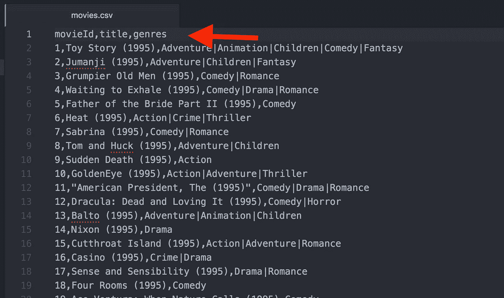

# 存储数据:

## 谷歌云 SQL:

> Google Cloud SQL 是一项服务，它使得在云中设置、维护、管理和管理关系型 MySQL 数据库变得非常容易。云 SQL **托管在谷歌云平台上，为在任何地方运行的应用程序提供数据库基础设施。**
> 
> 信用:[https://cloud.google.com/sql/](https://cloud.google.com/sql/)

您需要创建一些 SQL 脚本来创建数据库和表。

## 将 SQL 脚本和数据加载到云存储中:

创建一个 bucket 并将脚本加载到 Google 云存储中。云存储中的存储桶具有唯一的名称标识。您将**需要**用您选择的名称替换下面的内容。从终端使用 Google-Cloud-Sdk:

```
$ gsutil mb gs://**movie-rec-tutorial**
$ gsutil cp *.sql gs://**movie-rec-tutorial**$ gsutil cp movies.csv ratings.csv gs://**movie-rec-tutorial**
```

*(如果你没有设置 Google-Cloud-Sdk)*

```
brew install cask google-cloud-sdkgcloud init
```

完成这一步后，您可以查看 GCloud Storage 并确认文件已成功上传。

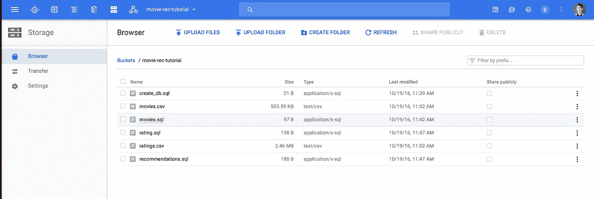

## **配置云 SQL:**

接下来，您将创建您的 sql 数据库。选择第二代。(*我已禁用备份，因为这是一个项目，没有必要，您可以选择其他方式*):

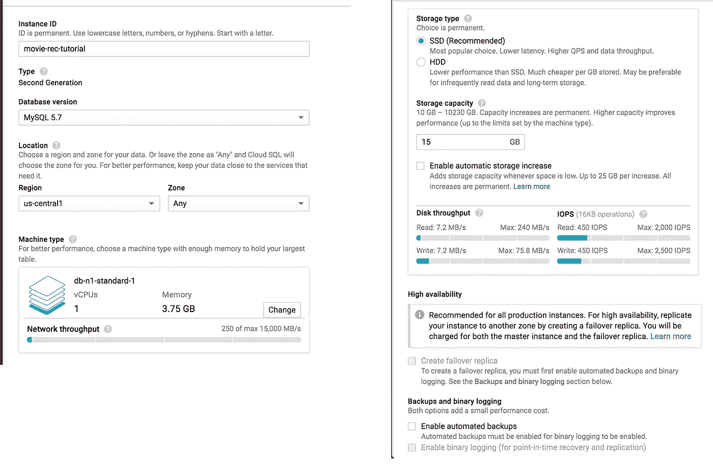

谷歌云 SQL 配置

初始化数据库后，设置新的 root 密码(实例->访问控制->用户) :

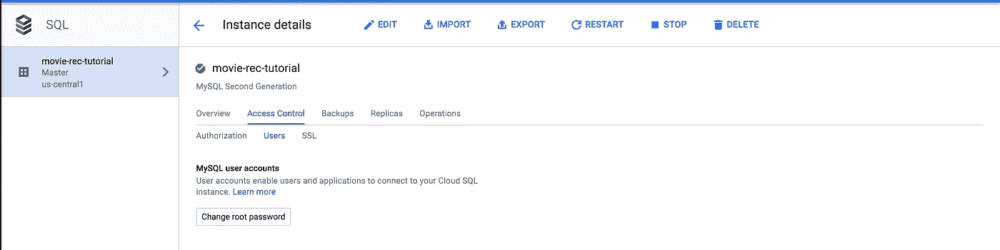

将之前加载到云存储中的脚本导入到 SQL 实例中。这将创建数据库和表。(导入->存储名称->脚本)。由于外键约束，按以下顺序执行脚本:(create_db、movies、ratings、recommendations)

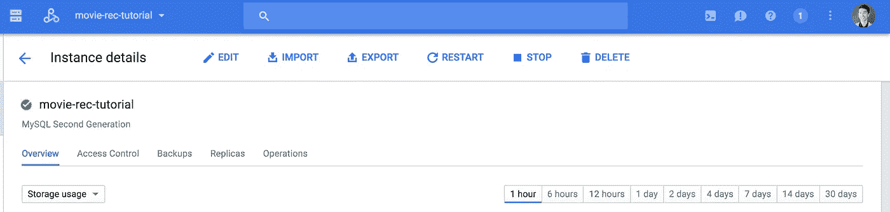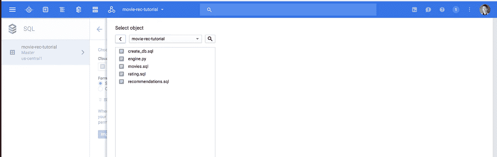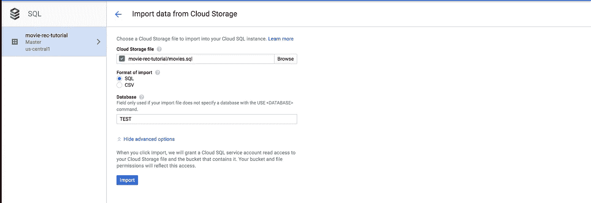

当加载表脚本时，您需要在高级选项中指定数据库。create_db 文件创建一个名为“TEST”的数据库，在这里引用。

## **加载数据:**

获取 csv 文件(movies.csv、ratings.csv ),并将它们分别加载到 movies 和 ratings 表中。

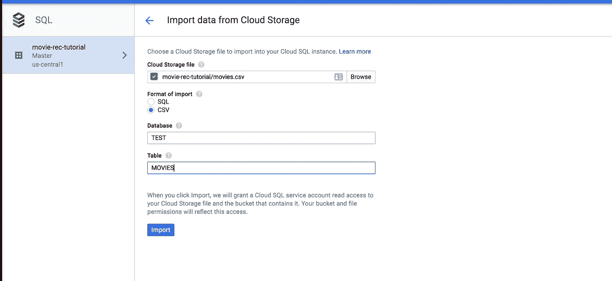

## 打开网络:

要从集群连接到实例，您需要允许节点的 ip 地址访问。为简单起见，向全世界开放允许的流量。

*   ***注意:这不应该在生产中进行。请查看** [**CloudSQL 代理**](https://cloud.google.com/sql/docs/compute-engine-access) **的生产级安全性。**

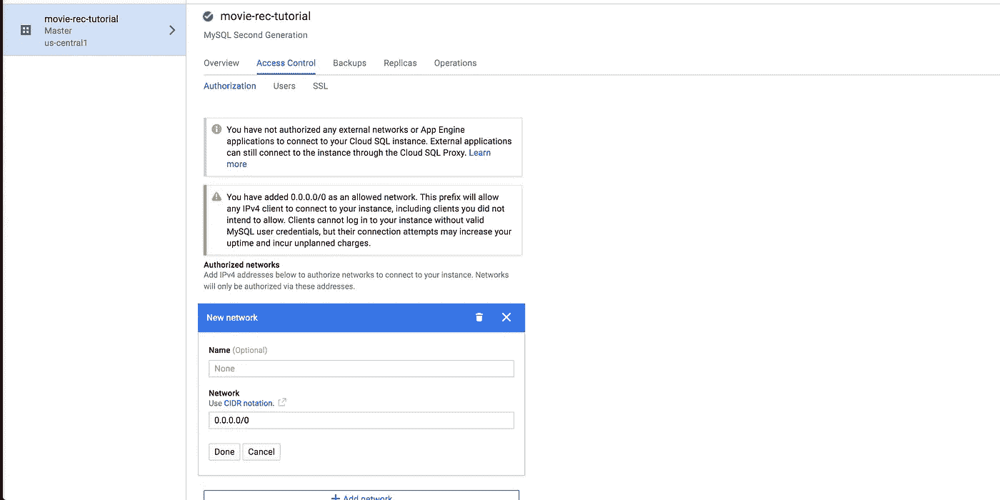

请注意安全警报

## 确认:

如果您想确认到目前为止一切都已正确执行，请使用您最喜欢的 Mysql 客户端并连接到您的实例。[续作 Pro](https://www.sequelpro.com/) 是我的首选。

您需要获取 SQL 实例的 IPv4 地址，该地址位于:

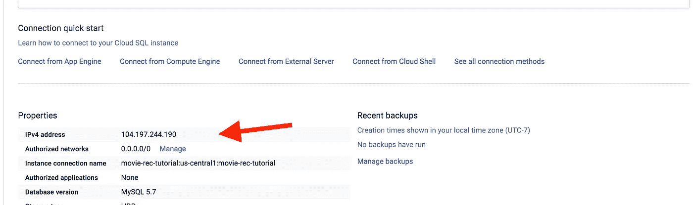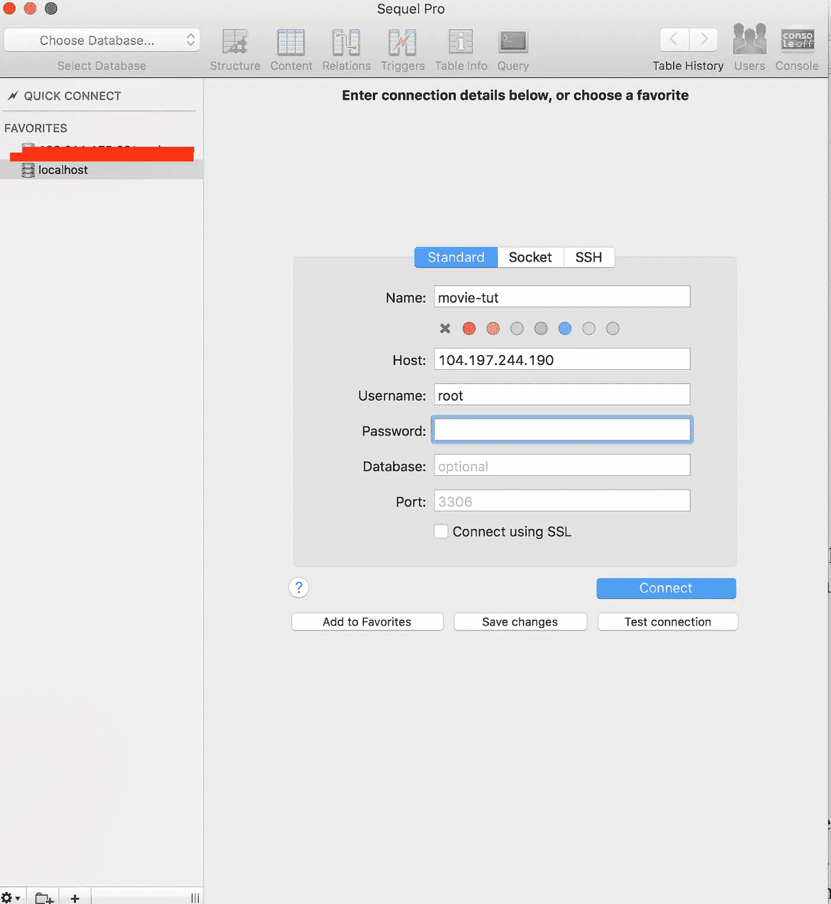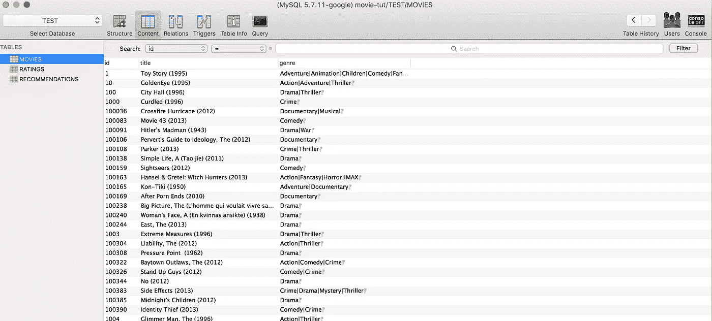

# 训练模型

您已经将数据加载到云 SQL 中；开始训练模型的时间到了。使用下面的代码，您将连接到您的 CloudSQL 实例，读取表，训练模型，生成预测并将预测写入建议表。

**遍历代码:**

前几行为我们的驱动程序/执行器配置 spark、设置应用程序名称以及内存约束。有关附加属性的信息可在 [Spark 配置文档](https://spark.apache.org/docs/latest/configuration.html)中找到。

配置 spark 之后，代码使用 sys.args 提供的信息为我们的数据库连接创建了一个 url。

接下来，提供给 ALS 算法的超参数。我已经为这个数据集提供了运行良好的默认参数。更多信息可在 [Spark ALS 文档](https://spark.apache.org/docs/latest/api/python/pyspark.mllib.html#pyspark.mllib.recommendation.ALS)中找到。

最后，用评级数据框架训练模型。训练之后，生成前 10 个预测，并写回到 CloudSQL 实例。

将此文件复制到您的 Google 云存储桶:

```
$ gsutil cp engine.py gs://**movie-rec-tutorial**
```

# 部署到 Google Cloud DataProc:

DataProc 是一个托管的 Hadoop 和 Spark 服务，用于在计算引擎节点集群上执行 engine.py 文件。

您需要在 API 管理器中启用 API:

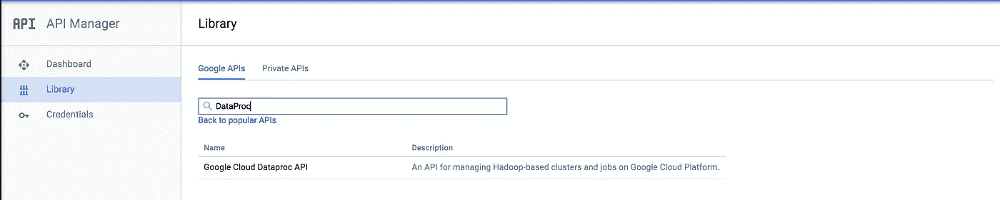

选择云 DataProc API

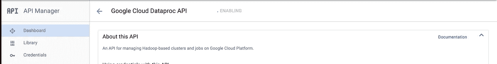

启用 API

接下来，转到 DataProc 并配置一个集群:

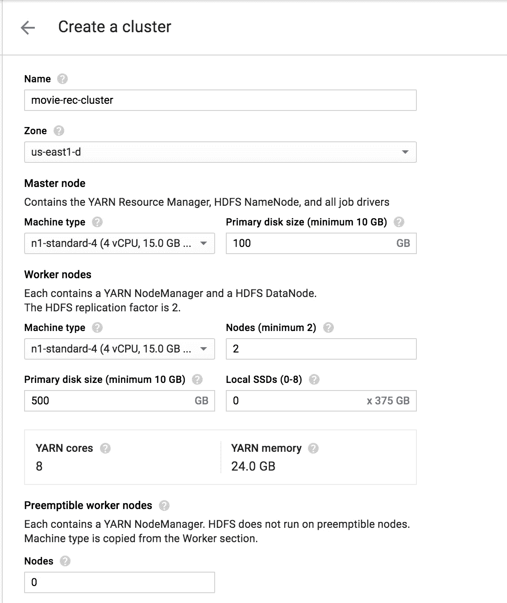

在配置完集群并等待每个节点初始化之后，创建一个作业来执行 **engine.py** 。您需要提供您的 CloudSQL 实例 IP、用户名和密码作为 sys args(如下所示)。

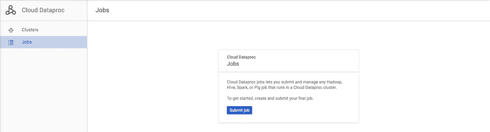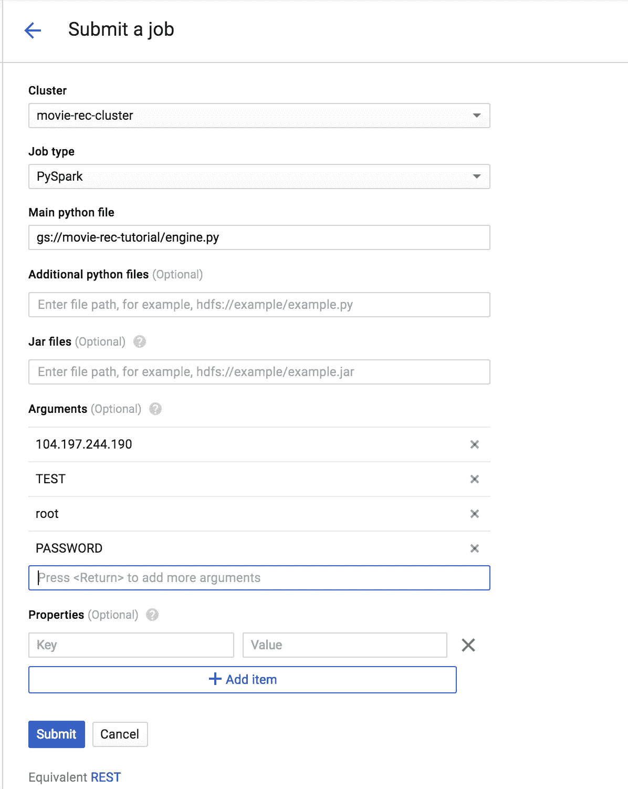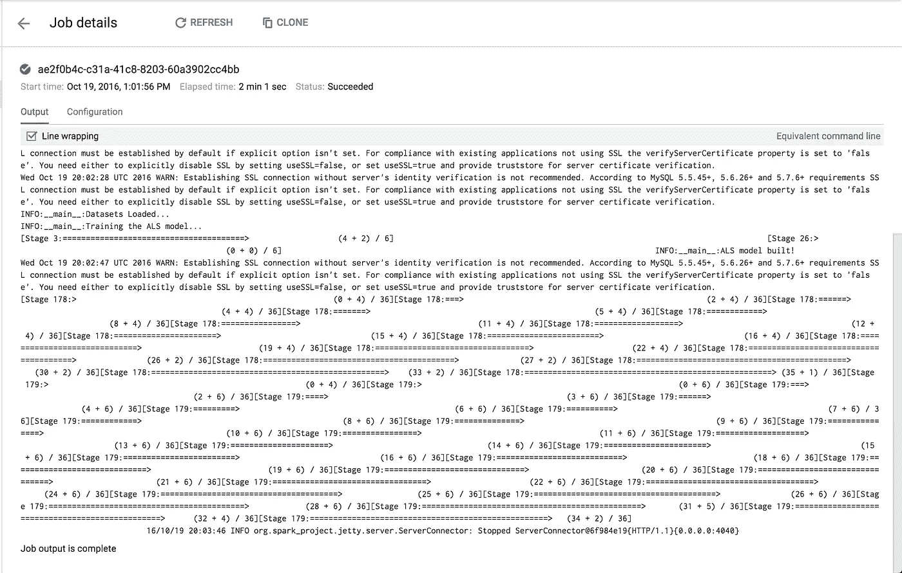

就是这样！如果您想查看书面推荐，请连接您首选的 mysql 客户端。

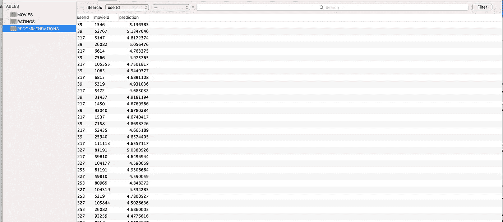

# 结论

在本教程中，您在 CloudSQL 中创建了一个 db & tables，在 Google Cloud 的 DataProc 服务上使用 Spark 训练了一个模型，并将预测写回到 CloudSQL db 中。

接下来的步骤是:

*   配置云 SQL 代理
*   创建一个 API 来与您的推荐服务进行交互

此处为完整代码:

[](https://github.com/ColeMurray/movie-rec-tutorial) [## cole Murray/电影录制教程

### 在 GitHub 上创建一个帐户，为电影录制教程的开发做出贡献。

github.com](https://github.com/ColeMurray/movie-rec-tutorial) 

> 如果你喜欢这个教程，请关注并推荐！
> 
> 对 node，android，或者 react 感兴趣？查看我的其他教程:
> - [将节点部署到谷歌云](/google-cloud/node-to-google-cloud-compute-engine-in-25-minutes-7188830d884e#.uzpd6tz7f)
> -[RecyclerViews 中的 Android 印象追踪](/@ColeMurray/how-to-track-impressions-e371f0a91f0#.dopjf841m)-[React&ES6 中的 Flux](/@ColeMurray/react-flux-in-es6-pt-1-2-e2a7b4aa074e#.lttn8owu2)
> 
> 其他地方可以找到我:
> 
> 推特:[https://twitter.com/_ColeMurray](https://twitter.com/_ColeMurray)