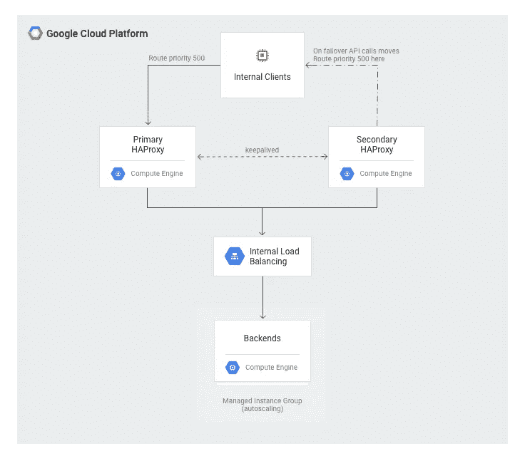
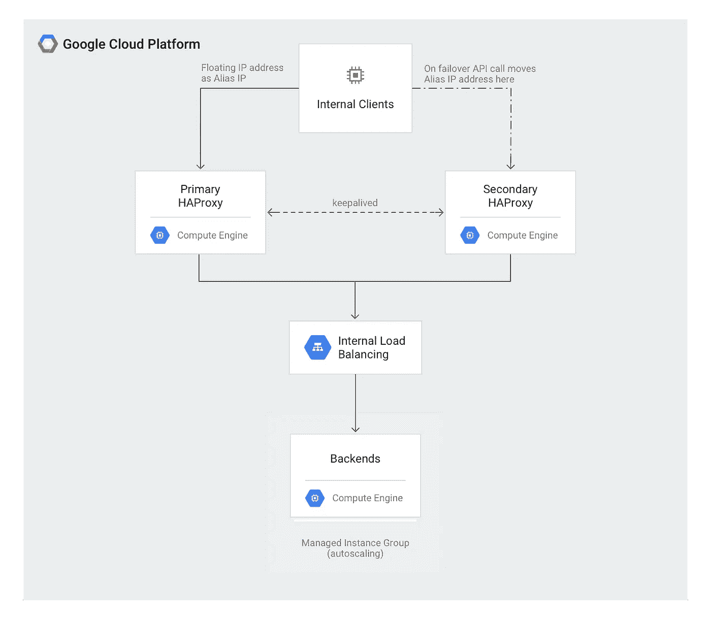

# Google 计算引擎上实现高可用性的 IP 地址故障转移建议

> 原文：<https://medium.com/google-cloud/recommendations-for-high-availability-failover-on-google-compute-engine-f4ff409fcf10?source=collection_archive---------1----------------------->

**TL；DR:** 由于别名 IP 地址“滞留”在虚拟机上的可能性很小，因此使用路由实现高可用性是首选方法。

当将内部高可用性应用迁移到 Google 云平台时，您经常需要在虚拟机之间移动固定 IP 地址，以模拟内部架构中浮动 IP 地址或虚拟 IP 地址的行为。如果主虚拟机上的服务或虚拟机本身出现故障，该 IP 地址将在一组通常为两个的虚拟机之间移动。

由于基于[免费 ARP](https://en.wikipedia.org/wiki/Address_Resolution_Protocol#ARP_announcements,) 的内部解决方案无法在谷歌计算引擎上运行，文章[浮动 IP 地址的最佳实践](https://cloud.google.com/solutions/best-practices-floating-ip-addresses)提供了几种可以在这种情况下使用的解决方案。

然而，该文章遗漏了使用别名 IP 地址的可能性，别名 IP 地址可以在同一子网的虚拟机之间移动。

因此，对于应用程序希望自己启动故障切换的情况，您是应该使用最佳做法白皮书中详述的使用路由的选项 4，还是应该使用别名 IP？

让我们来看看不同之处:

使用路由，当心跳代理想要启动故障转移时，它会删除一个路由，并添加指向新虚拟机实例的同一 IP 地址的另一个路由:

使用路由进行故障转移

这种方法的主要缺点是虚拟/浮动 IP 地址需要在 VPC 使用的 IP 地址空间之外，并且这些地址不由 GCP 管理。这也意味着您需要使用[自定义路由广告](https://cloud.google.com/router/docs/how-to/advertising-overview)来通过 VPN 或专用/合作伙伴互连使用这些路由。故障转移需要两个 API 调用或 gcloud 命令来移动 IP 地址。

现在，别名 IP 地址有什么不同:

使用别名 IP 的故障转移

故障转移机制非常相似，您需要两个 API 调用或 gcloud 命令来在主虚拟机和辅助虚拟机之间移动 IP 地址。它似乎解决了基于路由选项的主要缺点，因为该地址是 GCPs VPC 地址范围的本地地址，可以从 VPC 内的任何地方寻址，并且可以通过 VPN 和专用/合作伙伴互连自动寻址。所以从各方面来看，这似乎都是一个更好的选择，不是吗？

**遗憾的是没有:**别名 IP 地址是虚拟机的固有属性，因此它是虚拟机元数据的一部分，这也是高可用性配置可用性方面的最大缺点。在用户控制之外的某些罕见故障模式下，虚拟机可能变得完全不可访问，并且无法立即删除或修改包括元数据在内的虚拟机。因此，在这些情况下，**用户可能无法暂时从故障虚拟机中删除别名 IP** 地址，因此也无法将其添加到另一个虚拟机，因为每个别名 IP 地址在 VPC 中只能存在一次。

然而，对于路由，路由是一个全局资源，不附属于 VM，而是指向 VM 实例。因此，删除和创建路由的可能性不依赖于虚拟机及其元数据的可用性。此外，如果 keepalive/heartbeat 进程由于某种原因产生了意外结果，也可以通过创建具有较高优先级(这意味着较低的优先级值)的路由来手动覆盖该进程。

由于这种差异，建议使用路由而不是别名 IP，即使这意味着手动管理 IP 地址空间。

当然，为了达到最高的可用性，请确保在不同的[区域](https://cloud.google.com/compute/docs/regions-zones/)之间分配虚拟机实例，并查看[最佳实践文档](https://cloud.google.com/solutions/best-practices-floating-ip-addresses)中的其他选项是否更适合您的用例。